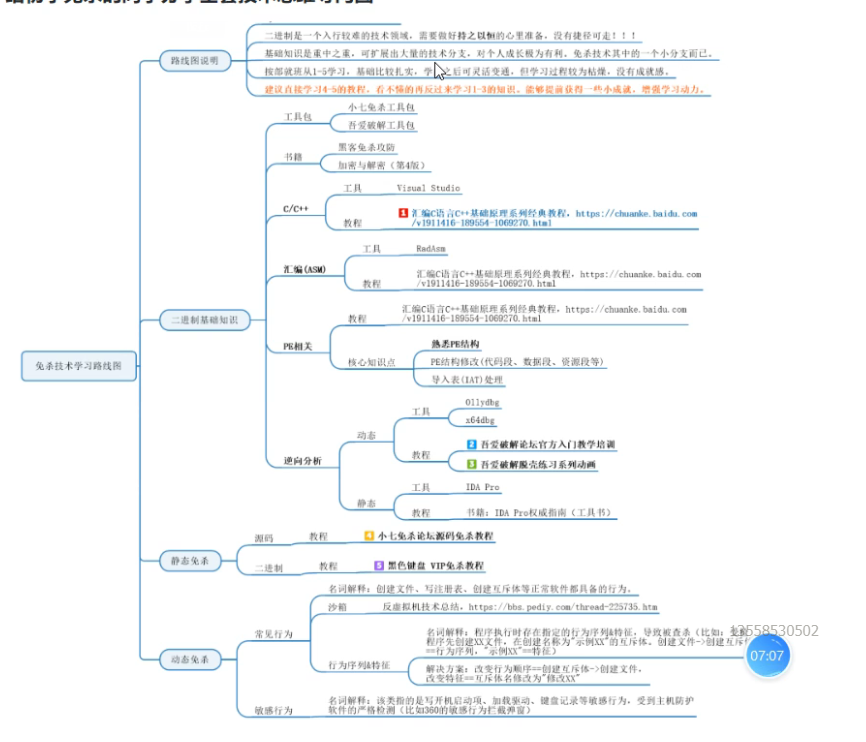
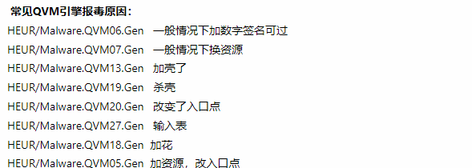

# 仓库

https://github.com/Al1ex

https://github.com/TideSec/BypassAntiVirus

# 大佬

https://blog.csdn.net/Simon798?type=blog


# 论坛


[0x00sec - The Home of the Hacker](https://0x00sec.org/)

https://geekdaxue.co/read/jianouzuihuai@attack-defense/blank

小熊远控/ 小熊技术论坛`

# 工具


2012小七免杀工具包.rar

url:  https://pan.baidu.com/s/1qWK3MKc

说明: 一个比较老,过时的工具,但是有些东西可以手法可以参考学习


# 杂文


https://bbs.kanxue.com/thread-217782.htm




# 杀软报毒的原因


## 360



## 火绒


# 沙箱&&杀软引擎&&监测工具


> 火绒HIPS引擎架构沙箱源码 

https://github.com/huoji120/DuckSandboxDetect


Ty2y 杀毒软件开发手册: https://www.ihonker.com/thread-30189-1-1.html

源代码 https://github.com/w2sft/Ty2yAntiVirus


> 毕方智能云沙箱( ***Bold-Falcon*** )是一个开源的自动化恶意软件分析系统。

它用于自动运行和分析文件，并收集全面的分析结果，概述恶意软件在独立操作系统中运行时所做的工作。

**`说明文档`** https://powerlzy.github.io/Bold-Falcon/

**`开发文档`** https://boldfalcon.readthedocs.io

二次开发开源cuckoo沙箱，

包括 **更新项目结构** ，**重写整个前端的用户交互**和 **添加基于机器学习的检测模块** ， 

使恶意软件分析系统可以 **思考**

下载源码

```shell
$ git clone https://github.com/PowerLZY/Bold-Falcon
```

```shell
$ pip install Bold-Falcon
```

开源资料

* [cuckoo](https://github.com/cuckoosandbox/cuckoo) Cuckoo Sandbox is an automated dynamic malware analysis system
* [cuckoo-modified](https://github.com/spender-sandbox/cuckoo-modified) Modified edition of cuckoo
* [cuckooDroid](https://github.com/idanr1986/cuckoo-droid) CuckooDroid - Automated Android Malware Analysis with Cuckoo Sandbox.
* [docker-cuckoo](https://github.com/blacktop/docker-cuckoo) Cuckoo Sandbox Dockerfile
* [cuckooautoinstall](https://github.com/buguroo/cuckooautoinstall) Auto Installer Script for Cuckoo Sandbox
* [cuckooML](https://github.com/honeynet/cuckooml) CuckooML: Machine Learning for Cuckoo Sandbox
* [Panda-Sandbox](https://github.com/PowerLZY/Panda-Sandbox) Cuckoo python3 (Unfinished)
* [HaboMalHunter](https://github.com/Tencent/HaboMalHunter#readme_cn) HaboMalHunter is a sub-project of Habo Malware Analysis System

源码分析

* [cuckoo技术分析全景图](https://cloud.tencent.com/developer/article/1597020)
* [cuckoo沙箱源码分析上](https://bbs.pediy.com/thread-260038.htm)
* [cuckoo沙箱源码分析中](https://bbs.pediy.com/thread-260087.htm)
* [cuckoo沙箱源码分析后](https://bbs.pediy.com/thread-260252.htm)
* [腾讯哈勃Linux沙箱源码分析上](https://zhuanlan.zhihu.com/p/54756592)
* [腾讯哈勃Linux沙箱源码分析下](


> 逆向火绒安全软件驱动sysdiag

这个在gitee有,我建议以后可以去下载下来

它可能把整个驱动给下载下来了


> Navy_public


轻量级自动分析病毒程序调用上下文、游戏反调试实现技术...

一款工具,可以去了解一下


