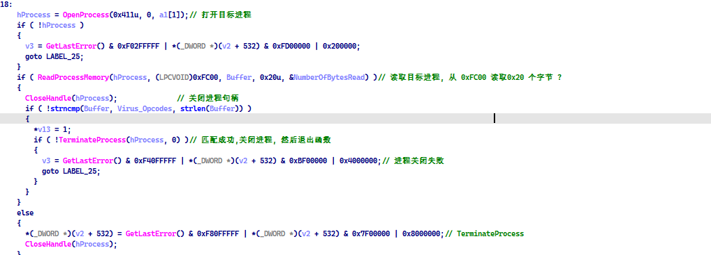

去打开并扫描那些正在运行的内存


```c
HANDLE OpenProcess(
    DWORD dwDesiredAccess, 
    BOOL bInheritHandle,
    DWORD dwProcessId
)

BOOL ReadProcessMemory(
    HANDLE hProcess, 
    LPCVOID lpBaseAddress, 
    LPVOID lpBuffer, 
    SIZE_T nSize, 
    SIZE_T *lpNumberOfBytesRead
)
BOOL CloseHandle(
	HANDLE hObject
);
```


某某杀软的内存读取代码截取部分



当发现内存中的特征串和病毒的特征串发现相同的时候

就会kill进程 ,但是他是基于特定偏移的匹配, 而不是对整个文件进行一个搜搜

ps: 可能我们找的函数不对,真正匹配特征的是另外一些函数


但是某某杀软采用这种方式读取内存,比较鸡肋

如果样本采用远程线程注入的方式,那么特征码可能不在样本的当前进程,而在远程进程


样本分析:

链接：[https://pan.baidu.com/s/1DaACF36ifNc_YF4lcllmbQ?pwd=1234](https://pan.baidu.com/s/1DaACF36ifNc_YF4lcllmbQ?pwd=1234)

提取码：1234

360all kill，火绒kill hosts.exe

