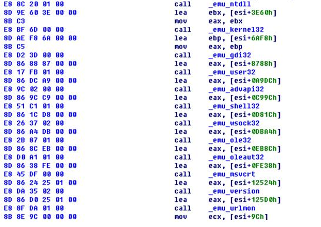

# 如何免杀

把自己封装为一个好人,最终的目的是干坏事

反病毒工程师 在动态分析的时候,不会去跟踪每一个call

最关心的是你什么时候调用的魔改API

exe是怎么启动的

exe调用了哪些API

exe如何加载dll

exe如何进行他的骚操作

# 关于沙箱

沙盒免杀

研究这个的话,可以写出这个虚拟化,然后借助一些签名,就可以长期驻留在显卡驱动层面

# 其它

 

## 加花指令免杀

等效汇编指令 add eax,-1  == sub eax1,1

...

 杂文

ifeo镜像劫持: 很早以前的东西,可以实现的效果,打开一个exe就可以重定向的其它程序

# 工具

PCHunter64 可以实现读取内核的一些东西

不过我的电脑无法加载工具的某些东西,就没管了

# 虚拟机检测

模拟了ntdll,kernel32,gdi32,user32,advapi32,shell32,

wsock32、ole32、oleaut32、msvcrt、version、urlmon这几个系统DLL

