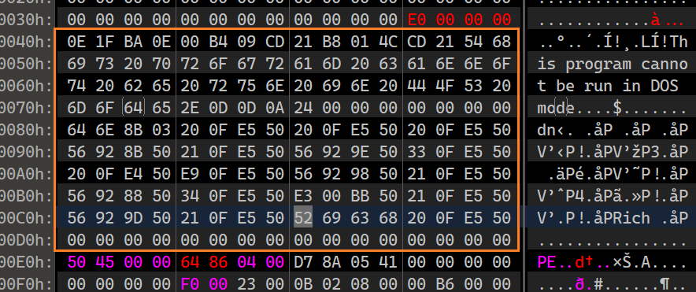
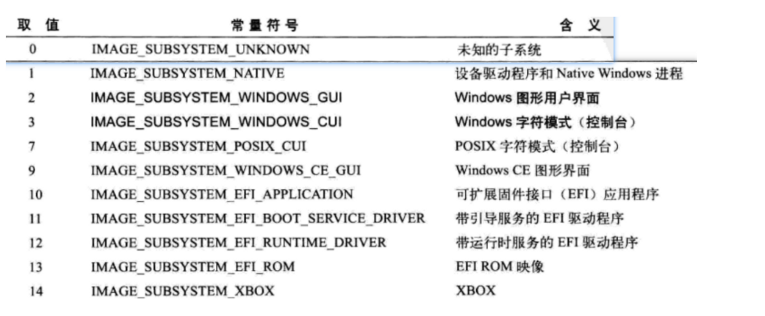
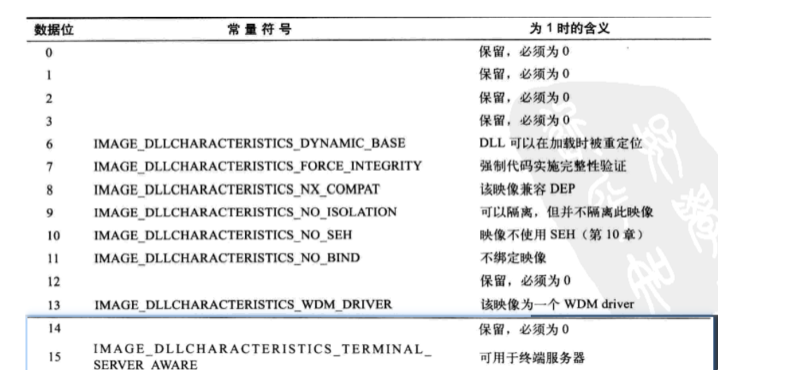

[恶意样本分析手册——文件封装篇](http://blog.nsfocus.net/malicious-sample-analysis-manual-file-encapsulation/)

Windows PE 是一个操作系统,全程是Windows PreInstallation Environment: Windows预安装环境

这里的PE是讲可执行文件的格式


# Dos头


x86和x64是一样的

```c
struct IMAGE_DOS_HEADER DosHeader
```


```c
struct _IMAGE_DOS_HEADER
{
    0x00 WORD  w_magic;         //value="MZ"        EXE文件的标志
    // ...
    0x3c DWORD dw_lfanew;       //                  PE头偏移地址
};
```


Dos头有4行 ps:4x16

你可以修改e_lfanew来迁移NT头的位置

除了2个重要的字段,其它的字段,你都可以干坏事情


# Dos_Stub


可以把它CC,没有用

所以你可以修改dw_lfanew然后把NT头向前移动,掩盖以前的Dos存根




# NT头

```c
PIMAGE_NT_HEADERS64
PIMAGE_NT_HEADERS32
```

NT头开始, x64和x86的结构体就发生了变化, 变化发生于Optional_Header,前面几个成员没变

```c
typedef struct _IMAGE_NT_HEADERS64 {
    DWORD Signature;
    IMAGE_FILE_HEADER FileHeader;
    IMAGE_OPTIONAL_HEADER64 OptionalHeader;//64位
} IMAGE_NT_HEADERS64, *PIMAGE_NT_HEADERS64;

typedef struct _IMAGE_NT_HEADERS {
    DWORD Signature;
    IMAGE_FILE_HEADER FileHeader;
    IMAGE_OPTIONAL_HEADER32 OptionalHeader;//32位
} IMAGE_NT_HEADERS32, *PIMAGE_NT_HEADERS32;
```


一般情况下

从文件开始到0x03C 偏移处为PE的头部信息，其中记录了整个PE文件的头结构。


## 签名字段 PE/0/0

value="PE/0/0"

```
50 45 00 00
```


## 标准头 FILE_HEADER

```
struct IMAGE_FILE_HEADER FileHeader
```


```c
typedef struct _IMAGE_FILE_HEADER
{
    WORD  Machine; //指定了该套机器码用于什么平台
    WORD  NumberOfSections; //表示 PE 文件中的区块（section）个数
    DWORD TimeDateStamp; //示 PE 文件的创建时间。 可以是任意值,不影响运行
    DWORD PointerToSymbolTable; //表示符号表在文件中的位置 可以是任意值,不影响运行
    DWORD NumberOfSymbols; //表示符号表中符号的数量 可以是任意值,不影响运行
    WORD  SizeOfOptionalHeader; //表示可选头的大小（以字节为单位）,可选头就在FILE_HEADER 的下面
    WORD  Characteristics; //表示 PE 文件的属性,比如 dll,exe, sys...,???
} IMAGE_FILE_HEADER, *PIMAGE_FILE_HEADER;
```

NumberOfSection

节区数一定要大于0,


如果表的节区数不和实际的节区数一致就会无法执行

SizeOfOptionalHeader:


x86下是 默认是00E0 , x64 下是 默认00F0 ,我们可以自定义


Characteristics: 16bit

一些PE文件的自身属性

[0]=1,表示没有基址重定位,必须加载到ImageBase,如果没有,就G啦

于是你可以去精确的控制这些位,实现一个陷阱的制作等等


## 可选头 OPTIONAL_HEADER

```c
IMAGE_OPTIONAL_HEADER64 OptionalHeader;//64位
IMAGE_OPTIONAL_HEADER32 OptionalHeader;//32位
```


为什么是可选头?

因为在obj文件中,这个是不存在的,所以是可选头

x86: 从可选头寻找0x60个大小后,就是数据目录表

x64: 从可选头寻找0x70个大小后,就是数据目录表


x86的可选头

```c
typedef struct _IMAGE_OPTIONAL_HEADER {
{
    0x00 WORD Magic; //比如是x86,还是x64,或者其它的..

    0x02 BYTE MajorLinkerVersion;
    0x03 BYTE MinorLinkerVersion;
    //指定连接器的版本号,对运行毫无影响

    0x04 DWORD SizeOfCode;                 //磁盘文件中,data节大小-text节大小
    0x08 DWORD SizeOfInitializedData;      //已经初始化的数据节的总大小,         运行时不参考
    0x0c DWORD SizeOfUninitializedData;    //没有初始化的数据节的总大小,         运行时不参考

    //4个地址
    0x10 DWORD AddressOfEntryPoint;     //程序的EP,RVA
    0x14 DWORD BaseOfCode;              //.text 代码的基地址RVA 运行时不参考
    0x18 DWORD BaseOfData;              //.data 数据的基地址RVA 运行时不参考
    0x1c DWORD ImageBase;               //程序建议装载地址,只是建议

    //2对齐
    0x20 DWORD SectionAlignment;        //内存中节的对齐粒度
    0x24 DWORD FileAlignment;           //文件中节的对齐粒度

    0x28 WORD MajorOperatingSystemVersion;
    0x2a WORD MinorOperatingSystemVersion;
    //操作系统版本号

    0x2c WORD MajorImageVersion;
    0x2e WORD MinorImageVersion;
    //PE的版本号

    0x30 WORD MajorSubsystemVersion; //它不可以修改,其它可以修改
    0x32 WORD MinorSubsystemVersion;
    //所需子系统版本号

    0x34 DWORD Win32VersionValue;   //win32下,该值任意,xp下,必须为0

    //3个大小
    0x38  DWORD SizeOfImage;        //内存中,PE文件占用的大小,是FileAlignment的倍数
    0x3c  DWORD SizeOfHeaders;      //所有PE头的大小,PE文件严格要求他是0x200的倍数
    0x40  DWORD CheckSum;           //校验和 和驱动文件,DLL文件有关

    //2个属性
    0x44 WORD Subsystem;            //指定使用界面的子系统,比如GUI,DOS
    0x46 WORD DllCharacteristics;   //所有PE文件的属性,而不是针对DLL

    //4个堆栈信息

    0x48 DWORD SizeOfStackReserve;  //初始化的栈大小
    0x4c DWORD SizeOfStackCommit;   //初始化时,实际的准备的栈大小

    0x50 DWORD SizeOfHeapReserve;   //初始化的堆大小
    0x54 DWORD SizeOfHeapCommit;    //初始化时,实际的准备的堆大小

    0x58 DWORD LoaderFlags;         //和调试有关
    0x5c DWORD NumberOfRvaAndSizes; //数据目录表的有效成员个数
    0x60 _IMAGE_DATA_DIRECTORY DataDirectory[16];//数据目录表
} IMAGE_OPTIONAL_HEADER32, *PIMAGE_OPTIONAL_HEADER32;
```


x64可选头

```c
typedef struct _IMAGE_OPTIONAL_HEADER64 {
    WORD        Magic;
    BYTE        MajorLinkerVersion;
    BYTE        MinorLinkerVersion;
    DWORD       SizeOfCode;
    DWORD       SizeOfInitializedData;
    DWORD       SizeOfUninitializedData;
    DWORD       AddressOfEntryPoint;
    DWORD       BaseOfCode;
	//无DWORD BaseOfData;
    ULONGLONG   ImageBase; //变为了8字节
    DWORD       SectionAlignment;
    DWORD       FileAlignment;
    WORD        MajorOperatingSystemVersion;
    WORD        MinorOperatingSystemVersion;
    WORD        MajorImageVersion;
    WORD        MinorImageVersion;
    WORD        MajorSubsystemVersion;
    WORD        MinorSubsystemVersion;
    DWORD       Win32VersionValue;
    DWORD       SizeOfImage;
    DWORD       SizeOfHeaders;
    DWORD       CheckSum;
    WORD        Subsystem;
    WORD        DllCharacteristics;
    ULONGLONG   SizeOfStackReserve;//变为了8字节
    ULONGLONG   SizeOfStackCommit;//变为了8字节
    ULONGLONG   SizeOfHeapReserve;//变为了8字节
    ULONGLONG   SizeOfHeapCommit;//变为了8字节
    DWORD       LoaderFlags;
    DWORD       NumberOfRvaAndSizes;
    IMAGE_DATA_DIRECTORY DataDirectory[IMAGE_NUMBEROF_DIRECTORY_ENTRIES];//内部的 VirtualAddress 和 Size 大小没变
} IMAGE_OPTIONAL_HEADER64, *PIMAGE_OPTIONAL_HEADER64;
```

从地址上来说,x64的多了4x5的字节,就是20字节

但是x64的结构少了一个`DWORD BaseOfData;` 所以总体来说,会比x86的大小多16字节

ps: IMAGE_DATA_DIRECTORY,数据目录表也涉及地址,但是长度没有发生变化, 也就是说他的VA和Size没变,还是4字节

```c
typedef struct _IMAGE_DATA_DIRECTORY {
    DWORD   VirtualAddress;//还是4字节
    DWORD   Size;
} IMAGE_DATA_DIRECTORY, *PIMAGE_DATA_DIRECTORY;
```


AddressOfEntryPoint:

对于DLL,它的EP是可选的,没有的话,就为0

许多病毒程序、加密程序、补丁程序都会劫持这里的值，使其指向其他用途的代码地址。


ImageBase:

该值是exe应该首先载入的地址,可以自定义它

要求它的大小是0x10000的倍数


File/Section Alignment

文件对齐指出了节区在磁盘的最小对齐单位

节区对齐指出了节区在内存中对齐的最小单位

win10的FileAlignment好像只能200对齐以上

SectionAlignment必须大于或等于FileAlignment。

当它小于系统页面大小时，必须保证SectionAlignment和 FileAlignment相等

ps:

我们的地址只能是对齐值得整数倍

如果对齐值不是整数倍就会被强制类型转化

比如R2PD=10,那么会被转化为0


Subsystem



DllCharacteristics



所有PE文件的属性,而不是针对DLL

数据目录表在另外一个章节


# 节区头

不同的节有不同的性质,不同的访问权限

节区之间是挨在一起的,不能重叠或者间隔

而且节区最后是空，也就是有个空的节区表示结束。。。很不理解。

ps: 后来发现也不是那样,节的介绍并不是zero区域


我发现节区表的顺序必须和节区的顺序对应要一一对应

也就是说第一个节区如果是text,

那么第一个节区表就必须是text的

...或者是因为其它地原因


```c
struct IMAGE_SECTION_HEADER SectionHeaders[n]
 {
     BYTE Name[8];//8字节的字符串名字,说明性信息,不一定以0结尾
     union Misc
     {
         DWORD PhysicalAddress;
         DWORD VirtualSize;  //该节区数据大小,未对齐
     }
     //内存描述
     DWORD VirtualAddress;   //数据去向des,RVA
     DWORD SizeOfRawData;    //数据大小,对齐后
     DWORD PointerToRawData; //数据来源src,FA

     //文件描述,运行时不依赖,可以CC它
     DWORD PointerToRelocations;  //obj文件使用,
     DWORD PointerToLinenumbers;  //行号表的位置,供调试使用
     WORD NumberOfRelocations;    //obj文件使用,
     WORD NumberOfLinenumbers;   //行号表的中行的数量

     //内存属性 ☆☆☆☆☆☆
     DWORD Characteristics;      //节的属性☆☆☆☆☆☆
 }
```

在文件头结束那里,+可选头的大小

结果就是节区头地址

节的属性


判断某个节有没有代码的依据是根据节的属性中

是否含有IMAGE_SCN_CNT_CODE标志

而不是可执行IMAGE_SCN_MEM_EXECUTE标志


# 相关结构体名字

```
PIMAGE_DOS_HEADER dos_Header;
PIMAGE_NT_HEADERS32 nt_Header;
PIMAGE_SECTION_HEADER sec_Header;

PIMAGE_EXPORT_DIRECTORY     g0_Expor;
PIMAGE_IMPORT_DESCRIPTOR    g1_Import;
PIMAGE_RESOURCE_DIRECTORY   g2_Resource;
PIMAGE_BASE_RELOCATION      g5_BaseRelocationTable;
PIMAGE_TLS_DIRECTORY        g9_TLS;
```