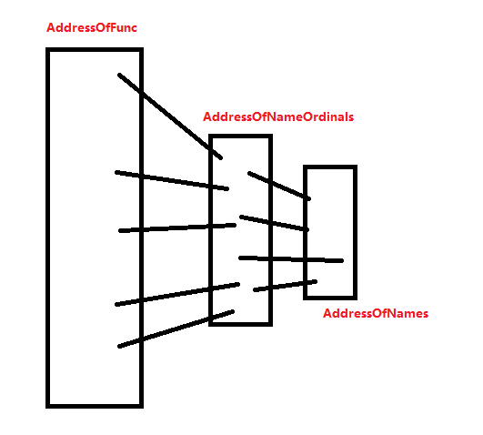

## 说明


导出数据所在的节通常名字是.edata

rdata也可以存储相关信息

export.size无用


导出表的作用有两个:

一般情况下,

DLL是导出,

exe是导入

当然Dll也可以导入,exe也可以导出

对于x86和x64的导出表, AddressOfFunctions, AddressOfNames 都指向一个DWORD的数组,成员都是4字节

但是对于x86和x64的带入表,就另说


```c
struct _IMAGE_EXPORT_DIRECTORY
{
    DWORD   Characteristics;    //未使用 导出表的特征标志，一般为0
    DWORD   TimeDateStamp;      //时间戳 导出表的创建时间戳。
    WORD    MajorVersion;       //未使用 导出表的主版本号
    WORD    MinorVersion;       //未使用 导出表的次版本号。

    DWORD   Name;               //字符串指针 dll的名字
    DWORD   Base;               //基址编号 导出表中所有函数的序号起始值，默认为1
    DWORD   NumberOfFunctions;  // 导出表中的导出函数数量,其中是有空函数的
    DWORD   NumberOfNames;      // 导出表中有字符串名称的导出函数数量
    DWORD   AddressOfFunctions;     // dword数组, 实际函数的RvA数组 导出表中所有导出函数
    DWORD   AddressOfNames;         // dword数组 导出表中所有有名称的导出函数的名称
    DWORD   AddressOfNameOrdinals;  // word数组  导出表中所有有名称的导出函数序号,成员是(序号-BASE)的序列
} IMAGE_EXPORT_DIRECTORY, *PIMAGE_EXPORT_DIRECTORY;
```


Base一般是首个导出函数的导出编号

AddressOfNameOrdinals是一个word数组,内部会有0填充的成员


# 名称导入查表原理:

如果用名称导入,那么查表就会用到 AddressOfName, AddressOfOrdianl, AddressOfFunc


拿着API字符串和char** AddressOfName[xx]的成员比对,到strcmp成功后,获取一个索引Index

拿着Index去WORD AddressOfOrdianl[xx]中,取出一个ordNum=AddressOfOrdianl[Index]

然后拿着ordNum去AddressOfFunc取出一个函数far_proc=AddressOfFunc[ordNum]

具体代码参考[1.代码大全\1.二进制\PE编程\1.dict.md]


# 序号导入查表原理:


如果用序号导入,就只用Base和,AddressOfFunc

序号导入默认是  Ordinals + base

导出的函数是 AddressOfFunc[输入编号-BASE]

具体代码参考[1.代码大全\1.二进制\PE编程\1.dict.md]


首先声明:  AddressOfOrdianl数组是一个比较混乱的数组,也就是成员的数值不是连续的

对于x86和x64而言

其中AddressOfOrdianl和AddressOfName是可以形成映射的DWORD数组

如果有些函数导出时,不给出NAME,那么他在 AddressOfOrdianl和AddressOfName 都不会占据一个相关的位置

只要有字符串导出的函数,他在 AddressOfOrdianl 中都在一个空间位置




一个数数组的范围如图

成员个数:  AddressOfFunc >= AddressOfNameOrdinals >= AddressOfNames

