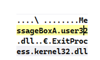

# 前言

导出数据所在的节通常名字是.idata

数据目录表中一共有4中类型和函数导入表有关

1. 导入表 Import
2. 导入函数地址表 IAT
3. 绑定导入表
4. 延迟加载导入表


每个导入表都是结构体,这些结构体连续分布

每一个要导入的dll结构体也具体指向了很多具体的数据

在DIY创建导入表的时候,说IAT和INT表至少8字节才算有效


导入表遍历问题 参考代码 [1.代码大全\1.二进制\PE编程\1.dict.md]


# 结构体


```c
struct _IMAGE_IMPORT_DESCRIPTOR
{
    0x00 union
     {
         0x00        DWORD Characteristics;
         0x00        DWORD OriginalFirstThunk;
         //INT 指向一个数组,数组成员是指针,以0结尾,指针又指向一个结构体
         //如果数组成员是0x80000xxxx----,表示他为序号导入
         //否则为名称导入,OriginalFirstThunk指向的是函数的名字,那么指向的结构应该为{Hint+Name}的结构
     } u;
    0x04 DWORD  TimeDateStamp;
    //无用 当时间戳=0,表示dll的地址没有被绑定 ,
    //否者表示dll的地址被绑定了
    0x08 DWORD  ForwarderChain;     //无用
    0x0c DWORD  Dll_Name;//指向dll字符串的RVA ,0结尾,导入dll的时候,可以不要.dll后缀名
    0x10  DWORD FirstThunk;//IAT,以0结尾,
};

//@[comment("MVI_tracked")]
typedef struct _IMAGE_IMPORT_BY_NAME {
    WORD    Hint;
    CHAR   Name[1];
} IMAGE_IMPORT_BY_NAME, *PIMAGE_IMPORT_BY_NAME;


//关于OriginalFirstThunk和FirstThunk的结构,简单的理解为数组就可以了
//@[comment("MVI_tracked")]
typedef struct _IMAGE_THUNK_DATA64 {
    union {
        ULONGLONG ForwarderString;  // PBYTE
        ULONGLONG Function;         // PDWORD
        ULONGLONG Ordinal;
        ULONGLONG AddressOfData;    // PIMAGE_IMPORT_BY_NAME
    } u1;
} IMAGE_THUNK_DATA64;
typedef IMAGE_THUNK_DATA64 * PIMAGE_THUNK_DATA64;

#include "poppack.h"                        // Back to 4 byte packing

//@[comment("MVI_tracked")]
typedef struct _IMAGE_THUNK_DATA32 {
    union {
        DWORD ForwarderString;      // PBYTE
        DWORD Function;             // PDWORD
        DWORD Ordinal;
        DWORD AddressOfData;        // PIMAGE_IMPORT_BY_NAME
    } u1;
} IMAGE_THUNK_DATA32;
typedef IMAGE_THUNK_DATA32 * PIMAGE_THUNK_DATA32;
```

现在有个问题, Dll_Name指向的是W版本字符串还是A版本字符串


对于x86和x64的导出表, AddressOfFunctions, AddressOfNames 都指向一个DWORD的数组,成员都是4字节

但是对于x86和x64的带入表, 

x64下 OriginalFirstThunk 和  FirstThunk 指向一个DWORD64的数组

x86下 OriginalFirstThunk 和  FirstThunk 指向一个DWORD32的数组


# 关于 OriginalFirstThunk | FirstThunk

关于INT,IAT 他们是类似于一次函数y=kx的关系,一一对应

在exe没加载之前,IAT和INT类似

在exe加载后,数据INT和IAT出现不同

1 在模块加载前,他们分别指向一个不同的数组,但是数组的内容是相同的,比如数组成员都指向函数的名字(字符串)

2 在模块加载后,FirstThunk指向的数组,内容不在和OriginalFirstThunk一致,而是指向具体的函数


# OriginalFirstThunk和FirstThunk的结构

通常情况下OriginalFirstThunk和FirstThunk指向相同的数据内容,

我们称这种为双桥结构的导入表,也就是通过OriginalFirstThunk和FirstThunk

我们都可以遍历到INT,这是在exe加载前的情况

还有一种情况是只有FirstThunk指向了INT,此刻称之为单桥结构,这种结构不可以绑定导入表


关于为什么会有OriginalFirstThunk和FirstThunk指向了相同的数据内容,

而且你还觉得很啰嗦...

如果只有FirstThunk,当PeLOad后,之前的函数名称的指针数组就丢失了,

数组的内容被替换为函数的地址VA

那么就不再还有指针数组指向API的NAME



当然,如果孤掷一注的话,我门也不需要有谁指向这个名称数组


# IAT的call类型

类似于函数指针

```c
xxx=MessageBOX
call xxx
```


比如

FF 15 98 B0 41 00       call    *(ds:MessageBoxA)   ;其实就是call *(指针)

其中 98 B0 41 00-> 0040B098其实就是FirstThunk指向的那个数组的某个成员

而0040B098指向的那个地址,也就是MessageBoxA真正的地址

0040B098指向什么? 看下面

```
.idata:0041B098 C0 17 E6 76             MessageBoxA dd offset user32_MessageBoxA
 .idata:0041B098                                                                 ; CODE XREF: _main_0+31↑p
 .idata:0041B098                                                                 ; DATA XREF: _main_0+31↑r ...
 .idata:0041B09C 00 00 00 00 00 00 00 00
 .idata:0041B09C 00 00 00 00 00 00 00 00
```

可以看出0041B098指向的地址就是C0 17 E6 76 ,也就是76E617C0,就是真真函数的地址

```
USER32.dll:76E617C0 8B FF                   mov     edi, edi
 USER32.dll:76E617C2 55                      push    ebp
 USER32.dll:76E617C3 8B EC                   mov     ebp, esp
 USER32.dll:76E617C5 83 3D 94 6C E8 76 00    cmp     dword_76E86C94, 0
 USER32.dll:76E617CC 74 22                   jz      short loc_76E617F0
```

# 导入表那么多个

什么时候结束??

当成员的struct _IMAGE_IMPORT_DESCRIPTOR.Dll_Name字段是0就结束..而不需要整个结构体全部为0


所以我们就可以把其它部分赋值为任意值,然后只把Dll_Name赋值为0


# 关于字符串导入和序号导入


```c
GetProcAddress(Kernel32_Base, CreateFileW");
GetProcAddress(Kernel32_Base, (char*)0xCE);
```


实际的序号导入,并不是0xCE,而是一个DWORD32或者DWORD64的长度,然后二进制最高位是1

比如是0x800000CE或者0x80000000000000CE


