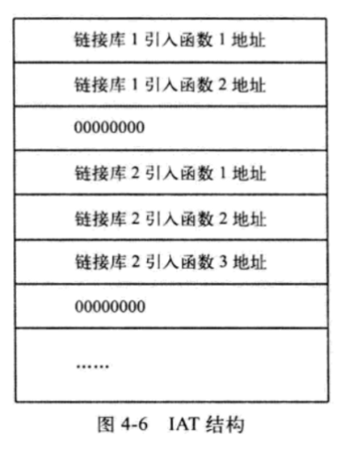
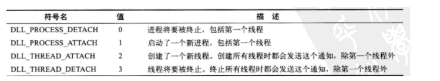
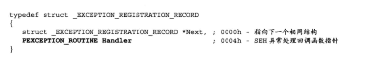

# [12] IAT 导入函数地址表

准确的说他是导入表的一部分

它指向了某个dll的IAT(FirstThunk)

第一次我发现是kernel32

PE文件中所有导入函数jmp指令操作数的集合，组成了另外一个数据结构，

这个结构就是导入函数地址表( Import Address Table，IAT)。该地址表是数据目录的第13个数据目录项。



# [11] 绑定导入表

```
typedef struct _IMAGE_THUNK_DATA
{
    union
     {
         PBYTE ForwarderString;
         PDWORD Function;      //被导入的函数的入口地址
         DWORD Ordinal;       // 该函数的序数
         PIMAGE_IMPORT_BY_NAME AddressOfData;   // 一个RVA地址，指向IMAGE_IMPORT_BY_NAME
     }u1;
} IMAGE_THUNK_DATA32;
```

```
struct _IMAGE_BOUND_FORWARDER_REF {
    DWORD   TimeDateStamp;
    WORD    OffsetModuleName;
    WORD    Reserved;
} IMAGE_BOUND_FORWARDER_REF, *PIMAGE_BOUND_FORWARDER_REF;
```

绑定导入表 成员

```
struct _IMAGE_BOUND_IMPORT_DESCRIPTOR
{
    DWORD   TimeDateStamp;//时间戳

    WORD    OffsetModuleName;//指向dll的名字

    WORD    NumberOfModuleForwarderRefs;//对应成员的数目
    // 表示该动态链接库中的函数实现字节码存储在另外一个动态链接库中
} IMAGE_BOUND_IMPORT_DESCRIPTOR,  *PIMAGE_BOUND_IMPORT_DESCRIPTOR;
```

有无绑定导入表是根据导入表的时间戳来判断的

绑定导入表一般位于0x400以内的地方,也就是section header 结束之后


TimeDateStamp

该字段的值必须与要引用的DLL的文件头IMAGE_FILE_HEADER.TimeDateStamp字段值相吻合，

否则就会促使加载器去重新计算新IAT，这种情况一般发生在DLL版本不同时或者DLL映像被重定位时

OffsetModuleName

该地址既不是RVA,也不是VA

是一个基于绑定导入表起始地址的偏移量

比如绑定导入表的地址是0x250

OffsetModuleName=0x30

那么对应dll的名字就在0x280


# [05] 基址重定位

基址重定位数据所在的节通常名字是.reloc

一般情况下,exe都会加载到ImageBAse,所以不会使用基址重定位

但是如果没有加载到ImageBAse,那么就会存在基址重定位

dll在加载的时候,一般都需要重定位置

各个dll贴在exe的内存中,是挨得比较紧密的,但是各个dll之间会有对齐的行为,默认的对齐是10000h,也就是64k

数据目录表的重定位的size很有用,它决定了有多少地方需要重定位

```
struct _IMAGE_BASE_RELOCATION
{
    DWORD   VirtualAddress;//RVA,代码页,对应数组的其实地址
    DWORD   SizeOfBlock;/成员个数
        // WORD	Arr[1]; 柔性数组
    } IMAGE_BASE_RELOCATION,* PIMAGE_BASE_RELOCATION;
```

每一个代码页都有这样的数据结构

VirtualAddress 决定了代码页的地址

SizeOfBlock 决定了这个数据结构的大小

数组成员个数=(SizeOfBlock-4*2)/2 就是柔性数组的成员个数

关于地址遍历

假设x=arr[xx];

(x&0xF000)>>3是标志位,如果结果是3,表示对应地址的4个字节都要修改,一般情况下,我们的遇到的都是3

(x&0x0FFF)+VirtualAddress 就是需要修改的地方的RVA地址

- ((x&0x0FFF)+VirtualAddress+ImageBase) 就是需要修改的值


修改的值=新的ImageBase - 旧的 ImageBase+原有的地址


# [13] 延迟导入表

https://blog.csdn.net/evileagle/article/details/12718845

和dll加载有关

以前dll的加载是,有很多dll干活,把所有dll都喊进屋,到谁干活谁就出来, ps:屋子可能不太好装下怎么多人

延迟导入就是准备很多dll干活,不先把他们领进门,让他们所有人在外面等着,干活时,喊谁,谁就进来

延迟加载导入是一种合理利用进程加载机制提高进程加载效率的技术，

使用延迟加载导入能跳过加载前对引入函数的检测及加载后对IAT的修正，

从而避免出现诸如“无法找到组件”的错误提示，提高程序的适应性。

及时即用?


```
typedef struct _IMAGE_DELAYLOAD_DESCRIPTOR
{
    union {
        DWORD AllAttributes;// 属性,说必须为0
        struct
        {
            DWORD RvaBased : 1;             // Delay load version 2
            DWORD ReservedAttributes : 31;
        } DUMMYSTRUCTNAME;
    } Attributes;

    DWORD DllNameRVA;                       // 指向dll的名字,好像是一个VA地址
    DWORD ModuleHandleRVA;                  // 指向dll的模块句柄
    DWORD ImportAddressTableRVA;            // IAT
    DWORD ImportNameTableRVA;               // INT
    DWORD BoundImportAddressTableRVA;       // 绑定该表的RVA 可选
    DWORD UnloadInformationTableRVA;        // 卸载该表的RVA 可选
    DWORD TimeDateStamp;                    // 0 if not bound,
    // Otherwise, date/time of the target DLL

} IMAGE_DELAYLOAD_DESCRIPTOR, *PIMAGE_DELAYLOAD_DESCRIPTOR;
```

不使用延迟加载

```
ml -c -coff He1loworld.asm
link -subsystem : windows Hellowor1d.obj
He1loworld
```

使用延迟加载

```
ml -c -coff Helloworld.asm
link -subsystem:windows -delayload:MyD11.dll delayimp.lib HelloWorld.obj
Helloworld
```

那么link -subsystem:windows -delayload:MyD11.dll delayimp.lib HelloWorld.obj干了什么?

首先，将一个函数_delayLoadHelper嵌入PE文件的可执行模块。

其次，从可执行模块的导入表部分删除MyDl.dll 及相关信息，这样，当进程初始化的时候，

操作系统的加载程序就不会显式加载该动态链接库了。

最后，在PE中把刚才删除的相关信息重新构造好，以便告诉_delayLoadHelper哪些函数是从MyDll.dll中导出的。

在调用API的时候


然后出现就出现了区别

不使用该技术就直接前往该dll

使用该技术,去往某个函数,然后LoadLibiary和GetProcessAddress,如果再次调用不再load和get

为什么使用了延迟导入表技术可以实现任何地方都可以轻松运行?

因为他把dll文件作为资源放进了自己那里,然后需要的时候再调用资源?

关于这个书中有代码讲解,我没有去实现,,,,QWQ,还是去写一下吧,万一有用呢

关于延迟导入的dll卸载,可以使用-delay:unload选项

这是一个可选项,具体深入还不知道

# [09] TLS

```c
typedef VOID
(NTAPI *PIMAGE_TLS_CALLBACK) (
    PVOID DllHandle,
    DWORD Reason,
    PVOID Reserved
    );

typedef struct _IMAGE_TLS_DIRECTORY64 {
    ULONGLONG StartAddressOfRawData;
    ULONGLONG EndAddressOfRawData;
    ULONGLONG AddressOfIndex;         // PDWORD
    ULONGLONG AddressOfCallBacks;     // PIMAGE_TLS_CALLBACK *;
    DWORD SizeOfZeroFill;
    union {
        DWORD Characteristics;
        struct {
            DWORD Reserved0 : 20;
            DWORD Alignment : 4;
            DWORD Reserved1 : 8;
        } DUMMYSTRUCTNAME;
    } DUMMYUNIONNAME;

} IMAGE_TLS_DIRECTORY64;

typedef IMAGE_TLS_DIRECTORY64 * PIMAGE_TLS_DIRECTORY64;

typedef struct _IMAGE_TLS_DIRECTORY32 {
    DWORD   StartAddressOfRawData;
    DWORD   EndAddressOfRawData;
    DWORD   AddressOfIndex;             // PDWORD
    DWORD   AddressOfCallBacks;         // PIMAGE_TLS_CALLBACK *
    DWORD   SizeOfZeroFill;
    union {
        DWORD Characteristics;
        struct {
            DWORD Reserved0 : 20;
            DWORD Alignment : 4;
            DWORD Reserved1 : 8;
        } DUMMYSTRUCTNAME;
    } DUMMYUNIONNAME;

} IMAGE_TLS_DIRECTORY32;
typedef IMAGE_TLS_DIRECTORY32 * PIMAGE_TLS_DIRECTORY32;
```

https://www.cnblogs.com/LyShark/p/13525917.html

```
typedef struct _IMAGE_TLS_DIRECTORY32
{
    DWORD   StartAddressOfRawData;	//文件主线程局部存储tls的起点,VA
    DWORD   EndAddressOfRawData;	//文件主线程局部存储tls的终点,VA
    DWORD   AddressOfIndex;          //tls索引位置
    DWORD   AddressOfCallBacks;     //指针数组,成员是回调的函数,以NULL结尾
    DWORD   SizeOfZeroFill;			//填充0的个数,
    DWORD   Characteristics;		//保留 0xCCCCCCCC
} IMAGE_TLS_DIRECTORY32;
```

基址重定位需要考虑到tls的VA修改

加载的时候,文件[ StartAddressOfRawData, EndAddressOfRawData]的数据会被复制到堆区去

TLS数据所在的节通常名字是.tls

它实现了线程内局部变量的存储访问

__declspec (thread) int  g_nNum = 0;

多线程访问全局变量 g_nNum ,得到的数据一直是0开始,无论其它线程怎么对 g_nNum 修改

int  g_nNum = 0;

多线程访问全局变量 g_nNum ,得到的数据不一定是0开始,因为其它线程可能对它做了一个修改

相当于tls拷贝g_nNum给任意一个子线程,让他们独自享用

内核模式创建进程


一个进程的创建涉及很多东西,但是,没有线程的进程就是一滩死水

内核创建一个线程


我想说的是,一个线程,进程的创建是一个蛮复杂的过程,所以搞清楚每一步才好设置一些陷阱

详细信:详细信息参考潘爱名老师的<<windows内核原理与实现

TLS技术分为两种:

动态线程局部存储技术

静态线程局部存储技术

TLS技术的分类主要依据是﹔线程局部存储的数据所用空间在程序运行期，操作系统完成的是动态申请还是静态分配。

动态线程局部存储通过四个Win32 API函数实现对线程局部数据的存储﹔

而静态线程局部存储则通过预先在PE文件中声明数据存储空间，由PE加载器加载该PE进入内存后为其预留存储空间实现。

## 动态线程局部存储技术

有一个TLS数组在结构体PEB中,

arr[64]

同时有一个8字节,64bit,记录了数组成员每一位是否被使用

unsigned long long

DWORD TlsAlloc(VOID)();

函数成功返回一个索引值值,失败返回-1

一旦函数返回成功,对应8字节那个bit位就变为1

DWORD TlsGetValue(DWORD index);

成功就返回对应的值,失败就返回0,当然里arr[]的值本来就可以是0,所以失败还需进行getlasterror进一步判断

BOOL SetTlsValue(DWORD index,LPVOID lpTlsValue)

失败返回0,成功不返回0

BOOL TlsFree(DWORD index);

失败返回0,成功不返回0,并把对应位置为0

如果如果arr[]装的是你自己申请的内存,那么也得是你自己释放,而不是tlsfree释放

```
#include<Windows.h>
#include <stdio.h>

DWORD WINAPI MY_ThreadProc(LPVOID);
DWORD32 MY_GetValue(DWORD32);

int main()
{
    HANDLE gh_tmp=0;
    gh_tmp = CreateThread(0, 0, MY_ThreadProc, 0, 0, 0);
    WaitForSingleObject(gh_tmp, 0xffffffff);
    system("pause");
    return;
}

DWORD WINAPI MY_ThreadProc(LPVOID lp_Param)
{
    DWORD32 dw_tmp = 0, index = 0;
    index = TlsAlloc();
    TlsSetValue(index, (LPVOID)0x1234);
    dw_tmp = TlsGetValue(index);
    printf("%08X\n", dw_tmp);
    TlsFree(index);
    return 0;
}
```

## 静态线程局部存储技术

就是手动在源代码写入数据

```
#pragma comment(linker, "/INCLUDE:__tls_used")

// TLS变量
__declspec (thread) int  g_nNum = 0x64;
__declspec (thread) char g_szStr[] = "TLS g_nNum = 0x%p ...\r\n";

//如果要写入函数的话
// 注册TLS回调函数，".CRT$XLB"
#pragma data_seg(".CRT$XLB")
PIMAGE_TLS_CALLBACK p_thread_callback[] = { TLS_A, TLS_B};
#pragma data_seg()
```

## TLS回调函数

void NTAPI TLS_B(PVOID DllHandle, DWORD Reason, PVOID Red);

参数解释:

1. Reserved:预留，为0。
2. Reason:调用该回调函数的时机
3. DllHandle:DLL的句柄。

标准的tls,了解一下

```
void NTAPI TLS_B(PVOID DllHandle, DWORD Reason, PVOID Red)
{
    switch (Reason)
    {
        case DLL_PROCESS_ATTACH:
            printf("Process Attach\n");
            break;
        case DLL_PROCESS_DETACH:
            printf("Process Detach\n");
            break;
        case DLL_THREAD_ATTACH:
            printf("Thread Attach\n");
            break;
        case DLL_THREAD_DETACH:
            printf("Thread Detach\n");
            break;
        default:
            break;
    }
    return;
}
```



在主线程加载的时候,主线程会把所有tls调用个遍,调用的理由Process Attach

奇怪的是,我的主线程结束的时候,并没有调用tls,

主线程如果创建了子线程,那么也会调用所有tls函数,调用理由Thread Attach

子线程结束的时候,那么也会调用tls函数,调用理由Thread Detach

写入tls函数

```
#include <Windows.h>
#include <stdio.h>
#pragma comment(linker, "/INCLUDE:__tls_used")

//然后巴拉巴拉注册
#pragma data_seg(".CRT$XLB")
PIMAGE_TLS_CALLBACK p_thread_callback[] = { TLS_B, TLS_A};
#pragma data_seg()

VOID _stdcall TLS_A(PVOID DllHandle, DWORD Reason, PVOID Reserved);
VOID _stdcall TLS_B(PVOID DllHandle, DWORD Reason, PVOID Reserved);
//然后巴拉巴拉
int main()
{

}
VOID _stdcall TLS_A(PVOID DllHandle, DWORD Reason, PVOID Reserved)
{

}
VOID _stdcall TLS_B(PVOID DllHandle, DWORD Reason, PVOID Reserved)
{

}
```

另外一种奇奇怪怪的写入

```
#define _CRT_SECURE_NO_WARNINGS
#include <stdio.h>
#include < Windows.h>

#pragma section(".CRT$XLY", long, read)
__declspec(thread) int var = 0xDEADBEEF;

VOID _stdcall TlsCallback(PVOID DllHandle, DWORD Reason, PVOID Reserved)
{
    var = 0xB15BADB0; // Required for TLS Callback call
    if (IsDebuggerPresent())
    {
        MessageBoxA(NULL, "Stop debugging program!", "Error", MB_OK | MB_ICONERROR);
        TerminateProcess(GetCurrentProcess(), 0xBABEFACE);
    }
}
__declspec(allocate(".CRT$XLY")) PIMAGE_TLS_CALLBACK g_tlsCallback = TlsCallback;

int main()
{
    puts("Hello World");
    return 0;
}
```

# [10] 加载配置表 | 异常处理表

根据自己写的exe,发现好像那个表没什么明显的用处

书上讲了很多和内核相关的东西,暂时看不懂(也就是和内核的一些关键函数和流程的分析)

和SEH有关:


ExceptionList:



下面这个表和书上的表有点不同哟

大体相同

```
typedef struct _IMAGE_LOAD_CONFIG_DIRECTORY32 {
    DWORD   Size;
    DWORD   TimeDateStamp;
    WORD    MajorVersion;//主版本号
    WORD    MinorVersion;//次版本号
    DWORD   GlobalFlagsClear;//标志1 需要被清除的
    DWORD   GlobalFlagsSet;//标志2 需要被初始化的
    DWORD   CriticalSectionDefaultTimeout;//最大超时限制
    DWORD   DeCommitFreeBlockThreshold;//释放内存数量
    DWORD   DeCommitTotalFreeThreshold;//空闲内存数量
    DWORD   LockPrefixTable;                // VA 使用locl前缀的指令地址
    DWORD   MaximumAllocationSize;//最大分配粒度
    DWORD   VirtualMemoryThreshold;//最大虚拟内存大小
    DWORD   ProcessHeapFlags;//进程堆标志
    DWORD   ProcessAffinityMask;//函数参数
    WORD    CSDVersion;//版本标识
    WORD    DependentLoadFlags;
    DWORD   EditList;                       // VA cookies指针
    DWORD   SecurityCookie;                 // VA 指向safe handler 处理程序列表
    DWORD   SEHandlerTable;                 // VA
    DWORD   SEHandlerCount;//safe handler
    DWORD   GuardCFCheckFunctionPointer;    // VA
    DWORD   GuardCFDispatchFunctionPointer; // VA
    DWORD   GuardCFFunctionTable;           // VA
    DWORD   GuardCFFunctionCount;
    DWORD   GuardFlags;
    IMAGE_LOAD_CONFIG_CODE_INTEGRITY CodeIntegrity;
    DWORD   GuardAddressTakenIatEntryTable; // VA
    DWORD   GuardAddressTakenIatEntryCount;
    DWORD   GuardLongJumpTargetTable;       // VA
    DWORD   GuardLongJumpTargetCount;
    DWORD   DynamicValueRelocTable;         // VA
    DWORD   CHPEMetadataPointer;
    DWORD   GuardRFFailureRoutine;          // VA
    DWORD   GuardRFFailureRoutineFunctionPointer; // VA
    DWORD   DynamicValueRelocTableOffset;
    WORD    DynamicValueRelocTableSection;
    WORD    Reserved2;
    DWORD   GuardRFVerifyStackPointerFunctionPointer; // VA
    DWORD   HotPatchTableOffset;
    DWORD   Reserved3;
    DWORD   EnclaveConfigurationPointer;    // VA
    DWORD   VolatileMetadataPointer;        // VA
    DWORD   GuardEHContinuationTable;       // VA
    DWORD   GuardEHContinuationCount;
    DWORD   GuardXFGCheckFunctionPointer;    // VA
    DWORD   GuardXFGDispatchFunctionPointer; // VA
    DWORD   GuardXFGTableDispatchFunctionPointer; // VA
    DWORD   CastGuardOsDeterminedFailureMode; // VA
} IMAGE_LOAD_CONFIG_DIRECTORY32, *PIMAGE_LOAD_CONFIG_DIRECTORY32;
```


# [06] 调试信息地址表

调试信息数据所在的节通常名字是.debug

这就是为什么你用IDA调试,他妈出现了源码文件

# [07] 预留

必须为0

# [08] 全局指针寄存器表

描述的是被存储在全局指针寄存器的一个值

# [14] CLR运行头

CLR运行头数据所在的节通常名字是.cormeta

# [15] 系统保留