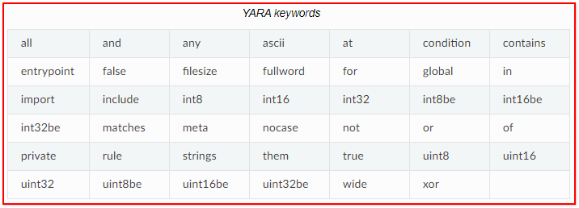

> 参考链接

https://www.cnblogs.com/SunsetR/p/12650325.html

https://bbs.kanxue.com/thread-226011.htm

https://ghostasky.github.io/2022/08/13/2022-8-13-Yara/


# 导入

通常yara规则有两部分: 字符串定义和条件

一个hello world

```c
//示例规则
rule func_TestARule : Trojan
{
    //规则描述
    meta:
        author = "Sunset"
        date = "2020-04-08"
        description = "Trojan Detection"

    //匹配的字符串
    strings:
        $a = {6A 40 68 00 30 00 00 6A 14 8D 91}
        $b = {8D ?? B0 ?? C1 83 99 6A 4E ?9 F7 1?}
        $c = "UVODFRYSIHLNWPEJXQZAKCBGMT"
    
    //匹配的条件
    condition: 
        $a or $b or $c
}
```


yara工具下载地址 :https://github.com/VirusTotal/yara

工具使用规则

```c
--atom - quality - table = FILE             //
- C, --compiled - rules                     //加载编译规则
- c, --count                                //  只打印命中的规则数量
- d, --define = VAR = VALUE                 //定义外部变量
     --fail - on - warnings                 //失败警告
- f, --fast - scan                          //快速匹配模式
- h, --help                                 //显示帮助并退出
- i, --identifier = IDENTIFIER              //  匹配指定名称的规则（使用指定名称的规则进行匹配）
- l, --max - rules = NUMBER                 //匹配多个规则后中止扫描
     --max - strings - per - rule = NUMBER  //设置每个规则的最大字符串数量(默认 = 10000)
- x, --module - data = MODULE = FILE        //将文件内容作为额外数据传递给模块
- n, --negate                               //  只打印不匹配的规则
- w, --no - warnings                        //禁用警告
- m, --print - meta                         //  打印元数据（在命中结果中显示：规则元数据）
- D, --print - module - data                //  打印模块数据（在命中结果中显示：规则名称与样本名称）
- e, --print - namespace                    //打印规则的名称空间
- S, --print - stats                        //打印规则的统计信息
- s, --print - strings                      //  打印匹配的字符串
- L, --print - string - length              //打印匹配的字符串长度（字符串在文件中的偏移与长度）
- g, --print - tags                         //  打印标签（显示命中规则的标签）
- r, --recursive                            //  递归搜索目录（匹配该目录下的所有样本文件）
- k, --stack - size = SLOTS                 //设置最大堆栈大小(默认值为16384)
- t, --tag = TAG                            //  匹配指定标签的规则（使用指定规则标签进行匹配，标签区分大小写）
- p, --threads = NUMBER                     //指定多少线程数来扫描目录
- a, --timeout = SECONDS                    //指定多少秒后中止扫描
- v, --version                              //显示版本信息
```


Yara规则语法: 以下我们称之为函数

每个函数都以关键字“rule”开头

以下关键字不能作为函数名字



关于他的注释,其实和C语言是一样的

```c
//　单行注释 
 
/*　
多行注释
*/
```

Yara中有三种类型的字符串:

```c
rule HelloRule2    // This is an example
{
    strings:
        $my_text_string = "text here" //文本字符串
        $my_hex_string = { E2 34 A1 C8 23 FB } //十六进制序列字符串,只不过是{}大括号搞起来的
 
    condition:
        $my_text_string or $my_hex_string
}
```


对于文本字符串,我们可以像C语言那样转义

```c
\" 双引号
\\ 反斜杠
\t 水平制表符
\n 换行符
\xdd 以十六进制表示的任何字节
```


同时 Yara规则默认对大小写敏感, 但你可以使用修饰符将其关闭

```c
strings:
    $strong_string = "Iron" nocase
```


字符集 也可能是unicode,所以我们也有修饰符来定义unicode字符串

```c
strings:
    $fat_villain = "FatTony" wide nocase 
    //unicode字符串,并且大小写忽略
```

但是wide只是说把单个英文字符的一个和00拼接在了一起,成为一个字符串来匹配,并不是真正意义上的unicode字符串 


对于unicode字符串 ,我们得用另外的一种方式,

```c
strings:
    $fat_villain = "FatTony" wide ascii nocase
```

ps: wide ascii是unicode字符串,对于ANSI的字符串是默认的,不需要渠修饰


全词匹配
```
strings:
    $shady_domain = "faceebook" fullword
```

这个规则可以匹配下面的三个字符串

```
www.faceebook.com
www.myportal.faceebook.com
https://secure.faceebook.com
```

但这个规则**不能**匹配以下的字符串:

```
www.myfaceebook.com
thefaceebook.com
```


# 一般的表达式


具体数值不确定

```c
strings:
    $b = {8D ?? B0 ?? C1 83 99 6? 4E ?9 F7 1?}
```


长度不确定

```c
strings:
   $hex_string = { F4 23 [4-6] 62 B4 }
   //意思就是以F4 23 开头, 62 B4 结尾
   //中间的未知长度是4-6个字节
```


如果一点长度都无法确定的话,可以写为默认

```c
strings:
   $hex_string = { F4 23 [-] 62 B4 }
```

  

```c
strings:
   $hex_string = { BA 21 ( DA BC | C6 ) A5 } //要么是DA BC A5 要么是 C6 A5
```


# 正则表达式

yara规则允许使用正则表达式, 不过要用正斜杠而非双引号括起来使用(像Perl编程那样)


比如匹配一个md5

```c
rule MatchMD5Hash {
    strings:
        $md5_hash = /(?i)^[0-9a-fA-F]{32}$/
    condition:
        $md5_hash
}
```

- `(?i)`: 正则表达式修饰符，表示后面的模式匹配大小写不敏感。
- `^`: 正则表达式锚点，表示匹配字符串的开头。
- `[0-9a-fA-F]`: 匹配一个十六进制字符，不区分大小写。包含了数字 0-9 和字母 a-f 和 A-F。
- `{32}`: 正则表达式量词，表示前面的字符类应该连续出现 32 次，用于匹配一个长度为 32 个十六进制字符的字符串。
- `$`: 正则表达式锚点，表示匹配字符串的结尾。

综上所述，`$md5_hash` 字符串变量用于匹配一个长度为 32 个十六进制字符的字符串，

不论大小写。该字符串应该以十六进制字符开头，以十六进制字符结尾


正则表达式符号

```
** 引用下一个元字符
^ 匹配文件的开头
$ 匹配文件的末尾
| 多选
() 分组
[] 方括号字符类
```


量词:

```
* 匹配0次或多次
+ 匹配1次或多次
? 匹配0次或1次
{n} 只匹配n次
{n, } 至少匹配n次
{ ,m} 至多匹配m次
{n,m} 匹配n到m次
```

转义符:

```
\t 水平制表符 (HT, TAB)
\n 换行符 (LF, NL)
\r 回车符 (CR)
\f 换页符 (FF)
\a 响铃
\xNN 十六进制代码为NN的字符
```

字符类:

```
\w 匹配单词字符 (单词可由字母数字加"_"组成)
\W 匹配非单词字符
\s 匹配空白符
\S 匹配非空白字符
\d 匹配一个十进制数字字符
\D 匹配一个非数字字符
\b 匹配单词边界
\B 匹配非单词边界
```


# 条件


布尔条件:


```c
rule Example
{
    strings:
        $hero1a = "Batman"
        $hero1b = "Robin"
        $hero2a = "Edward"
        $hero2b = "Alphonse"
 
    condition:
        ($hero1a or $hero1b) and ($hero2a or $hero2b)
}
```


出现的次数:

```
rule Ransomware
{
    strings:
        $a = "encrypted"
        $b = "btc"
 
    condition:
        #a == 2 and #b > 2
        //a出现2次,b出现次数>2
}
```


字符串偏移(虚拟地址)

```
rule Offset
{
    strings:
        $a = "encrypted"
        $b = "btc"
 
    condition:
        $a at 0x64 and $b at 0xC8
}
```

如果在文件的偏移100处(或者在一个正在运行的进程中, 位于虚拟地址100位置)发现了字符串`$a`, 

我们的规则就能捕获到该字符串. 当然字符串`$b`也要在偏移200位置上才行


`at`操作符指定到一个具体的偏移量, 而你可以使用操作符`in`来指定字符串的位置范围.

```
rule InExample
{
    strings:
        $a = "encrypted"
        $b = "btc"
 
    condition:
        $a in (0..100) and $b in (100..filesize)
}
```

字符串`$a`必须在偏移0-100之间才能找到, 而`$b`则必须是在偏移100到文件末尾位置(才能找到).

你也可以使用`@a[i]`来取得字符串`$a`第`i`个字符的偏移量或虚拟地址. 字符串索引以`1`开头 , 

故第1个字符是`@a[1]`, 第2个是`@[a2]`并依此类推, 而不是以`@a[0]`开始. 

如果你提供的索引值大过字符串总共出现的次数. 那结果就将是值`NaN`(Not a Number, 非数字).


匹配长度

对于包含跳转的许多正则表达式和十六进制字符串, 匹配长度用一个变量表示. 如果你有一个正则表达式`/fo*/`, 

可以匹配字符串`fo`, `foo`和`fooo`, 那么各个的匹配长度都是不同的.

 

在字符串标识符前加一个`!`得到匹配长度, 你就可以将匹配长度作为你条件的一部分. 跟你获取偏移时使用字符`@`类似, `!a[1]`是第一个匹配到的字符串`$a`的长度, 而`!a[2]`就是第二个匹配到的字符串的长度, 依此类推. `!a`是`!a[1]`的缩写.


```
rule Hak5
{
    strings:
        $re1 = /hack*/    // Will catch on hacker, hacked, hack, hack*
 
    condition:
        !re1[1] == 4 and !re1[2] > 6
}
```

该规则可以匹配如下字符串:

```
We hack things. We are hackers.
```

第一个`hack`是`re1[1]`且其长度等于4. 第二个`hack`长度则至少为6


文件大小

字符串标识符并不是唯一可以在条件中出现的变量(实际上, 可以不定义任何字符串来编写一个规则), 

还可以使用其他变量. `filesize`就保存着正在扫描的文件的大小. 大小以字节为单位.

```
rule FileSizeExample
{
    condition:
       filesize > 200KB
}
```

我们可以使用后缀`KB`将文件大小设置为`200KB`, 它会自动将常量的值乘上1024, 后缀`MB`会可以将值乘以`2^20`. 这两个后缀都只能用于十进制常量

[!]重要提示: `filesize`仅在规则应用于文件的时候生效. 如果应用于正在运行的进程, 那么它会永远都匹配不了.


可执行程序入口点

 变量`entry_point`的经典用法是用于搜索入口点的一些pattern, 以检测壳或简单的感染病毒

yara的`entrypoint`函数自第3版开始就已经过时了. 以下是它在第3版之前的样子.

```
rule EntryPointExample1
{
    strings:
        $a = { E8 00 00 00 00 }
 
    condition:
       $a at entrypoint
}
 
rule EntryPointExample2
{
    strings:
        $a = { 9C 50 66 A1 ?? ?? ?? 00 66 A9 ?? ?? 58 0F 85 }
 
    condition:
       $a in (entrypoint..entrypoint + 10)
}
```

[!]重要提示: 再次强调, 不要使用yara的`entrypoint`, 请在导入PE或ELF文件后使用对应的`pe.entry_point`和`elf.entry_point`


访问指定位置的数据

```
//有符号 小端序
int8(FA or VA)
int16(FA or VA)
int32(FA or VA)
 
//无符号 小端序 
uint8(FA or VA)
uint16(FA or VA)
uint32(FA or VA)
 
//有符号 小端序
int8be(FA or VA)
int16be(FA or VA)
int32be(FA or VA)
 
//无符号 大端序  
uint8be(FA or VA)
uint16be(FA or VA)
uint32be(FA or VA)
```

案例

```
rule IsPE
{
  condition:
     uint16(0) == 0x5A4D and uint32(uint32(0x3C)) == 0x00004550
}
```


for…of: 循环

要用for循环来检查一组字符串是否满足特定条件, 请使用如下语法:

```
for num of string_set : ( 要满足的表达式)
```

对每个`string_set`的字符串, 都会计算`boolean_expression`的值, 并且这些值必须至少有1个为真.

当然你也可以使用其他关键字, 如`all`或`any`代替`num`来使用.

```
for any of ($a,$b,$c) : ( $ at elf.entry_point  )
```

`$`表示集合中的所有字符串. 本例中, 它是字符串`$a`, `$b`和`$c`.

你也可以使用符号`#`和`@`来引用每一个字符串的出现次数和首字符偏移量.

```
for all of them : ( # > 3 )
for all of ($a*) : ( @ > @b )
```


迭代字符串出现次数:

如果你想对偏移迭代并测试条件. 你可以如下操作

```
rule Three_Peat
{
    strings:
        $a = "dummy1"
        $b = "dummy2"
 
    condition:
        for all i in (1,2,3) : ( @a[i] + 10 == @b[i] )
}
```


# Eg


## 1


如果你想要中列表中选择一定数量的字符串, 你可以执行以下操作

```c
rule MigosPresent
{
    strings:
        $m1 = "Quavo"
        $m2 = "Offset"
        $m3 = "Takeoff"
 
    condition:
        2 of ($m1,$m2,$m3)
}//如果$m1, $m2和$m3任意存在两个, 那么就满足上述规则中的条件.
```


当然也可以这样写

```c
rule MigosPresent
{
    strings:
        $m1 = "Quavo"
        $m2 = "Offset"
        $m3 = "Takeoff"
        $q1 = "Cardi B" 
 
    condition:
        2 of ($m*)
        // 3 of ($*)  
        // all of them
        // any of ($*) 
        // 2 of ($m*)
}
```


