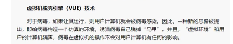

# 什么是免杀

免杀就是反病毒技术

它指的是一种能使病毒木马免于被[杀毒软件] 查杀的技术

其内容基本上都是修改病毒),木马的内容改变特征码，从而躲避了杀毒软件的查杀


病毒不断的发生进化...

进化到红蓝对抗的免杀?


为什么学先x86免杀?而不是x64?

这个问题 应该和 "为什么先学x86逆向,而不是x64逆向" 一样的

https://anhkgg.com/aanti-virus/

# 国内的杀软公司

360全家桶 一级棒

火绒其次

然后是电脑管家

其它的可能较次之(金山毒霸,江明,瑞星...),主要是每太听说他们


主动防御方面: 360和火绒 较强

查杀方面: 360和电脑管家 较强

反问: 360全家桶是指哪些?


就如图4个,就是360全家桶


> 360:

延迟查杀: 发现样本后,先不杀,哪怕你主动扫描它, 360会把它上传到云端分析,依据结果再对你进行查杀 


# 传统的查杀


## 查杀方式的基本框架 


**静态查杀**  : 一般根据特征码(涉及多处多组)，然后对文件进 **多维的** 交叉匹配 

**行为查杀**  : 关注软件执行时的行为模式。行为查杀会监控程序的运行，并分析其行为，如文件操作、系统修改、网络通信等。

如果一个程序表现出类似恶意软件的行为模式，即使其没有明确的病毒特征，行为查杀系统也可以标记它为潜在威胁或恶意软件

**云查杀**    :  它将样本上传到云端进行分析和检测。云端服务器使用先进的算法和机器学习技术来识别恶意代码。

一旦新的威胁被确认，其特征会被添加到云数据库中，以便全球用户受益于对新威胁的防护


>    细说行为查杀:


传统杀软检测原理:

通过对病毒多年年的观察、研究，有些行行行为是病毒的共同行行行为，而而且比比较特殊，

在正常程序中，这些行行行为比比较罕 见。

当程序运行行行时，监视其进程的各种行行行为，如果发现了了病毒行行行为，立立即报警


主动防御:

主动防御并不不需要病毒特征码支支持，只要杀毒软件能分析并扫描到目目标程序的行行行为，

并根据预先设定的规则，判定是否应该进行行行清除操作主动防御本来想领先于病毒，

让杀毒软件自自己己变成安全工工程师来分析病毒，从而而达到以不不变应万变的境界。

但是，计算机的智能总是在一一系列列的规则下诞生生，而而普通用用户的技术水水平达不不到专业分析病毒的水水平，

两者之间的博弈将主动防御推上一一个尴尬境地。


>   机器器学习识别技术

也是一种nb的查杀方式

可参考 https://bbs.pediy.com/thread-272298.htm

机器器学习识别技术既可以做静态样本的二二进制分析，又又可以运用用在沙箱动态行行行为分析当中，

是为内容/行行行为+算法模式。伴随着深度学习的急速发展，各家厂厂商也开始尝试运用用深度学习技术来识别病毒特征，

如瀚思科技的基于深度学习的二二进制恶意样本检测


## 监测技术


1、内存读取监测

监控所有进程，扫描内存。


2、写入文件监测

对于写入磁盘的文件进行扫描。

比如,我们创建一个文件,会被杀软检测到,确定安全才会被创建


3、网页安全监测

检测是否存在网络攻击和不安全下载


4、邮件附件监测

对于电子邮件的附件进行病毒扫描。

比如自动解压一些文件,zip或者7z什么的,如果你加了密码,就不会被杀软解压缩


5、进程行为监测

沙盒模式即为进程行为检测，监测进程各种行为，对于敏感操作进行警报。


通过深度学习技术来识别病毒特征，不仅可以做静态样本的二进制分析，也可以运用到沙盒动态行为分析中。

过的免杀,: 是可以让样本运行起来,拍起来之后是否被杀,是另外的事情


浅浅的提及一下 360对进程的检测:

当有新的进程创建的时候,360会Hook,并挂起新的进程,并对该进程进行一个扫描

新的进程的父进程一般是 explore.exe


下面是一个360挂的内核钩子,对进程创建做一个检测


VUE: 可以实现杀软的自动脱壳



既然都可以实现脱壳了,那么对于压缩包解压缩当然也是手到擒来的事情


## 扫描技术


1 扫描压缩包技术：即是对压缩包案和封装文件作分析检查的技术。

2 程序窜改防护：即是避免恶意程序借由删除杀毒侦测程序而大肆破坏电脑。

3 修复技术：即是对恶意程序所损坏的文件进⾏还原

4 急救盘杀毒：利用空白U盘制作急救启动盘，来检测电脑病毒。类似于大白菜pe启动器

5 智能扫描：扫描最常用的磁盘，系统关键位置，耗时较短。

6 全盘扫描：扫描电脑全部磁盘，耗时较长。

7 勒索软件防护：保护电脑中的文件不被⿊客恶意加密。

8 开机扫描：当电脑开机时自动进行扫描，可以扫描压缩文档和可能不需要的程序


# 沙箱&&杀软引擎&&监测工具


> 火绒HIPS引擎架构沙箱源码 

https://github.com/huoji120/DuckSandboxDetect


> 毕方智能云沙箱( ***Bold-Falcon*** )是一个开源的自动化恶意软件分析系统。

它用于自动运行和分析文件，并收集全面的分析结果，概述恶意软件在独立操作系统中运行时所做的工作。

**`说明文档`** https://powerlzy.github.io/Bold-Falcon/

**`开发文档`** https://boldfalcon.readthedocs.io

二次开发开源cuckoo沙箱，

包括 **更新项目结构** ，**重写整个前端的用户交互**和 **添加基于机器学习的检测模块** ， 

使恶意软件分析系统可以 **思考**

下载源码

```shell
$ git clone https://github.com/PowerLZY/Bold-Falcon
```

```shell
$ pip install Bold-Falcon
```

开源资料

* [cuckoo](https://github.com/cuckoosandbox/cuckoo) Cuckoo Sandbox is an automated dynamic malware analysis system
* [cuckoo-modified](https://github.com/spender-sandbox/cuckoo-modified) Modified edition of cuckoo
* [cuckooDroid](https://github.com/idanr1986/cuckoo-droid) CuckooDroid - Automated Android Malware Analysis with Cuckoo Sandbox.
* [docker-cuckoo](https://github.com/blacktop/docker-cuckoo) Cuckoo Sandbox Dockerfile
* [cuckooautoinstall](https://github.com/buguroo/cuckooautoinstall) Auto Installer Script for Cuckoo Sandbox
* [cuckooML](https://github.com/honeynet/cuckooml) CuckooML: Machine Learning for Cuckoo Sandbox
* [Panda-Sandbox](https://github.com/PowerLZY/Panda-Sandbox) Cuckoo python3 (Unfinished)
* [HaboMalHunter](https://github.com/Tencent/HaboMalHunter#readme_cn) HaboMalHunter is a sub-project of Habo Malware Analysis System

源码分析

* [cuckoo技术分析全景图](https://cloud.tencent.com/developer/article/1597020)
* [cuckoo沙箱源码分析上](https://bbs.pediy.com/thread-260038.htm)
* [cuckoo沙箱源码分析中](https://bbs.pediy.com/thread-260087.htm)
* [cuckoo沙箱源码分析后](https://bbs.pediy.com/thread-260252.htm)
* [腾讯哈勃Linux沙箱源码分析上](https://zhuanlan.zhihu.com/p/54756592)
* [腾讯哈勃Linux沙箱源码分析下](


> 逆向火绒安全软件驱动sysdiag

这个在gitee有,我建议以后可以去下载下来

它可能把整个驱动给下载下来了


> Navy_public


轻量级自动分析病毒程序调用上下文、游戏反调试实现技术...

一款工具,可以去了解一下


# 用什么语言做远控最好


建议越底层越好

因为越底层对环境要求越低

比如C#需要肉机得有.net环境

比如MFC,需要肉机得有xx环境

...

所以用C最好

举一个实际的例子..

之前用vs2022写纯C语言,一个简单的MessageBOx,拖到虚拟机或者沙箱运行..

居然都需要2个dll环境,msvcruntime140d.dll和ucrtbased.dll

这是逼我用vs2019! 或者说逼我用vs2010? 还是说用vc6.0 ?


又说回来...环境问题的解决办法就一定只有一种吗? 难道我们不可以打包环境吗?比如附上msvcruntime140d.dll和ucrtbased.dll

但是.net那个环境确实不好附上

又说回来..有的时候..比如一些API..为了脱离环境...我们甚至需要手写这个API或者函数


