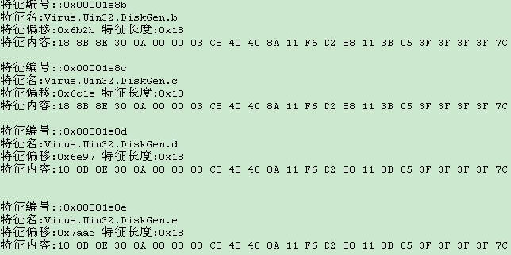
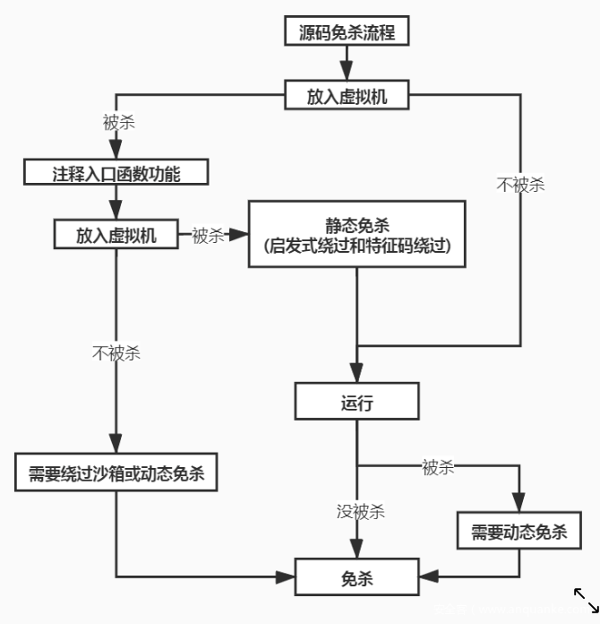

# 什么特征码


计算机病毒的特征码需要能够把病毒程序与一般的程序区分开来，即能够唯一标识一个或者一类多态病毒

要能够成为计算机病毒程序的指纹

每个杀毒软件公司都有自己的特征码提取方法和提取工具，这也是特别需要技术的地方，弄不好就造成误判，

将好文件当成病毒给杀了


一般来说，病毒特征码可能需要满足以下几个要求：

1), 不能从数据区提取，因为数据区的内容很容易改变，一旦病毒程序变更版本，改变了数据内容，特征码就会失效。而其它的区块则相对来说保险一些。

2), 在保持特征码的唯一性的前提下，应当尽量使得特征码短小精悍，从而减少检测过程中的时间与空间的复杂度，提高检测效率。

3), 经过详细的逆向分析之后选取出来的特征码，才足以将该病毒与其它病毒或正常程序相区别。

4), 病毒程序的特征码一定不能匹配到普通程序，比如选取病毒入口点的二进制代码，就必然出现误报的情况。

5), 从特征函数提取特征码,比如一些高频出现的解码函数,主打一个高频出现,不管病毒如何更新,该字节码序列是不变的


杀软可能选取多处特征码,交叉混合的匹配样本,当同时包含了多出特征,就会报毒


 


# YARA扫描

你的特征码其实一般情况下都会被Yara分析并识别

YARA是一款旨在帮助恶意软件研究人员识别和分类恶意软件样本的开源工具，

使用YARA可以基于文本或二进制模式创建恶意软件家族描述信息，当然也可以是其他匹配信息


下面这个是一个Yara的匹配案例,可以看看特征码扫描是什么样子的

```c
rule PoisonIvy_Generic_3 {
    //规则介绍
    meta:
        description = "PoisonIvy RAT Generic Rule"
        license = "https://creativecommons.org/licenses/by-nc/4.0/"
        author = "Florian Roth"
        date = "2022-04-07"
        hash = "e1cbdf740785f97c93a0a7a01ef2614be792afcd"
    
    //要匹配的数据    
    strings:
    	//敏感的某个字符串
        $k1 = "Tiger324{" fullword ascii
		
		//敏感的模块信息
        $s2 = "WININET.dll" fullword ascii
        $s3 = "mscoree.dll" fullword wide
        $s4 = "WS2_32.dll" fullword
        $s5 = "Explorer.exe" fullword wide
        $s6 = "USER32.DLL"
        $s7 = "CONOUT$"
        $s8 = "login.asp"
		
		//敏感的网络信息
        $h1 = "HTTP/1.0"
        $h2 = "POST"
        $h3 = "login.asp"
        $h4 = "check.asp"
        $h5 = "result.asp"
        $h6 = "upload.asp"
    condition:
        	uint16(0) == 0x5a4d and filesize < 500KB and //判断是不是PE文件,并且文件大小<500kb
            ( 
                $k1 or all of ($s*) or all of ($h*)
                //满足上面3个大类的其中任意一种情况都被查杀返回TRUE,否则返回FALSE
            )
}
```


# 杀软之常见的特征码结构


先了解一下常见的数据结构


病毒库结构: 名称表，包括壳名、包名、特征名 

```c
structVirInfo
{
    DWORD dwID;
    BYTE btLength;
    char VirName[btLength];
};
```


病毒库常见的PE库结构

```c
struct VirpeHeader
{
    WORD wUnknown;
    DWORD dwHeadSize;
    DWORD dwSize;
    WORD wTable1Count;
    WORD wdMaskCount;//表示共有多少条PE特征
    WORD wdUnknown4;
    DWORD dwTable1Off;
    DWORD dwTable2Off;
    DWORD dwTable3Off;
    DWORD dwTable4Off;
    DWORD dwTable5Off;//传统特征
    DWORD dwTable6Off //多模式特征
};
```


特征结构

```c
struct Sig 
{
    DWORD dwRecordID;//特征ID，用于关联特征名
    DWORD dwOffset;//特征偏移，用于定位病毒代码具体位置
    BYTE btLength;//特征长度，用于扫描匹配病毒代码长度
    BYTE btOffsetBaseAddress;//特征基地址，用于定位特征起始位置
    BYTE btVirMask[btLength];//病毒特征具体内容
};
```


二进制全文匹配: 也就是一一匹配.通常取出一些字节,然后和样本进行一个匹配

多模匹配:将恶意程序的明显字符串信息提取出，记录在病毒库中，与待检测样本进行多模匹配。


# 如何绕过特征码免杀 (一)


ps: 绕过md5校验的话,就修改字节码或者增加文件大小之类的,会比较简单

绕过特征码, 其实就是需要我们不断的去猜测,特征码在哪里


然后我们去修改特征码的某一个字节,然后再让杀软去扫描,是否报毒

如果还在报毒,那么我们就再寻找关键位置,再次修改字节码,再次让杀软扫描


如何修改特征码:

1), 修改字节码,不能影响样本的正常运行

2), 可以采用等效的方法修改, 类似于 xor eax,eax == mov eax,0

其实这种方法算得上是效率比较低下的笨方法,因为是大海捞针


进一步

这又侧面的说明了什么: 如何寻找特征码便得很重要

于是出现了工具  常用的定位木马病毒特征码: CCL，MultiCCL，MYCC, VirTest

其实可以去百度一下MyCLL的用法,知道MyCll是干嘛的

可以发现,MyCll也是一个效率很低的一个方法

关于VirTest貌似是一个更加科学的方法,不过效率还是比较低的


ps: 其实就是根据杀软如何定位特征码,我们才可以更加有效的去猜测特征码位置


# 如何绕过特征码免杀 (二)

反正特征码定位到数据位置不容易修改（可以再试试后面的盲免杀）

因为我们很难精准定位到特征码的位置


## 基于源码->二进制文件的免杀


其实只是针对于样本开发者的角度而言

比如我们写了一个病毒出来

生成的时候,发现360报毒了

这个报毒可能是因为我们写了某一个函数导致的

于是我们可以通过在源码中修改某某函数

比如增加这个函数,减少这个函数,替换这个函数,魔改这个函数,混淆这个函数之类 来达到一个免杀的目的

```
1. sub1 //未报毒
2. sub1 sub2 //未报毒
3. sub1 sub2 sub3 //报毒
4. sub1 sub2 sub3(sub31) //未报毒
5. sub1 sub2 sub3(sub31 sub32) //报毒
6. sub1 sub2 sub3(sub31 sub32(sub321)) //报毒
```

有时我们甚至需要重写API函数来绕过免杀


源码->二进制文件: 



## 基于二进制样本

其实就是我们最终编译好了恶意的代码

然后这个二进制文件被杀了

这个可能就是我们的恶意样本中包含了一些特征码

如何去除这些特征码?

比如nop大法,修改程序跳转,等效指令,花指令...

总之这种效果不是很好,比较费时间,源码面试会更加不粗


二进制文件->无特征文件:


## 数据角度


1 字符串，如果不影响程序逻辑，可以替换大小写；如果无关紧要的数据，随意替换；等等，看情况而定。

2 整数，如果不影响结果，替换值，清零等等操作。

3 地址，基本应该不能修改，具体看情况。

4 PE头数据，根据PE结构具体来看，无用数据清零或修改，有用数据看情况修改。


## 代码角度

1 如果特征码定位到代码（也通过IDA/OD等确认），在不改变程序功能基础上，应用各种方法修改。

2 等价替换汇编代码，如mov eax，0 可以换成xor eax，eax，直接结果相同，二进制代码不同。

3 交换代码顺序，在不影响逻辑的情况下。

4 代码块移位，将代码块移动不用的内存位置，通过加入jmp addr 跳过去执行，addr是新的代码块地址。

5 最后，终极修改方法，找到访问数据的代码，直接修改代码访问数据的地址，数据也可以放到其他地址了，

其实就如同修改源码一样修改，肯定没有修改源码那么容易（见后）。


# 其它


## 关于pe文件杀软会关注哪些地方


1), pe头

2), p代码段: 一般放全局变量

3), p数据段: 

4), 资源段(杀软重点研究): ico,shellcode


同时杀软会参照样本PE文件和标准PE文件,从多个维度考查样本PE的合法性

比如

首先确定是不是pe文件

查看section是否异常

...


>   关于对pe的入口修改

不一定要一开始就修改ep

而是在执行ep的时候,再去新的节区

这里可能盯的比较紧


>   关于pe的IAT

一般不去导入表加载API,容易被检测敏感函数,所以一般动态加载API

比如说你有一段提取的代码 ,他会通过你有危险APi的导入和危险APi的调用来判断你是一个恶意程序


敏感的API:

```
KERNEL32.LoadLibraryA
KERNEL32.GetProcAddress
KERNEL32.VirtualProtect
KERNEL32.VirtualAlloc
KERNEL32.VirtualFree
ADVAPI32.OpenProcessToken
PSAPI.EnumProcesses
kernel32.GetCurrentProcess
SeDebugPrivilege
```


## 关于文件的静态免杀,可能匹配什么


MD5 匹配:文件哈希

FileName 匹配:文件名字

File Size匹配: 文件大小

File Path 匹配:

scode 匹配: 关键特征码,也就是程序如果没有那段字节码,就跑不起来

