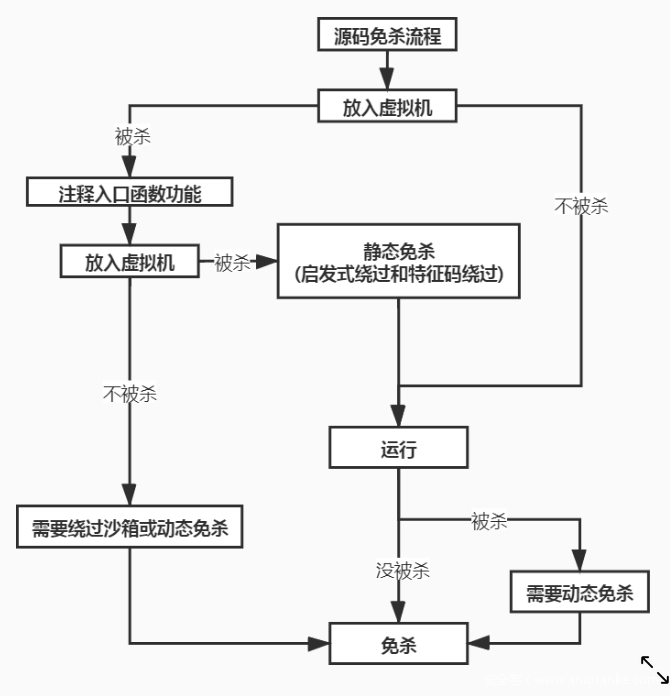

从C/C++语言出发的源码免杀

是通过修改源代码来达到二进制字节码的变化

从而逃过特征码的追踪


其实只是针对于样本开发者的角度而言

比如我们写了一个病毒出来

生成的时候,发现360报毒了

这个报毒可能是因为我们写了某一个函数导致的

于是我们可以通过在源码中修改某某函数

比如增加这个函数,减少这个函数,替换这个函数,魔改这个函数,混淆这个函数之类 来达到一个免杀的目的

```
1. sub1 //未报毒
2. sub1 sub2 //未报毒
3. sub1 sub2 sub3 //报毒
4. sub1 sub2 sub3(sub31) //未报毒
5. sub1 sub2 sub3(sub31 sub32) //报毒
6. sub1 sub2 sub3(sub31 sub32(sub321)) //报毒
```

有时我们甚至需要重写API函数来绕过免杀


源码->二进制文件: 



