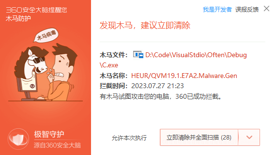

2023-07-27 测试


```c
#include <windows.h>
#include<stdio.h>
int main()
{
	int x;
	int y ;
	scanf("%d %d", &x, &y);
	__try {
		x = x / y;
	}
	__except(1)
	{
		printf("wrong\n");
	}
	return 0;
}
```




导出表函数遍历

