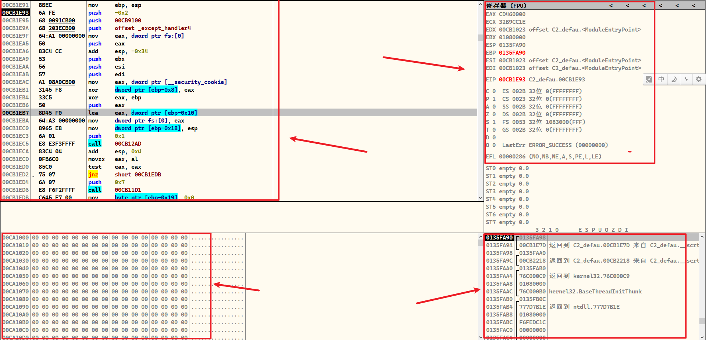
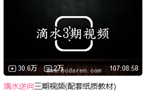

```
1),哪里学

2),如何学习

3),有什么学习资源

4),最后要达到一个什么效果

5),需要多深入

6),学习它的用处是什么

7),建议学习时长

8),用到的工具(附下载链接)
```


```
吾爱破解论坛工具下载: https://down.52pojie.cn/
看雪论坛工具下载: https://tool.kanxue.com/
```


# C语言初级


1), 哪里学? 菜鸟网站

2), 如何学? 看教程,敲代码


3),有什么学习资源:

A), 就菜鸟网站的那些案例, 别看评论区

B), 菜鸟网站 C语言的100  example


这个100例的东东建议练习一下,当然得是了解了基本上大部分语法再来拿100个example练手

练习个50-60感觉差不多吧, 建议手抄50-60个,哈哈,也不是非得50-60个

反正基本涉及的语法会就行,甚至不手抄50-60,100个都可以看懂语法,然后一个也不写都行


4), 最后要达到一个什么效果:

就基本的语法,循环,输入,输出结构体,数组,字符串,字符串操作,指针操作

什么文件操作那些可能都不太需要


5), 需要多深入:

10分深度,入6分


6), 学习它的用处是什么:

visual stdio 写代码, IDA 看代码需要用到


7), 用到的工具

visual stdio 2019 官网下载

别用Devcpp/Devc++,别问为什么


8), 建议学习时长

7天吧,适当1.5周也行


# 汇编语言初级


 

1), 哪里学?

依据自己的C语言基础写一些简单的代码,然后用IDA/OD/x64dbg调试

2), 如何学习? 

不需要学会写汇编!!! 重要事情说三遍

比如我不知道mov eax,0 什么意思,那就百度搜索 mov什么意思,百度搜索 eax什么意思

比如我不知道 jmp eax什么意思, 那就搜索jmp 什么意思...

比如我不知道eip什么意思,那就百度


ps: 不要看教程,或者看视频,那些东西偏慢,效率很低,效果不好

基本上都是看不懂就问会的人,或者**百度**搜一搜


3),有什么学习资源:

没


4), 最后要达到一个什么效果:

我框住的东西,基本上都要知道是什么



5), 需要多深入:

10分入6分


6), 学习它的用处是什么:

 IDA/OD/x64dbg看汇编都需要认识

以后shellcode什么的,内联汇编什么的都需要用到


7), 建议学习时长

7天吧,适当1.5周也行


8), 用到的工具

多用IDA

混合着x64dbg,OD使用

ps: 也就是IDA调试明白了,然后x64dbg,OD上手再看看

相同的案例,用不同的工具试一试

为什么要用3个工具? 3款利器,必须会,别问..


下载链接?

IDA这个别去官网!!!说3编,去看雪的贴子看看,会有的

OD去看雪官网,52破解的官网论坛会有下载链接

x64dbg 一个开源免费项目,官网有,去下载


# C语言+汇编


1), 哪里学?  

bilibili有一个滴水逆向的课程,长达巨多个小时

本人追剧追完过,但是不建议后来者去追它



然后视频前面讲了C语言和汇编语言,

他是结合这2个,融会贯通的讲,讲得很不错,可以追一下前面几个视频

追到多少集,我忘了,自己看


2), 如何学习? 

就追剧,跟着敲代码,跟着视频老师做

里面有一个什么switch case那个东东,没什么意思,知道就行


3),有什么学习资源:

见视频

 

4), 最后要达到一个什么效果:

看懂认为自己有收获


5), 需要多深入:

10分入6分


6), 学习它的用处是什么:

内功,把C语言和汇编融会贯通


7), 建议学习时长

7天吧 


8), 用到的工具

多用IDA

混合着x64dbg,OD使用

ps: 也就是IDA调试明白了,然后x64dbg,OD上手再看看

相同的案例,用不同的工具试一试

为什么要用3个工具? 3款利器,必须会,别问..


# win32


1), 哪里学?  


2), 如何学习? 


3),有什么学习资源:


4), 最后要达到一个什么效果:


5), 需要多深入:


6), 学习它的用处是什么:


7), 建议学习时长


8), 用到的工具


# PE


