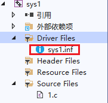
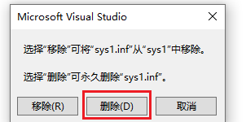
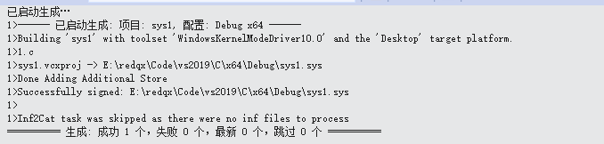
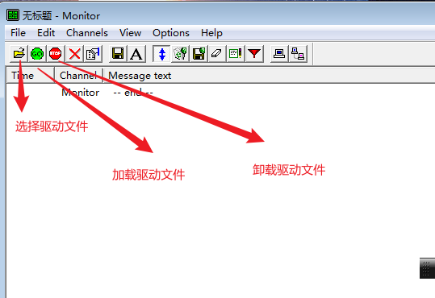
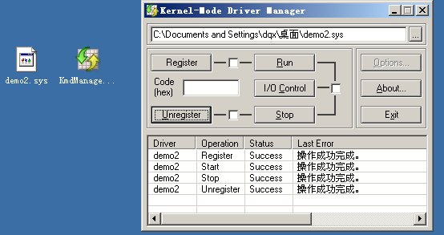

# 2019-环境配置+项目创建和生成-Win7

环境配置:

VS2013(update4) + wdk8.1 驱动开发环境搭建 https://blog.csdn.net/hk_5788/article/details/46801647

我用的是vs2019+wdk10，安装过程属于纯小白是一路默认,一点脑袋都不动

VS2013试了很久都没有成功


项目创建和生成:

第一次创建一个项目不像C语言那么简单,函数有些东西要注意一下

可以参考链接: https://www.bilibili.com/video/BV1QJ411A7kR?p=6&vd_source=43e0e1ba96c9433bed474fdc8305c719

创建一个项目


然后删除inf文件,注意是项目里面删除,而不是移除





然后继续配置项目属性


配置属性 `->` C/C++ `->` 常规 `->` 警告等级 `->` 等级3(/W3)

配置属性 `->` C/C++ `->` 常规 `->` 将警告视为错误 `->` 否(/WX-)

配置属性 `->` C/C++ `->` 代码生成 `->` Spectre Mitigation `->` Disabled   ps: Spectre缓解库的东东

配置属性 `->` Driver Settings `->` Target OS Version `->` Windows10  ps:如果是win7就写win7

配置属性 `->` Driver Settings `->` Target Platform `->` Desktop


在空的项目的源文件添加一个 test.c 文件,如果写cpp的话,就编译不过

文件内容如下

```c
#include<ntddk.h>
void my_unload(PDRIVER_OBJECT xx)
{
    DbgPrint("Good Bye rdqx\n");
}
NTSTATUS  DriverEntry(
    PDRIVER_OBJECT driver,
    PUNICODE_STRING reg_path
)
{
    driver->DriverUnload = my_unload;//安全卸载函数
    DbgPrint("redqx: %wZ\n", reg_path);
    return 0;
}
```


然后右键生成




加载驱动的3种方式

1), 通过服务

2), ntdll的API调用 ZwLoadDriver,搭配一个注册表路径,指定手动加载还是自动加载

3), inf文件,很麻烦

4), 百度一下


但是驱动这个东东需要一个官方签名才可以加载的

但是也不是说非要签名才可以的


参考链接: https://www.bilibili.com/read/cv10382111

需要makecert.exe和signtool.exe这两个开发工具带的程序，

网上搜一下就有，capicom.dll可以到这里下载安装

生成证书

```
makecert -r -pe -ss Sparkle -n "CN=Sparkle" sparkle.cer
```

签名一下

```
signtool sign /v /s Sparkle /n Sparkle 
ps: 要签名的文件用空格隔开就 
```

就签好了 


但是签名很麻烦 

关驱动强制签名是不可能关驱动强制签名的

Windows 10 1803以后是不可能关的，但是打开测试模式可以使用自签名证书

```c
bcdedit -set NOINTEGRITYCHECKS ON
bcdedit -set TESTSIGNING ON
bcdedit -set loadoptions DDISABLE_INTEGRITY_CHECKS


//关闭那个模式 
//bcdedit /set testsigning off
```

然后重启电脑就进入了测试模式


debugview配置一下才可以监听内核的DbgPrint: 

以管理员员模式启动


然后我们就用DriverMonitor.exe 加载驱动

注意: 以管理员模式启动DriverMonitor.exe

然后



于是选择->加载->卸载


debugView就出现了消息


# 2013 -环境配置+项目创建和生成-Xp

和之前的大体相同

但是又有一些又不相同

比如xp可以不要签名加载驱动

然后vs2013的生成修改的地方很少很少


测试文件如下

```c++
#include<ntddk.h>
void my_unload(PDRIVER_OBJECT xx)
{
    DbgPrint("Good Bye rdqx\n");
}
NTSTATUS  DriverEntry(
    PDRIVER_OBJECT driver,
    PUNICODE_STRING reg_path
)
{
    driver->DriverUnload = my_unload;//安全卸载函数
    DbgPrint("redqx: %wZ\n", reg_path);
    return 0;
}
```


首先建一个工程


然后删除这些东西


然后配置项目属性


然后就可以直接生成了


然后我们尝试在xp中加载一个文件


把文件拖进工具中

然后点击register

然后点击run

卸载的流程应该是: stop,unregister吧


可以看到注册成功,


然后run成功,,windbg停下来


然后你就g一下运行呗

首先输出


我们尝试卸载

先stop,然后unrgister



可以看到输出


