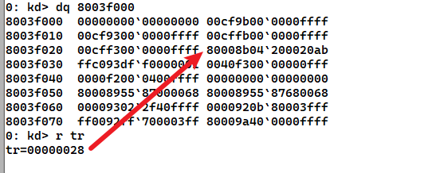
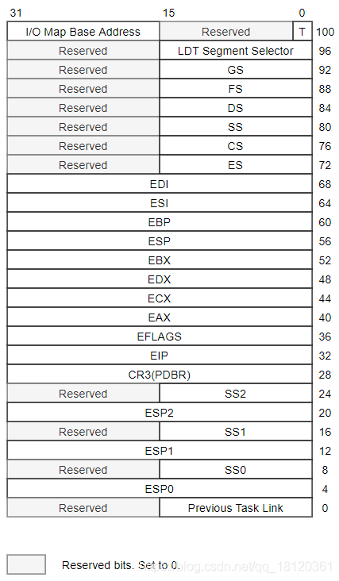
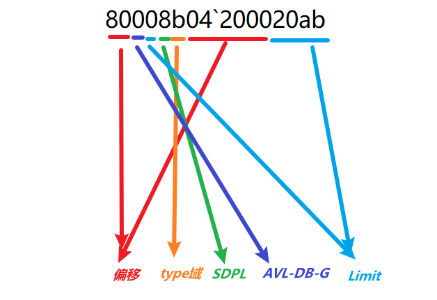
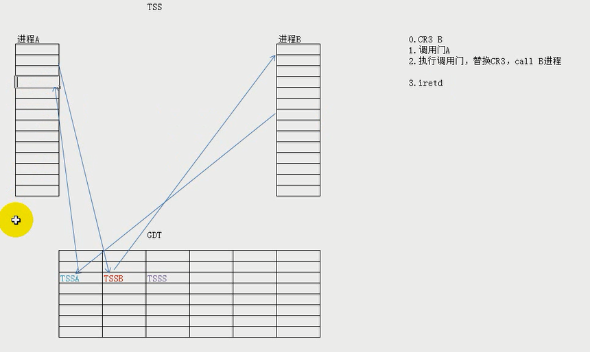

# 关于本节

很多东西视频没有讲明白

说一实验什么的也不好做


对于TSS的如何换掉一堆寄存器是怎么实现的?不知道

对于tr寄存器是如何修改的,,,不知道

对于ldt是干嘛的,,,不知道

ldtr是干嘛的,,也不知道


如果再看一遍自己都看不懂

那说明自己都没有理解的..🤭🤭🤭

其次的话,,我对当前这一节,,,可以说是很不了解的


# 前言

因为性能的一些原因

TSS在x64下已经不再使用的

不要把TSS和任务切换联系到一起

TSS的意义在于同时换掉一堆寄存器


TSS (Task-state segment )：任务状态段 

在调用门、中断门与陷阱门中，一旦出现权限切换，那么就会有堆栈的切换；

所以就会出现SS,SP的切换,那么切换需要的SS,SP初始化的数据来自哪里呢? 来自TSS任务状态段


TR是一个16位的寄存器, value是GDT表的一个偏移

该偏移指向的东西就是TSS段描述符

 


# TR寄存器

TR寄存器告诉了TSS的段描述符

也就是位于GDT的哪里,TR的值感觉是一个基于GDT表的偏移

而不是TSS的段选择子


其实关于TR寄存器的读写

自己不是很理解的


## 写TR寄存器


指令：`LTR`

在R0可以通过LTR指令修改TR段寄存器。

说明：

1.  用LTR指令去装载的话 仅仅是改变TR寄存器的值(96位)
2.  并没有真正改变TSS
3.  LTR指令只能在系统层使用
4.  加载后TSS段描述符的状态位会发生改变

在R3可以通过 CALL FAR 或者 JMP FAR 指令修改。

用JMP去访问一个代码段的时候，改变的是CS和EIP：

JMP 0x48:0x123456，如果0x48是代码段，执行后：CS->0x48、EIP->0x123456。

用JMP去访问一个任务段的时候：

如果0x48是TSS段描述符，先修改TR段寄存器，再用TR.BASE指向的TSS中的值修改当前的寄存器。


##  读TR寄存器

指令：`STR`

说明：如果用STR去读的话，只读了TR的16位，也就是段选择子

相关实验没做,没有环境


# TSS


>   引入

TSS在哪里?

TR寄存器会告诉你,TR就是一个基于WORD类型的段选择子?




```c++
|---------------------------------------|
| TYPE | S | DPL | P | AVL | - | DB | G |
| 1101 | 0 | 00  | 1 | 0   | 0 | 0  | 0 |
|---------------------------------------|
```

TSS是一块内存,每一个TSS都存储了与之对应线程的上下文

大小：至少104字节



另外TR寄存器是固定不变的,无论如何进行一个线程切换,TR都不会发生改变

变的是什么?是TR寄存器指向的TSS内存

然后内存里面的ESP成员一直在变,,其它大多数成员都没有发生改变

那么每一个线程的TSS的ESP来自哪里?

答:每一个线程的`_KPCR`


Intel的设计思想：在操作系统运行的时候，进行任务的切换。

Intel提到的任务对应的是操作系统的线程。

它在CPU层面叫任务，

操作系统层面叫线程。

当程序执行的时候，如果想做新的事情，或者新的任务，

那么上下文环境需要发生变化，不能使用原来的寄存器。

原来的寄存器存储的是上一个程序要用到的值。


 

## 位于GDT的 TSS段描述符


```c++
80008b04`200020ab
```




```c++
|---------------------------------------|
| TYPE | S | DPL | P | AVL | - | DB | G |
| 1101 | 0 | 00  | 1 | 0   | 0 | 0  | 0 |
|---------------------------------------|
```


和常规的差不多

Type = 二进制1001：说明该TSS段描述符**未**被加载到TR段寄存器中

Type = 二进制1011：说明该TSS段描述符**已**被加载到TR段寄存器中


注意：

高4字节的第23位，也就是G位。

G位=0：代表limit界限单位是字节

G位=1：代表limit界限单位是4KB。

前文中的实验通常都是1，本文中为0

为什么是0？因为LIMIT指向的TSS是以字节为单位的


## 位于IDT的 任务门描述符


保留部分,随意写

关于TYPE域


INT N（N为IDT表索引号）

系统通过用户指定的索引查找IDT表，找到对应的门描述符

门描述符若为任务门描述符，则根据任务门描述符中TSS段选择子查找GDT表，找到TSS段描述符

将TSS段描述符中的内容加载到TR段寄存器

TR段寄存器通过Base和Limit找到TSS

使用TSS中的值修改寄存器

IRETD返回

相关实验没做,没环境


# 关于线程切换


每一个线程都会去维护自己的TSS

好像每一个线程的TSS他的ebp是一样的,但是esp不一样

CPU每一个核只有一个tr


# 实验

这些实验,,,,基本上看网上的也没有作对,,,😔

以后回头再来看看呗


另外这个实验好像坑很多的

很多地方要注意的


其中视频

保护模式\16.任务段下

\保护模式\17-101012分页机制

都是学生演示这些实验,,,然后老师并没有讲解什么的


## call 任务门


```c++
#include <stdio.h>
#include <stdlib.h>
#include <windows.h>

char trs[6]={0};
char gdts[6]={0};


void __declspec(naked)  test()
{
        __asm
        {
            int 3;
            push eax;
            pushfd;
            pop eax;
            or eax,0x4000;
            push eax;
            popfd;
            pop eax;
            //jmp fword ptr trs;
            iretd;
        }
}

int main(int argc,char * argv[])
{

    char stack[100]={0};
    DWORD cr3=0;
    char buf[6]={0,0,0,0,0x48,0};
    DWORD st_tss[0x68]={
            0x0,0x0,0x0,0x0,
            0x0,0x0,0x0,
            cr3,//cr3
            (DWORD)test,//eip
            0,//eflag
            0,//eax
            0,//ecx
            0,//edx
            0,//ebx
            ((DWORD)stack) - 100,//esp
            0,//ebp
            0,//esi
            0,//edi
            0x23,//es
            0x08,//cx
            0x10,//ss
            0x23,//ds
            0x30,//fs
            0,//gs
            0,//ldt
            0x20ac0000//xx?

    };
    WORD rs=0;
    printf("cr3:");
    scanf("%X",&cr3);
    _asm{
        sgdt gdts;
        str ax;
        mov rs,ax;
    }
    *(WORD*)&trs[4]=rs;
    printf("%X\n",&st_tss);
    system("pause");
    __asm
    {
        call fword ptr buf;
    }
    printf("hi you get here\n");
    return 0;
}
```


首先构造TSS

```c++
|         (00cfbb00`0000ffff)
|         (00000000)[0,000FFFFF)        |
|---------------------------------------|
| TYPE | S | DPL | P | AVL | - | DB | G |
| 1101 | 1 | 10  | 1 | 0   | 0 | 1  | 1 |
|---------------------------------------|
```


## jmp 任务门


jmp过去,不会Nt=1

```c++
#define  _CRT_SECURE_NO_WARNINGS
#include <stdio.h>
#include <stdlib.h>
#include <Windows.h>
char trs[6]={0};
char gdts[6]={0};

void __declspec(naked)  test()
{
	__asm
	{
		int 3;
		jmp fword ptr trs;
		//iretd;
	}
}

int main(int argc,char * argv[])
{
	char stack[100]={0};
	DWORD cr3=0;
	WORD rs=0;
	char buf[6]={0,0,0,0,0x48,0};
	DWORD tss[0x68]={
		0x0,
		0x0,
		0x0,
		0x0,
		0x0,
		0x0,
		0x0,
		cr3,
		(DWORD)test,
		0,
		0,
		0,
		0,
		0,
		((DWORD)stack) - 100,
		0,
		0,
		0,
		0x23,//es
		0x1b,//cs
		0x23,//ss
		0x23,//ds
		0x30,//fs
		0,//gs
		0,
		0x20ac0000
	};

	printf("cr3:");
	scanf("%X",&cr3);
	tss[7]=cr3;
	printf("%x\n",&tss);
	system("pause");
	_asm
	{
		sgdt gdts;
		str ax;
		mov rs,ax;
	}
	*(WORD*)&trs[4]=rs;
	__asm
	{
		jmp fword ptr buf;
	}
	printf("wow you got here\n");
	return 0;
}
```


## 任务切换




看上去比较炫酷

也就是进程A在进程B执行了一下

然后又回到自己那里继续正常执行

实际用处: 不知道,,,好像可以用于远程执行吧


