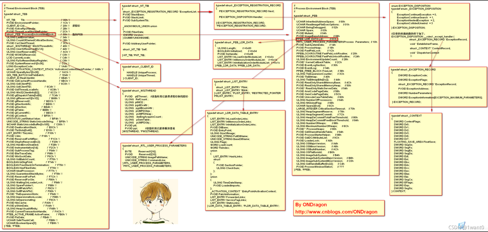

# 待学习的文章

[PEB结构：获取模块kernel32基址技术及原理分析](https://bbs.kanxue.com/thread-266678.htm#msg_header_h1_1)

[PEB资源](https://www.vergiliusproject.com/)

<div style="color:red;font-size:24px"> 不同的机器,不同的环境,得到的偏移量是可能不一样的</div>

# TEB

TEB 就是FS:00指向的地址

获取PEB地址

way1

```c
mov eax,dword ptr fs:[0x18]
mov ecx,dword ptr ds:[eax+0x30]
```

way2

```c
mvo eax,dword ptr fs:[0x30]
```


## 0x00 st:TIB


```c
struct _NT_TIB          //sizeof  1ch  
{
    00h   struct _EXCEPTION_REGISTRATION_RECORD  *ExceptionList; 
    04h   PVOID                            	StackBase;
    08h   PVOID                            	StackLimit;
    0ch   PVOID                            	SubSystemTib;  
    10h 
    union     
    {  
        PVOID                FiberData;  
        DWORD                Version;  
    };  
    14h   PVOID                            	ArbitraryUserPointer;  
    18h   struct _NT_TIB*					Self; 
}NT_TIB;  
```


### 0x00 lp: ExceptionList 🐍

即为指向_EXCEPTION_REGISTRATION_RECORD结构体的链表指针(SEH)


### 0x04 dd: StackBase

这里为线程堆栈顶部

### 0x08 dd: StackLimit

这里为线程堆栈底部

### 0x0C  dd: SubSystemTib

### 0x10 dd: union


#### FiberData


#### Version


### 0x18 lp: Self 🐍

这为**_NT_TIB**结构体的自引用指针，即为**NtCurrentTeb()** 函数所读出的**TEB**结构体指针

TEB的地址,指向了自己


```c
+0x30 PEB 		 					: 指向一个结构体
{
    +0x002 BeingDebugged    : UChar 为1表示正在调试中,为0则不再调试中
    +0x008 ImageBaseAddress : Ptr32 Void 进程的基址
    +0x00c Ldr              : Ptr32 _PEB_LDR_DATA 一个结构体指针
    +0x018 ProcessHeap      : Ptr32 Void
    +0x068 NtGlobalFlag     : Uint4B
}
```


## 0x01c EnvironmentPointer


## 0x020 st:ClientId


### 0x20 dd:UniqueProcess

这个为当前进程的的Pid，可用函数 GetCurrentProcessId() 访问当前结构体成员获取进程标识符：

### 0x24 dd:UniqueThread

 这个为当前线程的Tid，可用函数 GetCurrentThreadId() 访问当前结构体成员获取线程标识符：

## 0x02c ThreadLocalStoragePointer

用于静态的TlS

系统会把所有`.tls`节区汇总,然后复制到缓冲区,这样就建立了一个静态的副本

ThreadLocalStoragePointer就指向那个缓冲区

合并后的TLS副本指针


## 0x030 dd:ProcessEnvironmentBlock 🐍

这个即为**PEB**结构体的指针，所以说一般 **fs:[0x30]** 即为**PEB**的起始地址。


## 0xe10 TlsSlots[0x40]

大小是0x40字节

线程TLS的存储槽

这是一个没有类型的数组

大小是固定的

通常它会自动扩充,也就是数组成员指向另外一个malloc的内存

实现数组和堆区的动态分配


## 重要成员介绍


```c
+0x002 BeingDebugged    : UChar 为1表示正在调试中,为0则不再调试中
+0x008 ImageBaseAddress : Ptr32 Void 进程的基址
+0x00c Ldr              : Ptr32 _PEB_LDR_DATA 一个结构体指针
+0x018 ProcessHeap      : Ptr32 Void
+0x068 NtGlobalFlag     : Uint4B
```


Ldr指向

```c
+0x000 Length            //结构体大小 
+0x004 Initialized      //进程是否初始化完成
+0x008 SsHandle 
+0x00c InLoadOrderModuleList : _LIST_ENTRY
+0x014 InMemoryOrderModuleList : _LIST_ENTRY
+0x01c InInitializationOrderModuleList : _LIST_ENTRY  
+0x024 EntryInProgress
+0x028 ShutdownInProgress
+0x02c ShutdownThreadId
    
    processheap ntglobalflag
```


# PEB


就PEB的话,感觉可以直接从TEB跳转到PEB

比如从TEB+0x3000=PEB (这是我基于自己的电脑测试出来的结果)


## 0x00 db: InheritedAddressSpace

## 0x01 db: ReadImageFileExecOptions

## 0x02 db: BeingDebugged 🐍


这个结构体成员大家应该都懂，表示当前进程**是否处于调试状态**，

也就是函数 **IsDebuggerPresent()** 所访问的结构体成员


## 0x03 db: SpareBool

## 0x04 dd: Mutant

## 0x08 dd: ImageBaseAddress

这个结构体成员我们也经常用到，也就是自身的 **ImageBase** 

和PE结构的IMAGE_OPTIONAL_HEADER.ImageBase相同

可用函 **GetModuleHandle (0)** 获取自身模块句柄来访问这个结构体成员

## 0x0c lp: Ldr 

xp:

```c
ntdll!_PEB_LDR_DATA  
   +0x000 Length            //结构体大小 
   +0x004 Initialized      //进程是否初始化完成
   +0x008 SsHandle 
   +0x00c InLoadOrderModuleList : _LIST_ENTRY
   +0x014 InMemoryOrderModuleList : _LIST_ENTRY
   +0x01c InInitializationOrderModuleList : _LIST_ENTRY  
   +0x024 EntryInProgress
   +0x028 ShutdownInProgress
   +0x02c ShutdownThreadId
```


x86

```c
typedef struct _PEB_LDR_DATA {
    BYTE Reserved1[8];
    PVOID Reserved2[3];
    LIST_ENTRY InMemoryOrderModuleList;
} PEB_LDR_DATA, *PPEB_LDR_DATA;
```


```c
typedef struct _LIST_ENTRY {
   struct _LIST_ENTRY *Flink;
   struct _LIST_ENTRY *Blink;
} LIST_ENTRY, *PLIST_ENTRY, *RESTRICTED_POINTER PRLIST_ENTRY;
```


struct _LIST_ENTRY指向了

```c
typedef struct _LDR_DATA_TABLE_ENTRY {
    PVOID Reserved1[2];
    LIST_ENTRY InMemoryOrderLinks;
    PVOID Reserved2[2];
    PVOID DllBase;
    PVOID Reserved3[2];
    UNICODE_STRING FullDllName;
    BYTE Reserved4[8];
    PVOID Reserved5[3];
#pragma warning(push)
#pragma warning(disable: 4201) // we'll always use the Microsoft compiler
    union {
        ULONG CheckSum;
        PVOID Reserved6;
    } DUMMYUNIONNAME;
#pragma warning(pop)
    ULONG TimeDateStamp;
} LDR_DATA_TABLE_ENTRY, *PLDR_DATA_TABLE_ENTRY;
```


每个进程中的DLL加载进来都有与之对于的 **_LDR_DATA_TABLE_ENTRY** 结构体，

这些结构相互链接就形成了双向链表

也就是该字段指向的结构中记录了进程加载进内存的所有模块的基地址


### 0x000 dd: Length

### 0x004 dd: Initialized


### 0x008 dd: SsHandle 

### 0x00c lp: InLoadOrderModuleList

### 0x014 lp: InMemoryOrderModuleList 

 ### 0x01c lp: InInitializationOrderModuleList   

### 0x024 dd: EntryInProgress

### 0x028 dd: ShutdownInProgress

### 0x02c dd: ShutdownThreadId

上面3个指针都指向了下面这种结构体

```c
struct _LIST_ENTRY 
{
  struct _LIST_ENTRY *Flink;
  struct _LIST_ENTRY *Blink;
} LIST_ENTRY, *PLIST_ENTRY, PRLIST_ENTRY;
```

可以看出这是一个双向链表，链表中存放着 **_LDR_DATA_TABLE_ENTRY** 的结构体信息：

```c
lkd> dt -b _LDR_DATA_TABLE_ENTRY
nt!_LDR_DATA_TABLE_ENTRY
   +0x000 InLoadOrderLinks : _LIST_ENTRY
      +0x000 Flink            : Ptr32
      +0x004 Blink            : Ptr32
   +0x008 InMemoryOrderLinks : _LIST_ENTRY
      +0x000 Flink            : Ptr32
      +0x004 Blink            : Ptr32
   +0x010 InInitializationOrderLinks : _LIST_ENTRY
      +0x000 Flink            : Ptr32
      +0x004 Blink            : Ptr32
   +0x018 DllBase          : Ptr32
   +0x01c EntryPoint       : Ptr32
   +0x020 SizeOfImage      : Uint4B
   +0x024 FullDllName      : _UNICODE_STRING
      +0x000 Length           : Uint2B
      +0x002 MaximumLength    : Uint2B
      +0x004 Buffer           : Ptr32
   +0x02c BaseDllName      : _UNICODE_STRING
      +0x000 Length           : Uint2B
      +0x002 MaximumLength    : Uint2B
      +0x004 Buffer           : Ptr32
   +0x034 Flags            : Uint4B
   +0x038 LoadCount        : Uint2B
   +0x03a TlsIndex         : Uint2B
   +0x03c HashLinks        : _LIST_ENTRY
      +0x000 Flink            : Ptr32
      +0x004 Blink            : Ptr32
   +0x03c SectionPointer   : Ptr32
   +0x040 CheckSum         : Uint4B
   +0x044 TimeDateStamp    : Uint4B
   +0x044 LoadedImports    : Ptr32
   +0x048 EntryPointActivationContext : Ptr32
   +0x04c PatchInformation : Ptr32
```

## 0x010 dd: ProcessParameters

## 0x014 dd: SubSystemData


## 0x018 lp: ProcessHeap 🐍

这个结构体成员就是进程堆的句柄，也就是指向结构体**HEAP的**指针，我们查询下结构体成员：


```c
0:000> dt _HEAP 00530000
ntdll!_HEAP
   +0x000 Segment          : _HEAP_SEGMENT
   +0x000 Entry            : _HEAP_ENTRY
   +0x008 SegmentSignature : 0xffeeffee
   +0x00c SegmentFlags     : 2
   +0x010 SegmentListEntry : _LIST_ENTRY [ 0x5300a4 - 0x5300a4 ]

```


### 0x040 Flags 🐍


### 0x044 ForceFlags  🐍

程序正常运行时

ProcessHeap.Flags的值为2 ， 

ProcessHeap. ForceFlags 的值为0，

也常用于反调试

**ProcessHeap**结构体成员指向的**HEAP**结构体指针可用函数 **GetProcessHeap()**获取

ps: 建议自己写代码去了解,实际操作一下


## 0x01c FastPebLock

## 0x020 FastPebLockRoutine

## 0x024 FastPebUnlockRoutine

## 0x028 EnvironmentUpdateCount

## 0x02c KernelCallbackTable

## 0x030 SystemReserved

## 0x034 AtlThunkSListPtr32

## 0x038 FreeList

## 0x03c TlsExpansionCounter

tls索引计数

## 0x040 TlsBitmap

tls位图指针

指向的结构体是

```
struct RTL_BITMAO{
	ULONG SizeofBitMap;//TLS进程标志位
	PULOBG buffer;//TLS进程标志所在的缓冲区
}
```

结构体的目的是记录一个缓冲区

ps:缓冲区不一定需要用这个东西

## 0x044 TlsBitmapBits

tls进程标志位

## 0x04c ReadOnlySharedMemoryBase

## 0x050 ReadOnlySharedMemoryHeap

## 0x054 ReadOnlyStaticServerData

## 0x058 AnsiCodePageData

## 0x05c OemCodePageData

## 0x060 UnicodeCaseTableData 

## 0x064 NumberOfProcessors

## 0x068 NtGlobalFlag 🐍

全局标志位	

在调试状态时，**PEB.NtGlobalFlag** 的值为**0x70**


# Example


线程ID,进程ID获取

```c
#include <stdio.h>
#include <Windows.h>

DWORD GetSelfPid()
{
	DWORD Pid = 0;
	__asm
	{
		mov eax, fs: [0x18]   // 获取到PEB基地址
		add eax, 0x20         // 加上20得到 _CLIENT_ID
		add eax, 0x0          // 加上偏移0得到 UniqueProcess
		mov eax, [eax]       // 取出内存地址中的值
		mov Pid, eax
	}
	return Pid;
}

DWORD GetSelfTid()
{
	DWORD Pid = 0;
	__asm
	{
		mov eax, fs: [0x18]   // 获取到PEB基地址
		add eax, 0x20        // 加上20得到 _CLIENT_ID
		add eax, 0x04        // 加上偏移04得到 UniqueThread
		mov eax, [eax]       // 取出内存地址中的值
		mov Pid, eax
	}
	return Pid;
}

int main(int argc, char* argv[])
{
	printf("进程 Pid = %d \n", GetSelfPid());
	printf("线程 Tid = %d \n", GetSelfTid());//有点问题

	system("pause");
	return 0;
}

```


# 附录


## _TEB32


64位机器测试32位程序

```c
0:000> dt -rv ntdll!_TEB32
struct _TEB32, 117 elements, 0x1000 bytes
   +0x000 NtTib            : struct _NT_TIB32, 8 elements, 0x1c bytes
      +0x000 ExceptionList    : Uint4B
      +0x004 StackBase        : Uint4B
      +0x008 StackLimit       : Uint4B
      +0x00c SubSystemTib     : Uint4B
      +0x010 FiberData        : Uint4B
      +0x010 Version          : Uint4B
      +0x014 ArbitraryUserPointer : Uint4B
      +0x018 Self             : Uint4B
   +0x01c EnvironmentPointer : Uint4B
   +0x020 ClientId         : struct _CLIENT_ID32, 2 elements, 0x8 bytes
      +0x000 UniqueProcess    : Uint4B
      +0x004 UniqueThread     : Uint4B
   +0x028 ActiveRpcHandle  : Uint4B
   +0x02c ThreadLocalStoragePointer : Uint4B
   +0x030 ProcessEnvironmentBlock : Uint4B
   +0x034 LastErrorValue   : Uint4B
   +0x038 CountOfOwnedCriticalSections : Uint4B
   +0x03c CsrClientThread  : Uint4B
   +0x040 Win32ThreadInfo  : Uint4B
   +0x044 User32Reserved   : [26] Uint4B
   +0x0ac UserReserved     : [5] Uint4B
   +0x0c0 WOW32Reserved    : Uint4B
   +0x0c4 CurrentLocale    : Uint4B
   +0x0c8 FpSoftwareStatusRegister : Uint4B
   +0x0cc ReservedForDebuggerInstrumentation : [16] Uint4B
   +0x10c SystemReserved1  : [26] Uint4B
   +0x174 PlaceholderCompatibilityMode : Char
   +0x175 PlaceholderHydrationAlwaysExplicit : UChar
   +0x176 PlaceholderReserved : [10] Char
   +0x180 ProxiedProcessId : Uint4B
   +0x184 _ActivationStack : struct _ACTIVATION_CONTEXT_STACK32, 5 elements, 0x18 bytes
      +0x000 ActiveFrame      : Uint4B
      +0x004 FrameListCache   : struct LIST_ENTRY32, 2 elements, 0x8 bytes
         +0x000 Flink            : Uint4B
         +0x004 Blink            : Uint4B
      +0x00c Flags            : Uint4B
      +0x010 NextCookieSequenceNumber : Uint4B
      +0x014 StackId          : Uint4B
   +0x19c WorkingOnBehalfTicket : [8] UChar
   +0x1a4 ExceptionCode    : Int4B
   +0x1a8 ActivationContextStackPointer : Uint4B
   +0x1ac InstrumentationCallbackSp : Uint4B
   +0x1b0 InstrumentationCallbackPreviousPc : Uint4B
   +0x1b4 InstrumentationCallbackPreviousSp : Uint4B
   +0x1b8 InstrumentationCallbackDisabled : UChar
   +0x1b9 SpareBytes       : [23] UChar
   +0x1d0 TxFsContext      : Uint4B
   +0x1d4 GdiTebBatch      : struct _GDI_TEB_BATCH32, 4 elements, 0x4e0 bytes
      +0x000 Offset           : Bitfield Pos 0, 31 Bits
      +0x000 HasRenderingCommand : Bitfield Pos 31, 1 Bit
      +0x004 HDC              : Uint4B
      +0x008 Buffer           : [310] Uint4B
   +0x6b4 RealClientId     : struct _CLIENT_ID32, 2 elements, 0x8 bytes
      +0x000 UniqueProcess    : Uint4B
      +0x004 UniqueThread     : Uint4B
   +0x6bc GdiCachedProcessHandle : Uint4B
   +0x6c0 GdiClientPID     : Uint4B
   +0x6c4 GdiClientTID     : Uint4B
   +0x6c8 GdiThreadLocalInfo : Uint4B
   +0x6cc Win32ClientInfo  : [62] Uint4B
   +0x7c4 glDispatchTable  : [233] Uint4B
   +0xb68 glReserved1      : [29] Uint4B
   +0xbdc glReserved2      : Uint4B
   +0xbe0 glSectionInfo    : Uint4B
   +0xbe4 glSection        : Uint4B
   +0xbe8 glTable          : Uint4B
   +0xbec glCurrentRC      : Uint4B
   +0xbf0 glContext        : Uint4B
   +0xbf4 LastStatusValue  : Uint4B
   +0xbf8 StaticUnicodeString : struct _STRING32, 3 elements, 0x8 bytes
      +0x000 Length           : Uint2B
      +0x002 MaximumLength    : Uint2B
      +0x004 Buffer           : Uint4B
   +0xc00 StaticUnicodeBuffer : [261] Wchar
   +0xe0c DeallocationStack : Uint4B
   +0xe10 TlsSlots         : [64] Uint4B
   +0xf10 TlsLinks         : struct LIST_ENTRY32, 2 elements, 0x8 bytes
      +0x000 Flink            : Uint4B
      +0x004 Blink            : Uint4B
   +0xf18 Vdm              : Uint4B
   +0xf1c ReservedForNtRpc : Uint4B
   +0xf20 DbgSsReserved    : [2] Uint4B
   +0xf28 HardErrorMode    : Uint4B
   +0xf2c Instrumentation  : [9] Uint4B
   +0xf50 ActivityId       : struct _GUID, 4 elements, 0x10 bytes
      +0x000 Data1            : Uint4B
      +0x004 Data2            : Uint2B
      +0x006 Data3            : Uint2B
      +0x008 Data4            : [8] UChar
   +0xf60 SubProcessTag    : Uint4B
   +0xf64 PerflibData      : Uint4B
   +0xf68 EtwTraceData     : Uint4B
   +0xf6c WinSockData      : Uint4B
   +0xf70 GdiBatchCount    : Uint4B
   +0xf74 CurrentIdealProcessor : struct _PROCESSOR_NUMBER, 3 elements, 0x4 bytes
      +0x000 Group            : Uint2B
      +0x002 Number           : UChar
      +0x003 Reserved         : UChar
   +0xf74 IdealProcessorValue : Uint4B
   +0xf74 ReservedPad0     : UChar
   +0xf75 ReservedPad1     : UChar
   +0xf76 ReservedPad2     : UChar
   +0xf77 IdealProcessor   : UChar
   +0xf78 GuaranteedStackBytes : Uint4B
   +0xf7c ReservedForPerf  : Uint4B
   +0xf80 ReservedForOle   : Uint4B
   +0xf84 WaitingOnLoaderLock : Uint4B
   +0xf88 SavedPriorityState : Uint4B
   +0xf8c ReservedForCodeCoverage : Uint4B
   +0xf90 ThreadPoolData   : Uint4B
   +0xf94 TlsExpansionSlots : Uint4B
   +0xf98 MuiGeneration    : Uint4B
   +0xf9c IsImpersonating  : Uint4B
   +0xfa0 NlsCache         : Uint4B
   +0xfa4 pShimData        : Uint4B
   +0xfa8 HeapData         : Uint4B
   +0xfac CurrentTransactionHandle : Uint4B
   +0xfb0 ActiveFrame      : Uint4B
   +0xfb4 FlsData          : Uint4B
   +0xfb8 PreferredLanguages : Uint4B
   +0xfbc UserPrefLanguages : Uint4B
   +0xfc0 MergedPrefLanguages : Uint4B
   +0xfc4 MuiImpersonation : Uint4B
   +0xfc8 CrossTebFlags    : Uint2B
   +0xfc8 SpareCrossTebBits : Bitfield Pos 0, 16 Bits
   +0xfca SameTebFlags     : Uint2B
   +0xfca SafeThunkCall    : Bitfield Pos 0, 1 Bit
   +0xfca InDebugPrint     : Bitfield Pos 1, 1 Bit
   +0xfca HasFiberData     : Bitfield Pos 2, 1 Bit
   +0xfca SkipThreadAttach : Bitfield Pos 3, 1 Bit
   +0xfca WerInShipAssertCode : Bitfield Pos 4, 1 Bit
   +0xfca RanProcessInit   : Bitfield Pos 5, 1 Bit
   +0xfca ClonedThread     : Bitfield Pos 6, 1 Bit
   +0xfca SuppressDebugMsg : Bitfield Pos 7, 1 Bit
   +0xfca DisableUserStackWalk : Bitfield Pos 8, 1 Bit
   +0xfca RtlExceptionAttached : Bitfield Pos 9, 1 Bit
   +0xfca InitialThread    : Bitfield Pos 10, 1 Bit
   +0xfca SessionAware     : Bitfield Pos 11, 1 Bit
   +0xfca LoadOwner        : Bitfield Pos 12, 1 Bit
   +0xfca LoaderWorker     : Bitfield Pos 13, 1 Bit
   +0xfca SkipLoaderInit   : Bitfield Pos 14, 1 Bit
   +0xfca SpareSameTebBits : Bitfield Pos 15, 1 Bit
   +0xfcc TxnScopeEnterCallback : Uint4B
   +0xfd0 TxnScopeExitCallback : Uint4B
   +0xfd4 TxnScopeContext  : Uint4B
   +0xfd8 LockCount        : Uint4B
   +0xfdc WowTebOffset     : Int4B
   +0xfe0 ResourceRetValue : Uint4B
   +0xfe4 ReservedForWdf   : Uint4B
   +0xfe8 ReservedForCrt   : Uint8B
   +0xff0 EffectiveContainerId : struct _GUID, 4 elements, 0x10 bytes
      +0x000 Data1            : Uint4B
      +0x004 Data2            : Uint2B
      +0x006 Data3            : Uint2B
      +0x008 Data4            : [8] UChar
```





## _PEB32


64位机器测试32位程序

```c
0:000> dt _PEB
ntdll!_PEB
   +0x000 InheritedAddressSpace : UChar
   +0x001 ReadImageFileExecOptions : UChar
   +0x002 BeingDebugged    : UChar
   +0x003 BitField         : UChar
   +0x003 ImageUsesLargePages : Pos 0, 1 Bit
   +0x003 IsProtectedProcess : Pos 1, 1 Bit
   +0x003 IsImageDynamicallyRelocated : Pos 2, 1 Bit
   +0x003 SkipPatchingUser32Forwarders : Pos 3, 1 Bit
   +0x003 IsPackagedProcess : Pos 4, 1 Bit
   +0x003 IsAppContainer   : Pos 5, 1 Bit
   +0x003 IsProtectedProcessLight : Pos 6, 1 Bit
   +0x003 IsLongPathAwareProcess : Pos 7, 1 Bit
   +0x004 Mutant           : Ptr32 Void
   +0x008 ImageBaseAddress : Ptr32 Void
   +0x00c Ldr              : Ptr32 _PEB_LDR_DATA
   +0x010 ProcessParameters : Ptr32 _RTL_USER_PROCESS_PARAMETERS
   +0x014 SubSystemData    : Ptr32 Void
   +0x018 ProcessHeap      : Ptr32 Void
   +0x01c FastPebLock      : Ptr32 _RTL_CRITICAL_SECTION
   +0x020 AtlThunkSListPtr : Ptr32 _SLIST_HEADER
   +0x024 IFEOKey          : Ptr32 Void
   +0x028 CrossProcessFlags : Uint4B
   +0x028 ProcessInJob     : Pos 0, 1 Bit
   +0x028 ProcessInitializing : Pos 1, 1 Bit
   +0x028 ProcessUsingVEH  : Pos 2, 1 Bit
   +0x028 ProcessUsingVCH  : Pos 3, 1 Bit
   +0x028 ProcessUsingFTH  : Pos 4, 1 Bit
   +0x028 ProcessPreviouslyThrottled : Pos 5, 1 Bit
   +0x028 ProcessCurrentlyThrottled : Pos 6, 1 Bit
   +0x028 ProcessImagesHotPatched : Pos 7, 1 Bit
   +0x028 ReservedBits0    : Pos 8, 24 Bits
   +0x02c KernelCallbackTable : Ptr32 Void
   +0x02c UserSharedInfoPtr : Ptr32 Void
   +0x030 SystemReserved   : Uint4B
   +0x034 AtlThunkSListPtr32 : Ptr32 _SLIST_HEADER
   +0x038 ApiSetMap        : Ptr32 Void
   +0x03c TlsExpansionCounter : Uint4B
   +0x040 TlsBitmap        : Ptr32 Void
   +0x044 TlsBitmapBits    : [2] Uint4B
   +0x04c ReadOnlySharedMemoryBase : Ptr32 Void
   +0x050 SharedData       : Ptr32 Void
   +0x054 ReadOnlyStaticServerData : Ptr32 Ptr32 Void
   +0x058 AnsiCodePageData : Ptr32 Void
   +0x05c OemCodePageData  : Ptr32 Void
   +0x060 UnicodeCaseTableData : Ptr32 Void
   +0x064 NumberOfProcessors : Uint4B
   +0x068 NtGlobalFlag     : Uint4B
   +0x070 CriticalSectionTimeout : _LARGE_INTEGER
   +0x078 HeapSegmentReserve : Uint4B
   +0x07c HeapSegmentCommit : Uint4B
   +0x080 HeapDeCommitTotalFreeThreshold : Uint4B
   +0x084 HeapDeCommitFreeBlockThreshold : Uint4B
   +0x088 NumberOfHeaps    : Uint4B
   +0x08c MaximumNumberOfHeaps : Uint4B
   +0x090 ProcessHeaps     : Ptr32 Ptr32 Void
   +0x094 GdiSharedHandleTable : Ptr32 Void
   +0x098 ProcessStarterHelper : Ptr32 Void
   +0x09c GdiDCAttributeList : Uint4B
   +0x0a0 LoaderLock       : Ptr32 _RTL_CRITICAL_SECTION
   +0x0a4 OSMajorVersion   : Uint4B
   +0x0a8 OSMinorVersion   : Uint4B
   +0x0ac OSBuildNumber    : Uint2B
   +0x0ae OSCSDVersion     : Uint2B
   +0x0b0 OSPlatformId     : Uint4B
   +0x0b4 ImageSubsystem   : Uint4B
   +0x0b8 ImageSubsystemMajorVersion : Uint4B
   +0x0bc ImageSubsystemMinorVersion : Uint4B
   +0x0c0 ActiveProcessAffinityMask : Uint4B
   +0x0c4 GdiHandleBuffer  : [34] Uint4B
   +0x14c PostProcessInitRoutine : Ptr32     void 
   +0x150 TlsExpansionBitmap : Ptr32 Void
   +0x154 TlsExpansionBitmapBits : [32] Uint4B
   +0x1d4 SessionId        : Uint4B
   +0x1d8 AppCompatFlags   : _ULARGE_INTEGER
   +0x1e0 AppCompatFlagsUser : _ULARGE_INTEGER
   +0x1e8 pShimData        : Ptr32 Void
   +0x1ec AppCompatInfo    : Ptr32 Void
   +0x1f0 CSDVersion       : _UNICODE_STRING
   +0x1f8 ActivationContextData : Ptr32 _ACTIVATION_CONTEXT_DATA
   +0x1fc ProcessAssemblyStorageMap : Ptr32 _ASSEMBLY_STORAGE_MAP
   +0x200 SystemDefaultActivationContextData : Ptr32 _ACTIVATION_CONTEXT_DATA
   +0x204 SystemAssemblyStorageMap : Ptr32 _ASSEMBLY_STORAGE_MAP
   +0x208 MinimumStackCommit : Uint4B
   +0x20c SparePointers    : [4] Ptr32 Void
   +0x21c SpareUlongs      : [5] Uint4B
   +0x230 WerRegistrationData : Ptr32 Void
   +0x234 WerShipAssertPtr : Ptr32 Void
   +0x238 pUnused          : Ptr32 Void
   +0x23c pImageHeaderHash : Ptr32 Void
   +0x240 TracingFlags     : Uint4B
   +0x240 HeapTracingEnabled : Pos 0, 1 Bit
   +0x240 CritSecTracingEnabled : Pos 1, 1 Bit
   +0x240 LibLoaderTracingEnabled : Pos 2, 1 Bit
   +0x240 SpareTracingBits : Pos 3, 29 Bits
   +0x248 CsrServerReadOnlySharedMemoryBase : Uint8B
   +0x250 TppWorkerpListLock : Uint4B
   +0x254 TppWorkerpList   : _LIST_ENTRY
   +0x25c WaitOnAddressHashTable : [128] Ptr32 Void
   +0x45c TelemetryCoverageHeader : Ptr32 Void
   +0x460 CloudFileFlags   : Uint4B
   +0x464 CloudFileDiagFlags : Uint4B
   +0x468 PlaceholderCompatibilityMode : Char
   +0x469 PlaceholderCompatibilityModeReserved : [7] Char
   +0x470 LeapSecondData   : Ptr32 _LEAP_SECOND_DATA
   +0x474 LeapSecondFlags  : Uint4B
   +0x474 SixtySecondEnabled : Pos 0, 1 Bit
   +0x474 Reserved         : Pos 1, 31 Bits
   +0x478 NtGlobalFlag2    : Uint4B

```


## _TEB64

信息来源于微软的符号文件


```c
0:000> dt -rv ntdll!_TEB64
struct _TEB64, 127 elements, 0x1838 bytes
   +0x000 NtTib            : struct _NT_TIB64, 8 elements, 0x38 bytes
      +0x000 ExceptionList    : Uint8B
      +0x008 StackBase        : Uint8B
      +0x010 StackLimit       : Uint8B
      +0x018 SubSystemTib     : Uint8B
      +0x020 FiberData        : Uint8B
      +0x020 Version          : Uint4B
      +0x028 ArbitraryUserPointer : Uint8B
      +0x030 Self             : Uint8B
   +0x038 EnvironmentPointer : Uint8B
   +0x040 ClientId         : struct _CLIENT_ID64, 2 elements, 0x10 bytes
      +0x000 UniqueProcess    : Uint8B
      +0x008 UniqueThread     : Uint8B
   +0x050 ActiveRpcHandle  : Uint8B
   +0x058 ThreadLocalStoragePointer : Uint8B
   +0x060 ProcessEnvironmentBlock : Uint8B
   +0x068 LastErrorValue   : Uint4B
   +0x06c CountOfOwnedCriticalSections : Uint4B
   +0x070 CsrClientThread  : Uint8B
   +0x078 Win32ThreadInfo  : Uint8B
   +0x080 User32Reserved   : [26] Uint4B
   +0x0e8 UserReserved     : [5] Uint4B
   +0x100 WOW32Reserved    : Uint8B
   +0x108 CurrentLocale    : Uint4B
   +0x10c FpSoftwareStatusRegister : Uint4B
   +0x110 ReservedForDebuggerInstrumentation : [16] Uint8B
   +0x190 SystemReserved1  : [30] Uint8B
   +0x280 PlaceholderCompatibilityMode : Char
   +0x281 PlaceholderHydrationAlwaysExplicit : UChar
   +0x282 PlaceholderReserved : [10] Char
   +0x28c ProxiedProcessId : Uint4B
   +0x290 _ActivationStack : struct _ACTIVATION_CONTEXT_STACK64, 5 elements, 0x28 bytes
      +0x000 ActiveFrame      : Uint8B
      +0x008 FrameListCache   : struct LIST_ENTRY64, 2 elements, 0x10 bytes
         +0x000 Flink            : Uint8B
         +0x008 Blink            : Uint8B
      +0x018 Flags            : Uint4B
      +0x01c NextCookieSequenceNumber : Uint4B
      +0x020 StackId          : Uint4B
   +0x2b8 WorkingOnBehalfTicket : [8] UChar
   +0x2c0 ExceptionCode    : Int4B
   +0x2c4 Padding0         : [4] UChar
   +0x2c8 ActivationContextStackPointer : Uint8B
   +0x2d0 InstrumentationCallbackSp : Uint8B
   +0x2d8 InstrumentationCallbackPreviousPc : Uint8B
   +0x2e0 InstrumentationCallbackPreviousSp : Uint8B
   +0x2e8 TxFsContext      : Uint4B
   +0x2ec InstrumentationCallbackDisabled : UChar
   +0x2ed UnalignedLoadStoreExceptions : UChar
   +0x2ee Padding1         : [2] UChar
   +0x2f0 GdiTebBatch      : struct _GDI_TEB_BATCH64, 4 elements, 0x4e8 bytes
      +0x000 Offset           : Bitfield Pos 0, 31 Bits
      +0x000 HasRenderingCommand : Bitfield Pos 31, 1 Bit
      +0x008 HDC              : Uint8B
      +0x010 Buffer           : [310] Uint4B
   +0x7d8 RealClientId     : struct _CLIENT_ID64, 2 elements, 0x10 bytes
      +0x000 UniqueProcess    : Uint8B
      +0x008 UniqueThread     : Uint8B
   +0x7e8 GdiCachedProcessHandle : Uint8B
   +0x7f0 GdiClientPID     : Uint4B
   +0x7f4 GdiClientTID     : Uint4B
   +0x7f8 GdiThreadLocalInfo : Uint8B
   +0x800 Win32ClientInfo  : [62] Uint8B
   +0x9f0 glDispatchTable  : [233] Uint8B
   +0x1138 glReserved1      : [29] Uint8B
   +0x1220 glReserved2      : Uint8B
   +0x1228 glSectionInfo    : Uint8B
   +0x1230 glSection        : Uint8B
   +0x1238 glTable          : Uint8B
   +0x1240 glCurrentRC      : Uint8B
   +0x1248 glContext        : Uint8B
   +0x1250 LastStatusValue  : Uint4B
   +0x1254 Padding2         : [4] UChar
   +0x1258 StaticUnicodeString : struct _STRING64, 3 elements, 0x10 bytes
      +0x000 Length           : Uint2B
      +0x002 MaximumLength    : Uint2B
      +0x008 Buffer           : Uint8B
   +0x1268 StaticUnicodeBuffer : [261] Wchar
   +0x1472 Padding3         : [6] UChar
   +0x1478 DeallocationStack : Uint8B
   +0x1480 TlsSlots         : [64] Uint8B
   +0x1680 TlsLinks         : struct LIST_ENTRY64, 2 elements, 0x10 bytes
      +0x000 Flink            : Uint8B
      +0x008 Blink            : Uint8B
   +0x1690 Vdm              : Uint8B
   +0x1698 ReservedForNtRpc : Uint8B
   +0x16a0 DbgSsReserved    : [2] Uint8B
   +0x16b0 HardErrorMode    : Uint4B
   +0x16b4 Padding4         : [4] UChar
   +0x16b8 Instrumentation  : [11] Uint8B
   +0x1710 ActivityId       : struct _GUID, 4 elements, 0x10 bytes
      +0x000 Data1            : Uint4B
      +0x004 Data2            : Uint2B
      +0x006 Data3            : Uint2B
      +0x008 Data4            : [8] UChar
   +0x1720 SubProcessTag    : Uint8B
   +0x1728 PerflibData      : Uint8B
   +0x1730 EtwTraceData     : Uint8B
   +0x1738 WinSockData      : Uint8B
   +0x1740 GdiBatchCount    : Uint4B
   +0x1744 CurrentIdealProcessor : struct _PROCESSOR_NUMBER, 3 elements, 0x4 bytes
      +0x000 Group            : Uint2B
      +0x002 Number           : UChar
      +0x003 Reserved         : UChar
   +0x1744 IdealProcessorValue : Uint4B
   +0x1744 ReservedPad0     : UChar
   +0x1745 ReservedPad1     : UChar
   +0x1746 ReservedPad2     : UChar
   +0x1747 IdealProcessor   : UChar
   +0x1748 GuaranteedStackBytes : Uint4B
   +0x174c Padding5         : [4] UChar
   +0x1750 ReservedForPerf  : Uint8B
   +0x1758 ReservedForOle   : Uint8B
   +0x1760 WaitingOnLoaderLock : Uint4B
   +0x1764 Padding6         : [4] UChar
   +0x1768 SavedPriorityState : Uint8B
   +0x1770 ReservedForCodeCoverage : Uint8B
   +0x1778 ThreadPoolData   : Uint8B
   +0x1780 TlsExpansionSlots : Uint8B
   +0x1788 DeallocationBStore : Uint8B
   +0x1790 BStoreLimit      : Uint8B
   +0x1798 MuiGeneration    : Uint4B
   +0x179c IsImpersonating  : Uint4B
   +0x17a0 NlsCache         : Uint8B
   +0x17a8 pShimData        : Uint8B
   +0x17b0 HeapData         : Uint4B
   +0x17b4 Padding7         : [4] UChar
   +0x17b8 CurrentTransactionHandle : Uint8B
   +0x17c0 ActiveFrame      : Uint8B
   +0x17c8 FlsData          : Uint8B
   +0x17d0 PreferredLanguages : Uint8B
   +0x17d8 UserPrefLanguages : Uint8B
   +0x17e0 MergedPrefLanguages : Uint8B
   +0x17e8 MuiImpersonation : Uint4B
   +0x17ec CrossTebFlags    : Uint2B
   +0x17ec SpareCrossTebBits : Bitfield Pos 0, 16 Bits
   +0x17ee SameTebFlags     : Uint2B
   +0x17ee SafeThunkCall    : Bitfield Pos 0, 1 Bit
   +0x17ee InDebugPrint     : Bitfield Pos 1, 1 Bit
   +0x17ee HasFiberData     : Bitfield Pos 2, 1 Bit
   +0x17ee SkipThreadAttach : Bitfield Pos 3, 1 Bit
   +0x17ee WerInShipAssertCode : Bitfield Pos 4, 1 Bit
   +0x17ee RanProcessInit   : Bitfield Pos 5, 1 Bit
   +0x17ee ClonedThread     : Bitfield Pos 6, 1 Bit
   +0x17ee SuppressDebugMsg : Bitfield Pos 7, 1 Bit
   +0x17ee DisableUserStackWalk : Bitfield Pos 8, 1 Bit
   +0x17ee RtlExceptionAttached : Bitfield Pos 9, 1 Bit
   +0x17ee InitialThread    : Bitfield Pos 10, 1 Bit
   +0x17ee SessionAware     : Bitfield Pos 11, 1 Bit
   +0x17ee LoadOwner        : Bitfield Pos 12, 1 Bit
   +0x17ee LoaderWorker     : Bitfield Pos 13, 1 Bit
   +0x17ee SkipLoaderInit   : Bitfield Pos 14, 1 Bit
   +0x17ee SpareSameTebBits : Bitfield Pos 15, 1 Bit
   +0x17f0 TxnScopeEnterCallback : Uint8B
   +0x17f8 TxnScopeExitCallback : Uint8B
   +0x1800 TxnScopeContext  : Uint8B
   +0x1808 LockCount        : Uint4B
   +0x180c WowTebOffset     : Int4B
   +0x1810 ResourceRetValue : Uint8B
   +0x1818 ReservedForWdf   : Uint8B
   +0x1820 ReservedForCrt   : Uint8B
   +0x1828 EffectiveContainerId : struct _GUID, 4 elements, 0x10 bytes
      +0x000 Data1            : Uint4B
      +0x004 Data2            : Uint2B
      +0x006 Data3            : Uint2B
      +0x008 Data4            : [8] UChar

```


## _PEB64

64位机器测试64位程序

```c
0:000> dt _PEB
C1!_PEB
   +0x000 Reserved1        : [2] UChar
   +0x002 BeingDebugged    : UChar
   +0x003 Reserved2        : [1] UChar
   +0x008 Reserved3        : [2] Ptr64 Void
   +0x018 Ldr              : Ptr64 _PEB_LDR_DATA
   +0x020 ProcessParameters : Ptr64 _RTL_USER_PROCESS_PARAMETERS
   +0x028 Reserved4        : [3] Ptr64 Void
   +0x040 AtlThunkSListPtr : Ptr64 Void
   +0x048 Reserved5        : Ptr64 Void
   +0x050 Reserved6        : Uint4B
   +0x058 Reserved7        : Ptr64 Void
   +0x060 Reserved8        : Uint4B
   +0x064 AtlThunkSListPtr32 : Uint4B
   +0x068 Reserved9        : [45] Ptr64 Void
   +0x1d0 Reserved10       : [96] UChar
   +0x230 PostProcessInitRoutine : Ptr64     void 
   +0x238 Reserved11       : [128] UChar
   +0x2b8 Reserved12       : [1] Ptr64 Void
   +0x2c0 SessionId        : Uint4B

```

