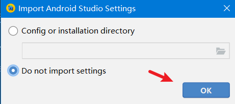
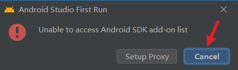
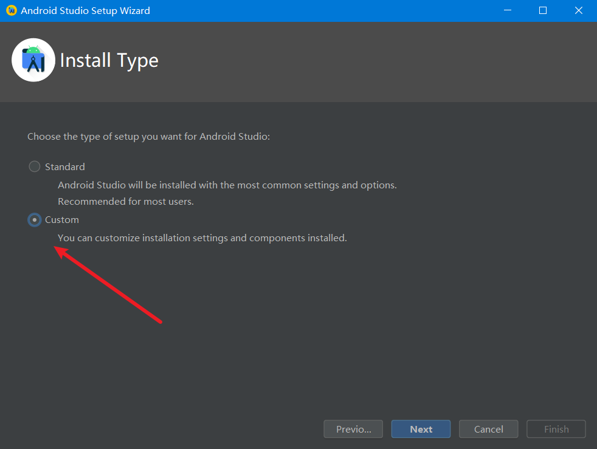
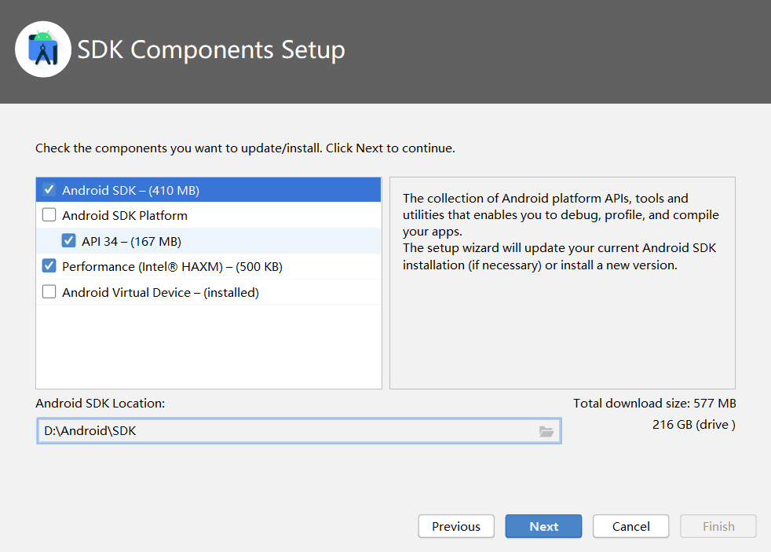
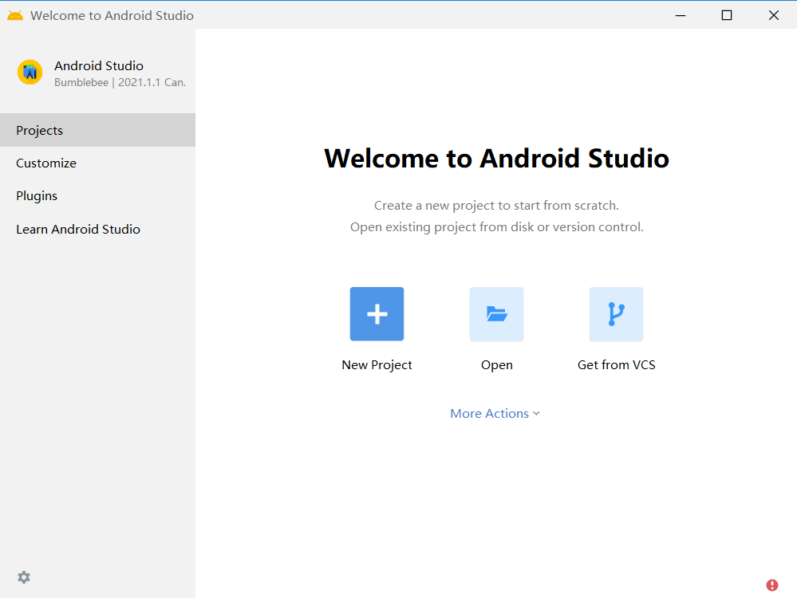
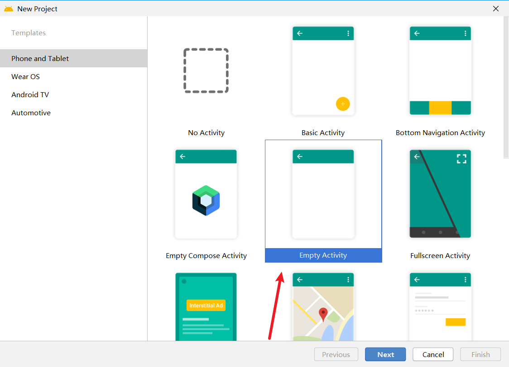
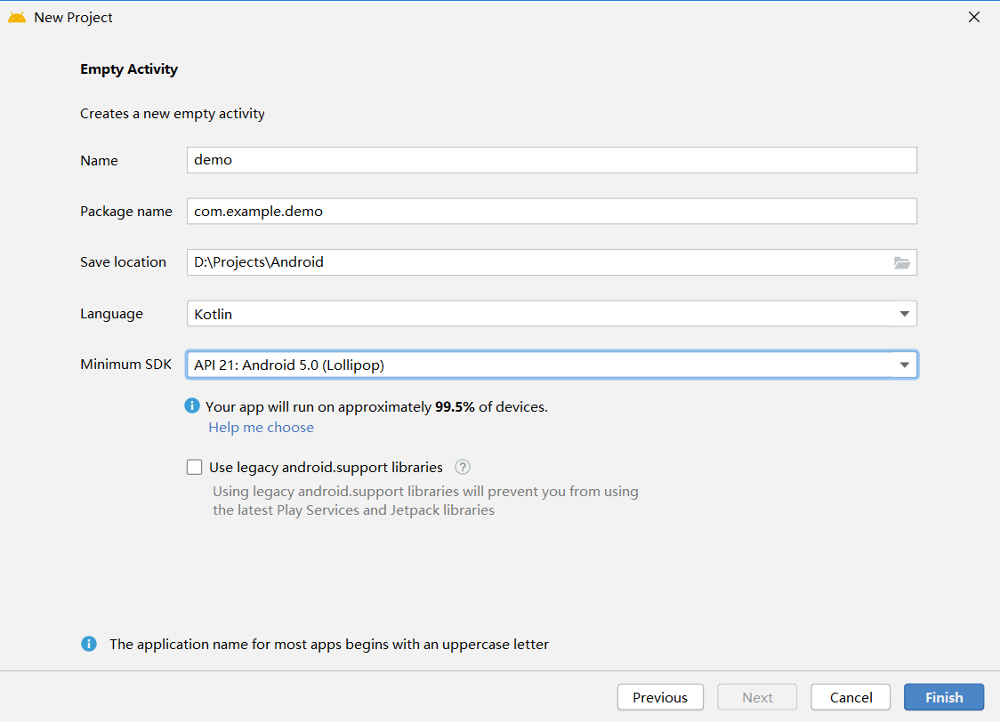

开发工具下载

下载地址 https://developer.android.google.cn/studio/

但是我下载的是历史版本 `android-studio-2021.1.1.2-windows.exe`

下载之后,安装即可

第一次安装

然后

然后

我们选择自定义,因为去设置一些文件路径的

其实就是涉及的路径什么的,,自己看要不要修改什么的

然后基本上就是一路默认的

 

然后就新建一个项目

选空项目

然后随便搞一下

