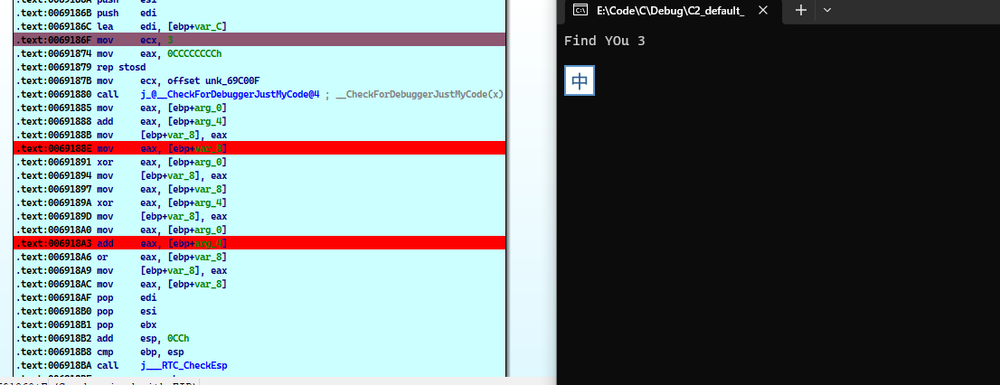

# 待学习的链接

[How to Reverse Engineer Software (Windows) in a Right Way](https://www.apriorit.com/dev-blog/364-how-to-reverse-engineer-software-windows-in-a-right-way)

[sanqiuai](https://blog.csdn.net/sanqiuai?type=blog) 这个人的反调试,我是没怎么看懂,好像很创新


只要涉及开启一个线程的调试,就会有一点不好控制


# 时间记录器


被调试时，进程的运行速度大大降低

下面是一些用于时间记录的API

```c
GetLocalTime(&stStart);
dwStart = GetTickCount();
QueryPerformanceCounter(&liStart);
```


下面主要使用汇编指令来做相关的时间记录,API相比来说过于显眼

缺点: 你需要去触发时间记录器,也就是去单步运行它,它才会有一个时间差

如果你F9完整运行和你双击运行,其实没差别的,无法检测调试器的存在

只有你把时间记录器内联在关键步骤里面才会有一个很好的效果

所以这些API就可以上场了,就不用内联汇编了


x86版本

```c
#include <stdio.h>
#include <windows.h>

void Anti_dbg()
{
	DWORD dwDelta = 0;
	printf("Timing Check");
	__asm {
			pushad

			; --------------------------------------------------------
			rdtsc		//这里就会把t0计入寄存器
			push edx
			push eax	//把获取的数据放入栈中

			; ------------------------------
			xor eax, eax	//eax从0开始累计1,到0x3e8
			mov ecx, 1000 //一个循环的次数

			time_spend:
			inc eax
			loop time_spend
			; ------------------------------

			rdtsc //记录一下t1
			pop esi	// eax
			pop edi	// edx

			; ---------------------------------- - (t1)edx:eax - (t0)edi : esi

			cmp edx, edi
			ja you_are_debugging //如果存在很大的时间差,肯定就在调试,这是比较高位的原因
			sub eax, esi		//比较低位,
			cmp eax, 0xffffff
			jb no_one_debugging //如果时间差很小.就是正常运行

			//发现你在调试,就故意引发了一个异常

			you_are_debugging:
			xor eax, eax
			mov[eax], eax

			// debugger not found
			no_one_debugging :
			popad
	}
	MessageBox(0, "where are you?", "Xsir", 0);
	return;
}

int main()
{
	Anti_dbg();
	return 0;
}
```


x64版本

asm文件

```assembly
.CODE

MY_TEST PROC
	push rax;
	push rbx;
	push rcx;
	push rdx;
	push rsi;
	push rdi;

	rdtsc;		这里就会把t0计入寄存器
	push rdx;
	push rax;	把获取的数据放入栈中

 
	xor rax, rax;	eax从0开始累计1,到0x3e8
	mov rcx, 1000; 一个循环的次数

time_spend:
	inc rax;
	loop time_spend;
			 
	rdtsc; 记录一下t1
	pop rsi;	 eax
	pop rdi;	 edx

	; ---------------------------------- - (t1)edx:eax - (t0)edi : esi

	cmp rdx, rdi;
	ja you_are_debugging; 如果存在很大的时间差,肯定就在调试,这是比较高位的原因
	sub rax, rsi;		比较低位
	cmp rax, 16777215
	jb no_one_debugging ;如果时间差很小.就是正常运行

	;发现你在调试,就故意引发了一个异常

you_are_debugging:
	xor rax, rax;
	mov[rax], rax;

	;debugger not found
	no_one_debugging :
	pop rdi;
	pop rsi;
	pop rdx;
	pop rcx;
	pop rbx;
	pop rax;
	ret;

MY_TEST ENDP
 
END
```

c文件

```c
 
#include <Windows.h>
#include <stdio.h>

extern  int _stdcall MY_TEST();


void Anti_dbg()
{
	MY_TEST();
	MessageBoxA(0, "where are you?", "re@dqx", 0);
	return;
}

int main()
{
	Anti_dbg();
	return 0;
}
```


如果专用API的话

```c

#include <stdio.h>
#include <windows.h>

DWORD NormallCode(int x, int y)
{
	
	DWORD xx= GetTickCount();
	int z = x + y;
	z = z ^ x;
	z = z ^ y;
	z = z | (x + y);
	xx = GetTickCount() - xx;
	if (xx > 1000)
	{
		printf("you are dbg me!");
	}
	else
	{
		printf("no find you\n");
	}
	return z;
}

int main()
{
	NormallCode(1, 2);
	return 0;
}
```


# 软件 断点检测


## 0xCC个数检测


在没有下断点的情况下,0xCC的个数是固定的

如果下了多个软件断点,0xCC的个数会增加

所以我们可以统计0xCC的个数来判断是否下了断点


本来想开一个线程,来特意的检测0xCC的个数

哪知道我用IDA调试,CPU的控制权一直落在主线程

我主线程运行完毕,CreateThread的线程都还没有开始运行

所以只能来一个顺序执行检测0xCC断点


```c
#include <stdio.h>
#include <string.h>
#include <stdlib.h>
#include <Windows.h>


DWORD WINAPI CheckDebug(PVOID pParam);
DWORD NormallCode(int x, int y);

BYTE* __stdcall getRealCall(BYTE* lp)
{
	return  *(DWORD*)(lp + 1) + (BYTE*)lp + 5;
}
int main()
{

	//HANDLE hThread = CreateThread(NULL, 0, CheckDebug, "re@dqx", 0, NULL);
	CheckDebug("check you");
	NormallCode(1, 2);
	//WaitForSingleObject(hThread, INFINITE);
	return 0;
}
DWORD CALLBACK CheckDebug(PVOID pParam)
{
	BYTE* bAddr_start = getRealCall((BYTE*)NormallCode);//开始的地址
	DWORD func_size =   99;
	DWORD cnt_0xcc;
	int i;
	//while (1)
	//{
		cnt_0xcc = 0;
		for (i = 0; i< func_size; i++)//结束的地址
		{
			if (bAddr_start[i] == 0xCC)
				cnt_0xcc++;
		}
		if (cnt_0xcc > 6)
		{
			printf("Find YOu %d\n", cnt_0xcc - 6);
		}
		//Sleep(1000);//慢点检测
	//}
	return 0;
}
DWORD NormallCode(int x, int y)
{
	int z = x + y;
	z = z ^ x;
	z = z ^ y;
	z = z | (x + y);
	return z;
}
```

 

效果图




## 哈希校验

其实就是指定一个区段, 然后计算一个摘要值

如果该摘要值发生了变化,那么就说明被动过了

对于调试器来说,0xCC就算一种情况


如果代码是随机地址,会有一个重定位,那么一块字节码就会出现不同的随机哈希值

所以该代码是基于固定基址 

x86版本

```c
#include <stdio.h>
#include <windows.h>
DWORD csum1 = 0x3DE7CABB;//具体情况,具体而定
BYTE* __stdcall getRealCall(BYTE* lp)
{
	return  *(DWORD*)(lp + 1) + (BYTE*)lp + 5;
}

_declspec(naked) void Checksum(BYTE* start_addr, int cnt, int Checksum)
{
	__asm {
		push ebp;
		mov ebp, esp;
		sub esp, 64;
		mov esi, start_addr;
		mov ecx, cnt;				// ecx : loop count (buf size)
		xor eax, eax;         // eax : checksum
		xor ebx, ebx;

	_CALC_CHECKSUM:
		mov bl, ds : [esi] ;
		add eax, ebx;
		rol eax, 1;
		inc esi;
		loop _CALC_CHECKSUM;
		cmp eax, Checksum;
		jz _NOT_DEBUGGING;
		xor eax, eax;
		mov[eax], 0;
	_NOT_DEBUGGING:
		mov esp, ebp;
		pop ebp;
		ret;
	}
}
DWORD NormallCode(int x, int y)
{
	int z = x + y;
	Checksum(getRealCall(NormallCode), 126, csum1);//126是该函数的字节码长度
	z = z ^ x;
	z = z ^ y;
	z = z | (x + y);
	return z;
}
int main()
{
	int x = NormallCode(1, 2);
	printf("%d", x);
	return 0;
}
```


## 软件断点去除&&软件断点修改

其实是基于0xCC的检测

类似之前的0xCC的个数检测

我们这里的原理,运行中,如果字节码发生了变化,那就会被发现

比如我们在运行中,动态的F2,就会出现0xCC的消失和出现


原理: 这个代码是有问题的, 

问题在于一个线程的调度问题

也就是主线程都运行完了,TMD检测线程还没有开始

关于设置线程优先级.我还是没有成功

但是原理放在那里的,以后再说吧

```c
#include<stdio.h>
#include<string.h>
#include<stdlib.h>
#include<windows.h>
 

 
BYTE* __stdcall getRealCall(BYTE* lp)
{
	return  *(DWORD*)(lp + 1) + (BYTE*)lp + 5;
}
DWORD WINAPI checkDbg(LPVOID lpParam)
{
	DWORD oldProtect;
	BYTE* old_asm;
	int i;
	BYTE* lp =*(DWORD*)lpParam;
	int len= *(DWORD*)((BYTE*)lpParam+4);
	BOOL result = VirtualProtect(lp, len, PAGE_EXECUTE_READWRITE, &oldProtect);//对代码区rwx
	if (!result)
	{
		// 处理错误
		exit(-1);
	}
	old_asm = malloc(len + 1);
	if (old_asm)
	{
		memcpy(old_asm, lp, len);
	}
	else
	{
		exit(-1);
	}
	while (1)
	{
		for (i = 0; i < len; i++)
		{
			if (old_asm[i] != lp[i])
			{
				MessageBoxA(NULL, ":)", "do not dbg me", MB_OK);
				lp[i] = old_asm[i] + i;//然后引发一个执行异常,当然你可以恢复
			}
		}
	}
	return 0;
}
//花爱心的函数
DWORD NormallCode(int x, int y)
{
	
	HANDLE hThread;
	int z;
	BYTE lp[8];
	*(DWORD*)lp = getRealCall(NormallCode);
	*(DWORD*)(lp + 4) = 212;
	hThread = CreateThread(NULL, 0, checkDbg, lp, 0, 0);	//创建线程 但是最好先于main函数执行
	WaitForSingleObject(hThread,3000);
	z = x + y;
	z = z ^ x;
	z = z ^ y;
	z = z | (x + y);
	TerminateThread(hThread, 0);
	return z;
}
int main()
{
	
	int z=NormallCode(1, 2);
	printf("%d\n", z);
	return 0;
}
```

一起对win32线程这个东西哦


# 硬件断点


基于硬件断点的监测

DR0、Dr1、Dr2、Dr3用于设置硬件断点，

由于只有4个硬件断点寄存器，所以同时最多只能设置4个硬件断点。

DR4、DR5由系统保留。

DR6、DR7用于记录Dr0-Dr3中断点的相关属性。

如果没有硬件断点，那么DR0、DR1、DR2、DR3这4个寄存器的值都为0

```c
#include <stdio.h>
#include <string.h>
#include <stdlib.h>
#include <Windows.h>
#include <tlhelp32.h>

BOOL CheckDebug();
DWORD NormallCode(int x, int y);

int main()
{
    NormallCode(1, 2);
    if (CheckDebug())
    {
        printf("Get You\n");
    }
    else
    {
        printf("where are you\n");
    }
    NormallCode(3, 4);
	return 0;
}
BOOL CheckDebug()
{
    CONTEXT context;
    HANDLE hThread = GetCurrentThread();
    context.ContextFlags = CONTEXT_DEBUG_REGISTERS;
    GetThreadContext(hThread, &context);
    if (context.Dr0 != 0 || context.Dr1 != 0 || context.Dr2 != 0 || context.Dr3 != 0)
    {
        return TRUE;
    }
    return FALSE;
}
DWORD NormallCode(int x, int y)
{
    int z = x + y;
    z = z ^ x;
    z = z ^ y;
    z = z | (x + y);
    return z;
}
```


# 内存扫描之特征码监测(失败)

比如OD加载了xxx.exe

然后我们扫描xxx.exe,去发现也没有字符串OD

可能原理就是这个