[新瓶装老酒--近期APT32（海莲花）组织攻击活动样本分析](https://mp.weixin.qq.com/s/U9LIfVVP5kHBFFt0LN0Q-A?ref=www.ctfiot.com)

好的文章,值得学习

[Bypassing User-Mode Hooks and Direct Invocation of System Calls for Red Teams - MDSec](https://www.mdsec.co.uk/2020/12/bypassing-user-mode-hooks-and-direct-invocation-of-system-calls-for-red-teams/)

[总结到目前为止发现的所有EDR绕过方法-腾讯云开发者社区-腾讯云](https://cloud.tencent.com/developer/article/1794090)

[A tale of EDR bypass methods | S3cur3Th1sSh1t](https://s3cur3th1ssh1t.github.io/A-tale-of-EDR-bypass-methods/)

[https://github.com/leftp/AQUARMOURY](https://github.com/leftp/AQUARMOURY)

[https://github.com/chvancooten/NimPackt-v1](https://github.com/chvancooten/NimPackt-v1)

[https://github.com/hlldz/RefleXXion](https://github.com/hlldz/RefleXXion)

[https://github.com/CKevens/CobaltStrike-4.8-Cracked](https://github.com/CKevens/CobaltStrike-4.8-Cracked)

[https://github.com/NextronSystems/APTSimulator](https://github.com/NextronSystems/APTSimulator)

[2022零基础韭菜成长计划之红队入门实战-免&杀(部分公开内容)_哔哩哔哩_bilibili](https://www.bilibili.com/video/BV1YZ4y1C7cm)

[2017免杀实战_哔哩哔哩_bilibili](https://www.bilibili.com/video/BV1xL411E7Af)


# 主进程分析


接着又再次创建进程和关闭句柄

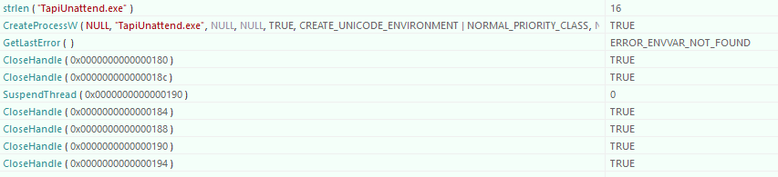

创建了windows下的`C :\Windows\System32\TapiUnattend.exe` 

创建进程的最后1一个参数如下

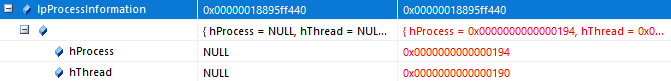

期间关闭了`管道1的读句柄`,`管道2的写句柄`

所以最后留下的是`管道1的写句柄`和`管道2的读句柄`

创建进程后,对进程的线程做了一个停止

```c
typedef struct _PROCESS_INFORMATION {
    HANDLE hProcess;
    HANDLE hThread;
    DWORD dwProcessId;
    DWORD dwThreadId;
} PROCESS_INFORMATION, *PPROCESS_INFORMATION, *LPPROCESS_INFORMATION;
```

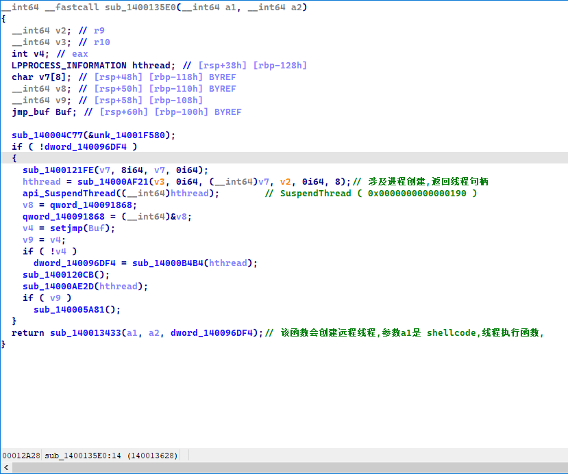

接着又关闭了进程句柄,线程句柄,和剩下的所有管道句柄

反正,不知道它创建管道是干什么的

也没有往里面写入什么东西

前面几次的内存分配也是同理,分配了,不知道都干什么了

然后再打开远程进程

在远程进程分配内存

然后再创建远程线程

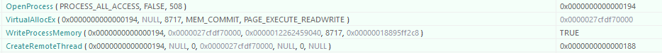

线程执行没有参数

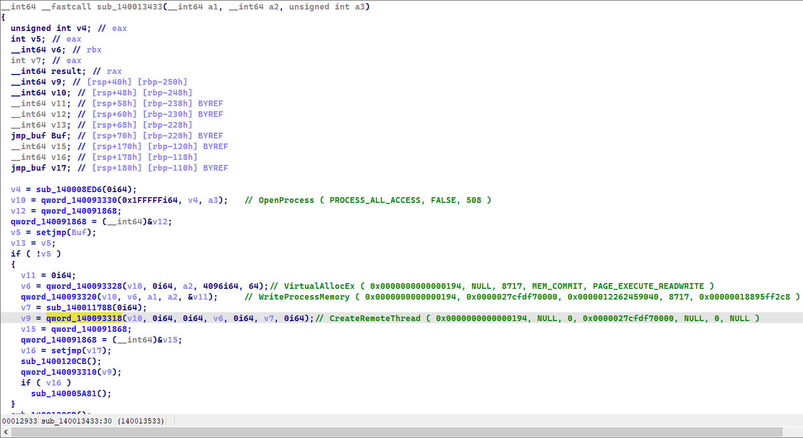

远程进程的执行代码是一段shellcode

shellcode提取如下

```c
#include<idc.idc>

static format_binFile()
{
    auto i;
    auto flen=8717;
    auto start_addr=0x000001719ACE9040;
    auto fd = fopen("shellcode.bin", "w"); 
    for(i=0;i<flen;i=i+1)
    {
        fputc(Byte(start_addr+i),fd);
    }
    fclose(fd);
}
static main()
{
    Message("| -- Y -- |\n");
    format_binFile();
    Message("| -- N -- |\n");
}
```

ps: 

我是重新调试进程,找到关键位置,然后提取的数据

另外,shellcode直接搜索字节码搜不到,说明被加密了的

创建远程线程然后,关闭2个句柄

然后又开始 打开相同的进程

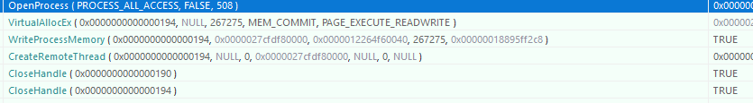

再次远程线程注入

函数还是以前的函数,只不过函数参数发生了改变

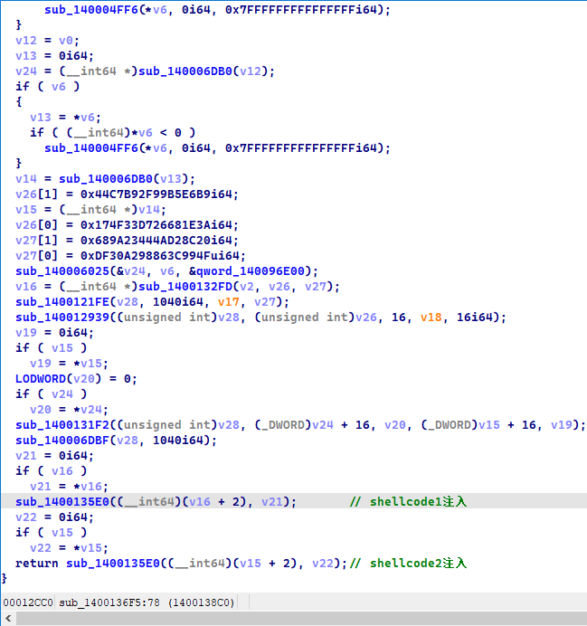

然后主进程干的事情就没了

可以看出主进程就干了2间事情 注入线程

# shellcode

我是通过打断点的方式,把shellcode从内存里面提取出来的

比如说,A远程线程注入B

IDA直接调试A,附加调试B

对进程B: 断点于线程开始的时候,

当A创建远程线程完毕,我们就可以去B进程把实际运行的字节码给dump出来

ps: 我为什么不在A中把字节码dump出来? 尝试过,发现效果不是理想…不过拿到就可以,管他那么多方式,去进程B拿字节码才是有效模拟环境

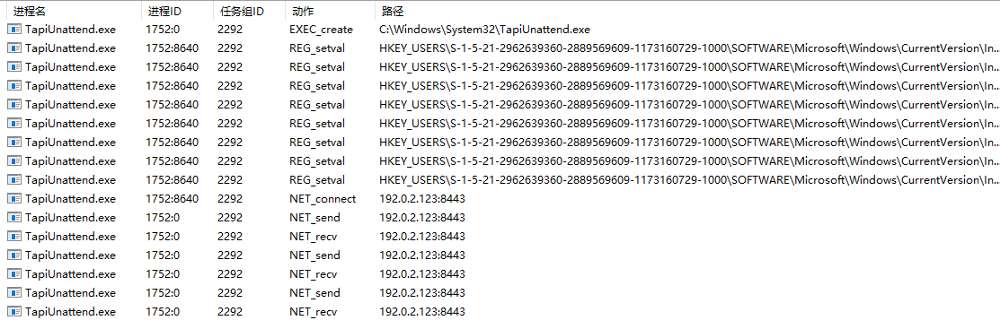

## shellcode.1

后期分析出,第一段shellcode其实是一个pe加载器, 他会手动把一个文件pe映射到内存

然后做一些初始化的工作,最后去往ep执行

### PE加载器分析

所以说其实laoder分析的意义不太大,而只需要关心具体加载的是什么pe文件

这个文件都干了什么,后期发现他是一个x64的dll文件

因为是第一次遇到PE_loader,所以我们就大概分析一下

首先是动态获取API

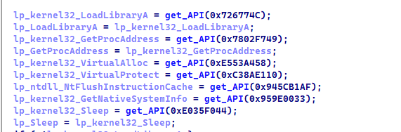

他的API获取比较有意思

通过类似于CRC64的算法,(可能不是这个算法哈,,🤣) 来映射一个dll对应的API

比如0x726774C映射的是kernel32的LoadLibraryA

💡 具体如何加载的API?

就小小的提及一句:

先通过TEB→PEB0→Ldr→_LDR_DATA_TABLE_ENTRY遍历自身模块, 

遍历模块A的时候, 每一个模块的dll字符串名字可以计算出一个校验值key_A

找到模块A后.就遍历dll的导出表的导出函数

每个函数的字符串名字也对应一个校验值key_B

通过计算key_A+key_B 是否和传递进来的目标api_key相等来判断

可以看到,其实他会遍历每一个dll的每一个api,

而不是先寻找dll,然后寻找api,而是有顺序的遍历所有api,直到找到目标api

---

一开始动态获取的API其实都是为了加载PE文件服务的,看上去么有恶意的行为,都是为了加载pe而获取的API

比如 VirtualAlloc, VirtualProtect, 

动态加载APi后,它会判断是不是一个pe文件

并判断该pe文件是否合法

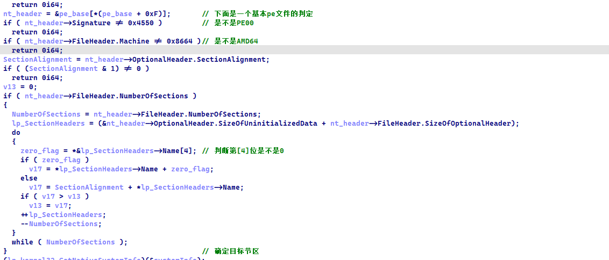

然后下面的代码截图有点长,就不展示了,大概流程如下

```c
pe头复制
pe节区映射
DataDirectory[5] 基址重定位操作
DataDirectory[1] 导入表初始化
DataDirectory[13] 延迟导入表操作
VirtualProtect 节区属性设置
DataDirectory[9] TLS操作
AddressOfEntryPoint 去往ep
DataDirectory[0] 执行导出表的一些东东
```

### dll文件分析

其实就是从peloader加载之前,把文件给dump出来

本来是尝试从内存里面dump出来的,然后发现IDA编译有问题

因为我没有把进行一个把内存映射到文件的操作,所以IDA翻译就有问题

写了dump的程序,重新把内存dump的处理了一下,其实也就是把节区多余的字节删除了,充VirusSize减少到RawSize

后来发现还是有问题,,,,所以我只能在文件还没有映射到内存之前dump了,而不是dump 加载器 去往程序ep的

没加载之前截胡文件是莫问题的,后来对比了一下

我处理的文件和一开始就截胡的文件,发现少了很多东西

这什么…他喵的….还得是加载之前原汁原味

DllMain就调用了一个函数

```c
BOOL __stdcall DllEntryPoint(HINSTANCE hinstDLL, DWORD fdwReason, LPVOID lpReserved)
{
  if ( fdwReason == 1 )
    sub_180001820(hinstDLL);
  return 1;
}
```

对于dll文件,我也就看了一个大概

总体来说,感觉就是修改了`TapiUnattend`.exe  的ntdll.dll 的.text的节区属性

期间设计dll基址寻找,PE节区的遍历

修改某段节区属性等等吧

内存创建什么的

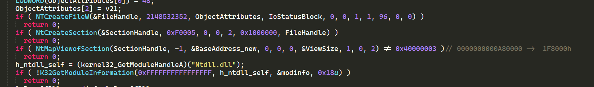

目标节区寻找和修改属性

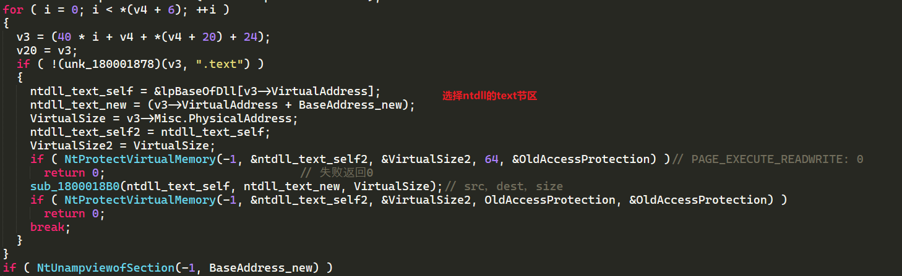

可读可写可执行

`sub_1800018B0(ntdll_text_self, ntdll_text_new, VirtualSize);` 不知道干了什么

反正 `ntdll_text_self, ntdll_text_new` 指向的内存没发生改变


其实后来看文章发现

他其实是在脱钩unhoook

把原来的ntdll复制一份覆盖远程进程的那个ntdll

这样就脱去了远程进程TapiUnattend的钩子

## shellcode.2

查资料说,他是一个木马

经过分析后得知,其实他也是一个peload和dll文件的结合体

pelode完成dll文件的初始化后,就去执行dll的entrypoint

分析起来比上一儿要费劲些

### PE加载器分析

一开始,寻找自己的基地址

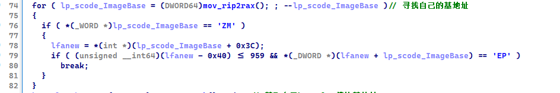

然后寻找kernel32的基地址

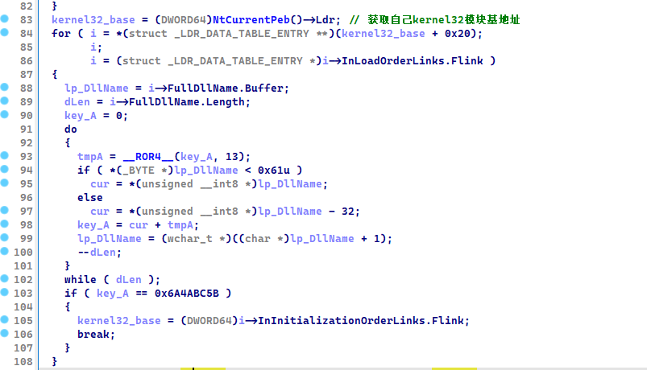

然后初始化基本的几个API地址

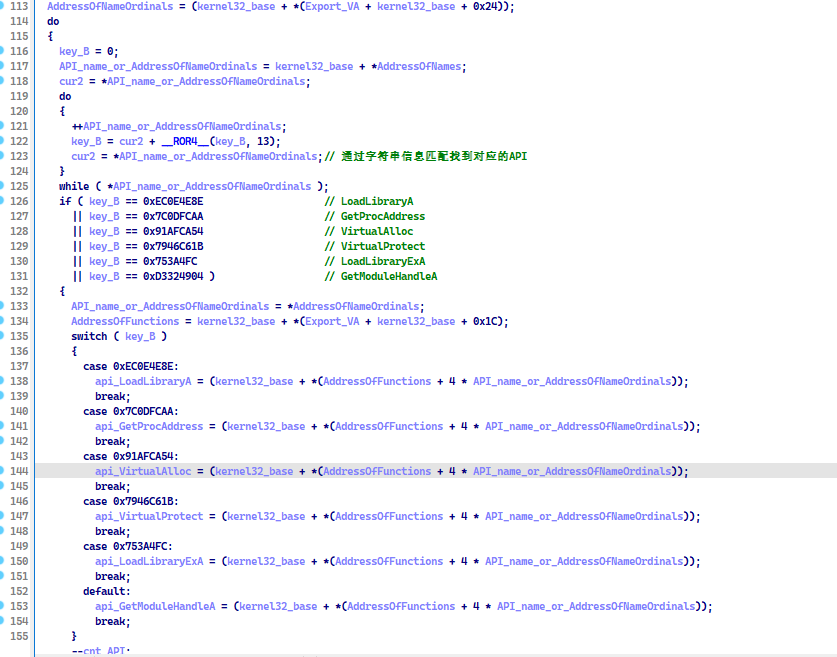

然后就是调用这些找到的API去加载PE文件

具体不不展示,说一下流程

pe头复制

节区复制

导入表初始化: 分为2步.dll加载和IAT填充 , At填充分2种情况,,,ID导入和字符串导入

ps: 导入表的dll名字和函数名字都被异或加密了,解密之后才操作的

基址重定位

然后去往eip执行


其实在这里,就产生了一些问题,那就是他的导入表表是被加密了的

如果我把shellcode给dump出来后,IDA反编译是有问题的

但凡涉及导入表的函数,IDA就翻译g了

比如下面这个样子

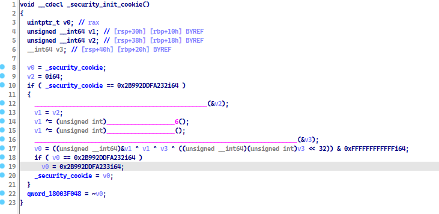

那些`____`的东东,其实IDA没有从导入表成功加载的函数

所以要进行下一步分析的话

需要解密导入表

解密脚本见res文件夹

解密之后如图,就会非常清晰


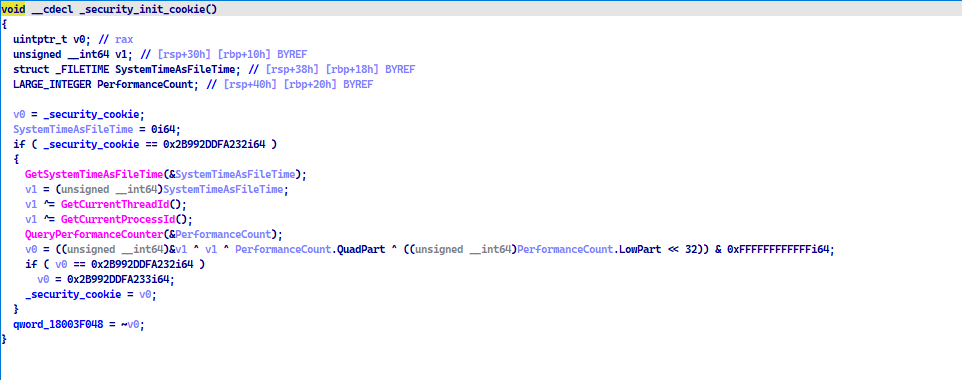

这同时也告诉我们一个道理,加密导入表在一定程度上是可以干扰IDA静态分析的

其实对动态分析也有一定的干扰程度


其中,有点很奇怪

那就是关于内存开辟这个东西

比如我们把一个pe文件映射到内存中

0~0x1000这段空间虽然是pe头所拥有,但是在运行的时候,一般不会访问这个区域的数据


### dll文件分析

在pe加载的时候就已经进行了一个EntryPoint的前往

那时进行了一个dll的初始化

第二次进入的时候,dwReason=4

很奇怪,一般来说都是0,1,2,3,

但是通过后面分析,其实4-1了,结果是3

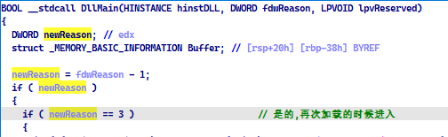


#### 如何分析

后面我通过了很多种方式去分析shellcode2的dll

比如

1),把shellcode放入一个新的节区,然后exe去往那个节区加载并执行dll相关东西

不足: 是用API monitor 无法监视,它只能监视那种中规中矩的文件

2), 把shellcode提取为一个dll,然后把LoadLibary加载,效果还是不理想,并且 API monitor也无法监视

3), 把shellcode提取为一个dll,然后写入导入表,然后用windwos加载,然后我们在程序的ep那里再次去往dll

附带另外一个Reason

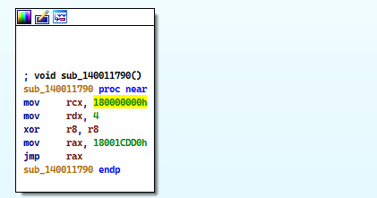

就这样,主程序再次去往ep

期间也遇到很多无法解决的问题

比如用getModuleHandle获取dll的基地址,而不是写死基地址, 发现后面莫名其妙异常

只能把地址写死,然后去往dll


#### API monitor 


信息窃取?

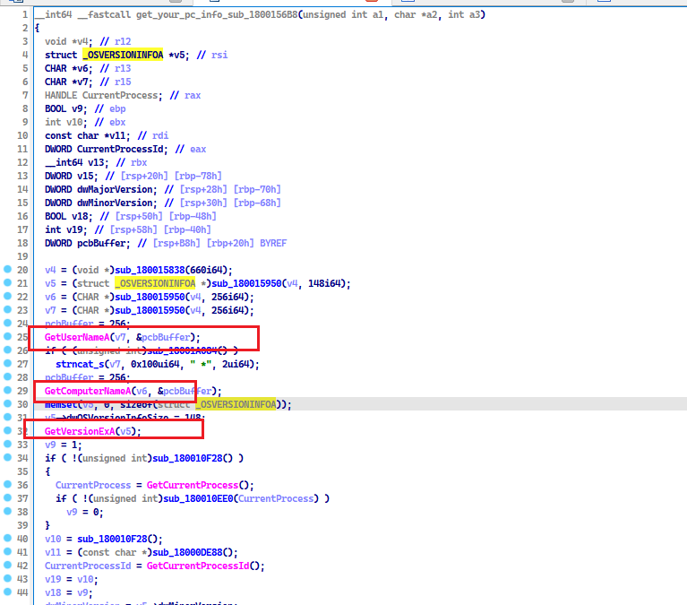


他会获取我们的用户名,电脑名字,IP地址

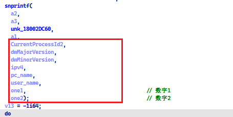

后面呢就无法分析了,因为程序不跑了


# 溯源


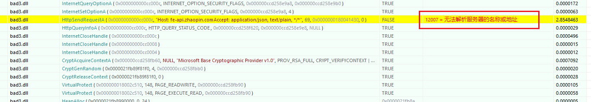


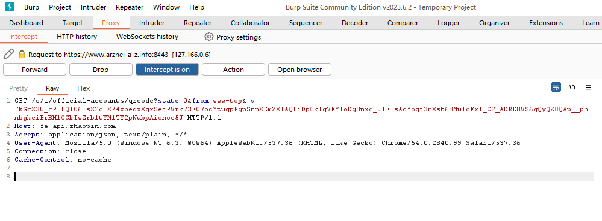


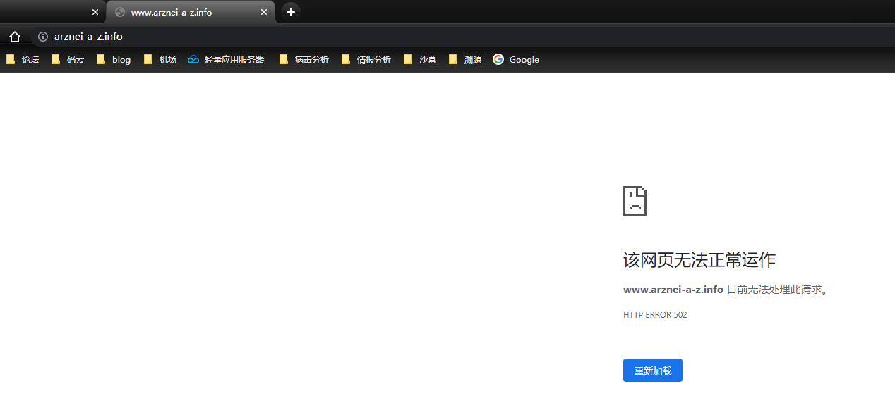


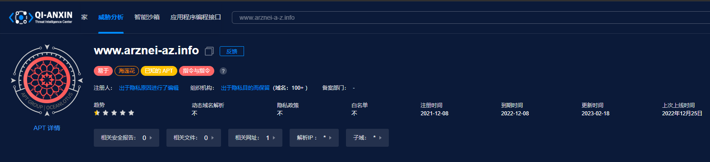

# 资源文件


bad.dll :第1个shellcode的提取物

bad2.dll 第2个shellcode的提取物质

bad2.dll.fixed 导入表解密后的dll

bad3.dll 同bad2.dll.fixed

C1.exe_ 自动加载bad3.dll

Load_sec1.exe_ 把shellcode1放入自己的节区并执行

Load_sec2.exe_ 把shellcode2放入自己的节区并执行

Load_sec2:主要是研究第2个dll.放入自己的节区执行

Loader_me: 加载bad3.dll,然后ep去往bad3.dll