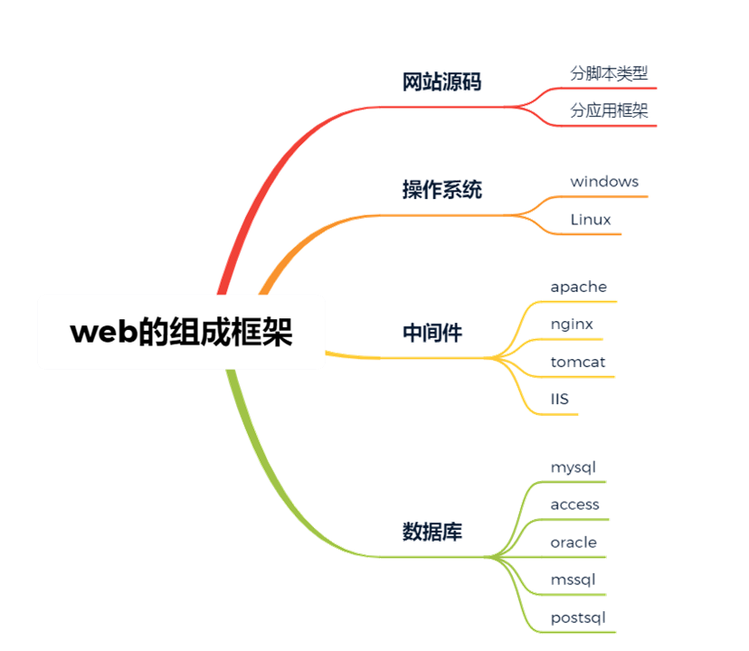
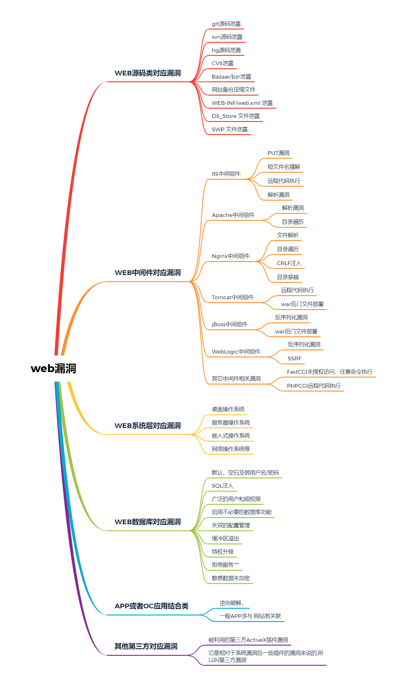

 

域名发现对于安全测试意义?

答: 进行渗透测试时，其主域名找不到漏洞时，就可以尝试去测试收集到的子域名，有可能测试子域名网站时会有意向不到的效果，

然后可以由此横向到主网站。另外，相同的二级域名的网站架构、源码、密码可能相似，两个网站的域名解析的ip地址可能相同。

 

什么是后门?有那些后门?

答:

**后门的分类**

-   网站后门，也就是webshell，控制网站权限。
-   服务器后门，控制的是个人计算机或者服务器的权限。比如远控木马、灰鸽子后门等。
-   还有更深层次的Rootkit 后门。

 

Web的组成架构模型?

 

 

Web源码类对应漏洞

SQL注入,上传，xss，代码执行,变量覆盖,逻辑漏洞，反序列化等 	

web中间件对应漏洞

web数据库对应漏洞

web系统层对应漏洞 

其它第三方对应漏洞

APP或PC应用结合类

