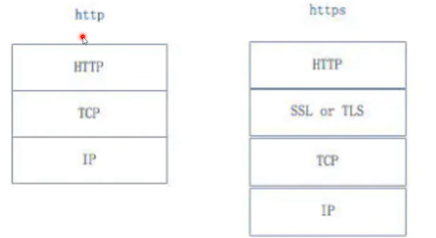

关于http和https的一些区别

 3、Request请求数据包数据格式

1.请求行：请求类型/请求资源路径、协议的版本和类型
2.请求头：一些键值对，一般由w3c定义，浏览器与web服务器之间都可以发送，表示特定的某种含义
3.空行：请求头与请求体之间用一个空行隔开
4.请求体：要发送的数据(一般post提交会使用)；例：userName=123&password=123

# **请求行**

请求行由三个标记组成：请求方法、请求url和HTTP版本，它们用空格分开。
例如：GET /index.html HTTP/1.1

HTTP 规划定义了 8 种可能的请求方法：

-   GET：检索 URL 中标识资源的一个简单请求
-   HEAD：与 GET 方法相同，服务器只返回状态行和头标，并不返回请求文档
-   POST：服务器接受被写入客户端输出流中的数据的请求
-   PUT：服务器保存请求数据作为指定 URL 新内容的请求
-   DELETE：服务器删除 URL 中命令的资源的请求
-   OPTIONS：关于服务器支持的请求方法信息的请求
-   TRACE：web 服务器反馈 Http 请求和其头标的请求
-   CONNECT ：已文档化，但当前未实现的一个方法，预留做隧道处理

# 请求头

由关键字/值对组成，每行一对，关键字和值用冒号分隔。请求头通知服务器有关于客户端请求的信息。

-   HOST：主机或域名地址
-   Accept：指浏览器或其他客户可以接受的 MIME 文件格式。Servlet 可以根据它判断并返回适当的文件格式。
-   User-Agent：是客户浏览器名称。
-   Host：对应网址 URL 中的 Web 名称和端口号。
-   Accept-Langeuage：指出浏览器可以接受的语言种类，如 en 或 en-us，指英语。
-   connection：用来告诉服务器是否可以维持固定的 HTTP 连接。http 是无连接的，HTTP/1.1 使用 Keep-Alive为默认值，这样，当浏览器需要多个文件时(比如一个 HTML 文件和相关的图形文件)，不需要每次都建立连接。
-   Cookie：浏览器用这个属性向服务器发送 Cookie。Cookie 是在浏览器中寄存的小型数据体，它可以记载和服务器相关的用户信息，也可以用来实现会话功能。
-   Referer：表 明 产 生 请 求 的 网 页 URL 。这个属性可以用来跟踪 Web 请求是从什么网站来的。
-   Content-Type：用来表名 request 的内容类型。可以用 HttpServletRequest 的 getContentType()方法取得。
-   Accept-Charset：指出浏览器可以接受的字符编码。英文浏览器的默认值是 ISO-8859-1
-   Accept-Encoding：指出浏览器可以接受的编码方式。浏览器在接收到 Web 响应之后先解码，然后再检查文件格式。

空行

请求头与请求体之间用一个空行隔开；最后一个请求头标之后是空行，发送回车符和换行，通知服务器以下不再有头标。

请求数据

要发送的数据(一般 post 提交会使用)；例：user=123&pass=123。
使用 POST 传送，最常使用的是 Content-Type 和 Content-Length 头标。

# Response返回数据包数据格式

一个响应由四个部分组成；状态行、响应头标、空行、响应数据。

1.状态行：协议版本、数字形式的状态代码和状态描述，几个元素之间以空格分隔
2.响应头标：包含服务器类型、日期、长度、内容类型等
3.空行：响应头与响应体之间用空行隔开
4.响应数据：浏览器会将实体内容中的数据取出来，生成相应的页面

HTTP 响应码：

-   1xx：信息，请求收到，继续处理
-   2xx：成功，行为被成功地接受、理解和采纳
-   3xx：重定向，为了完成请求，必须进一步执行的动作
-   4xx：客户端错误
-   5xx：服务器错误

御剑扫描后台目录时，可通过以下状态码判断：

-   200 存在文件
-   3XX 均可能存在
-   403 存在文件夹
-   404 不存在文件及文件夹
-   500 均可能存在

响应头标：像请求头标一样，它们指出服务器的功能，标识出响应数据的细节。

空行：最后一个响应头标之后是一个空行，发送回车符和换行，表明服务器以下不再有头标。

响应数据：HTML文档和图像等，也就是HTML本身
