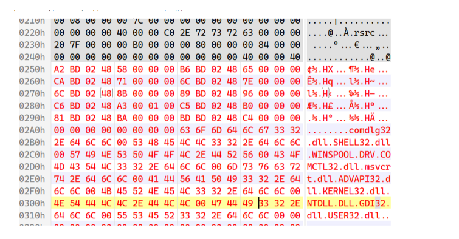

# [11] 绑定导入表


```
typedef struct _IMAGE_THUNK_DATA
{
    union
     {
         PBYTE ForwarderString;
         PDWORD Function;      //被导入的函数的入口地址
         DWORD Ordinal;       // 该函数的序数
         PIMAGE_IMPORT_BY_NAME AddressOfData;   // 一个RVA地址，指向IMAGE_IMPORT_BY_NAME
     }u1;
} IMAGE_THUNK_DATA32;
```

```
struct _IMAGE_BOUND_FORWARDER_REF {
    DWORD   TimeDateStamp;
    WORD    OffsetModuleName;
    WORD    Reserved;
} IMAGE_BOUND_FORWARDER_REF, *PIMAGE_BOUND_FORWARDER_REF;
```

绑定导入表 成员

```
struct _IMAGE_BOUND_IMPORT_DESCRIPTOR
{
    DWORD   TimeDateStamp;//时间戳

    WORD    OffsetModuleName;//指向dll的名字

    WORD    NumberOfModuleForwarderRefs;//对应成员的数目
    // 表示该动态链接库中的函数实现字节码存储在另外一个动态链接库中
} IMAGE_BOUND_IMPORT_DESCRIPTOR,  *PIMAGE_BOUND_IMPORT_DESCRIPTOR;
```

有无绑定导入表是根据导入表的时间戳来判断的

绑定导入表一般位于0x400以内的地方,也就是section header 结束之后



TimeDateStamp

该字段的值必须与要引用的DLL的文件头IMAGE_FILE_HEADER.TimeDateStamp字段值相吻合，

否则就会促使加载器去重新计算新IAT，这种情况一般发生在DLL版本不同时或者DLL映像被重定位时

OffsetModuleName

该地址既不是RVA,也不是VA

是一个基于绑定导入表起始地址的偏移量

比如绑定导入表的地址是0x250

OffsetModuleName=0x30

那么对应dll的名字就在0x280

