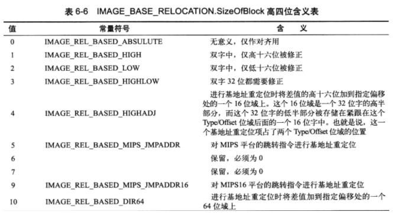

基址重定位数据所在的节通常名字是.reloc

一般情况下,exe都会加载到ImageBAse,所以不会使用基址重定位

但是如果没有加载到ImageBAse,那么就会存在基址重定位


dll在加载的时候,一般都需要重定位置

各个dll贴在exe的内存中,是挨得比较紧密的,但是各个dll之间会有对齐的行为,默认的对齐是1000h,也就是64k

数据目录表的重定位的size很有用,它决定了有多少地方需要重定位


```c
struct _IMAGE_BASE_RELOCATION
{
    DWORD   VirtualAddress;//RVA,代码页,对应数组的其实地址
    DWORD   SizeOfBlock;/成员个数
// WORD	Arr[1]; 柔性数组
} IMAGE_BASE_RELOCATION,* PIMAGE_BASE_RELOCATION;
```

每一个代码页都有这样的数据结构

VirtualAddress 决定了代码页的基地址

SizeOfBlock 决定了这个数据结构的大小

数组成员个数=(SizeOfBlock-4*2)/2 就是柔性数组的成员个数


关于地址遍历

假设x=arr[xx];

(x&0xF000)>>3是标志位,如果结果是3,表示对应地址的4个字节都要修改,一般情况下,我们的遇到的都是3

(x&0x0FFF)+VirtualAddress 就是需要修改的地方的RVA地址

((x&0x0FFF)+VirtualAddress+ImageBase) 就是需要修改的值

修改为 修改的值=(新的ImageBase - 旧的ImageBase)+原有的地址




```c
#define IMAGE_REL_BASED_ABSOLUTE              0
#define IMAGE_REL_BASED_HIGH                  1
#define IMAGE_REL_BASED_LOW                   2
#define IMAGE_REL_BASED_HIGHLOW               3
#define IMAGE_REL_BASED_HIGHADJ               4
#define IMAGE_REL_BASED_MACHINE_SPECIFIC_5    5
#define IMAGE_REL_BASED_RESERVED              6
#define IMAGE_REL_BASED_MACHINE_SPECIFIC_7    7
#define IMAGE_REL_BASED_MACHINE_SPECIFIC_8    8
#define IMAGE_REL_BASED_MACHINE_SPECIFIC_9    9
#define IMAGE_REL_BASED_DIR64                 10
```
