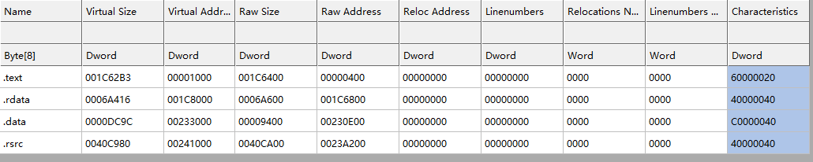
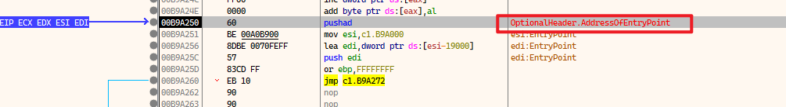
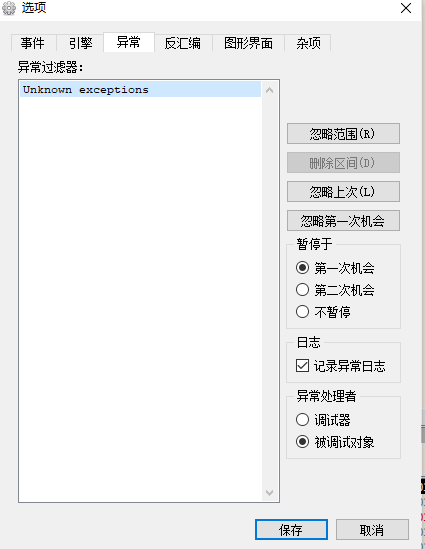

参考链接:

https://blog.csdn.net/jyk764717697/article/details/7306621

二次断点法（又叫内存镜像法）

壳如果要把原来加密或压缩的代码运行起来就必须要解压和解密原来的代码。

而这一个过程我们难道不能将他看做是对代码段（code段）的写入吗

所以就满足可以触发内存访问断点的条件

当然能也可以触发内存可执行断点之类的

# UPX -

## 32位利用 xdbg

首先我们看一下一个exe 加壳前后的变化

加壳前

加壳后

加壳后

`.UPX0`是一个空的节区

`.UPX1`和`.rsrc`节区估计和压缩的数据有关

然后解压缩的数据放在UPX0节区,然后在UPX0执行

所以我们可以在.rsrc下一个内存访问断点,F9,

如果停止下来,说明它开始解密数据了

然后在.UPX0下一个内存执行断点,然后F9 

具体步骤如下

在程序ep处

第一个断点

然后F9一下

停下来了,因为ESI+0x1A218访问了资源节

第二个断点

然后F9一下,到了OEP

ps:我的异常设置如下,默认选项

到了

## x64 xdbg

操作一模一样,参考x86的

## 疑惑

为什么我们不可以直接在UXP0下一个可执行断点呢?

省的下2次

于是就g,woc,反正就是不对
