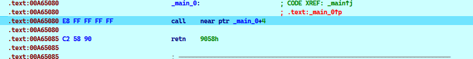
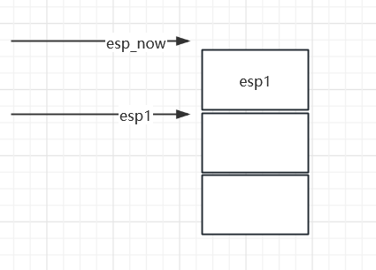

# CALL/POP .1


```assembly
DWORD* lp_apiAddr;

    __asm {
        push eax;
        push ebx;
        push ecx;

        call label_reloc;
    label_reloc:
        pop ebx;

        //重定位lpfuncAddr;
        lea eax, g_apiAddr;
        sub eax, label_reloc;
        add eax, ebx;

        lea ecx, lp_apiAddr;
        mov[ecx], eax;

        pop ecx;
        pop ebx;
        pop eax;

    }
```

他的原理是什么?

一个变量的真实地址 = 一个基址 + 一段偏移


比如y1地址的重定位,就是x1的地址+一个偏移量量

偏移量是一个相对距离,静态加载和动态加载都不会改变这个相对值

只是基址在发生变化,所以重定位就是新的基址+写死的偏移量

对方法1的小结

其实就是新的基址+一个固定的偏移

就我举得例子,它是通过现场获取当前基址,并现场计算写死的固定偏移

通过新的基址+固定偏移来获取

其实,大多数情况下,固定偏移是提前计算好了的,不需要我们那样现场计算

```c
        //重定位lpfuncAddr;
        lea eax, g_apiAddr;
        sub eax, label_reloc;
        add eax, ebx;

优化为
 
        mov eax,xxx ;xx是直接写死的,而不是通过计算
				add eax,ebx
```


# CALL/POP .2


```
E8FFFFFFFFC25890
```




执行后,代码会重构


这样的话,edx就可以获取地址 .text:00A65085


# 浮点运算型

浮点运算后位置保存在栈顶，通过POP操作可以获取其位置。


案例1

```assembly
.text:00A65084 D9 EE                         fldz
.text:00A65086 D9 74 24 F4                   fnstenv byte ptr [esp-12]
.text:00A6508A 5B                            pop     ebx
```

案例2

```assembly
debug043:00E00000 DA C5                         fcmovb  st, st(5)
debug043:00E00002 B8 5B 43 B1 DA                mov     eax, 0DAB1435Bh
debug043:00E00007 D9 74 24 F4                   fnstenv byte ptr [esp-12]
debug043:00E0000B 5D                            pop     ebp
```

案例3

```assembly
.data:0041A005 DA C9                         fcmove  st, st(1)
.data:0041A007 D9 74 24 F4                   fnstenv byte ptr [esp-12]
.data:0041A00B 5F                            pop     edi;edi直接获取0041A005
```

案例4

```assembly
.data:0041A01B fcmovbe st, st(2)
.data:0041A01D fnstenv byte ptr [esp-12]
.data:0041A021 pop     eax;eax直接获取0041A01
```

案例5

```assembly
.data:0041A036 fldpi
.data:0041A038 mov     ebx, 0F575EA6Bh
.data:0041A03D
.data:0041A03D loc_41A03D 
.data:0041A03D  fnstenv byte ptr [esp-12]
.data:0041A041 pop     ebp ;ebp直接获取0041A036 
```


总结规律

` fnstenv byte ptr [esp-12]` 会把最近那个浮点数操作指令的地址入栈

然后pop 出来就是那个地址


所以常见浮点数操作

```assembly
D9 EE                         fldz
D9 EB                         fldpi
D9 C2                         fld     st(2)
DD C6                         ffree   st(6)
D9 CE                         fxch    st(6)
D9 E9                         fldl2t
DB D0                         fcmovnbe st, st
DA C9                         fcmove  st, st(1)
DA D2                         fcmovbe st, st(2)
DB C3                         fcmovnb st, st(3)
DA C5                         fcmovb  st, st(5)
DA D6                         fcmovbe st, st(6)
DB CF                         fcmovne st, st(7)
```


 

# 中断

说用int 2Eh 或者 int 2Ch 可以把下一条地址入ebx

没有实验成功


# 异常

通过异常,可以记录异常发生的位置eip


# 栈利用


比如我们有一个字符串在代码里面写死了

如何拿到它的地址?

情况是这样的

``` 
.data:0041A1DA 68 33 32 00 00                push    3233h
.data:0041A1DF 68 77 73 32 5F                push    5F327377h 
```

然后我们push进去的其实是一个一堆8字节

然后我们在push进去一个esp

就可以获取那对东西的地址了



