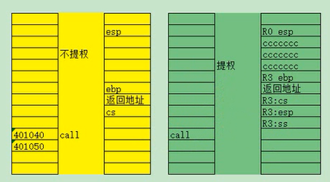
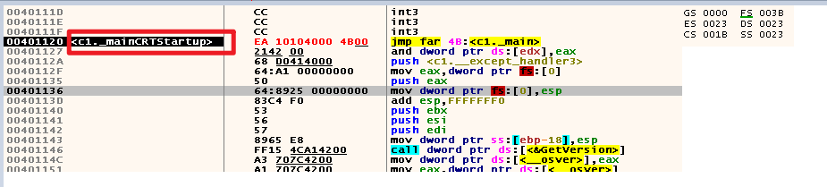
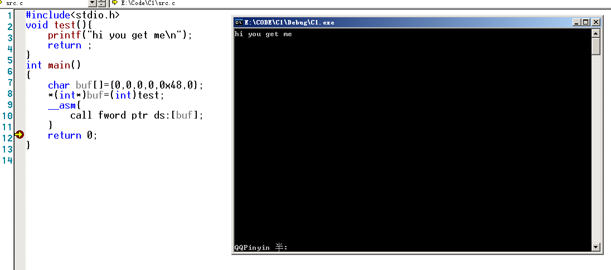
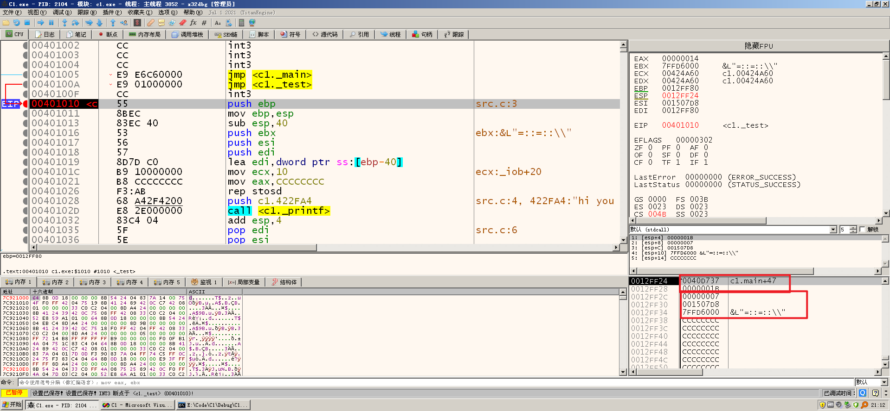

# 前言

为什么说是初入?

因为这里面涉及很多东西,,所以就简单的介绍一下,,,细节会在之后单独提出来的


分为很多情况的

比如`JMP FAR`

比如 `CALL FWORD PTR`


期间涉及线程环境的切换

可以实现代码跨段的指令,期间可能会修改CS:IP,甚至SS:SP

```
jmp far
call far
int
retf
iret(16位)
iretd(32位)
//这些指令有什么区别,那是后面会讲到的
```

可以修改CS,IP的除了上面提及的指令  还有->sysentry,sysexit,


跨段,我感觉应该是一种环境的切换,前往的虚拟地址甚至可以是一样的,,,

但是线程环境不再是一样的

就像是`CALL FWORD PTR `不提权,去往附近的地方


段间跳转分为两种情况：

1.  要跳转的段是一致代码段 ,存在跨级访问, 系统不怎么用
2.  要跳转的段是非一致代码段,各自调用各自的

但是我们通常使用的是`非一致代码段`的跨段,因为那样更加方便,不容易出错吧


> 最后引出一个小结论,是通过前人总结的

jmp,call是可以用来提权的

但是 jmp,call, 不调用`门`,或者不调用`TSS`,只能在同级之间跳转

retf,iretd呢,只能在同级之间跳转,或者只能降级跳转


<div  style="color:#FFB5C5;font-size:16px">
    注意：直接对代码段进行JMP 或者 CALL的操作，<br>
	无论目标是一致代码段还是非一致代码段，CPL当前权限都不会发生改变.<br>
    如果要提升CPL的权限，只能通过调用门<br>
</div>


# JMP FAR 段间跳转

jmp的跳转不涉及栈的变化...? 可能吧


## 不提权的 jmp


```
JMP x:y
机器码是
EA 34124000(y) 2000(x)
```

该指令要提供6字节的参数(2+4)==(段选择子+偏移)

对于这种,是修改CS:IP的

但不会修改SS:SP

`JMP x:y`的y就是去往目标地方的偏移

比如x=0x004B,Y=0x0040101A


## 提权的 jmp

略,,后面说吧


# CALL FAR 段间调用(调用门引入)

不同于之前的call

现在的call far不仅仅是push ip了

既然是call far,那么函数的返回就不再是ret

而不是retf

但是retf又分为2种情况来返回

一种是不需要提权的reft,会把栈中2个东西pop出来

另外一种是经过提权的retf,会把栈中4个东西pop出来,此刻的retf就是用来降权啦




左边是不提权的call far, 把CS:IP入栈

右边是提权的call far,把SS:SP,CS:IP入栈了


## 不提权

不提权的话, CALL FAR XX:YYYY

其中CPL=目标的DPL

真正去往的地址是YYYY


期间会push这些东西,不仅仅有这些哈

```
EIP
CS
```


## 提权

指令格式：CALL XX:EIP(EIP是废弃的)

ps: 在调用门那里我们会详细的介绍

跨段调用时，一旦有权限切换，伴随着以一个新的堆栈出现。

CS的权限一旦改变，SS的权限也要随着改变，即CS与SS的等级必须一样。

新的堆栈里面,初步的值会是下面的样子

```
栈顶:	   EIP //返回的地址
		CS //以前的cs
		ESP //以前的栈顶
		SS //以前的ss
```

新的堆栈来源于参见TSS段

后面会讲到关于CALL的提权


# 小实验

有些实验可能没有什么意义

只是说熟练一下相关的东西罢了


## JMP 不提权的段间跳转

实验声明:

很多实验有一定的运气性...什么意思?

就是我们的基础掌握的不够,,很多情况 成功了,,就成功了

失败了,,却不知道哪里失败,,甚至连成功都有一定的运气成分的

就算成功了,,后续的单步执行也会报出异常...


随便一个exe为例子,拖进xdbg

然后构造

```c++
JMP FAR xx:yyyy
```

首先查看数据

```c++
0: kd> r gdtr
gdtr=8003f000
0: kd> dq 8003f000
8003f000  00000000`00000000 00cf9b00`0000ffff //[0],[1]
8003f010  00cf9300`0000ffff 00cffb00`0000ffff //[2],[3]
8003f020  00cff300`0000ffff 80008b04`200020ab //[4],[5]
8003f030  ffc093df`f0000001 0040f300`00000fff //[6],[7]
8003f040  0000f200`0400ffff 00000000`00000000 //[8],[9]
8003f050  80008955`27000068 80008955`27680068
8003f060  00009302`2f40ffff 0000920b`80003fff
8003f070  ff0092ff`700003ff 80009a40`0000ffff

```

首先CS=0x001B

```
CS 去往:GDT 索引:3 然后请求:R3
```

索引的值是[3]=00cffb00`0000ffff


### 不提权访问R3


于是我们为了突出效果,在[9]: 8003f048的地方插入值CS:00cffb00`0000ffff

```c++
0: kd> eq 8003f048 00cffb00`0000ffff
0: kd> dq 8003f000
8003f000  00000000`00000000 00cf9b00`0000ffff
8003f010  00cf9300`0000ffff 00cffb00`0000ffff
8003f020  00cff300`0000ffff 80008b04`200020ab
8003f030  ffc093df`f0000001 0040f300`00000fff
8003f040  0000f200`0400ffff 00cffb00`0000ffff //发生改变
8003f050  80008955`27000068 80008955`27680068
8003f060  00009302`2f40ffff 0000920b`80003fff
8003f070  ff0092ff`700003ff 80009a40`0000ffff
0: kd> g
```


打算跳往的选择子是0x004B

```
0x004B: 去往:GDT 索引:9 然后请求:R3
```

然后后续我们直接跳到main函数罢了

```
JMP FAR 0x004B:0x00401010 //0x00401010函数地址
```

跳转前



跳转后


发现跳转成功,,但是也有可能跳转失败的


### 不提权访问R0


如果我们跳往的不是R0的CS段,

而是DPL为R0的CS段

```
0: kd> eq 8003f048 00cf9b00`0000ffff
0: kd> g
```

 00cf9b00`0000ffff 段范围:00000000[FFFFFFFF] ,段类型:非系统段 段权限:R0

于是我们尝试从非一致代码段,从R3 JMP FAR 到R0

直接触发异常


因为CPL=R3,RPL=R0,DPL=R0,

同时我们不能通过JMP FAR的断间跳转来提权获得R0

所以报出异常?


### 提权访问R0

如果我尝试利用一致代码段呢?

通过JMP FAR的断间跳转来提权获得R0,

设置windbg

```c++
0: kd> r gdtr
gdtr=8003f000
0: kd> dq 8003f000
8003f000  00000000`00000000 00cf9b00`0000ffff
8003f010  00cf9300`0000ffff 00cffb00`0000ffff
8003f020  00cff300`0000ffff 80008b04`200020ab
8003f030  ffc093df`f0000001 0040f300`00000fff
8003f040  0000f200`0400ffff 00000000`00000000
8003f050  80008955`87000068 80008955`87680068
8003f060  00009302`2f40ffff 0000920b`80003fff
8003f070  ff0092ff`700003ff 80009a40`0000ffff
0: kd> eq 8003f048 00cf9f00`0000ffff
0: kd> g

```


然后开始跳转

CPL=R3,RPL=R0,DPL=R0

最后的CPL=R3, em....


而且后续就一直异常和失败了


## 视频的实验:

是一个一致代码段的实验

通过call far实现了R3调用R0

同时他还需要修改页的一些东西

这个可以参考

```c++
\火哥内核1-\保护模式\09.段跳转流程;
\火哥内核1-\保护模式\10.段跳转实验-一致代码段分析
```

但是没看懂的


## CAll实验


### R3访问R0


这个就是用的call

CPL=3, 目标DPL=0,目标RPL=0

看是否可以成功的call

```c++
0: kd> eq 8003f048 00cf9b00`0000ffff
|         (00cf9b00`0000ffff)
|         (00000000)[0,000FFFFF)        |
|---------------------------------------|
| TYPE | S | DPL | P | AVL | - | DB | G |
| 1101 | 1 | 00  | 1 | 0   | 0 | 1  | 1 |
|---------------------------------------|
```


CPL=3,DPL=0,RPL=0

发现跳转失败


说明什么,,在CPL=3,DPL=0,RPL=0的情况下,,,使用call,也失败

call在不调用门,TSS的情况下,,仍然不能提权,,只能在同一级别之间跳转


### R3访问R3


CPL=3,DPL=3,RPL=0;


代码例子

```c++
#include<stdio.h>
void test(){
	printf("hi you get me\n");
	return ;
}
int main()
{
	char buf[]={0,0,0,0,0x48,0};
	*(int*)buf=(int)test;
	__asm{
		call fword ptr ds:[buf];
	}
	return 0;
}
```


然后我们尝试在同一级别之间call

```c++
0: kd> eq 8003f048 00cffb00`0000ffff;
|         (00cffb00`0000ffff)
|         (00000000)[0,000FFFFF)        |
|---------------------------------------|
| TYPE | S | DPL | P | AVL | - | DB | G |
| 1101 | 1 | 11  | 1 | 0   | 0 | 1  | 1 |
|---------------------------------------|
```


CPL=3,DPL=3,RPL=0;

可以看见就成功跳转过去了

但是还是会遇到一些问题

比如在test下断点,就g了




在没有call进去时


call进去后




这说明了什么?
尝试使用retf正常返回


```c++
0: kd> dq gdtr
8003f000  00000000`00000000 00cf9b00`0000ffff
8003f010  00cf9300`0000ffff 00cffb00`0000ffff
8003f020  00cff300`0000ffff 80008b04`200020ab
8003f030  ffc093df`f0000001 0040f300`00000fff
8003f040  0000f200`0400ffff 00000000`00000000
8003f050  80008955`27000068 80008955`27680068
8003f060  00009302`2f40ffff 0000920b`80003fff
8003f070  ff0092ff`700003ff 80009a40`0000ffff
0: kd> eq 8003f048  00cffb00`0000ffff

```


```c++
#include<stdio.h>
int gvar=10;
void _declspec(naked) test()
{
	__asm{
		push eax;
		push ecx;
		lea eax,gvar;
		xor ecx,ecx;
		mov [eax],ecx;
		pop ecx;
		pop eax;
		retf;
	}
}
int main()
{
	char buf[]={0,0,0,0,0x48,0};
	*(int*)buf=(int)test;
	printf("hi i am hello world\n");
	printf("%08X\n",gvar);
	__asm{
		call fword ptr ds:[buf];
	}
	printf("%08X\n",gvar);
	return 0;
}
```


执行如下


# 复习


其实就讲了一下不提权的 `JMP FAR`,`CALL FAR`

也包含了`CALL FAR`的返回

期间涉及的一些权限问题,其实没有必要去过多的在乎

因为这个东西有点玄乎,,

偶尔成功偶尔不成功,,说明了我们掌握的知识不够

还不能完整的明白一个实验的成功和失败


