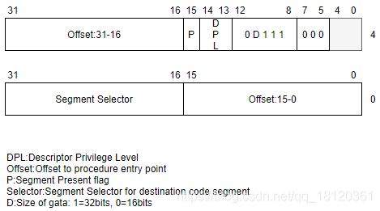

# 前言

引入

系统调用：

当在开发应用层程序的时候，使用的API在执行过程中通过3环进入0环，这个过程就是系统调用

而从3环是如何进入0环的过程，就使用到了中断门。需要注意的是，

老的CPU是通过中断门进入的0环，而现在的CPU都是通过快速调用调试

例如OD使用F2下断点，下断点其实就是把某个字节修改为了0xCC，0xCC硬编码对应的汇编指令就是INT3，INT3就是用来执行中断门的


IDT表在哪里?

IDTR寄存器会告诉你

IDT表存储了中断描述符表 ,它同 GDT 一样，每个元素占 8 个字节

仅在xp环境有效

```
r idtr //查看IDT表其实地址
r idtl //查看IDT长度
```


IDT表可以包含3种门描述符：

1.  任务门描述符。
2.  中断门描述符。
3.  陷阱门描述符。


中断门会让EFLAG的TF会置零,陷阱门不会


# 位于IDT的中断门


调用中断门的方式既不是`CALL FAR` 也不是`JPM FAR`

而是通过`INT`来实现


其实后面还会去讲.....

那就是任务门他也在IDT表里面的


## 简单介绍

记住新的表的名字

IDT表

查的是IDT表


```c++
0: kd> r idtr
idtr=8003f400
0: kd> dq 8003f400 
8003f400  80548e00`000831a0 80548e00`0008331c
8003f410  00008500`0058113e 8054ee00`00083730
8003f420  8054ee00`000838b0 80548e00`00083a10
8003f430  80548e00`00083b84 80548e00`000841fc
8003f440  00008500`00501198 80548e00`00084600
8003f450  80548e00`00084720 80548e00`00084860
8003f460  80548e00`00084ac0 80548e00`00084dac
8003f470  80548e00`000854a8 80548e00`000857e0

```

int 0就映射出第[0]个

int 3就映射出第[3]个


TYPE域说明了是一个32位中断门

中断门不允许传递参数，所以Parame Count都是0。


TYPE域说明


所以固定是0xE

构造中断门

```
Offset in Segment 31:16 = 0x0000		//暂定
					  P = 1
					DPL = 二进制:11
					S 	= 0
				TYPE	= 二进制:1110
	   Segment Selector = 0x0008
Offset in Segment 15:00 = 0x0000		//暂定
```

关于他的调用,不同于call far和jmp far的入栈

其中它的入栈情况如下

```c++
EIP;
CS;
EFLAG;
ESP;
SS;
```


在int中断成功调用之后,会伴随着环境的切换

比如堆栈,寄存器的一些切换,但是有些又不会去切换的

关于切换也是有依据的,,比如某些寄存器切换为具体的什么值

有些地方会特地的指明...这是后面将会讲到的细节之处


## 关于权限检查

权限CPL>=中断门的DPL,这样的话,代表可以访问这个门?


# 实验


## demo1

确定IDT选哪一个

也就是你要int xx

xx你选哪一个?


然后我们看看那个xx表

```c++
0: kd> r idtr
idtr=8003f400
0: kd> dq 8003f400
8003f400  80548e00`000831a0 80548e00`0008331c
8003f410  00008500`0058113e 8054ee00`00083730
8003f420  8054ee00`000838b0 80548e00`00083a10
8003f430  80548e00`00083b84 80548e00`000841fc
8003f440  00008500`00501198 80548e00`00084600
8003f450  80548e00`00084720 80548e00`00084860
8003f460  80548e00`00084ac0 80548e00`00084dac
8003f470  80548e00`000854a8 80548e00`000857e0
0: kd> dq 8003f480
8003f480  80548e00`00085900 80548e00`00085a3c
8003f490  80548500`00a057e0 80548e00`00085ba4
8003f4a0  80548e00`000857e0 80548e00`000857e0
8003f4b0  80548e00`000857e0 80548e00`000857e0
8003f4c0  80548e00`000857e0 80548e00`000857e0
8003f4d0  80548e00`000857e0 80548e00`000857e0
8003f4e0  80548e00`000857e0 80548e00`000857e0
8003f4f0  80548e00`000857e0 806e8e00`0008710c
0: kd> dq 8003f490
8003f490  80548500`00a057e0 80548e00`00085ba4
8003f4a0  80548e00`000857e0 80548e00`000857e0
8003f4b0  80548e00`000857e0 80548e00`000857e0
8003f4c0  80548e00`000857e0 80548e00`000857e0
8003f4d0  80548e00`000857e0 80548e00`000857e0
8003f4e0  80548e00`000857e0 80548e00`000857e0
8003f4f0  80548e00`000857e0 806e8e00`0008710c
8003f500  00000000`00080000 00000000`00080000

```


所以使用int 32吧

```c++
In [1]: 0x8003f500-0x8003f400
Out[1]: 256

In [2]: 256/8
Out[2]: 32.0
```

写入的位置是`0x8003f500`


函数的地址仍然是`0x0040100A`

所以构造IDT-32, 门的DPL=R3,目标Seg的DPL=R0


```c++
Offset in Segment 31:16 = 0x0040		//暂定
					  P = 1
					DPL = 二进制:11
					S 	= 0
				TYPE	= 二进制:1110
	   Segment Selector = 0x0008
Offset in Segment 15:00 = 0x100A		//暂定
```

所以

```c++
0: kd> eq 8003f500 0040ee00`0008100a
```


然后测试代码

```c++
#include<stdio.h>
#include <stdlib.h>

void _declspec(naked) test()
{
	__asm{
		iretd
	}
}
int main()
{
	printf("%08X\n",test);
	__asm{
 
		push fs;
		int 32;
		pop fs;
	 
	}
	printf("you get here!\n");
	getchar();
	return 0;
}

```


尝试运

windbg断下来了

```c++
watchdog!WdUpdateRecoveryState: Recovery enabled.
Break instruction exception - code 80000003 (first chance)
nt_400000!_imp_KfLowerIrql:
00401030 cc              int     3
```


然后我们写的目标int 32 处理函数

```c++
nt_400000!_imp_KfLowerIrql:
00401030 cc              int     3
00401031 66cf            iretd
```


过去之后,看一下堆栈,所以我们返回才用的

``` 
fb dd 40 00 返回的IP
1b 00 00 00 R3的CS
06 03 00 00 R3的EFLAG
28 ff 12 00 R3的SP
23 00 00 00 R3的SS
```

 

期间遇到很多0xC0000005的异常

然后就一直vc6的F9,F9很懂次,,才可以出现最后的东西,,,搞不懂


 


 


## 视频的课堂作业 (不知道怎么搞)


### 一些指令的原理回顾


> ret 

```c++
先是 pop ip
然后 add esp,xx
```


> retf

```c++
pop ip;
pop cs;
pop esp;
pop ss;
```


> iretd

```c++
pop EIP;
pop CS;
pop EFLAG;
pop ESP;
pop SS;
```


然后就是retn这一类指令到底是对哪一个栈的影响?

如果retn位于R3,那么就是该改变R3,同理,R0就改变R0


### 具体分析


#### 中断门用retf返回


所以如果在中断门中使用retf的话

使用调用中断int后,不会把返回地址压入到R3,

retf后面跟一个数字的话,修改的是R3的堆栈


```c++
ip=org_ip;
cs=org_CS;
esp=EFLAG;
ss=esp;
```


```c++
0: kd> uf RtlInitAnsiString
nt!RtlInitAnsiString:
8052f734 57              push    edi
8052f735 8b7c240c        mov     edi,dword ptr [esp+0Ch]
8052f739 8b542408        mov     edx,dword ptr [esp+8]
8052f73d c70200000000    mov     dword ptr [edx],0
8052f743 897a04          mov     dword ptr [edx+4],edi
8052f746 0bff            or      edi,edi
8052f748 741e            je      nt!RtlInitAnsiString+0x34 (8052f768)

```


所以如果在调用门中使用iretd的话


下面这个代码没有实验,估计会翻车的

然后把中断门写入IDT

```c
#include <windows.h>
#include<stdio.h>

DWORD dwH2GValue;

void __declspec(naked) GetH2GValue()
{
	__asm
	{
		pushad
		pushfd

		mov eax, [0x8003f00c]
		mov ebx, [eax]				// 获取高2G地址的值
		mov dwH2GValue, ebx

		popfd
		popad

		iretd
	}
}

void PrintH2GValue()
{
	printf("%x \n", dwH2GValue);
}

int main(int argc, char* argv[])
{
	__asm
	{
		int 0x20			// 中断门位置在IDT[20]
	}

	PrintH2GValue();

	getchar();
	return 0;
}

```


# 陷阱门 入门介绍

陷阱门比较的简单

多和一些异常处理相结合的

所以到后面几个章节的话,,讲异常的话可以看见效果

这里只是简单的提及一下




小端序概览


而中断门是


陷阱门,TYPE域是1111


中断门和陷阱门大致是一样的


<p id="Attribute.DPL" style="color:#00FA9A;font-size:16px">
    陷阱门与中断门的区别
</p>


中断门执行时，会将IF位清零，但陷阱门不会。如果IF位为0，意味着不再接收可屏蔽中断。

IF位：eflag寄存器下标为9的位置。

中断分为

-   可屏蔽中断、
-   不可屏蔽中断。


是在硬件上的概念。

<p style="color:#FFA500;font-size:16px">
    可屏蔽中断(也就是可以去屏蔽的中断,可以选择屏蔽或者不屏蔽)
</p>


说明时候是发生外界中断? 比如你按下键盘,点击鼠标,这些就是外界硬件发送额中断请求

IF=1,CPU接受你的终中断请求

IF=0，CPU就会当作无事发生。屏蔽你的中断请求

<p style="color:#FFA500;font-size:16px">
    不可屏蔽中断(也就是怎么都无法屏蔽的中断)
</p>


如计算机正在运行，忽然断电了。断电时，电源管理器会向CPU发送请求，

其不受IF位影响，就是不可屏蔽中断。

IF位不管为1还是0，CPU都必须马上去处理。

主板上有电容/电源，当断电的一刹那，可以保证CPU完成一些清理工作。


