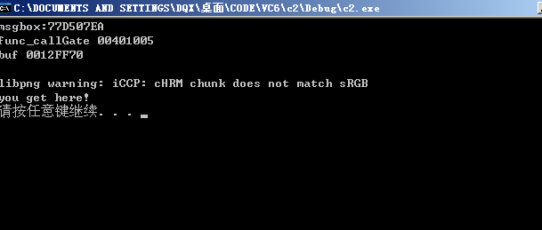

# 引入


4GB内存空间

大家可能都听说过，每个程序在运行时，操作系统都会为其分配一段4GB的内存空间。

但是我们的内存容量很可能最多只够为一个进程分配4GB的内存空间，如何做到为每个进程都分配呢？

实际上，进程被分配到的`4GB内存空间`只是虚拟的的内存空间，

并不是指真正意义上的物理内存，虚拟内存与物理内存之间有一层转换关系

ps: 那`4GB内存空间`是假的


看到的问题:

什么时候用大页..什么非分页内存交换什么的


# 地址


## 有效地址和线性地址


物理地址

以如下为例

```
MOV eax,dword ptr ds:[0x12345678]
```

其中，

0x12345678 是**有效地址**

ds.Base + 0x12345678 是**线性地址**

注意：当段[寄存器] 的Base为0时，**有效地址**=**线性地址**，

大多数时候都是如此；但也有特殊情况，比如**fs段寄存器**的Base不为0


对于4GB而言,,,应该可能的话,,我们能够直接操作的都是虚拟地址

而不是物理地址,

所以在书写的时候,,我们就不好搞的


## 物理地址


描述：

我们平时所用到的 **系统DLL**（动态链接库）存在于物理地址中，

当程序想要调用某个DLL时，DLL便会映射一份线性地址给程序，

这样程序就能够通过线性地址找到DLL的物理地址


关于实验,我没去做,就说一下自己的理解吧

首先打开一个notpad.exe,往里面写入内容

然后用CE附加这个进程,然后用Unicode的方式扫描扫描字符串,寻找该内容

最后就可以获取一个线性地址

然后我们要做的就是把线性地址转化到物理地址

这里我们以`10-10-12`分页的方式为例

<div  style="color:#FFB5C5;font-size:16px">
    tips:<br>
    10-10-12的意思,就是把一个32位的数据分为10bit,10bit,12bit<br>
	然后10个bit位大小最大是1023,<br>
    也即是1024个数据<br>
</div>


如果通过CE获取的线性地址是0x06765140

然后我们划分数据,把3个数据提取出来,因为最后的12bit刚好3个16进制位,就不用划分了

```
0    6    7    6    5    140
=
0000 0110 0111 0110 0101 140
=
0000011001		// 0x19
1101100101		// 0x365
140				// 12个比特位刚好三个字节
```

所以我们提取出来就是0x19,0x365,0x140,

这3个数据是什么? 其实也就是一些表的索引值


```
!process 0 0 寻找进程,然后获取DirBase 是一个进程的物理地址
```


假如我们获取的DirBase是`0bd1000`

然后我们

tips: `!dd`是查看物理地址

```
!dd 0bd1000 + 0x19*4 //成员是DWORd Arr1[xx]
```

然后可以获取一个4字节数据,把后3位16进制置为0(后面讲诉)

```
!dd 08F17000 + 0x365*4	//成员是DWORd Arr2[xx]
```

然后可以获取一个4字节数据,把后3位16进制置为0(后面讲诉)

```
!dd 1D075000 + 0x140  //成员是BYTE Arr3[xx]
```

这里面的很多东西到后面会详细的讲解


# 分页


## 简单介绍

CR3：唯一一个存储物理地址的寄存器。

在Windows中，页大小是4KB。在后期会接触到另一种页，有4MB大小，称为大页。

CR3里面存储的地址，指向的PDT，表中每个成员称为PDE,PTE指向的才是真正的`物理页`。

无论是PDE或者PTE，都是4字节。它的十六进制形式的后三位存储的是属性


然后说一下为什么0地址不能读写

因为0地址一般不会给他分配物理页

那么,如果我们手动给他分配物理页的话,是完全可以实现0地址的读写

关于0地址读写问题,我希望后面你自己写个小实验


寻找我们已经分配的物理页


```c
#include "stdafx.h"
 
int main(int argc, char* argv[])
{
    int x = 1;
 
    printf("x的地址:%x\n", &x);
 
    getchar();
 
    //向0地址写入数据
    *(int*)0 = 123;
 
    //读取0地址上的数据
    printf("0地址数据:%x\n", *(int*)0);
 
    return 0;
}
```


1.  PTE可以指向物理页，也可以没有指向物理页。
2.  多个PTE可以指向一同一个物理页。
3.  一个PTE只能指向一个物理页


设置分页的方式


在该是在xp的C:/booit.ini文件里面修改的


12-10-10分页,,,指的是4字节本被分割为这几个bit位


## 10-10-12 分页


这种分页方式基本上绝种了

只有xp才会用,基本上都是2-9-9-12分页的


10-10-12有什么含义呢?

CPU 规定xxx是4K,也就是4096个字节

10个bit位可以容纳1024个范围,,2^10=1024

同时2^10x2^10x2^12=4GB

本来0xffffffff~0就是4GB的范围,,,,


### PDE&PTE


很多PDE组成了一张PDT

很多PTE组成了一张PTT


一个进程有4GB

然后每一个进程的高2G都维护着自己的PDT和PTT,


ps: 名字很绕口


PTE会指向一个4k的区域

对于小页,才会有PTE,每一个PTE都指向4k

对于大页,,不会有PTE,,大页不再指向一个4KB,而是指向一个4MB


物理页大小都是4kb

一个页表能包含的物理页的页数是1024,,, 所以一个页表可以表示的范围就是1024*4kb=4mb

对于10-10-12分页的来说,他最多1024个页表,,,所以范围就是1024*4mb=4GB


像这种情况就是内存共享

不同的进程指向了相同的物理页

这个东西好像蛮有意思的


### 属性分析


属性位都是占3位数,也就是12bit

下面这是大端序的表示

物理页的属性: PDE&PTE,但又不是完全的与的关系


属性位占据12bit,也就是占据3个位

然后其它5位就是一个基址了


PDE:

```c++
|<------ 31~12------>|<------ 11~0 --------->| 比特
                     |b a 9 8 7 6 5 4 3 2 1 0| 
|--------------------|-|-|-|-|-|-|-|-|-|-|-|-| 占位
|<-------index------>| AVL |G|P|0|A|P|P|U|R|P| 属性
                             |S|   |C|W|/|/|
                                   |D|T|S|W|
```


PTE:

```c++
|<------ 31~12------>|<------ 11~0 --------->| 比特
                     |b a 9 8 7 6 5 4 3 2 1 0|
|--------------------|-|-|-|-|-|-|-|-|-|-|-|-| 占位
|<-------index------>| AVL |G|P|D|A|P|P|U|R|P| 属性
                             |A|   |C|W|/|/|
                             |T|   |D|T|S|W|
```


P位: 是否有效,,还有一个功能,,不太知道,,,以后去了解

R/W: 0是只读,1是可写


U/S: 普通用户和超级用户,,,1表示普通用户/超级用户都可以访问,,0表示只能超级用户(R0,R1,R2)访问

Hint: R3是否可以读写高2G,就是在这里对物理页做了一个限制😏


A: 是否有访问过

D: 是否被写过

G: 全局的位,,和TLb有关系,,后面会讲到的

P: 是否是大页,只对PDE有效

其实重要的没几位


P=0,就不需要访问了,因为无效的


PS/PAT=0,说明有PTE存在

PS/PAT=1,说明没PTE存在,那就直接读写内存,(所以没PTE对吧?)


比如虚拟地址`0x12345678`, 且PS=1

通过(10-22)拆分...就不用10-10-12拆分了

`10010001101000101011001111000`

10个bit位 获取index

22个bit位 直接就获取偏移

所以 index=0001001000=0x48

偏移=1101000101011001111000=0x345678

通过CR3找到PDT,

然后PDT[0x48]+0x345678就结束了,直接找到真实的东西

因为ps是第[7]个bit位,,所以当我们看见ps=1的时候,,,那么倒数第[1]位的值就是>=8的


PDE[1]: 31930867 -> '0b100001100111'

PTE [0]: 1adc4025 -> '0b000000100101'

为什么有2个属性? PDE,PTE?

首先我认为PTE是对PDE的精细控制

然后PTE是对整个4m的控制,PTE是对4k的控制

有些页的描述她没有PTE,比如大页,,所以为了兼容性,,,会用到PDE来控制属性

如果也有PTE存在,,则更加精细化控制


### 其它分析

每一个进程有4GB空间,,

但是不可能每一个进程映射到物理页就是4GB了吧

否则我们的内存是不够用的,,,那么的话,,到底是什么回事呢?


CR3其实也是申请的

> CR3来自哪里?


在0xC00的偏移处,,又指向了字节

0x473F2863->(取出后三位)->0x473F2000

CR3代表了一个进程的物理页相关东西吧

这个C00是一个比较特殊的地址


### 遍历问题


掌握两个地址,,就掌握了一个进程所有的物理内存读写权限


ps: PDI和PTI指的是index


访问页目录表: PDE

0xC0300000+DPI`*`4


访问页表的公式:

0xC0000000+DPI`*`4096+ PTI`*`4


以为C00可以找到自己,,,如果我循环绕3次,,当然也是可以找到地址的

比如虚拟地址0xC0300C00, 相当于PDI=0x300,PTI=0x300, 偏移是C00


关于那个地址怎么来的?

首先C0000000我们是知道的

在那里,系统默认存放了我们的CR3

然后PET是怎么来的,好像是下面这个公式推导来的


## 2-9-9-12 分页


xp配置

```c++
[boot loader]
timeout=30
default=multi(0)disk(0)rdisk(0)partition(1)\WINDOWS
[operating systems]
multi(0)disk(0)rdisk(0)partition(1)\WINDOWS="xp debug mode" /noexecute=optin /fastdetect /debug /debugport=com1 /baudrate=115200
multi(0)disk(0)rdisk(0)partition(1)\WINDOWS="xp normal" /noexecute=optin /fastdetect
```


为什么10-10-12分页的寻址范围是4GB?

因为(2^10 )x (2^10) x (2^12) = 2^32

所以就是2^32=4GB,,虽然看上去很像是废话,哈哈


在以前的10-10-12中

我们的结构都是4字节,后三位是属性,前5位是物理基地址

2-9-9-12分页,就是8字节了


对于10-10-12分页有特殊的2个地址,C0000000和C0300000

其中C0300000是C0000000计算推导出来的


对于2-9-9-12分页,,也是同理,,有2个特殊的地址,分别是C0000000

C0600000=C0000000/10000000x8m+C0000000

但是,因为是2-9-9-12,

所以不同于之前的,他有4张PDT表,,woc


2-9-9-12

9:决定了有512项

12决定了一个物理页范围仍然是4k

2决定了有4个PDT表


512*8=2m


这个东西和缓冲区溢出,然乎去执行有有关系的

比如我们的win7


DEP= data execute protect =数据执行保护


### 属性

属性位都和10-10-12是一样的


### 拆分一个地址虚拟地址


尝试程序如下


```
0x00424028
0x004240--=0b00000000010000100100
 
2-9-9如下:
00 = 0x00 PDTT	   (0x0*8)			
000000010 =0x2 PDT (0x2*8)
000100100 =0x4 PET (0x4*8)

```

然后操作如下

```
0: kd> !dq 0aac0380
# aac0380 00000000`208bc801 00000000`208bd801
# aac0390 00000000`2057e801 00000000`2097b801
# aac03a0 00000000`bae713c0 00000000`00000000
# aac03b0 00000000`00000000 00000000`00000000
# aac03c0 00000000`bae713e0 00000000`00000000
# aac03d0 00000000`00000000 00000000`00000000
# aac03e0 00000000`bae71400 00000000`00000000
# aac03f0 00000000`00000000 00000000`00000000
0: kd> !dq 0aac0380 + 0*8
# aac0380 00000000`208bc801 00000000`208bd801
# aac0390 00000000`2057e801 00000000`2097b801
# aac03a0 00000000`bae713c0 00000000`00000000
# aac03b0 00000000`00000000 00000000`00000000
# aac03c0 00000000`bae713e0 00000000`00000000
# aac03d0 00000000`00000000 00000000`00000000
# aac03e0 00000000`bae71400 00000000`00000000
# aac03f0 00000000`00000000 00000000`00000000
0: kd> !dq 208bc000+2*8
#208bc010 00000000`20414867 00000000`00000000
#208bc020 00000000`00000000 00000000`00000000
#208bc030 00000000`00000000 00000000`00000000
#208bc040 00000000`00000000 00000000`00000000
#208bc050 00000000`00000000 00000000`00000000
#208bc060 00000000`00000000 00000000`00000000
#208bc070 00000000`00000000 00000000`00000000
#208bc080 00000000`00000000 00000000`00000000
0: kd> !dq 20414000+24*8
#20414120 80000000`19327025 80000000`19268025
#20414130 80000000`20672867 80000000`1946a225
#20414140 00000000`00000000 80000000`206af867
#20414150 80000000`20631867 80000000`209b3867
#20414160 80000000`2052d825 00000000`00000000
#20414170 00000000`00000000 00000000`00000000
#20414180 00000000`00000000 00000000`00000000
#20414190 00000000`00000000 00000000`00000000
0: kd> !dq 19327000+28
#19327028 2069206f`6c6c6548 78716465`72206d61
#19327038 2e646d63`00000000 6d6d6f63`00657865
#19327048 006d6f63`2e646e61 74737973`0000632f
#19327058 00000000`632e6d65 646e616d`6d6f632a
#19327068 2728545f`203d2120 00000000`2927305c
#19327078 00434550`534d4f43 632e6674`6e697270
#19327088 6d726f66`00000000 554e203d`21207461
#19327098 36383369`00004c4c 2e707365`6b68635c
0: kd> !db 19327000+28
#19327028 48 65 6c 6c 6f 20 69 20-61 6d 20 72 65 64 71 78 Hello i am redqx
#19327038 00 00 00 00 63 6d 64 2e-65 78 65 00 63 6f 6d 6d ....cmd.exe.comm
#19327048 61 6e 64 2e 63 6f 6d 00-2f 63 00 00 73 79 73 74 and.com./c..syst
#19327058 65 6d 2e 63 00 00 00 00-2a 63 6f 6d 6d 61 6e 64 em.c....*command
#19327068 20 21 3d 20 5f 54 28 27-5c 30 27 29 00 00 00 00  != _T('\0')....
#19327078 43 4f 4d 53 50 45 43 00-70 72 69 6e 74 66 2e 63 COMSPEC.printf.c
#19327088 00 00 00 00 66 6f 72 6d-61 74 20 21 3d 20 4e 55 ....format != NU
#19327098 4c 4c 00 00 69 33 38 36-5c 63 68 6b 65 73 70 2e LL..i386\chkesp.

```

ps: 简直爽得不要不要,哈哈


### 验证0xC00


```
C0000000
11 = 0x03 
000000000
000000000
000000000000


C0600000
11 
000000011
000000000
000000000000
```


首先

```
0: kd> !dq 0aac0340
# aac0340 00000000`189e6801 00000000`18f27801
# aac0350 00000000`18ee8801 00000000`18f25801
# aac0360 00000000`194d4801 00000000`195d5801
# aac0370 00000000`19616801 00000000`19893801
# aac0380 00000000`1955e801 00000000`1971f801
# aac0390 00000000`196a0801 00000000`1965d801
# aac03a0 00000000`bae713c0 00000000`00000000
# aac03b0 00000000`00000000 00000000`00000000
0: kd> !dq 0aac0340 + 3*8
# aac0358 00000000`18f25801 00000000`194d4801
# aac0368 00000000`195d5801 00000000`19616801
# aac0378 00000000`19893801 00000000`1955e801
# aac0388 00000000`1971f801 00000000`196a0801
# aac0398 00000000`1965d801 00000000`bae713c0
# aac03a8 00000000`00000000 00000000`00000000
# aac03b8 00000000`00000000 00000000`bae713e0
# aac03c8 00000000`00000000 00000000`00000000
0: kd> !dq 18f25000 + 3*8
#18f25018 00000000`18f25863 00000000`18da9863
#18f25028 00000000`19cc0863 00000000`00000000
#18f25038 00000000`0a8d0963 00000000`0a8d1963
#18f25048 00000000`0a8d2963 00000000`0a8d3963
#18f25058 00000000`0a8d4963 00000000`0a8d5963
#18f25068 00000000`0a8d6963 00000000`0a8d7963
#18f25078 00000000`0a8d8963 00000000`0a899963
#18f25088 00000000`0a89a963 00000000`0a89b963
0: kd> !dq 18f25000 + 0
#18f25000 00000000`189e6863 00000000`18f27863
#18f25010 00000000`18ee8863 00000000`18f25863
#18f25020 00000000`18da9863 00000000`19cc0863
#18f25030 00000000`00000000 00000000`0a8d0963
#18f25040 00000000`0a8d1963 00000000`0a8d2963
#18f25050 00000000`0a8d3963 00000000`0a8d4963
#18f25060 00000000`0a8d5963 00000000`0a8d6963
#18f25070 00000000`0a8d7963 00000000`0a8d8963

```

可以看到我们并没有发现`0aac0340`开头的地址,难到我们找错了?

其实好像不是的

你可以发现`!dq 18f25000 + 0`

```
0: kd> !dq 18f25000 + 0
#18f25000 00000000`189e6863 00000000`18f27863
#18f25010 00000000`18ee8863 00000000`18f25863
```

和`!dq 0aac0340`

```
0: kd> !dq 0aac0340
# aac0340 00000000`189e6801 00000000`18f27801
# aac0350 00000000`18ee8801 00000000`18f25801
```

的数据是差不多一样的,但是他们的属性发生了变化,,上面的属性都是864,下面的属性都是801


然后


# TLB


TLB的应用场景?


一个CPU核对应了4个TLB, 他们分别用不同的用途


# 小实验


## 实验1 10-10-12分页


因为是10-10-12分页

所以就有了10bit,10bit的划分

因为20bit刚好是5个数字,,,所以这个特征还是比较好记住的

拆分字符串的虚拟地址

```c++
0042201C

0 0 4 2 2 | 0 1 C
0000 0000 0100 0010 0010
0000000001=1
0000100010=0x22

01C在后面还大有用途,在最后物理页的一个偏移
```


首先找到CR3

```c++
PROCESS 89c99b30  SessionId: 0  Cid: 0b90    Peb: 7ffdf000  ParentCid: 0b88
    DirBase: 31cbd000  ObjectTable: e28c7290  HandleCount:  84.
    Image: c2.exe
```


然后找PDE

```c++
0: kd> !dd 31cbd000
//这些都是PDT数组,也就2个
#31cbd000 319f1867 31930867 00000000 00000000
```


解释一下什么意思

```c++
0042201C

0 0 4 2 2
0000 0000 0100 0010 0010
0000000001=1 //index->1
0000100010=0x22 //index->0x22
```

因为是索引1

```c++
0: kd> !dd 31cbd000//CR3_value
//这些都是PDT数组,也就2个
#31cbd000 319f1867 31930867 00000000 00000000
```

所以取出成员 `31930867` ,去掉后3位,`3193000`

然后拿着 `31930000`  和索引0x22

```c++
0: kd> !dd 31930000 + 0x22*4
#31930088 1adc4025 1ad85025 2f349867 1af07225
#31930098 00000000 2f386867 31b88867 2f38b867
#319300a8 318c5825 00000000 00000000 00000000
#319300b8 00000000 00000000 00000000 00000000
#319300c8 00000000 00000000 00000000 00000000
#319300d8 00000000 00000000 00000000 00000000
#319300e8 00000000 00000000 00000000 00000000
#319300f8 00000000 00000000 00000000 00000000
```


然后拿到地址`1adc4025` ,去掉后三位`1adc400`

因为字符串的虚拟地址是`0042201C`,然后拿出后三位`01C`

凑在一起`1adc401C`

然后去查看地址

```c++
0: kd> !db 1adc401C
#1adc401c 72 65 64 71 78 00 00 00-70 61 75 73 65 00 00 00 redqx...pause...
#1adc402c 2e 5c 00 00 70 72 69 6e-74 66 2e 63 00 00 00 00 .\..printf.c....
#1adc403c 66 6f 72 6d 61 74 20 21-3d 20 4e 55 4c 4c 00 00 format != NULL..
#1adc404c 69 33 38 36 5c 63 68 6b-65 73 70 2e 63 00 00 00 i386\chkesp.c...
#1adc405c 00 00 00 00 54 68 65 20-76 61 6c 75 65 20 6f 66 ....The value of
#1adc406c 20 45 53 50 20 77 61 73-20 6e 6f 74 20 70 72 6f  ESP was not pro
#1adc407c 70 65 72 6c 79 20 73 61-76 65 64 20 61 63 72 6f perly saved acro
#1adc408c 73 73 20 61 20 66 75 6e-63 74 69 6f 6e 20 63 61 ss a function ca
```

可以看到目标字符串已经被找打了

然后我们修改一下

```c++
0: kd> !eb 1adc401c 52
0: kd> !db 1adc401C
#1adc401c 52 65 64 71 78 00 00 00-70 61 75 73 65 00 00 00 Redqx...pause...
#1adc402c 2e 5c 00 00 70 72 69 6e-74 66 2e 63 00 00 00 00 .\..printf.c....
#1adc403c 66 6f 72 6d 61 74 20 21-3d 20 4e 55 4c 4c 00 00 format != NULL..
#1adc404c 69 33 38 36 5c 63 68 6b-65 73 70 2e 63 00 00 00 i386\chkesp.c...
#1adc405c 00 00 00 00 54 68 65 20-76 61 6c 75 65 20 6f 66 ....The value of
#1adc406c 20 45 53 50 20 77 61 73-20 6e 6f 74 20 70 72 6f  ESP was not pro
#1adc407c 70 65 72 6c 79 20 73 61-76 65 64 20 61 63 72 6f perly saved acro
#1adc408c 73 73 20 61 20 66 75 6e-63 74 69 6f 6e 20 63 61 ss a function ca
```

然后继续运行程序

可以看到已经被我们修改了


## 实验2 call null


读取物理地址

```c++
2: kd> !dd a29fb000
#a29fb000 a2b5e867 a2c1d867 00000000 00000000
#a29fb010 00000000 00000000 00000000 00000000
#a29fb020 00000000 00000000 00000000 00000000
#a29fb030 00000000 00000000 00000000 00000000
#a29fb040 00000000 00000000 00000000 00000000
#a29fb050 00000000 00000000 00000000 00000000
#a29fb060 00000000 00000000 00000000 00000000
#a29fb070 00000000 00000000 00000000 00000000
2: kd> !dd a2b5e000
#a2b5e000 a41ee867 00000000 00000000 00000000
#a2b5e010 00000000 00000000 00000000 00000000
#a2b5e020 00000000 00000000 00000000 00000000
#a2b5e030 00000000 00000000 00000000 00000000
#a2b5e040 a2b1f867 00000000 00000000 00000000
#a2b5e050 00000000 00000000 00000000 00000000
#a2b5e060 00000000 00000000 00000000 00000000
#a2b5e070 00000000 00000000 00000000 00000000

```

读取虚拟内存

```c++
2: kd> dd c0300000
c0300000  a2b5e867 a2c1d867 00000000 00000000
c0300010  00000000 00000000 00000000 00000000
c0300020  00000000 00000000 00000000 00000000
c0300030  00000000 00000000 00000000 00000000
c0300040  00000000 00000000 00000000 00000000
c0300050  00000000 00000000 00000000 00000000
c0300060  00000000 00000000 00000000 00000000
c0300070  00000000 00000000 00000000 00000000
2: kd> dd c0000000
c0000000  a41ee867 00000000 00000000 00000000
c0000010  00000000 00000000 00000000 00000000
c0000020  00000000 00000000 00000000 00000000
c0000030  00000000 00000000 00000000 00000000
c0000040  a2b1f867 00000000 00000000 00000000
c0000050  00000000 00000000 00000000 00000000
c0000060  00000000 00000000 00000000 00000000
c0000070  00000000 00000000 00000000 00000000
```

奇怪的是,有些时候,我们`dd c0300000`和`dd c0000000`出来的是没有数据的,

也就是内存没有COMMIT


所以 

虚拟内存 c0300000  == PDE

虚拟内存 c0000000  == PTE

原理是什么?

```c++
c0300000:PDE
1100000000  >0x300*4=0xc00
1100000000  >>0x300*4=0xc00
000000000000

c0000000: PTE 
1100000000  >>0x300*4=0xc00
0000000000
000000000000
```


首先我们得提供2个索引值

找PDE,我们只需要一个的,,但是我们必须得提供2个,,,所以就再循环一次,,,再提供一个0xC00

找PTE,,我们需要提供2个,,一个是找到PDE,,然后拿出第一个,,所以第二个index就是0x000啦


然后是如何通过一个地址快速的获取物理页的地址

比如`00425A30`, 然后我就不知道了,,,cao


在windbg

在0048处,构造提权用的调用门

门是0040ec00`00081005, 其中func_callGate函数的地址就是00401005

然后保存运行即可


然后就是vc调试下面这个代码了

```c++
#include<stdio.h>
#include <stdlib.h>
#include <windows.h>


char shellcode[]={
	0x6a,0,
	0x6a,0,
	0x6a,0,
	0x6a,0,
	0xe8,0,0,0,0,
	0xc3,//megbox的返回地址
};
void _declspec(naked) func_callGate()
{ 
	__asm{
		
		int 3;

		push 0x30;
		pop fs;

		pushad;
		pushfd;

		//int 3;

		lea eax,shellcode;
		mov ebx,DWORD PTR DS:[0xc0300000];//拿到PDE[0]
		test ebx,ebx;
		je _gPDE;
        
_gPTE:
        
		shr eax,12;//为什么是12位?  
		and eax,0xfffff;//去除ff,置0
		shl eax,2;//x4

		add eax,0xc0000000;
		mov eax,[eax];
		mov DWORD PTR DS:[0xc0000000],eax;//PDE[0]=eax
		jmp _ret
	
_gPDE:
		shr eax,22;//为什么是22位?  
		and eax,0x3ff;//去除ff,置0
		shl eax,2;//x4
		 
		add eax,0xc0300000;//PDE[index]
		mov eax,[eax];
		mov DWORD PTR DS:[0xc0300000],eax;//PDE[0]=eax

_ret:

		popfd;
		popad;

		retf;
	}
	
}
int main()
{
	DWORD funcAddr=(DWORD)MessageBoxA;
	DWORD offset1=(DWORD)shellcode&0xfff;
	char buf[]={0,0,0,0,0x48,0x00};
	*(DWORD*)&shellcode[9]=funcAddr-(13+offset1);//0ffset+13d的意思是shellcode的最后返回地址
	printf("msgbox:%p\nfunc_callGate %p\nbuf %p\n",MessageBoxA,func_callGate,buf);
	system("pause");
	__asm{
		call fword ptr buf;
		push 0x3b;
		pop fs;
		mov eax,offset1;
		call eax;
	}

	printf("you get here!\n");
	system("pause");
	return 0;
}

```


关于call 调用门提权什么的,,是之前章节出现的

ps: 之前在章节中,都没有搞懂,,,别骂了




写入PDE[0]=shellcode


其实我们可以思考一个问题

那就是shellcode没有设置可执行权限

然后依然执行了我们的shellcode

所以只是一个很危险的东西


## 逆向 10-10-12 MmIsAddressValid()


分析样本在电脑的`C:\Windows\System32\ntoskrnl.exe`会有的

然后我们需要复制出来,,,然后分析的


在实验2中,,我就遇到了一个问题

那就是给一个虚拟地址,,然后直接获取它的物理页的方法,,没看懂

```assembly
shr eax,12;//shellcode地址抹去后3位 
and eax,0xfffff;//如果是负数右移,就把ff置为00
shl eax,2;//索引值x4

add eax,0xc0000000; //
mov eax,[eax];
mov DWORD PTR DS:[0xc0000000],eax;// PTE[0]=shellcode的物理页
```


然乎本次逆向的代码

```assembly
shr     eax, 20         ; 10-10-12分页,这里右移20位,取出PDI,PTI,本来是右移22,然后左移2的
mov     edx, 0FFCh      ; 111111111100,因为是一次性右移20,但是得保证效果一样,所以就把最后2位置空
and     eax, edx
sub     eax, 3FD00000h  ; 减去一个负数,相当于加上这里的正数C0300000
mov     eax, [eax]      ; 然后直接取出了物理页基址
```


我只能说,,大概的分析结果如下


IDA反汇编如下

```c++
// 属性位是一个字节的
BOOLEAN __stdcall MmIsAddressValid(PVOID VirtualAddress)
{
  int v1; // eax
  _DWORD *v2; // eax
  BOOLEAN result; // al

  v1 = *(_DWORD *)((((unsigned int)VirtualAddress >> 20) & 0xFFC) - 0x3FD00000);
  result = 0;
  if ( (v1 & 1) != 0 )
  {
    if ( (v1 & 0x80u) != 0 )
      return 1;
    v2 = (_DWORD *)((((unsigned int)VirtualAddress >> 10) & 0x3FFFFC) - 0x40000000);
    if ( (*v2 & 1) != 0
      && ((*v2 & 0x80u) == 0 || (*(_DWORD *)((((unsigned int)VirtualAddress >> 10) & 0xFFC) - 0x3FD00000) & 0x81) != 0x81) )
    {
      return 1;
    }
  }
  return result;
}
```

