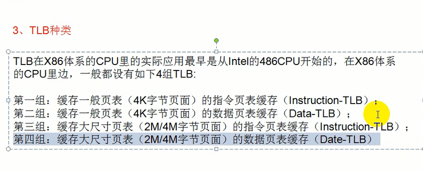

# TLB


TLB的应用场景?

一个CPU核对应了4个TLB, 他们分别用不同的用途


对一个地址重复的访问,,然后为了提高效率,,做的一个缓冲机制




学TLB有什么用?

1), 理解内核

2), 在代码校验上


说过实话,,这节课没看懂


ps:在0x48那里开一个调用门

```c++
#include <stdio.h>
#include <stdlib.h>
#include <Windows.h>

unsigned int g_value=0;

__declspec(naked) void test()
{

	//2-9-9-12 page-format
	__asm
	{
		push 0x30;
		pop fs;
		
		pushad;
		pushfd;

		mov eax,0x600000;
		mov ebx,0xc0000000;// 2 9 9 12
		shr eax,0x9;//?? 反正是不明白为什么要移动9位的
		and eax,0x7ffff8;//
		
		//find pte
		mov edx,eax;
		add edx,ebx;
		mov edx,dword ptr ds:[edx];//edx is va
		or edx,0x100;
		mov dword ptr ds:[ebx],edx;
		

		mov dword ptr ds:[0],0x12345678;

		mov eax,0x700000;
		mov ebx,0xc0000000;
		shr eax,0x9;
		and eax,0x7ffff8;
		
		//find pte
		mov edx,eax;
		add edx,ebx;
		mov edx,dword ptr ds:[edx];
		mov dword ptr ds:[ebx],edx;
	
		//刷新TLB缓存
		mov eax,cr3;
		mov cr3,eax;

		//刷新全局的
		invlpg dword ptr ds:[0];
		
		mov eax,dword ptr ds:[0];
		mov g_value,eax;


		popfd;
		popad;

		retf;
	}
}


int main(int agrc,char * agrv[])
{
	char buf[]={0,0,0,0,0x48,0};
	
	void * p1 = VirtualAlloc((void*)0x600000,0x1000,MEM_COMMIT | MEM_RESERVE ,PAGE_EXECUTE_READWRITE);
	void * p2 = VirtualAlloc((void*)0x700000,0x1000,MEM_COMMIT | MEM_RESERVE ,PAGE_EXECUTE_READWRITE);
	*((unsigned int *)p1)=0x100;//write num to mem
	*((unsigned int *)p2)=0x200;//write num to mem
	printf("redqx  %X\n",test);
	__asm
	{
		call fword ptr buf;
		push 0x3b;
		pop fs;
	};
 	printf("redqx %X\n",g_value);
	VirtualFree(p1,0x1000,MEM_COMMIT | MEM_RESERVE);
	VirtualFree(p2,0x1000,MEM_COMMIT | MEM_RESERVE);

	return 0;
}

```


NTSTATUS KdEnableDebugger(void)

NTSTATUS KdDisableDebugger(void)

