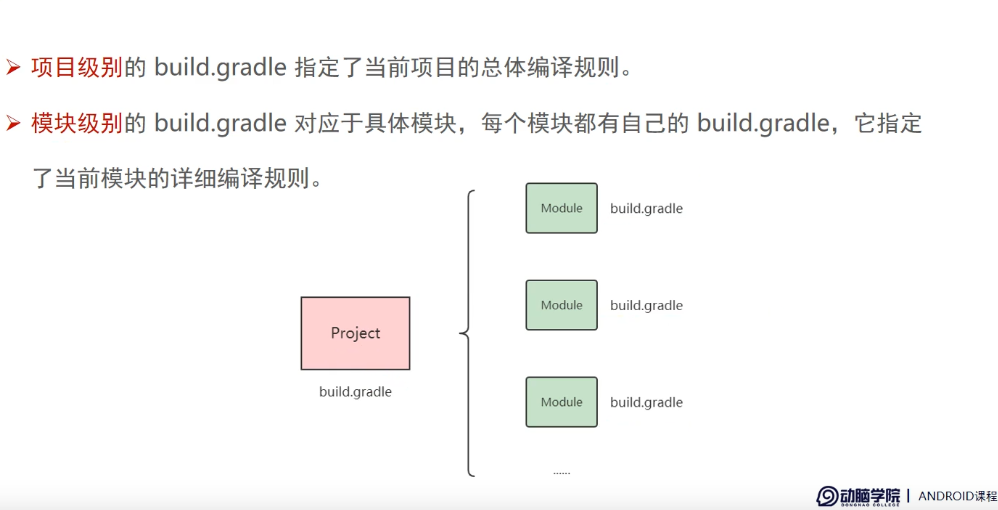

# helloworld


新建一个工程,然后选择 


然后


注意语言选Java

然后其他的,应该默认即可吧


然后项目会加载的一会儿时间的

一般情况如下,,,,那个app是绿色的


如果不是,那只能自求多福了,,,直接崩溃


在调试的时候,我们希望在控制台打印出一些东西,这功能和debugview差不多吧

于是就可以在源代码中写入一下东西


```java
package com.example.myapplication;

import androidx.appcompat.app.AppCompatActivity;

import android.os.Bundle;
import android.util.Log;

public class MainActivity extends AppCompatActivity {

    @Override
    protected void onCreate(Bundle savedInstanceState) {
        super.onCreate(savedInstanceState);
        setContentView(R.layout.activity_main);
        Log.d("tag1","我启动啦");
    }
}
```


# 介绍


安卓是基于Linux

但是又不等同于Linux

所以apk不能直接在Linux上运行的


PC和apk的调试通信是通过abd.exe这个工具,

adb的全称" Android Debug Bridge


安卓开发也会用到C/C++, 那个时候,其实写出来的我感觉更像是一个接口

写好了,然后供调用,,这个东西叫NDK


> 安卓开发 项目结构


AndroidManifest.xml:  App运行的配置文件


res目录: 存放图标,图片,...


然后这是属性配置


Project的配置是全局的

模块的配置只对模块有效


Gradle 其实就想是一个 编译链接的工具,负责打包,部署,发布


woc,,,这个东西就想是clang,可以提供混淆


还是说说项目配置


模块的属性配置是精细化的,项目的属性配置是统一的




# 基本控件的使用


## 文本控件


可以设置颜色,大小,内容

 

如何通过代码去实现呢?

```java
public class MainActivity extends AppCompatActivity {

    @Override
    protected void onCreate(Bundle savedInstanceState) {
        super.onCreate(savedInstanceState);
        setContentView(R.layout.activity_main);
        TextView txt=findViewById(R.id.tv_demo1);
        txt.setText("D0g3.21.Reverse.redqx");//设置文本内容啦
        Log.d("tag1","我启动啦");
    }
}
```


设置字体大小?


```c++
public class MainActivity extends AppCompatActivity {

    @Override
    protected void onCreate(Bundle savedInstanceState) {
        super.onCreate(savedInstanceState);
        setContentView(R.layout.activity_main);
        TextView txt=findViewById(R.id.tv_demo1);
        txt.setText("D0g3.21.Reverse.redqx");
        txt.setTextSize(32);
        Log.d("tag1","我启动啦");
    }
}
```


然后我们来设置字体的颜色

在java代码中设置

```java
public class MainActivity extends AppCompatActivity {

    @Override
    protected void onCreate(Bundle savedInstanceState) {
        super.onCreate(savedInstanceState);
        setContentView(R.layout.activity_main);
        TextView txt=findViewById(R.id.tv_demo1);
        txt.setText("D0g3.21.Reverse.redqx");
        txt.setTextSize(32);
        txt.setTextColor(Color.GREEN);
        Log.d("tag1","我启动啦");
    }
}
```


然后我们还可以设置字体的背景颜色,而不是整体的背景眼色


 在java中设置

```java
public class MainActivity extends AppCompatActivity {

    @Override
    protected void onCreate(Bundle savedInstanceState) {
        super.onCreate(savedInstanceState);
        setContentView(R.layout.activity_main);
        TextView txt=findViewById(R.id.tv_demo1);
        txt.setText("D0g3.21.Reverse.redqx");
        txt.setTextSize(32);
        txt.setTextColor(Color.GREEN);
        txt.setBackgroundColor(Color.BLACK);
        Log.d("tag1","我启动啦");
    }
}
```


## 视图


感觉看上去很无趣,,所以烦躁的草草跳过了


## 布局


其实很多布局都是基于XML的设置

感觉就是是学HTML一样


布局有很多,前面几种布局豆草草跳过


记录了一下滚动布局


水平滚动是 ` <HorizontalScrollView`

竖直滚动是 `<ScrollView`


```xml
<?xml version="1.0" encoding="utf-8"?>
<LinearLayout xmlns:android="http://schemas.android.com/apk/res/android"

    android:layout_width="match_parent"
    android:layout_height="match_parent"
    android:orientation="vertical">

    <HorizontalScrollView
        android:layout_width="wrap_content"
        android:layout_height="200dp">

        <LinearLayout
            android:layout_width="wrap_content"
            android:layout_height="match_parent"
            android:orientation="horizontal">

            <View
                android:layout_width="300dp"
                android:layout_height="match_parent"
                android:background="#ffff00">

            </View>


            <View
                android:layout_width="300dp"
                android:layout_height="match_parent"
                android:background="#aaffff">

            </View>

        </LinearLayout>

    </HorizontalScrollView>

    <ScrollView
        android:layout_width="match_parent"
        android:layout_height="wrap_content">

        <LinearLayout
            android:layout_width="match_parent"
            android:layout_height="400dp"
            android:orientation="vertical">

            <View
                android:layout_width="match_parent"
                android:layout_height="400dp"
                android:background="#aaffff"/>

            <View
                android:layout_width="match_parent"
                android:layout_height="400dp"
                android:background="#ffff00"/>
            
        </LinearLayout>

    </ScrollView>


</LinearLayout>
```


## Button

可能这才是基于消息机制最好玩的那个吧

添加一个Button,直接鼠标拖


拖了之后,XML文档会自动生成Button的大小

```c++
    <Button
        android:id="@+id/button1"
        android:layout_width="match_parent"
        android:layout_height="wrap_content"
        android:text="你有本事按一下试试" />
```


### 单击按钮事件


消息处理函数是这样设置的

```java
        Button b1= findViewById(R.id.button1);
        b1.setOnClickListener(new listen2b1(txt1));
```

参数是一个 `OnClickListener`的类吧


然后实现一个消息处理函数大概如下

```java
package com.example.demo;

import androidx.appcompat.app.AppCompatActivity;

import android.os.Bundle;
import android.view.View;
import android.widget.Button;
import android.widget.TextView;
import java.text.SimpleDateFormat;
import java.util.Date;

public class MainActivity extends AppCompatActivity {

    private TextView txt1;

    @Override
    protected void onCreate(Bundle savedInstanceState) {
        super.onCreate(savedInstanceState);
        setContentView(R.layout.activity_main);

        TextView txt1= findViewById(R.id.textView1);
        Button b1= findViewById(R.id.button1);
        b1.setOnClickListener(new listen2b1(txt1));

    }
    static class listen2b1 implements View.OnClickListener{
        private final TextView txt1;
        public listen2b1(TextView xx){
            this.txt1=xx;
        }
        public void onClick(View v){
            String xx=String.format("现在是北京时间: %s",getTime());
            txt1.setText(xx);
        }
    }
    static String getTime(){
        // 获取当前时间
        Date date = new Date();

        // 指定日期格式
        SimpleDateFormat dateFormat = new SimpleDateFormat("yyyy-MM-dd HH:mm:ss");

        // 将日期转换为指定格式的字符串
        String currentTime = dateFormat.format(date);

        // 输出结果
        return  currentTime;
    }
}
```


是实现的效果就是点击按钮,就刷新时间显示


### 长时间按下


使用`b1.setOnLongClickListener`

代码如下


XML

```xml
<?xml version="1.0" encoding="utf-8"?>
<LinearLayout xmlns:android="http://schemas.android.com/apk/res/android"
    xmlns:app="http://schemas.android.com/apk/res-auto"
    xmlns:tools="http://schemas.android.com/tools"
    android:layout_width="match_parent"
    android:layout_height="match_parent"
    tools:context=".MainActivity"
    android:orientation="vertical">


    <Button
        android:id="@+id/button1"
        android:layout_width="match_parent"
        android:layout_height="wrap_content"
        android:text="你有本事按一下试试" />

    <TextView
        android:id="@+id/textView1"
        android:layout_width="match_parent"
        android:layout_height="wrap_content"
        android:background="#000000"
        android:gravity="center"
        android:padding="20px"
        android:text="不要眨眼睛"
        android:textColor="#06F110"
        android:textSize="16sp" />
    <TextView
        android:id="@+id/textView2"
        android:layout_width="match_parent"
        android:layout_height="wrap_content"
        android:background="#000000"
        android:gravity="center"
        android:padding="20px"
        android:text="不要眨眼睛"
        android:textColor="#06F110"
        android:textSize="16sp" />

</LinearLayout>
```


```java
package com.example.demo;

import androidx.appcompat.app.AppCompatActivity;

import android.os.Bundle;
import android.view.View;
import android.widget.Button;
import android.widget.TextView;
import java.text.SimpleDateFormat;
import java.util.Date;

public class MainActivity extends AppCompatActivity {

    private TextView txt1;

    @Override
    protected void onCreate(Bundle savedInstanceState) {
        super.onCreate(savedInstanceState);
        setContentView(R.layout.activity_main);

        TextView txt1= findViewById(R.id.textView1);
        TextView txt2= findViewById(R.id.textView2);
        Button b1= findViewById(R.id.button1);
        b1.setOnClickListener(v->{
            String xx=String.format("现在是广东时间: %s",getTime());
            txt1.setText(xx);
            return ;
        });
        b1.setOnLongClickListener(v->{
            String xx=String.format("现在是四川时间: %s",getTime());
            txt2.setText(xx);
            return true;
        });
    }
    static String getTime(){
        // 获取当前时间
        Date date = new Date();

        // 指定日期格式
        SimpleDateFormat dateFormat = new SimpleDateFormat("yyyy-MM-dd HH:mm:ss");

        // 将日期转换为指定格式的字符串
        String currentTime = dateFormat.format(date);

        // 输出结果
        return  currentTime;
    }
}
```


 


### 禁用和恢复


启动就是`b2.setEnabled(true);`

禁用就是`b2.setEnabled(false);`


实验

```java
package com.example.demo;

import androidx.appcompat.app.AppCompatActivity;

import android.graphics.Color;
import android.os.Bundle;
import android.view.View;
import android.widget.Button;
import android.widget.TextView;
import java.text.SimpleDateFormat;
import java.util.Date;

public class MainActivity extends AppCompatActivity implements View.OnClickListener{

    private  Button b2;
    private TextView textView0;
    @Override
    protected void onCreate(Bundle savedInstanceState) {
        super.onCreate(savedInstanceState);
        setContentView(R.layout.activity_main);

        textView0= findViewById(R.id.textView0);
        Button b0= findViewById(R.id.button0);
        Button b1= findViewById(R.id.button1);
        b2= findViewById(R.id.button2);

        b0.setOnClickListener(this);
        b1.setOnClickListener(this);
        b2.setOnClickListener(this);

    }
    public void onClick(View v){
        int xx=v.getId();
        if(xx==R.id.button0) {
            this.b2.setEnabled(true);
            this.b2.setTextColor(Color.BLACK);
        }
        else if (xx==R.id.button1) {
            this.b2.setEnabled(false);
            this.b2.setTextColor(Color.GRAY);
        }else if(xx==R.id.button2){
            textView0.setText(getTime());
        }
    }
    static String getTime(){
        // 获取当前时间
        Date date = new Date();

        // 指定日期格式
        SimpleDateFormat dateFormat = new SimpleDateFormat("yyyy-MM-dd HH:mm:ss");

        // 将日期转换为指定格式的字符串
        String currentTime = dateFormat.format(date);

        // 输出结果
        return  currentTime;
    }
}
```


xml

```xml
<?xml version="1.0" encoding="utf-8"?>
<LinearLayout xmlns:android="http://schemas.android.com/apk/res/android"
    xmlns:app="http://schemas.android.com/apk/res-auto"
    xmlns:tools="http://schemas.android.com/tools"
    android:layout_width="match_parent"
    android:layout_height="match_parent"
    tools:context=".MainActivity"
    android:orientation="vertical">

    <LinearLayout
        android:layout_width="match_parent"
        android:layout_height="wrap_content"
        android:orientation="horizontal">

        <Button
            android:id="@+id/button0"
            android:layout_weight="1"
            android:layout_width="0dp"
            android:layout_height="wrap_content"
            android:text="启用" />
        <Button
            android:id="@+id/button1"
            android:layout_weight="1"
            android:layout_width="0dp"
            android:layout_height="wrap_content"
            android:text="禁用" />
    </LinearLayout>
    <Button
        android:id="@+id/button2"
        android:layout_width="match_parent"
        android:layout_height="wrap_content"
        android:text="按一下看看"/>
    <TextView
        android:id="@+id/textView0"
        android:layout_width="match_parent"
        android:layout_height="wrap_content"
        android:background="#000000"
        android:gravity="center"
        android:padding="20px"
        android:text="我准备显示时间.."
        android:textColor="#06F110"/>

</LinearLayout>
```


## ImageView


关于存入图片的话


我们可以找到res目录,在draw的目录下, 手动的cv一个图片

或者我们复制一个图片,对着res的某个目录,右键粘贴


然后就是把图片引用到代码中

ps: 最离谱的是, 图片的名字只能是0-9和小写a-z,

在xml中显示图片

```xml
<?xml version="1.0" encoding="utf-8"?>
<LinearLayout xmlns:android="http://schemas.android.com/apk/res/android"

    xmlns:app="http://schemas.android.com/apk/res-auto"
    xmlns:tools="http://schemas.android.com/tools"
    android:layout_width="match_parent"
    android:layout_height="match_parent"
    android:orientation="vertical">
    
    <ImageView
        android:id="@+id/iv_1"
        android:layout_width="match_parent"
        android:layout_height="200dp"
        android:layout_marginTop="10dp"
        android:src="@drawable/wus1"/>

    <ImageView
        android:id="@+id/imageView"
        android:layout_width="match_parent"
        android:layout_height="wrap_content"
        tools:srcCompat="@tools:sample/avatars" />


</LinearLayout>
```


图片1的引用是` android:src="@drawable/wus1"`

图片2的引用是 `tools:srcCompat="@tools:sample/avatars"`


效果如下,哈哈,我放了一个涩图

露出来的部分被我搞点了


当然我们也可以在代码中实现图片的设置

```java
package com.example.demo2;

import androidx.appcompat.app.AppCompatActivity;

import android.os.Bundle;
import android.widget.ImageView;

public class MainActivity extends AppCompatActivity {

    @Override
    protected void onCreate(Bundle savedInstanceState) {
        super.onCreate(savedInstanceState);
        setContentView(R.layout.activity_main);
        
        ImageView demo=findViewById(R.id.iv_1);
        demo.setImageResource(R.drawable.test);
    }
}
```


可以看到,一样的显示出来了


我们同时也可以修改图片的显示方式

通过属性


比如

```xml
    <ImageView
        android:id="@+id/iv_1"
        android:layout_width="match_parent"
        android:layout_height="200dp"
        android:layout_marginTop="10dp"
        android:scaleType="fitXY"/>
```

或者

```java
package com.example.demo2;

import androidx.appcompat.app.AppCompatActivity;

import android.os.Bundle;
import android.widget.ImageView;

public class MainActivity extends AppCompatActivity {

    @Override
    protected void onCreate(Bundle savedInstanceState) {
        super.onCreate(savedInstanceState);
        setContentView(R.layout.activity_main);

        ImageView demo=findViewById(R.id.iv_1);
        demo.setImageResource(R.drawable.test);
        demo.setScaleType(ImageView.ScaleType.CENTER);
    }
}
```


 

### ImageButton


  
