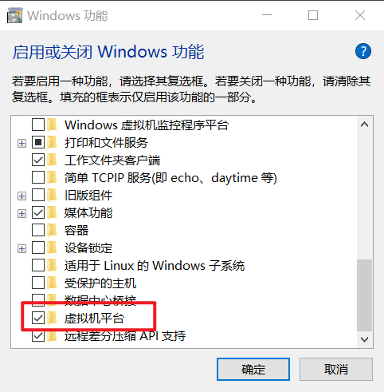
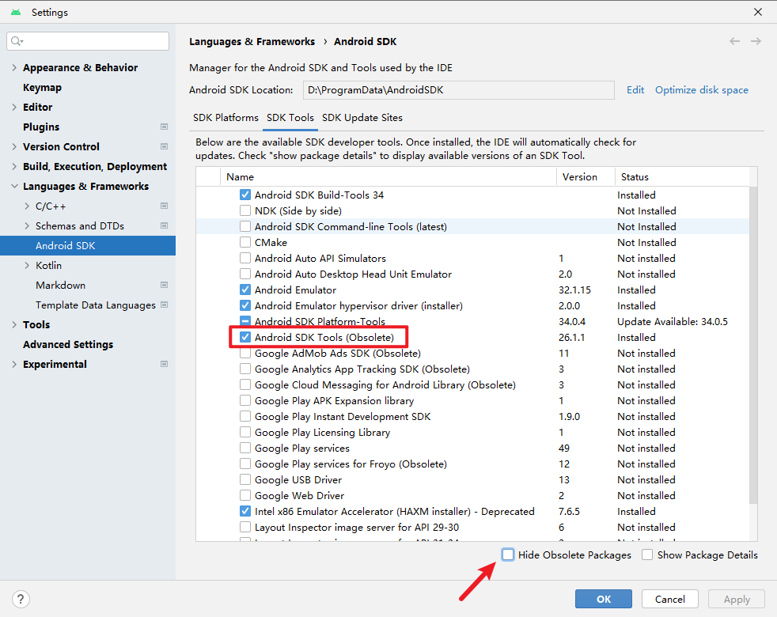
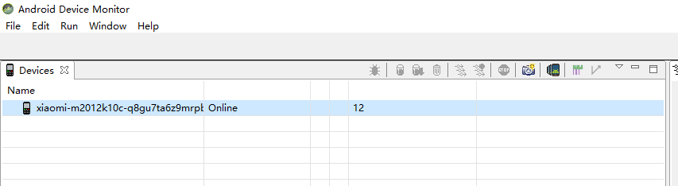

# 准备


# ADB.exe说明

官网说明书: https://developer.android.google.cn/studio/command-line/adb?hl=zh-cn

这东西应该是SDK自带的

类似于WDK自带的windbg.exe

adb.exe 负责安装apk,连接虚拟机吧

如果要单独下载的话: https://developer.android.google.cn/studio/releases/platform-tools?hl=zh-cn


连接和断开

```
adb connect 127.0.0.1:58526
adb disconnect localhost:5554
```


打开shell环境

```c++
>adb shell
```

如果要退出shell环境的话,,就输入exit或者ctrl d


> 进入root

在进入adb shell后

我们`su`一下,,就是切换到root环境

然后可能会


发起一个root的请求

然后就同意请求

然后就可以su root成功了


apk安装 

```c++
adb install apk_path...
Performing Streamed Install
Success
```


文件上传

```
adb push 上传文件的路径 上传的目标目录
```

文件下载

```
adb pull 下载的文件路径 下载的目标目录
```

ps: 期间可能遇到权限问题,比如无法读,,,那就会下载失败,,修改为可读权限即可


adb连接安卓虚拟机

连接WSA

```
adb connect 127.0.0.1:58526
```


连接夜神模拟器

```
adb connect 127.0.0.1:62001
```


mmuu模拟器

```
adb connect 127.0.0.1:16384
```

adb连接真机

```
adb devices
```


# 模拟器

别折腾模拟器了,,

我最后还是选择了真机

真机不仅仅运行快,,,还不会出现乱七八糟莫名其妙的环境搭建问题


## WSA 

官网下载链接 https://github.com/MustardChef/WSABuilds/releases

https://github.com/A-JiuA/WSAOnWin10

期间注意关闭杀软,,开启Windows的某个功能




同时呢,,这个好像还得用到hypv的功能

这个功能貌似和夜神模拟器不可以共存


## 夜神


...


# jdax 反汇编

官网下载链接 https://github.com/skylot/jadx/releases


# DDMS 显示监听端口

这个东西在哪里下载?

在Android SDK里面,,最新版本也可以找到,,只不过被隐藏起来




下载之后在`‪xxx\AndroidSDK\tools\monitor.bat`可以找到

点击`monitor.bat`不出意外是不可以运行的

它需要一个JAVA8的环境

配置好后,,就可以使用`monitor.bat`了

使用它之前,,貌似要先用adb去连接一个手机或者模拟器

然后打开`monitor.bat`就会显示了




```
ANDROID_HOME=/Users/chunyu/Library/Android/sdk
export PATH=$PATH:$ANDROID_HOME/tools
export PATH=$PATH:$ANDROID_HOME/platform-tools
```


# 真机投屏到电脑


参考文章

```
https://blog.csdn.net/was172/article/details/99705855
```


直接连接就可以了,运行`scrcpy.exe`

```
D:\dqx\work\Reverse\Android\scrcpy\data>scrcpy.exe
scrcpy 2.1.1 <https://github.com/Genymobile/scrcpy>
INFO: ADB device found:
INFO:     -->   (usb)      q8gu7ta6z9mrpbro            device  M2012K10C
D:\dqx\work\Reverse\Android\scrcpy\data\scrcpy-server: 1 file pushed, 0 skipped. 127.7 MB/s (56995 bytes in 0.000s)
[server] INFO: Device: [Xiaomi] Redmi M2012K10C (Android 12)
INFO: Renderer: direct3d
INFO: Texture: 1080x2400
```


