# 调试so

参考文章

```
https://mp.weixin.qq.com/s/cxwz1oVS0mah9ecOqvqa5w
https://www.cnblogs.com/ddms/p/8820044.html
```


ps: 我用模拟器去调试so....折腾了我很久,,,莫名其妙出现了很多难以理解的问题,,最后用真机轻轻松松完成


分为2种方法去调试的

都得是在root下搞定? 可能吧,,,反正我的真机已久root了

首先`android_server64`和`android_server` 得放到手机的一个路径里,

比如默认是`/data/local/tmp`下

然后给他们可以执行的权限

然后我们还得准备jdb.exe, DDMS

jdb在JAVA里面有,,在AndroidStudio里面也有`xxx\Android\Android Studio\jbr\bin\jdb.exe`

比如我们去调试64位的

调试x86的好像要方便些吧....而且网上的资料差不多都是调试x86的


1), 第一步,开启server

```
ares:/data/local/tmp/debug # ./android_server64
IDA Android 64-bit remote debug server(ST) v7.6.27. Hex-Rays (c) 2004-2021
Listening on 0.0.0.0:23946...
2023-10-18 14:55:49 [1] Accepting connection from 127.0.0.1...
```


2), 第二步, 转发端口,,,

为什么要转发端口?不知道

但是通过这个操作后,,我好像可以在IDA里面输入127.0.0.1:23946去找到手机的进程

```
adb forward tcp:23946 tcp:23946
```


然后就是开始分流了

## Launch

启动模式去调试一个so,,那么我们就可以选择断在elf的init那里


指令如下

```
adb shell am start -D -n 包名/包名.入口Activity
```

然后手机会出现wait for debugger

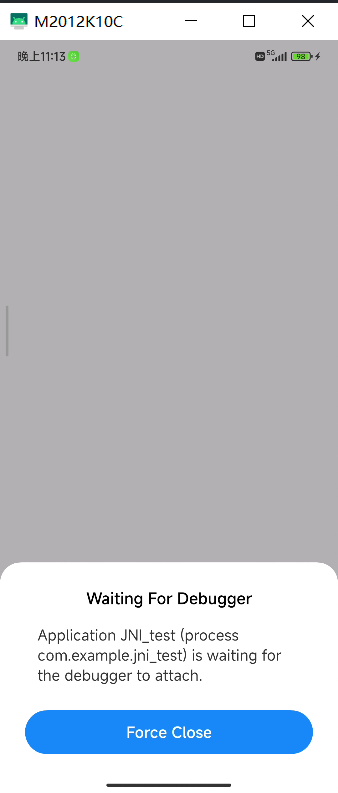


注意,,,不是所有的apk都支持以调试模式启动自己

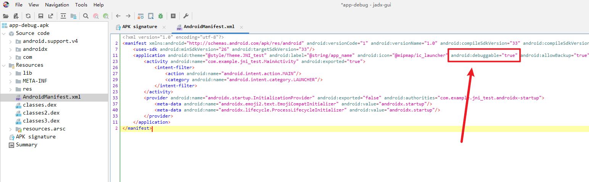

只有`android:debuggable="true"`的apk才可以支持被调试模式启动

如果没有这个东西,,,我们去调试的话,,,应该是无法断下来的,,不管下了多少断点,,,都会跑飞的

ps: 如何给apk添加`android:debuggable="true"`?


然后打开IDA,,,

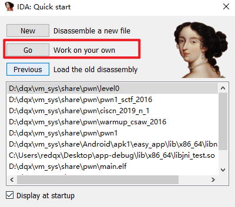

然后

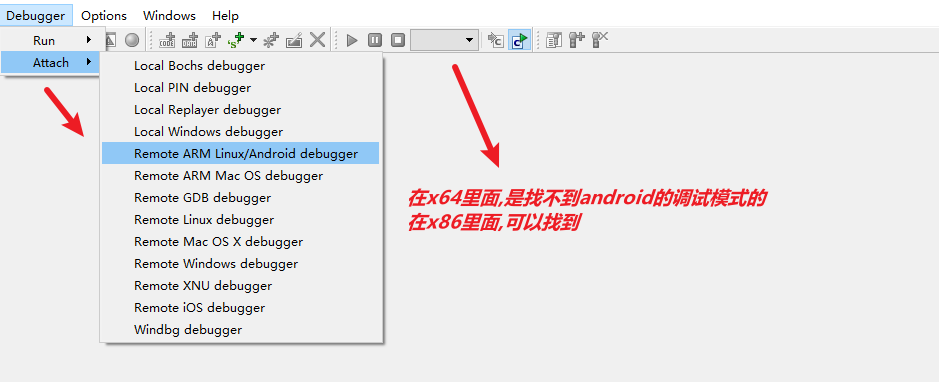


然后

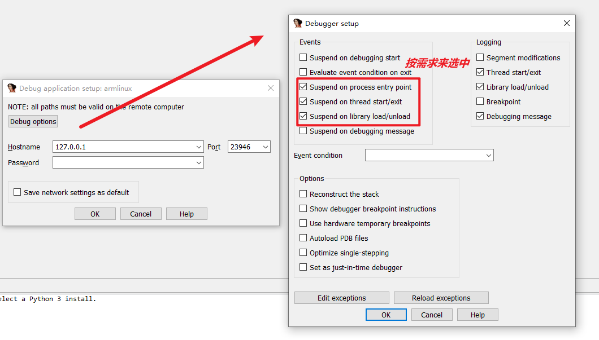


然后选择你要调试的进程

ps: 在前面我们已久通过adb以调试模式启动了apk了,`adb shell am start -D -n 包名/包名.入口Activity`,

所以这里可以找到`等待被调试的目标进程`


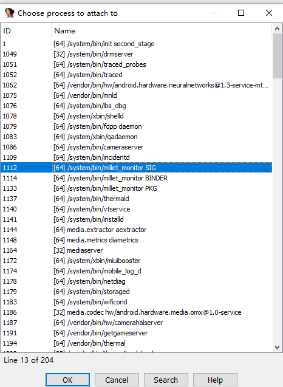

选择并确认后

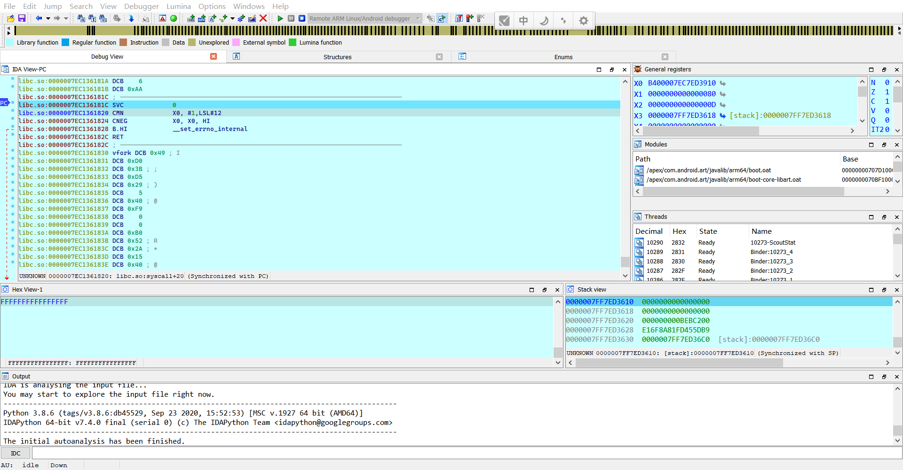

然后来到我们的DDMS

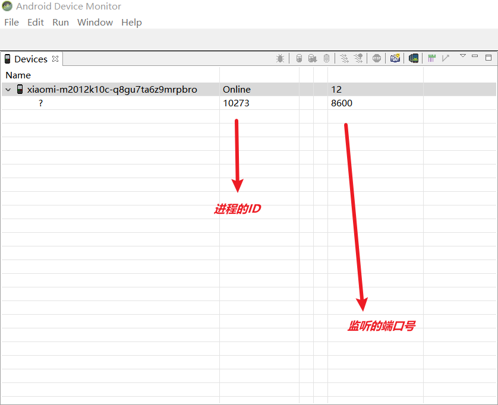

然后找xxx下一个目标断点

然后IDA那里F9, jdb开始run

```
jdb -connect com.sun.jdi.SocketAttach:hostname=127.0.0.1,port=8600
```


然后就g.....


## Attach


这个比上面那个要方便

即使没有debug的属性,,貌似也是可以附加的

在手机上,我们先运行目标程序

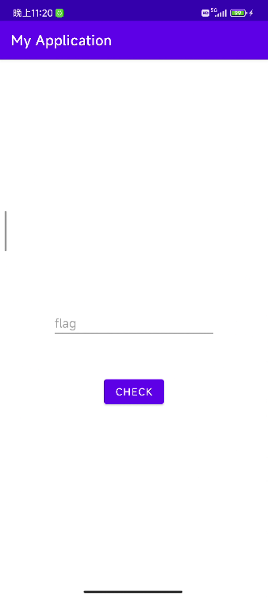


然后IDA附加

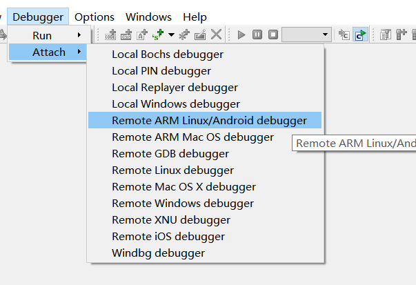


选择目标进程

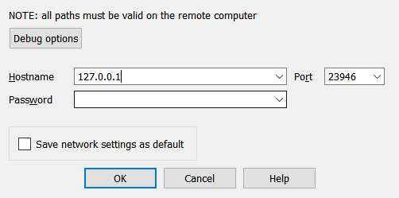

,点击确定,

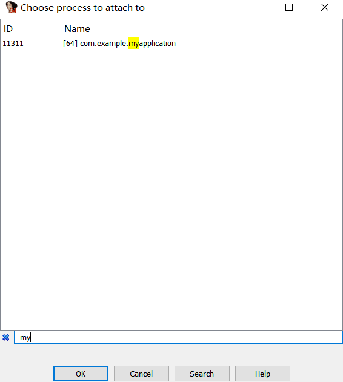

然后就断下来了

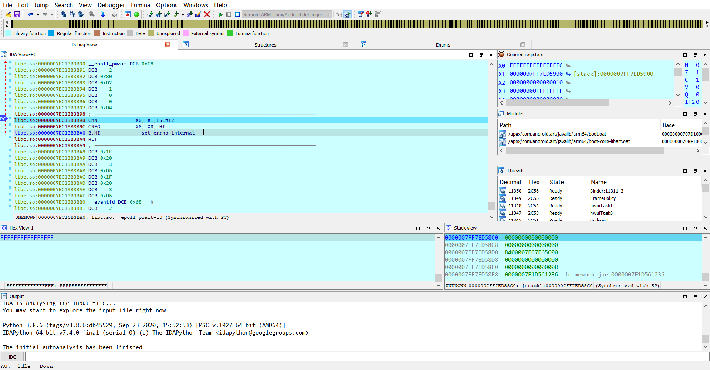

然后下断点

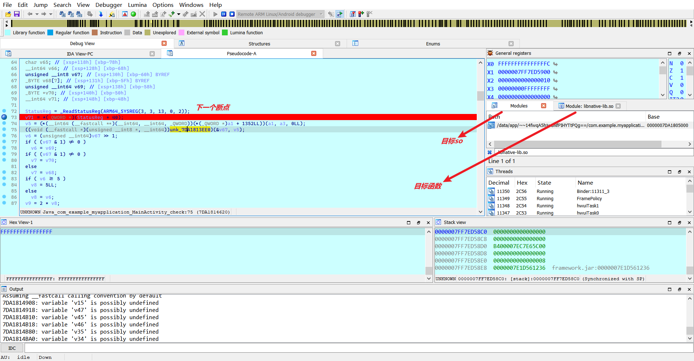

然后触发我们的断点,点击确认

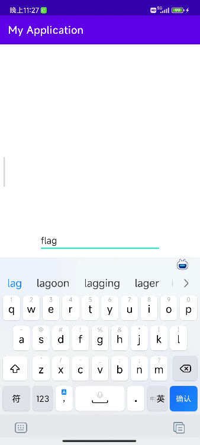

然后就可以断下来了

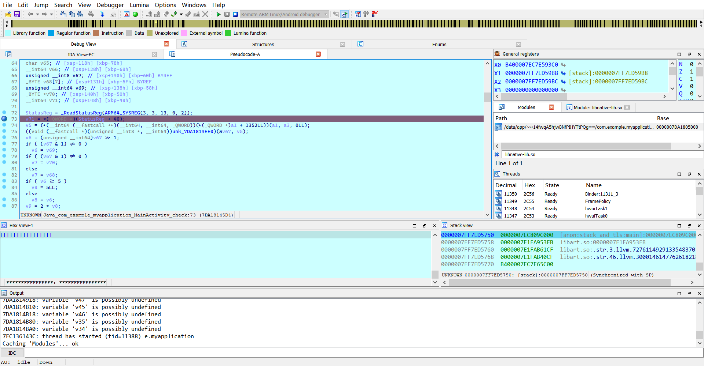


