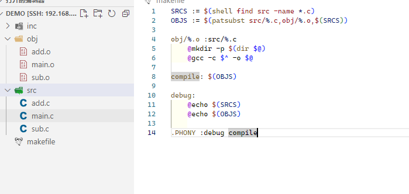
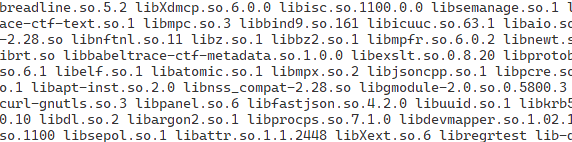

# 杂七杂八


gcc 肯定有默认的文件搜索路径的, 下面的指令是可以查看的

```
echo | gcc -v -x c -E -
```


如果我们需要把C语言转化为汇编语言,,,就那种纯汇编的文件

```
gcc -S xx.c -o yy.asm
```

那么最后xx.c就会被翻译为汇编语言


为什么要这么干? 万一以后,,我们学了linux汇编语言的时候,,我们就可以写c,然后翻译为汇编,,,然后参考它的语法


# 如何生出静态链接库和动态链接库


.a 静态库文件

.i 是预处理文件

.s 是汇编代码文件

.o 类似于obj文件

.so 类似于dll文件


关于库名,有一个约定俗成的名字,,那就是`libXXX.so或者libYYY.a`


## 静态库


main.c

```c++
#include<stdio.h>

int sub(int,int);
int add(int,int);

int main()
{
    int x=70,y=20,z;
    z=add(x,y);
    printf("a+b=%d\n",z);
    z=sub(x,y);
    printf("a-b=%d\n",z);
    return 0;
}
```


func_sub.c

```c++
int sub(int x,int y){
    return x+y;
}
```


func_add.c

```c++
int add(int x,int y){
    return x+y;
}
```


我们把`func_sub.c和func_add.c`整合为一个静态库

然后哦main.c和静态库链接在一起


```
gcc -c func_add.c func_sub.c	//生成.o
ar -r func.a func_add.o func_sub.o	//生成静态库
gcc main.c libfunc.a -o main.elf	//链接
```


## 动态库


```
gcc -c -fpic func_add.c func_sub.c
gcc -shared func_add.o func_sub.o -o func.so
```

在链接过程中一直遇到问题,,woc

```
 gcc main.c  -L./ -l./func.so -Wl,-rpath=./
```


# helloworld


 


最简单的makefile

```makefile
main:main.c
	gcc main.c -o main.elf
```

执行make

```
redqx@DebianYY:/mnt/hgfs/share/demo$ make
gcc main.c -o main.elf
```

其中,make会在当前路径搜索`makefile或者Makefile`文件进行make操作

如果要指定文件进行make操作的话,,,就需要`make -f xxx`

```
redqx@DebianYY:/mnt/hgfs/share/demo$ ./main.elf
hello world
```


# 伪目标

为什么叫伪目标?

因为最后的目标只有一个? 其它的都是假的???

```makefile
clean:
	rm -rf *.o
debug:
	echo hello
```


尝试运行

```
redqx@DebianYY:/mnt/hgfs/share/demo$ make debug
echo hello
hello
redqx@DebianYY:/mnt/hgfs/share/demo$ make clean
rm -rf *.o
redqx@DebianYY:/mnt/hgfs/share/demo$ 
```

发现我们执行的指令也输出了....

我们可以隐藏我们的指令,,而只是输出结果,在指令前面加上`@`

```makefile
clean:
	@rm -rf *.o
debug:
	@echo redqx
```

运行如下

```
redqx@DebianYY:/mnt/hgfs/share/demo$ make debug
redqx
redqx@DebianYY:/mnt/hgfs/share/demo$ make clean
redqx@DebianYY:/mnt/hgfs/share/demo$ 
```


说一下我们遇到的`.PHONY`指令

这个的线就是告诉我们的make,,我们将要执行的名称不是文件,,而是指令

```
make clean
```

比如clean是一个指令,,而不是文件

```makefile
clean:
	@rm -rf objs
debug:
	@echo redqx

.PHONY :clean,debug
```


还有就是这目标的字符串名字可以任意指定,,但是最好是符合规范的,同时也有一些隐晦的规则用于目标名

此外，还有一些约定俗成的目标名：

- `all`：通常用于指定默认的目标，表示编译或构建所有的目标。
- `clean`：用于删除生成的文件，清理项目目录。
- `install`：用于将已编译的程序文件安装到指定的位置。
- `test`：用于运行测试脚本、执行测试用例等。
- `doc`：用于生成项目文档。


# 变量的引用


```makefile
INCS := /mnt/hgfs/share/demo/inc
SRCS := /mnt/hgfs/share/demo/src
debug:
	@echo $(INCS)
	@echo $(SRCS)

.PHONY :debug
```

尝试运行

```
redqx@DebianYY:/mnt/hgfs/share/demo$ make debug
/mnt/hgfs/share/demo/inc
/mnt/hgfs/share/demo/src
```


# 预定义的变量

在看别人写的Makefile文件时，你可能会碰到以下三个变量：现在看不懂没关系,,以后再细细的介绍

``` 
$@，$^，$<
```

代表的意义分别是：

- `$@`: 目标(target)的完整名称
- `$<`: 第一个依赖文件（prerequisties）的名称
- `$^`: 所有的依赖文件（prerequisties），以空格分开，不包含重复的依赖文件

所以`$<`就是`$^`的第一个


```makefile
SRCS := $(shell find src -name *.c)
OBJS := $(patsubst src/%.c,obj/%.o,$(SRCS))

obj/%.o :src/%.c
	@echo ++++
	@echo $^
	@echo $@
	@echo $<
	
compile: $(OBJS)

debug:
	@echo $(SRCS)
	@echo $(OBJS)
	
.PHONY :debug compile
```

运行如下

```
redqx@DebianYY:/mnt/hgfs/share/demo$ make compile
++++
src/add.c
obj/add.o
src/add.c
++++
src/main.c
obj/main.o
src/main.c
++++
src/sub.c
obj/sub.o
src/sub.c
```


其中可以看到,,,其实%就像是一个遍历,,一个一个的取出数据来


# makefile常见的符号


## =

- 简单的赋值运算符
- 用于将右边的值分配给左边的变量
- 如果在后面的语句中重新定义了该变量，则将使用新的值

```makefile
HOST_ARCH= amd64
TARGET_ARCH =$(HOST_ARCH)

#....

#...

HOST_ARCH = i386
debug:
	@echo $(TARGET_ARCH)
	
.PHONY :debug
```

尝试运行

```
redqx@DebianYY:/mnt/hgfs/share/demo$ make debug
i386
```

可以看到输出的是i386,而不是amd64

因为等号会追踪变量的最新value,然后赋值进去


## :=

最朴素的等号,,,也就是我们常见的那个数学等号,,不多说

```
HOST_ARCH = amd64
TARGET_ARCH := $(HOST_ARCH)

#....

#...

HOST_ARCH = i386
debug:
	@echo $(TARGET_ARCH)
	
.PHONY :debug
```

尝试运行

```
redqx@DebianYY:/mnt/hgfs/share/demo$ make debug
amd64
```


## ?=

如果该变量已经定义，则不进行任何操

如果该变量尚未定义，则求值并分配

类似于

```
#ifndef
	#define xxxx
#endif
```


```makefile
TARGET_ARCH = amd64
TARGET_ARCH ?=i386
debug:
	@echo $(TARGET_ARCH)
	
.PHONY :debug
```

尝试运行

```
redqx@DebianYY:/mnt/hgfs/share/demo$ make debug
amd64
```


## +=


字符串的一类累加...用空格来作为分隔符

```
TARGET_ARCH = amd64
TARGET_ARCH +=i386
debug:
	@echo $(TARGET_ARCH)
	
.PHONY :debug
```

尝试运行

```
redqx@DebianYY:/mnt/hgfs/share/demo$ make debug
amd64 i386
```


## \

续行符号

其实就是一行写不下,,然后换一行


# 基本函数

函数的调用,需要使用符号`$`,,类似于变量的引用

```
$(func,argv) 或者${func,argv}
```


## shell

写对运行在makefile中写入shell指令


```makefile
SRCS := $(shell find ./src -name *.c)
debug:
	@echo $(SRCS)
	
.PHONY :debug
```

运行如下

```
redqx@DebianYY:/mnt/hgfs/share/demo$ make debug
./src/main.c
```


## subst ,patsubst

用于字符串的操作


```
$(subst <from>,<to>,<text>)
```

把text的字符串从`<from>`的形式转变为`<to>`的形式

```makefile

SRCS := $(shell find ./src -name *.c)
OBJS := $(subst src/,obj/, $(SRCS))
OBJS := $(subst .c,.o, $(OBJS))
debug:
	@echo $(SRCS)
	@echo $(OBJS)
	
.PHONY :debug
```

运行

```
redqx@DebianYY:/mnt/hgfs/share/demo$ make debug
./src/add.c ./src/main.c ./src/sub.c
./obj/add.o ./obj/main.o ./obj/sub.o
```


```
$(patsubst <pattern>,<replacement>,<text>)
```

这个指令是上一个指令的升级版本

```makefile

SRCS := $(shell find ./src -name *.c)
OBJS := $(patsubst %.c,%.o,$(SRCS))
debug:
	@echo $(SRCS)
	@echo $(OBJS)
	
.PHONY :debug
```

运行如下

```
redqx@DebianYY:/mnt/hgfs/share/demo$ make debug
./src/add.c ./src/main.c ./src/sub.c
./src/add.o ./src/main.o ./src/sub.o
```


## foreach


```
$(foreach <var>,<list>,<text>)
```

- 名称：循环函数——foreach。
- 功能：把字串`<list>`中的元素逐一取出来，执行`<text>`包含的表达式
- 返回：`<text>`所返回的每个字符串所组成的整个字符串（以空格分隔）
- var作为list取出的单个成员


```makefile
include_path := func_add_inc func_sub_inc
INCS := $(foreach item,$(include_path),-I$(item))
debug:
	@echo $(include_path)
	@echo $(INCS)
	
.PHONY :debug
```

运行如下

```
redqx@DebianYY:/mnt/hgfs/share/demo$ make debug
func_add_inc func_sub_inc
-Ifunc_add_inc -Ifunc_sub_inc
redqx@DebianYY:/mnt/hgfs/share/demo$ 
```


当然..也可以用其它的来做一个等效

```makefile
include_path := func_add_inc func_sub_inc
INCS := $(include_path:%=-I%)
debug:
	@echo $(include_path)
	@echo $(INCS)
	
.PHONY :debug
```

一样输出

```
redqx@DebianYY:/mnt/hgfs/share/demo$ make debug
func_add_inc func_sub_inc
-Ifunc_add_inc -Ifunc_sub_inc
redqx@DebianYY:/mnt/hgfs/share/demo$ 
```


## dir, not-dir


用于创建一些没有的目录

```
$(dir <names...>)
```



not-dir的意思就是把参数的路径都去掉...留下尾部的文件


我们尝试取出指定path的所有文件

```makefile
LIBS := $(shell find /usr/lib -name lib*) #输出 所有的path/file
LIBS :=$(notdir $(LIBS))  #输出所有的 file

debug:
	@echo $(LIBS)
	
.PHONY :debug  
```

输出所有的/path/file


只输出file




## filter, basename , filter-out

继续沿用dir和not-dir的例子

如果有很多的文件,,然后我们要取出特定格式的

```
 $(filter 要筛选出的样式,来源) 
```


然后我们可以利用filter做一个结果的筛选,而不是替换什么的

```makefile
LIBS := $(shell find /usr/lib -name lib*) #输出 所有的path/file
LIBS :=$(notdir $(LIBS))  #输出所有的 file
LIBS_a := $(filter %.a,$(LIBS)) #输出所有静态库
LIBS_so := $(filter %.so,$(LIBS)) #输出所有动态库
debug:
	@echo $(LIBS_a)
	@echo $(LIBS_so)
	
.PHONY :debug  
```


有时候,,对于file,,我只需要取出它的文件名,而不是后缀名

```makefile
LIBS := $(shell find /usr/lib -name lib*) #输出 所有的path/file
LIBS :=$(notdir $(LIBS))  #输出所有的 file
LIBS_a  := $(basename $(filter %.a, $(LIBS)))
LIBS_so := $(basename $(filter %.so,$(LIBS)))
liba:
	@echo $(LIBS_a)
libso:
	@echo $(LIBS_so)

.PHONY :liba libso
```

当然我们也可以利用subst,吧后缀名给置空


然后说说fileter-out是什么意思

比如我们有下面这个情况

```
.
├── build
│   └── main.elf
├── include
│   ├── add.h
│   └── sub.h
├── makefile
├── obj
│   ├── add.o
│   ├── main.o
│   └── sub.o
└── src
    ├── add.c
    ├── main.c
    └── sub.c
```

我们准备把add.c和sub.c编译为动态链接库

所以在取出.c文件中

我们不想拿出main.c

于是就这样

```
SRCS :=$(filter-out src/main.c,$(shell find src -name *.c))
```

输出

```
redqx@Debian12:/mnt/hgfs/share/demo$ make debug
src/add.c src/sub.c
```


## $(%)


$(library_path:%=-Wl,-rpath=%)

意思是取出`library_path`的成员

`%`代指得成员

然后替换为样式`-Wl,-rpath=%`


# 进入正题


比如我们有这样一个main.c

```c
#include<stdio.h>

int main()
{
    printf("hello world\n");
    return 0;
}
```


结构如下

```
redqx@DebianYY:/mnt/hgfs/share/demo$ tree
.
├── build
│   └── main.elf
├── makefile
├── objs
│   └── main.o
└── src
    └── main.c

3 directories, 4 file
```


然后写一个makefle

```makefile

SRCS :=$(shell find src -name *.c)
OBJS :=$(patsubst src/%.c,objs/%.o,$(SRCS))
BIN := build/main.elf
objs/%.o : src/%.c
	@mkdir -p $(dir $@)
	@gcc -c $< -o $@

$(BIN): $(OBJS)
	@mkdir -p $(dir $@)
	@gcc $^ -o $@

all: $(BIN)


clean:
	@rm -rf objs build

debug:
	@echo $(SRCS)
	@echo $(OBJS)

.PHONY : clean
```


# gcc 一些编译选项

了解即可,,用熟了自然就记住了


> 编译选项

- `-m64`: 指定编译为 64 位应用程序
- `-std=`: 指定编译标准，例如：-std=c++11、-std=c++14
- `-g`: 包含调试信息
- `-w`: 不显示警告
- `-O`: 优化等级，通常使用：-O3
- `-I`: 加在头文件路径前
- `fPIC`: (Position-Independent Code), 产生的没有绝对地址，全部使用相对地址，代码可以被加载到内存的任意位置，且可以正确的执行。这正是共享库所要求的，共享库被加载时，在内存的位置不是固定的

> 链接选项

- `-l`: 加在库名前面
- `-L`: 加在库路径前面
- `-Wl,<选项>`: 将逗号分隔的 <选项> 传递给链接器
- `-rpath=`: "运行" 的时候，去找的目录。运行的时候，要找 .so 文件，会从这个选项里指定的地方去找

 


其中要注意的是

编译时,是gcc -c,需要指明头文件的路径

链接时,是gcc , 需要指明链接库名字,链接库的位置


# 带头文件的编译


结构如下

```
redqx@DebianYY:/mnt/hgfs/share/demo$ tree
.
├── build
│   └── main.elf
├── include
│   ├── add.h
│   └── sub.h
├── makefile
├── obj
│   ├── add.o
│   ├── main.o
│   └── sub.o
└── src
    ├── add.c
    ├── main.c
    └── sub.c

4 directories, 10 files
```


具体情况见`./demo`文件夹

makefile

```makefile
SRCS :=$(shell find src -name *.c)
OBJS :=$(patsubst src/%.c,obj/%.o,$(SRCS))
include_path := /mnt/hgfs/share/demo/include
INCS := $(include_path:%=-I%)
BIN := build/main.elf


LDFALG := -g -O3 -w $(INCS)

obj/%.o : src/%.c
	@mkdir -p $(dir $@)
	@gcc -c $< $(LDFALG) -o $@

$(BIN): $(OBJS)
	@mkdir -p $(dir $@)
	@gcc $^ -o $@

all: $(BIN)

clean:
	@rm -rf obj build

debug:
	@echo $(SRCS)
	@echo $(OBJS)
	@echo $(INCS)
	@echo $(LDFALG)
.PHONY : clean
```

其中,,,比较有意思

头文件的使用是放在CFLAG那里,而不是LDFALG

