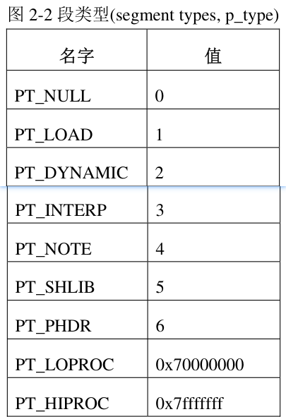
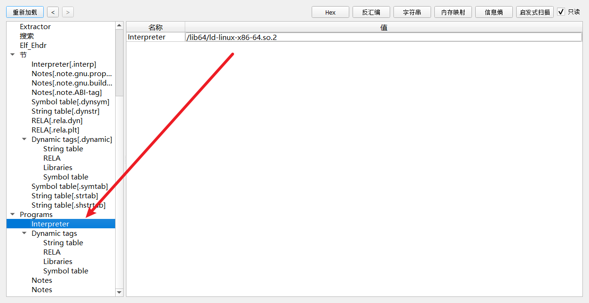
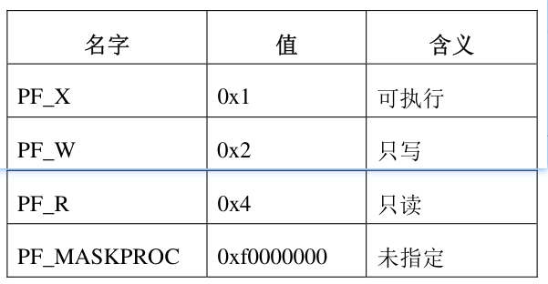
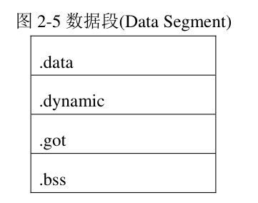
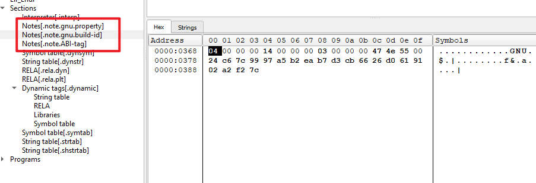

其实对比PE的话,,我们可以发现

PE只有一个section的概念

然后elf有Section和segment的概念

当我执行一个elf的话,,其实我还是可以看大Section这个东西

这说明了什么...? section仍然是最小的处理单元


# 主要去介绍什么


还是以前那句话,虽然在加载的时候,,我们只看段,而不需要去关系节的概念

但是段的组成单元虽然是节,,所以归根结底,,我们还是要去关心节


段的加载其实就是把对应的节加载到内存中去

短的加载机制,,,我们只需要简单的去了解了解


# program header


一个可执行文件或共享目标文件的程序头表(program header table)是一个数组

数组中的每一个元素称为“程序头(program header)”

每一个程序头描述了一个“段(segment)” 或者一块用于准备执行程序的信息


程序头只对可执行文件或共享目标文件有意义，对于其它类型的目标文件，该信息可以忽略


在目标文件的文件头(elf header)中，e_phentsize 和 e_phnum 成员指定了程序头的大小。


````c++
//x86
typedef struct
{
  Elf32_Word	p_type;			/* Segment type */
  Elf32_Off	p_offset;		/* Segment file offset */
  Elf32_Addr	p_vaddr;		/* Segment virtual address */
  Elf32_Addr	p_paddr;		/* Segment physical address */
  Elf32_Word	p_filesz;		/* Segment size in file */
  Elf32_Word	p_memsz;		/* Segment size in memory */
  Elf32_Word	p_flags;		/* Segment flags */
  Elf32_Word	p_align;		/* Segment alignment */
} Elf32_Phdr;


//x64
typedef struct
{
  Elf64_Word	p_type;			/* Segment type */
  Elf64_Word	p_flags;		/* Segment flags */
  Elf64_Off	p_offset;		/* Segment file offset */
  Elf64_Addr	p_vaddr;		/* Segment virtual address */
  Elf64_Addr	p_paddr;		/* Segment physical address */
  Elf64_Xword	p_filesz;		/* Segment size in file */
  Elf64_Xword	p_memsz;		/* Segment size in memory */
  Elf64_Xword	p_align;		/* Segment alignment */
} Elf64_Phdr;
````


# p_type

此数据成员说明了本程序头所描述的段的类型，或者如何解析本程序头的信息



PT_NULL:

此类型表明本程序头是未使用的，本程序头内的其它成员值均无意义。具有此种类型的程序头应该被忽略。


PT_LOAD:

此类型表明本程序头指向一个可装载的段。段的内容会被从文件中拷贝到内存中。

所以其它类型的段不会被加载,,,哈哈


PT_DYNAMIC:

此类型表明本段指明了动态连接的信息。


PT_INTERP:

本段指向了一个以”null”结尾的字符串，这个字符串是一个 ELF 解析器的路径。

这种段类型只对可执行程序有意义，当它出现在共享目标文件中时，是一个无意义的多余项。

在一个 ELF 文件中它最多只能出现一次，而且必须出现在其它可装载段的表项之前。




PT_NOTE:

本段指向了一个以”null”结尾的字符串，这个字符串包含一些附加的信息


PT_SHLIB:

该段类型是保留的，而且未定义语法。UNIX System V 系统上的应用程序不会包含这种表项。


PT_PHDR:

略...

PT_LOPROC ~ PT_HIPROC:

类型值在这个区间的程序头是为特定处理器保留的


# p_offset

类似于pe.SectionHeaders.PointerToRawData

# p_vaddr


类似于pe.SectionHeaders.VirtualAddress


# p_paddr


和物理地址有关, 目前这个成员多数情况下保留不用，或者被操作系统改作它用


# p_filesz


类似于pe.SectionHeaders.sizeofRAWdata


# p_memsz


类似于pe.SectionHeaders.virtualSize


# p_flags


类似于pe.SectionHeaders.Characteristics

此数据成员给出了本段内容的属性

如果一个权限位被设置为 0，这种类型的段是不可访问的。



可读与可执行是通用的，有其中一个就等于也有了另一个, 也就是说 PF_R等价于PF_X

可写权限是最高权限，可以覆盖另外两个，有了可写权限，所有权限就都有了


# p_align

类似于pe.OptionalHeader.SectionAlignment

# program


代码段(.text)或直译为“文本段”，包含的是只读的指令和数据，一般情况下会包含以下这些节


数据段(data segment)包含可写的数据和指令，典型的数据段包含以下节




注释段

类型为 PT_NOTE 的段往往会包含类型为 SHT_NOTE 的节，SHT_NOTE 节可以为目标文件提供一些特别的信息，

用于给其它的程序检查目标文件的一致性和兼容性。

这些信息我们称为“注释信息”，这样的节称为“注释节(note section)”，所在的段即为“注释段(note segment)”。




注释信息可以包含任意数量的“注释项”，每一个注释项是一个数组，

数组的每一个成员大小为 4 字节，格式依目标处理器而定。

也就是说,这个段他是自定义的对吧

具体的构成,,我认为可以不忙去了解


