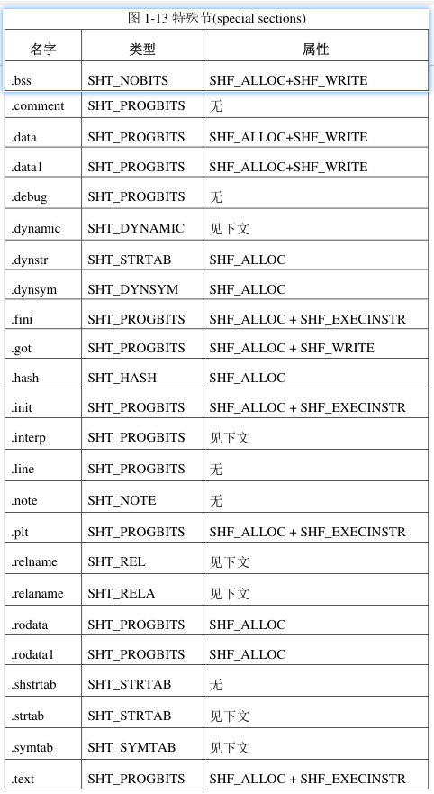

# 前言


是专用于链接过程而言的，在每个“节”中包含有指令数据、符号数据、重定位数据等等

在连接视图中，“Section Header”是必须存在的，

文件里的每一个“节”都需要在“节头表”中有一个对应的注册项

这个注册项描述了节的名字、大小等等

所谓的注册表项只不过是一个数组罢了,装了很多节的属性信息


```c++
typedef struct elf32_shdr {
  DWORD	sh_name; 
  DWORD	sh_type; 
  DWORD	sh_flags;//节区标志
  DWORD	sh_addr; //节的虚拟地址,
  DWORD	sh_offset; //节的文件偏移。
  DWORD	sh_size; //节区的大小。
  DWORD	sh_link; //关联到其它节（不同节代表不同的意义，后面会有介绍）
  DWORD	sh_info;  //附加的节信息（不同节代表不同的意义，后面会有介绍）。
  DWORD	sh_addralign; //地址对齐
  DWORD	sh_entsize;   //给出每个表项的长度字节数。
} Elf32_Shdr;

typedef struct elf64_shdr {
  DWORD sh_name;		/* Section name, index in string tbl */
  DWORD sh_type;		/* Type of section */
  ULONGLONG sh_flags;		/* Miscellaneous section attributes */
  ULONGLONG sh_addr;		/* Section virtual addr at execution */
  ULONGLONG sh_offset;		/* Section file offset */
  ULONGLONG sh_size;		/* Size of section in bytes */
  DWORD sh_link;		/* Index of another section */
  DWORD sh_info;		/* Additional section information */
  ULONGLONG sh_addralign;	/* Section alignment */
  ULONGLONG sh_entsize;	/* Entry size if section holds table */
} Elf64_Shdr;
```

节区名存储在.[shstrtab] 字符串表中，sh_name是表中偏移。


通常，目标文件中含有众多的“节”，“节”区是文件中最大的部分，它们需要满足下列这些条件

• 目标文件中的每一个节一定对应有一个节头(section header)，节头中有对节的描述信息；但有的节头可以没有对应的节，

而只是一个空的头。

• 每一个节所占用的空间是连续的。

• 各个节之间不能互相重叠。

• 在目标文件中，节与节之间可能会存在一些多余的字节，这些字节不属于任何节。

关于第一点就像什么呢, PE的空节区

 

# 结构体成员


## sh_name

一个基于(.shstrtab)的偏移,会告诉我们Section的name,以字符串0结尾


## sh_type

节区类型

节类型，以下为 ET_REL 常见的节类型定义： 

| 节类型                | 节描述                                                       |
| --------------------- | ------------------------------------------------------------ |
| SHT_NULL              | 索引为 0 的节,此值表明本节头是一个无效的（非活动的）节头，它也没有对应的节 |
| SHT_PROGBITS          | 程序数据，如代码、数据等                                     |
| SHT_NOBITS            | 未初始化或初始化为零的数据，该节不占用ELF文件空间，但有大小  |
| SHT_SYMTAB/SHT_DYNSYM | 其实类似于INT,有很多文件指针,指向了字符串                    |
| SHT_STRTAB            | 全是字符串,以0作为分割,开始,结束的标志                       |
|                       |                                                              |
|                       |                                                              |
|                       |                                                              |
|                       |                                                              |


其实还有很多很多,,,只能说遇到一个去查一查吧

```
SHT_NULL（Section Header Type-Null）：
此值表明本节头是一个无效的（非活动的）节头，它也没有对应的节。本节 头中的其它成员的值也都是没有意义的。


SHT_PROGBITS（Section Header Type-Program Bits）：
此值表明本节所含有的信息是由程序定义的，本节内容的格式和含义都由程 序来决定。


SHT_SYMTAB/SHT_DYNSYM（Section Header Type-Symbol Table**/S**ection Header Type-Dynamic Symbol）：
这两类节都含有符号表。目前，ELF 文件中多只能各包含一个这两种节， 但这种限制以后可能会取消。一般来说，SHT_SYMTAB 提供的符号用于在创建 ELF 文件的时候编辑链接，在运行期间也有可能会用于动态链接。SHT_SYMTAB 包含完整的符号表，它往往会包含很多在运行期间（动态链接）用不到的符号。所以，一个 ELF 文件可以再有一个 SHT_DYNSYM 节，它含有一个较小的符号表，专门用于动态链接。


SHT_STRTAB（Section Header Type-String Table）：
此值表明本节是字符串表。ELF 文件中可以包含多个字符串表节。


SHT_RELA（Section Header Type-Relocation Entries with Addends）：
此值表明本节是一个重定位节，含有带明确加数（addend）的重定位项，对于 64 位类型的 ELF 文件来说，这个加数就是 Elf64_Rela。一个 ELF 文件可能含有多个重定位节。


SHT_HASH（Section Header Type-Symbol Hash Table）：
此值表明本节包含一张哈希表。所有参与动态链接的 ELF 文件都必须要包含一个符号哈希表。目前，一个 ELF 文件中多只能有一个哈希表，但这一限制以后可能会取消。


SHT_DYNAMIC（Section Header Type-Dynamic Linking Information）：
此值表明本节包含的是动态链接信息。目前，一个 ELF 文件中多只能有一个 SHT_DYNAMIC 节，但这一限制以后可能会取消。


SHT_DYNAMIC（Section Header Type-Dynamic Linking Information）：
此值表明本节包含的是动态链接信息。目前，一个 ELF 文件中多只能有一个 SHT_DYNAMIC 节，但这一限制以后可能会取消。


SHT_NOTE（Section Header Type-Notes）：
此值表明本节包含的信息用于以某种方式来标记本文件。


SHT_NOBITS（Section Header Type-No Bits）：
此值表明这一节的内容是空的，节并不占用实际的空间。在定义 sh_offset 时提到过，这时 sh_offset 只代表一个逻辑上的位置概念，并不代表实际的内容。


SHT_REL（Section Header Type-Relocation Entries without Addends）：
此值表明本节是一个重定位节，含有隐士加数的重定位项。一个 ELF 文件可能含有多个重定位节。

SHT_DYNSYM（Section Header Type-Dynamic Symbol）：
此值表明本节是符号表。与 SHT_SYMTAB 同义。
```


## sh_flags

本节的一些属性，由一系列标志比特位组成

类似于SectionHeader.Characteristics


节的标志位可以组合，描述了节的属性，定义如下： 

| 节标志        | 描述                                   | value |
| ------------- | -------------------------------------- | ----- |
| SHF_WRITE     | 可写                                   | 0x1   |
| SHF_ALLOC     | 执行时驻留内存（这种节一般包含在段内） | 0x2   |
| SHF_EXECINSTR | 可执行的属性                           | 0x4   |
| SHF_MERGE     | 可能被合并                             |       |
| SHF_STRINGS   | 包含以 0 结尾的字符串                  |       |
| SHF_INFO_LINK | sh_info 关联了另一个节的索引           |       |
| SHF_GROUP     | 此节是个组节的成员                     |       |
| SHF_TLS       | 节包含了线程局部存储（TLS）数据        |       |


下面是看不懂的一些介绍

```
SHF_ALLOC:
如果此标志被设置，表示本节内容在进程运行过程中要占用内存单元。并不是所有节都会占用实际的内存，
有一些起控制作用的节，在目标文件映射到进程空间时，并不需要占用内存

SHF_MASKPROC:
所有被此值所覆盖的位都是保留做特殊处理器扩展用的
```


## sh_offset


## sh_size


## sh_info 和 sh_link 

各个节类型的 sh_info 与 sh_link 的意义如下： 现了解了解,看不懂没关系

只有某些特定类型的节才会有 `sh_info 与 sh_link `字段


| 节类型                  | sh_link                   | sh_info            |
| ----------------------- | ------------------------- | ------------------ |
| SHT_SYMTAB / SHT_DYNSYM | （静态/动态）字符串节索引 | 全局符号的起始索引 |
| SHT_REL / SHT_RELA      | （静态/动态）符号节索引   | 被重定位的节的索引 |
| SHT_DYNAMIC             | 动态字符串节索引          | 无                 |
| SHT_GNU_versym          | 动态符号节索引            | 无                 |
| SHT_GNU_verneed         | 动态字符串节索引          | Verneed 项的数量   |
| SHT_GNU_verdef          | 动态字符串节索引          | Verdef 项的数量    |
| SHT_HASH / SHT_GNU_HASH | 动态符号节索引            | 无                 |


## sh_entsize


比较特殊的一个字段

有一些节的内容是一张表，其中每一个表项的大小是固定的，比如符号表。

对于这种表来说，本成员指定该结构体的大小。 


其它的节类型值是保留未用的

也就是大多数的节的sh_entsize是保留未用的

如果节内容是特定元素的数组，该值代表了元素大小，如对于 SHT_SYMTAB，该址为的大小为sizeof(Elf_Sym).


## sh_addralign


## sh_entsize


# 节的索引值

每个节都有它的索引值

就像是第0个节,第1个节,第2个节

他们都用编号或者是索引值


某些表项的索引值被保留，有特殊的含义。


```
#define SHN_UNDEF	0	    
#define SHN_LORESERVE	0xff00	 
#define SHN_LOPROC	0xff00	 
...  

#define SHN_HIPROC	0xff1f		 

... 

#define SHN_ABS		0xfff1		 
#define SHN_COMMON	0xfff2		 

... 

#define SHN_HIRESERVE	0xffff	 
```


然后简单了解一下下面的东西,我也看不懂,哈哈

```
SHN_UNDEF
该值被定义为 0，它表示一个未定义的、不存在的节的索引。
尽管索引值 0 是一个未定义的保留值，但在节头表中的索引还是会从 0 开始。
比如，如果文件头中 e_shnum 的值为 6，表明在节头表中存在 6 个表项，其索引值
分别为从 0 到 5。其中 0 号表项的意义将在后面说明。

SHN_LORESERVE
被保留索引号区间的下限。

SHN_LOPROC
为处理器定制节所保留的索引号区间的下限

SHN_HIPROC
为处理器定制节所保留的索引号区间的上限。

SHN_ABS
此节中所定义的符号有绝对的值，这个值不会因重定位而改变。

SHN_COMMON
此节中所定义的符号是公共的，比如 FORTRAN COMMON 符号或者未分配的 C 外部变量。

SHN_HIRESERVE
被保留索引号区间的上限。
```


# 预定义的的节


有些节包含调试信息，比如.debug 和.line 节

有些节包含程序控制信息，比如.bss，.data，.data1，.rodata 和.rodata1 这些节

动态连接过程所需要的信息由.dynsym、.dynstr、.interp、.hash、.dynamic、.rel、.rela、.got、.plt 等节提供

比如 .init 和.fini 节用于进程的初始化和终止过程




接下来,简单介绍一些节

有些可能还没有遇到,有些介绍了可能还是不懂,慢慢来


> .text

本节包含程序指令代码。


> .init

初始化代码，先于main执行

此节包含进程初始化时要执行的程序指令。当程序开始运行时，系统会在进入main之前执行这一节中的代码。


> .fini

结束代码，在最后执行

此节包含进程终止时要执行的程序指令。当程序正常退出时，系统会执行这一节中的代码。


> .rodata/.rodata1

本节包含程序中的只读数据，一般是字符串常量（代码中直接使用的字符串也算）

在程序装载时，它们一般会被装入进程空间中那些只读的段中去。


> .bss

未初始化（零初始化）的全局变量和静态局部变量保存在bss段

一般情况下，可执行程序在开始运行的时候，系统会把这一段内容清零。

但是，在运行期间的 bss 段是由系统初始化而成的，

在目标文件中.bss 节并不包含任何内容，其长度为 0，所以它的节类型为 SHT_NOBITS, 也就是空节区


> .data/.data1

保存已经初始化（非零初始化）的全局变量和静态局部变量

在目标文件中，它们是占用实际的存储空间的，与.bss 节不同


> .got

类似于PE的导入表,存放API的地址

比如在没有运行的时候

```
.got:000055F9E83D3FC8 28 40 3D E8 F9 55 00 00       puts_ptr dq offset puts       ; DATA XREF: _puts+4↑r
```


> .plt

 

```
.plt:000055F8128C9030                               sub_55F8128C9030 proc near
.plt:000055F8128C9030 F3 0F 1E FA                   endbr64
.plt:000055F8128C9034 68 00 00 00 00                push    0
.plt:000055F8128C9039 F2 E9 E1 FF FF FF             bnd jmp sub_55F8128C9020
.plt:000055F8128C9039                               sub_55F8128C9030 endp
```


> .plt.got

 

这个就像是PE那个 jmp xxx的东西, 最后jmp到导入表

```
.plt.got:000055F8128C9050                               ; int __fastcall _cxa_finalize(void *)
.plt.got:000055F8128C9050                               __cxa_finalize proc near      ; CODE XREF: __do_global_dtors_aux+22↓p
.plt.got:000055F8128C9050                               ; __unwind { // 55F8128C8000
.plt.got:000055F8128C9050 F3 0F 1E FA                   endbr64
.plt.got:000055F8128C9054 F2 FF 25 9D 2F 00 00          bnd jmp cs:__cxa_finalize_ptr
.plt.got:000055F8128C9054                               __cxa_finalize endp
```


> .plt.sec


这个就像是PE那个 jmp xxx的东西, 最后jmp到导入表

```
.plt.sec:000055F9E83D1060                               ; int puts(const char *s)
.plt.sec:000055F9E83D1060                               _puts proc near               ; CODE XREF: main+37↓p
.plt.sec:000055F9E83D1060                               ; __unwind { // 55F9E83D0000
.plt.sec:000055F9E83D1060 F3 0F 1E FA                   endbr64
.plt.sec:000055F9E83D1064 F2 FF 25 5D 2F 00 00          bnd jmp cs:puts_ptr
.plt.sec:000055F9E83D1064                               _puts endp
```


> .comment

本节包含版本控制信息。


> .debug

本节中含有调试信息，内容格式没有统一规定。所有以”.debug”为前缀的节名字都是保留的


> .dynamic

本节包含动态连接信息


> .dynstr

此节含有用于动态连接的字符串，一般是那些与符号表相关的名字。更多信息参见第 2 章。


> .dynsym

此节含有动态连接符号表。


> .hash

本节包含一张符号哈希表。


> .line

本节也是一个用于调试的节，它包含那些调试符号的行号，为程序指令码与源文件的行号建立起联系。

其内容格式没有统一规定


> .note

本节所包含的信息在第 2 章”注释节(note section)”部分描述。


> .relname 和.relaname

这两个节含有重定位信息。

如果此节被包含在某个可装载的段中，那么本节的属性中应置 SHF_ALLOC 标志位，否则不置此标志。

注意，这两个节的名字中”name”是可替换的部分，执照惯例，

对哪一节做重定位就把”name”换成哪一节的名字。

比如，.text 节的重定位节的名字将是.rel.text 或.rela.text。


> .shstrtab

本节是“节名字表”，含有所有节的名字

也就是section_name


> .strtab

本节用于存放字符串，主要是那些符号表项的名字。

如果一个目标文件有一个可装载的段，并且其中含有符号表，

那么本节的属性中应该有 SHF_ALLOC。


> .symtab

本节用于存放符号表。如果一个目标文件有一个可载入的段，并且其中含有符号表，那么本节的属性中应该有 SHF_ALLOC。

什么是符号表? 他有具体代指定了哪些符号呢?


## .interp

此节含有 ELF 程序解析器的路径名。如果此节被包含在某个可装载的段中，

 


## .shstrtab


所有节区的名字都在这

节里面全是字符串

字符串的以0结尾

节区的sh_name的数值是基于这个节区的偏移


## .strtab | .symtab


为什么我会一次性介绍2个节区?因为这2个节区是相互关联的

我们现介绍`.strtab`然后说`.symtab`


### .strtab

`.strtab`的结构类型和`.shstrtab`是一样的

但是`.shstrtab` 是专门用于存放节区名的

而`.strtab `是用于存放什么呢???

```
一些函数的名字,比如 main,_start,
```


### .symtab


#### 结构体引入


首先` .symtab`的结构类似于 struct  Elf64_Sym demo[xx] 或者  struct  Elf32_Sym demo[xx] ;

首先第[0]项仍然是空的


关于这个结构体类型

```
typedef struct
{
  Elf32_Word	st_name;		/* 基于STRTAB节区的偏移,指向了一个字符串内容*/
  Elf32_Addr	st_value;		/* 它可能代表一个数值，也可以是一个地址,具体看上下文 */
  Elf32_Word	st_size;		/* Symbol size */
  unsigned char	st_info;		/* Symbol type and binding */
  unsigned char	st_other;		/* Symbol visibility */
  Elf32_Section	st_shndx;		/* Section index */
} Elf32_Sym;

typedef struct
{
  Elf64_Word	st_name;		/* Symbol name (string tbl index) */
  unsigned char	st_info;		/* Symbol type and binding */
  unsigned char st_other;		/* Symbol visibility */
  Elf64_Section	st_shndx;		/* Section index */
  Elf64_Addr	st_value;		/* Symbol value */
  Elf64_Xword	st_size;		/* Symbol size */
} Elf64_Sym;
```


##### st_value 


这个值其实没有固定的类型，它可能代表一个数值，也可以是一个地址，

具体是什么要看上下文。

对于不同的目标文件类型，符号表项的 st_value 的含义略有不同


1), 在重定位文件中，如果一个符号对应的节的索引值是 SHN_COMMON，st_value 值是这个节内容的字节对齐数

2), 在重定位文件中，如果一个符号是已定义的，那么它的 st_value 值是该符号的起始地址

在其所在节中的偏移量，而其所在的节的索引由st_shndx 给出

3), 在可执行文件和共享库文件中，st_value 不再是一个节内的偏移量，而是一个虚拟地址，直接指向符号所在的内存位置。

这种情况下，st_shndx就不再需要了


综合以上三点可知，在不同的目标文件中 st_value 的值多少有所不同，这样的设计是为了在各种类型的文件中更有效地访问数据


 


##### st_info

st_info 由一系列的比特位构成，

同时这个成员是对符号信息的阐述吧

```
#define ELF32_ST_BIND(val)		(((unsigned char) (val)) >> 4)
#define ELF32_ST_TYPE(val)		((val) & 0xf)
#define ELF32_ST_INFO(bind, type)	(((bind) << 4) + ((type) & 0xf))

/* Both Elf32_Sym and Elf64_Sym use the same one-byte st_info field.  */
#define ELF64_ST_BIND(val)		ELF32_ST_BIND (val)
#define ELF64_ST_TYPE(val)		ELF32_ST_TYPE (val)
#define ELF64_ST_INFO(bind, type)	ELF32_ST_INFO ((bind), (type))
```


它标识了“符号绑定(symbol binding)”、“符号类型(symbol type)”和“符号信息(symbol infomation)”三种属性。

比如


STB_LOCAL说明了他是一个局部符号,

然后STT_FILE说明这个符号是文件名


符号类型可以通过 ELF_ST_TYPE(st_info) 获取，

符号类型的定义如下：

###### ELF_ST_TYPE


```c++
/* Legal values for ST_TYPE subfield of st_info (symbol type).  */

#define STT_NOTYPE	0		/* Symbol type is unspecified */
#define STT_OBJECT	1		/* Symbol is a data object */
#define STT_FUNC	2		/* Symbol is a code object */
#define STT_SECTION	3		/* Symbol associated with a section */
#define STT_FILE	4		/* Symbol's name is file name */
#define STT_COMMON	5		/* Symbol is a common data object */
#define STT_TLS		6		/* Symbol is thread-local data object*/
#define	STT_NUM		7		/* Number of defined types.  */
#define STT_LOOS	10		/* Start of OS-specific */
#define STT_GNU_IFUNC	10		/* Symbol is indirect code object */
#define STT_HIOS	12		/* End of OS-specific */
#define STT_LOPROC	13		/* Start of processor-specific */
#define STT_HIPROC	15		/* End of processor-specific */

```


符号类型可以通过 ELF_ST_TYPE(st_info) 获取，符号类型的定义如下：

| 符号类型    | 描述                                      |
| ----------- | ----------------------------------------- |
| STT_NOTYPE  | 未定义符号                                |
| STT_OBJECT  | 符号是数据                                |
| STT_FUNC    | 符号是函数                                |
| STT_SECTION | 节符号，每个节都会有一个节符号            |
| STT_FILE    | 符号名是源文件的文件名，如 ./../../test.c |
| STT_COMMON  | 符号是公共数据                            |
| STT_TLS     | 符号是 TLS 数据                           |

 


###### ELF_ST_BIND


```c++
#define STB_LOCAL	0		/* Local symbol */
#define STB_GLOBAL	1		/* Global symbol */
#define STB_WEAK	2		/* Weak symbol */
#define	STB_NUM		3		/* Number of defined types.  */
#define STB_LOOS	10		/* Start of OS-specific */
#define STB_GNU_UNIQUE	10		/* Unique symbol.  */
#define STB_HIOS	12		/* End of OS-specific */
#define STB_LOPROC	13		/* Start of processor-specific */
#define STB_HIPROC	15		/* End of processor-specific */
```


符号绑定可以通过 ELF_ST_BIND(st_info) 获取，符号绑定的定义如下： 

| 绑定类型   | 描述                                               | value |
| ---------- | -------------------------------------------------- | ----- |
| STB_LOCAL  | 局部符号，对其它文件不可见（如被static修饰的函数） | 0     |
| STB_GLOBAL | 全局符号                                           | 1     |
| STB_WEAK   | 弱符号（允许符号找不到）                           | 2     |
| STB_LOPROC |                                                    | 13    |
| STB_HIPROC |                                                    | 15    |


> STB_LOCAL

表明本符号是一个本地符号。它只出现在本文件中，在本文件外该符号无效。

所以在不同的文件中可以定义相同的符号名，它们之间不会互相影响。


> STB_GLOBAL

表明本符号是一个全局符号。当有多个文件被连接在一起时，在所有文件中该符号都是可见的。

正常情况下，在一个文件中定义的全局符号，一定是在其它文件中需要被引用，否则无须定义为全局。


> STB_WEAK

类似于全局符号，但是相对于 STB_GLOBAL，它们的优先级更低

全局符号(global symbol)和弱符号(weak symbol) 有什么区别,遇到再说吧


> STB_LOPROC ~ STB_HIPROC

为特殊处理器保留的属性区间。

在符号表中，不同属性的符号所在位置也有不同，

本地符号(STB_LOCAL)排在前面，

全局符号(STB_GLOBAL/STB_WEAK)排在后面。


###### ELF_ST_INFO ???


##### st_shndx

 符号所在节的节索引，还有一些特殊定义： 

| 节索引        | 描述                                                         |
| ------------- | ------------------------------------------------------------ |
| SHN_UNDEF     | 未定义符号，可能存在其它文件或模块中                         |
| SHN_LORESERVE | 小于该值且不为SHN_UNDEF，则代表真正的节索引，否则均为特殊索引 |
| SHN_ABS       | 绝对符号，只是描述一些信息，如对于STT_FILE 类型的符号        |


