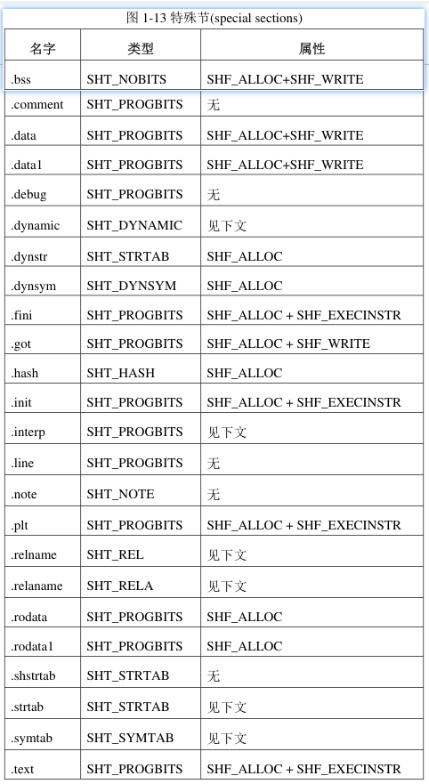
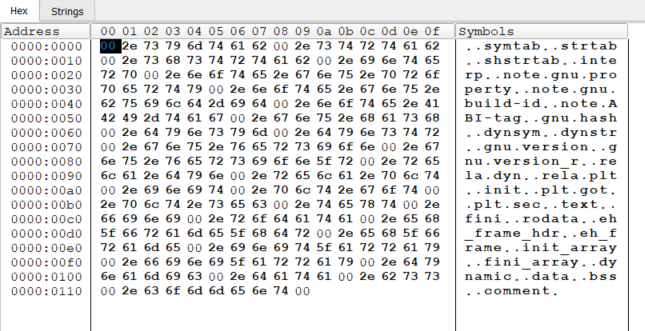
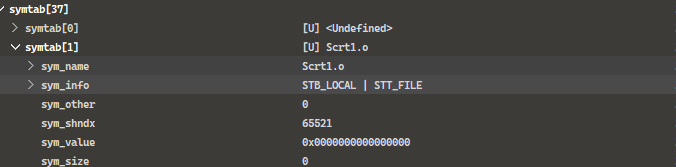
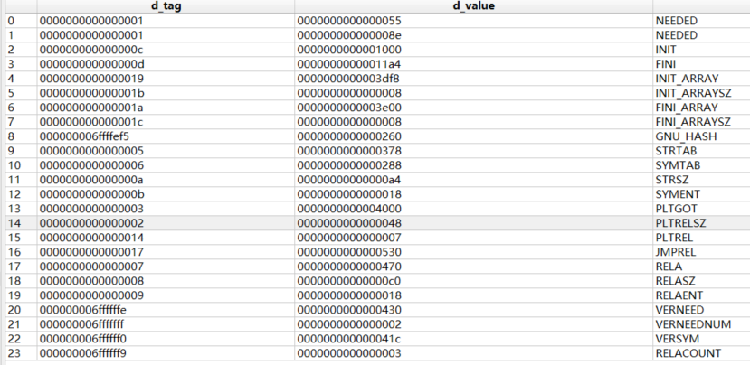
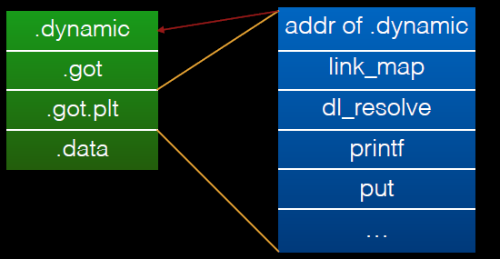
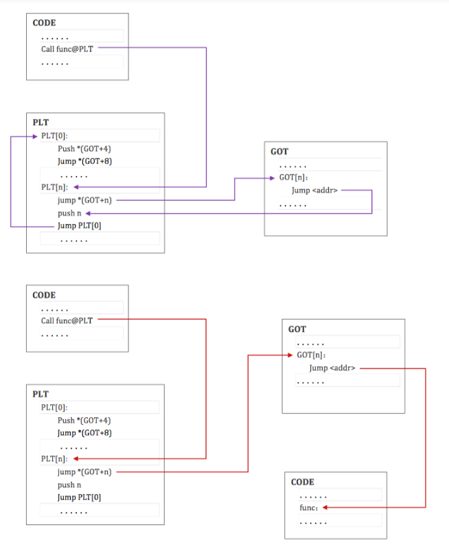

# 预定义的的节


有些节包含调试信息，比如.debug 和.line 节

有些节包含程序控制信息，比如.bss，.data，.data1，.rodata 和.rodata1 这些节

动态连接过程所需要的信息由.dynsym、.dynstr、.interp、.hash、.dynamic、.rel、.rela、.got、.plt 等节提供

比如 .init 和.fini 节用于进程的初始化和终止过程




接下来,简单介绍一些节

有些可能还没有遇到,有些介绍了可能还是不懂,慢慢来


> .text

本节包含程序指令代码。


> .init

初始化代码，先于main执行

此节包含进程初始化时要执行的程序指令。当程序开始运行时，系统会在进入main之前执行这一节中的代码。


> .fini

结束代码，在最后执行

此节包含进程终止时要执行的程序指令。当程序正常退出时，系统会执行这一节中的代码。


> .rodata/.rodata1

本节包含程序中的只读数据，一般是字符串常量（代码中直接使用的字符串也算）

在程序装载时，它们一般会被装入进程空间中那些只读的段中去。


> .bss

未初始化（零初始化）的全局变量和静态局部变量保存在bss段

一般情况下，可执行程序在开始运行的时候，系统会把这一段内容清零。

但是，在运行期间的 bss 段是由系统初始化而成的，

在目标文件中.bss 节并不包含任何内容，其长度为 0，所以它的节类型为 SHT_NOBITS, 也就是空节区


> .data/.data1

保存已经初始化（非零初始化）的全局变量和静态局部变量

在目标文件中，它们是占用实际的存储空间的，与.bss 节不同


> .got
>
> 类型: SHT_PROGBITS
>
> 

类似于PE的导入表,存放API的地址

比如在没有运行的时候

```
.got:000055F9E83D3FC8 28 40 3D E8 F9 55 00 00       puts_ptr dq offset puts       ; DATA XREF: _puts+4↑r
```


> .plt
>
> 属性: SHT_PROGBITS

 

```
.plt:000055F8128C9030                               sub_55F8128C9030 proc near
.plt:000055F8128C9030 F3 0F 1E FA                   endbr64
.plt:000055F8128C9034 68 00 00 00 00                push    0
.plt:000055F8128C9039 F2 E9 E1 FF FF FF             bnd jmp sub_55F8128C9020
.plt:000055F8128C9039                               sub_55F8128C9030 endp
```


> .plt.got

 

这个就像是PE那个 jmp xxx的东西, 最后jmp到导入表

```
.plt.got:000055F8128C9050                               ; int __fastcall _cxa_finalize(void *)
.plt.got:000055F8128C9050                               __cxa_finalize proc near      ; CODE XREF: __do_global_dtors_aux+22↓p
.plt.got:000055F8128C9050                               ; __unwind { // 55F8128C8000
.plt.got:000055F8128C9050 F3 0F 1E FA                   endbr64
.plt.got:000055F8128C9054 F2 FF 25 9D 2F 00 00          bnd jmp cs:__cxa_finalize_ptr
.plt.got:000055F8128C9054                               __cxa_finalize endp
```


> .plt.sec


这个就像是PE那个 jmp xxx的东西, 最后jmp到导入表

```
.plt.sec:000055F9E83D1060                               ; int puts(const char *s)
.plt.sec:000055F9E83D1060                               _puts proc near               ; CODE XREF: main+37↓p
.plt.sec:000055F9E83D1060                               ; __unwind { // 55F9E83D0000
.plt.sec:000055F9E83D1060 F3 0F 1E FA                   endbr64
.plt.sec:000055F9E83D1064 F2 FF 25 5D 2F 00 00          bnd jmp cs:puts_ptr
.plt.sec:000055F9E83D1064                               _puts endp
```


> .got.plt        


> .comment
>
> 类型: SHT_PROGBITS
>
> 属性: 

存放编译器版本信息，如字符串 "GCC:(GNU)4.2.0"        


> .debug
>
> 类似: SHT_PROGBITS

本节中含有调试信息，内容格式没有统一规定。所有以”.debug”为前缀的节名字都是保留的


> .dynamic
>
> 类型: SHT_DYNAMIC
>
> 属性: SHF_ALLOC , SHF_WRITE

本节包含动态连接信息


> .dynstr
>
> 类似: SHT_STRTAB
>
> 属性: SHF_ALLOC

此节含有用于动态连接的字符串，一般是那些与符号表相关的名字。更多信息参见第 2 章。


> .dynsym
>
> 类型: SHT_DYNSYM
>
> 属性: SHF_ALLOC

此节含有动态连接符号表。


> .hash

本节包含一张符号哈希表。


> .line

本节也是一个用于调试的节，它包含那些调试符号的行号，为程序指令码与源文件的行号建立起联系。

其内容格式没有统一规定


> .note

本节所包含的信息在第 2 章”注释节(note section)”部分描述。


> .relname 
>
> 属性:SHT_REL
>
> 
>
> .relaname
>
> 属性: SHT_RELA

这两个节含有重定位信息。

如果此节被包含在某个可装载的段中，那么本节的属性中应置 SHF_ALLOC 标志位，否则不置此标志。

注意，这两个节的名字中”name”是可替换的部分，执照惯例，

对哪一节做重定位就把”name”换成哪一节的名字。

比如，.text 节的重定位节的名字将是.rel.text 或.rela.text。


> .shstrtab

本节是“节名字表”，含有所有节的名字

也就是section_name


> .strtab

本节用于存放字符串，主要是那些符号表项的名字。

如果一个目标文件有一个可装载的段，并且其中含有符号表，

那么本节的属性中应该有 SHF_ALLOC。


> .symtab

本节用于存放符号表。如果一个目标文件有一个可载入的段，并且其中含有符号表，那么本节的属性中应该有 SHF_ALLOC。

什么是符号表? 他有具体代指定了哪些符号呢?


# .shstrtab


所有节区的名字都在这

节里面全是字符串

字符串的以0结尾

节区的sh_name的数值是基于这个节区的偏移





# .strtab | .symtab


在编译程序时，必须有相应的结构来管理程序中的符号以便于对函数和变量进行重定位。

于是每个目标文件都会有一个符号表

链接本质就是把多个不同的目标文件相互 “粘” 在一起, 那通过什么链接?链接器

实际上，目标文件相互粘合是目标文件之间对地址的引用，即函数和变量的地址的相互引用。

而在粘合的过程中，符号就是其中的粘合剂。


目标文件中的符号表包含了**一些通用的符号**，这部分信息在进行了 `strip` 操作后就会消失。

这些符号信息可能包括变量名、函数名


为什么我会一次性介绍2个节区?因为这2个节区是相互关联的

我们现介绍`.strtab`然后说`.symtab`


## .strtab

这东西的名字好像叫字符串表,,str是字符串的意思,tab就是表的意思

如果细分的话,有节区的字符串表,,xxx的字符串表


`.strtab`的结构类型和`.shstrtab`是一样的

但是`.shstrtab` 是专门用于存放节区名的

而`.strtab `是用于存放什么呢???

```
一些函数的名字,比如 main,_start,
```


## .symtab

这东西叫符号表, sym就是符号的意思,tab就是表的意思

` .symtab`的结构类似于 struct  Elf64_Sym demo[xx] 或者  struct  Elf32_Sym demo[xx] ;

首先第[0]项仍然是空的


关于这个结构体类型

```c++
typedef struct
{
  Elf32_Word	st_name;		/* 基于STRTAB节区的偏移,指向了一个字符串内容*/
  Elf32_Addr	st_value;		/* 它可能代表一个数值，也可以是一个地址,具体看上下文 */
  Elf32_Word	st_size;		/* Symbol size */
  unsigned char	st_info;		/* Symbol type and binding */
  unsigned char	st_other;		/* Symbol visibility */
  Elf32_Section	st_shndx;		/* Section index */
} Elf32_Sym;

typedef struct
{
  Elf64_Word	st_name;		/* Symbol name (string tbl index) */
  unsigned char	st_info;		/* Symbol type and binding */
  unsigned char st_other;		/* Symbol visibility */
  Elf64_Section	st_shndx;		/* Section index */
  Elf64_Addr	st_value;		/* Symbol value */
  Elf64_Xword	st_size;		/* Symbol size */
} Elf64_Sym;
```


<p style="color:#00FF7F;font-size:48px;">st_value </p>


这个值其实没有固定的类型，它可能代表一个数值，也可以是一个地址，

具体是什么要看上下文。

对于不同的目标文件类型，符号表项的 st_value 的含义略有不同

 

如果该符号对应着一个变量，那么表明该变量在内存中的偏移。我们可由这个值获取其文件偏移

1. 获取该符号对应的 `st_shndx`，进而获取到相关的节区。
2. 根据节区头元素可以获取节区的虚拟基地址和文件基地址。
3. value - 内存基虚拟地址 = 文件偏移 - 文件基地址

如果该符号对应着一个函数，那么表明该函数在文件中的起始地址。

 

不同的目标文件类型对符号表项中 st_value 成员的解释不同：

- 在可重定位文件中，st_value 保存了节区索引为 SHN_COMMON 的符号的对齐约束。
- 在可重定位文件中，st_value 保存了已定义符号的节区偏移。也就是说，st_value 保留了 st_shndx 所标识的节区的头部到符号位置的偏移。
- 在可执行和共享目标文件中，st_value 包含一个虚地址。为了使得这些文件的符号对动态链接器更有用，节区偏移（针对文件的解释）给出了与节区号无关的虚拟地址（针对内存的解释）。

 


<p style="color:#00FF7F;font-size:48px;">st_info </p>

st_info 由一系列的比特位构成，

同时这个成员是对符号信息的阐述吧

```c++
#define ELF32_ST_BIND(val)		(((unsigned char) (val)) >> 4)
#define ELF32_ST_TYPE(val)		((val) & 0xf)
#define ELF32_ST_INFO(bind, type)	(((bind) << 4) + ((type) & 0xf))

/* Both Elf32_Sym and Elf64_Sym use the same one-byte st_info field.  */
#define ELF64_ST_BIND(val)		ELF32_ST_BIND (val)
#define ELF64_ST_TYPE(val)		ELF32_ST_TYPE (val)
#define ELF64_ST_INFO(bind, type)	ELF32_ST_INFO ((bind), (type))
```


它标识了“符号绑定(symbol binding)”、“符号类型(symbol type)”和“符号信息(symbol infomation)”三种属性。

比如



STB_LOCAL说明了他是一个局部符号,

然后STT_FILE说明这个符号是文件名


符号类型可以通过 ELF_ST_TYPE(st_info) 获取，

符号类型的定义如下：


<p style="color:#98F5FF;font-size:24px;">ELF_ST_TYPE </p>


```c++
/* Legal values for ST_TYPE subfield of st_info (symbol type).  */

#define STT_NOTYPE	0		/* Symbol type is unspecified */
#define STT_OBJECT	1		/* Symbol is a data object */
#define STT_FUNC	2		/* Symbol is a code object */
#define STT_SECTION	3		/* Symbol associated with a section */
#define STT_FILE	4		/* Symbol's name is file name */
#define STT_COMMON	5		/* Symbol is a common data object */
#define STT_TLS		6		/* Symbol is thread-local data object*/
#define	STT_NUM		7		/* Number of defined types.  */
#define STT_LOOS	10		/* Start of OS-specific */
#define STT_GNU_IFUNC	10		/* Symbol is indirect code object */
#define STT_HIOS	12		/* End of OS-specific */
#define STT_LOPROC	13		/* Start of processor-specific */
#define STT_HIPROC	15		/* End of processor-specific */

```


符号类型可以通过 ELF_ST_TYPE(st_info) 获取，符号类型的定义如下：

| 符号类型    | 描述                                      |
| ----------- | ----------------------------------------- |
| STT_NOTYPE  | 未定义符号                                |
| STT_OBJECT  | 符号是数据                                |
| STT_FUNC    | 符号是函数                                |
| STT_SECTION | 节符号，每个节都会有一个节符号            |
| STT_FILE    | 符号名是源文件的文件名，如 ./../../test.c |
| STT_COMMON  | 符号是公共数据                            |
| STT_TLS     | 符号是 TLS 数据                           |

 

STT_FUNC: 当另一个目标文件从共享目标文件中引用一个函数时，链接器自动为被引用符号创建过程链接表项


如果一个符号的值指向节内的特定位置，则它的节索引号 `st_shndx`，包含了它在节头表中的索引。

当一个节在重定位过程中移动时，该符号值也做相应改变，对该符号的引用继续指向程序中的相同位置。

有些特定节索引值具有其他语义。

<p style="color:#98F5FF;font-size:24px;">ELF_ST_BIND</p>


```c++
#define STB_LOCAL	0		/* Local symbol */
#define STB_GLOBAL	1		/* Global symbol */
#define STB_WEAK	2		/* Weak symbol */
#define	STB_NUM		3		/* Number of defined types.  */
#define STB_LOOS	10		/* Start of OS-specific */
#define STB_GNU_UNIQUE	10		/* Unique symbol.  */
#define STB_HIOS	12		/* End of OS-specific */
#define STB_LOPROC	13		/* Start of processor-specific */
#define STB_HIPROC	15		/* End of processor-specific */
```


符号绑定可以通过 ELF_ST_BIND(st_info) 获取，符号绑定的定义如下： 

| 绑定类型   | 描述                                               | value |
| ---------- | -------------------------------------------------- | ----- |
| STB_LOCAL  | 局部符号，对其它文件不可见（如被static修饰的函数） | 0     |
| STB_GLOBAL | 全局符号                                           | 1     |
| STB_WEAK   | 弱符号（允许符号找不到）                           | 2     |
| STB_LOPROC |                                                    | 13    |
| STB_HIPROC |                                                    | 15    |


> STB_LOCAL

表明本符号是一个本地符号。它只出现在本文件中，在本文件外该符号无效。

所以在不同的文件中可以定义相同的符号名，它们之间不会互相影响。


> STB_GLOBAL

表明本符号是一个全局符号。当有多个文件被连接在一起时，在所有文件中该符号都是可见的。

正常情况下，在一个文件中定义的全局符号，一定是在其它文件中需要被引用，否则无须定义为全局。


> STB_WEAK

类似于全局符号，但是相对于 STB_GLOBAL，它们的优先级更低

全局符号(global symbol)和弱符号(weak symbol) 有什么区别,遇到再说吧


> STB_LOPROC ~ STB_HIPROC

为特殊处理器保留的属性区间。

在符号表中，不同属性的符号所在位置也有不同，

本地符号(STB_LOCAL)排在前面，

全局符号(STB_GLOBAL/STB_WEAK)排在后面。


<p style="color:#98F5FF;font-size:24px;">ELF_ST_INFO</p>


<p style="color:#00FF7F;font-size:48px;">st_shndx </p>

 符号所在节的节索引，还有一些特殊定义： 

| 节索引        | 描述                                                         |
| ------------- | ------------------------------------------------------------ |
| SHN_UNDEF     | 未定义符号，可能存在其它文件或模块中                         |
| SHN_LORESERVE | 小于该值且不为SHN_UNDEF，则代表真正的节索引，否则均为特殊索引 |
| SHN_ABS       | 绝对符号，只是描述一些信息，如对于STT_FILE 类型的符号        |


# .interp


此节含有 ELF 程序解析器的路径名。如果此节被包含在某个可装载的段中，


 


有些时候解释器就像一个elf_loader, 然后加载并执行我们的elf文件

有时候,elf文件是直接映射到内存,然后得以执行


# .dynamic


## 前言


这个段太特殊了，程序执行离不开他，简单来说，程序启动后，文件中的数据映射到内存

也就是PT_LOAD这个类型的段加载到了内存中去了，ELF header中有了入口点的地址，

但是只有这些程序是不可能运行成功的, 依赖的动态库还没有加载，重定位还没有处理，执行前的初始化代码还没有执行

如果是动态库，动态库是有导出符号的，但是连符号表在内存中哪个位置都不知道，也就无法导出 等等.....

所以这个节包含了很多很多的信息啦


所以这个就单独拿出来说一下

```c++
typedef struct
{
  Elf32_Sword	d_tag;			/* Dynamic entry type */
  union
    {
      Elf32_Word d_val;			/* Integer value */
      Elf32_Addr d_ptr;			/* Address value */
    } d_un;
} Elf32_Dyn;

typedef struct
{
  Elf64_Sxword	d_tag;			/* Dynamic entry type */
  union
    {
      Elf64_Xword d_val;		/* Integer value */
      Elf64_Addr d_ptr;     /* Address value */
    } d_un;
} Elf64_Dyn;
```


d_tag,  的取值决定了该如何解释 d_un

d_val,  这个字段表示一个整数值，可以有多种意思

d_ptr,  这个字段表示程序的虚拟地址


## d_tag说明


**下表总结了可执行文件以及共享目标文件中的 d_tag 的需求**。 

ps: 我只能说看不懂,不想看,等遇到了再查喽


> DT_NEEDED

一个基于xxx的字符串偏移,,指向了要被加载的so文件

比如加载了

```
libpthread.so.0
libc.so.6
```


> DT_INIT

指出了init函数的RVA


> DT_INIT_ARRAY

那个初始化数组的位置


> DT_INIT_ARRAYSZ

那个初始化数组的总大小


> DT_FINI

指出fini函数的RVA


> DT_FINI_ARRAY

程序结束的数组的RVA


> DT_FINI_ARRAYSZ

程序结束的数组的大小


> DT_STRTAB

指出了`.dynsym`的地址

这里面全是字符串内容

符号名、库名、和其它字符串都包含在此表中。


> DT_STRSZ

给出了`DT_STRTAB`相关结构体的大小


> DT_SYMTAB

当然就是那些结构了


> DT_SYMENT

和DT_SYMTAB有关系,,但是没看懂

但是又看了一下,,,和`.dynamic`的成员个数有关系

就是下面这个东西




> DT_PLTGOT

类似于FirstThunk[]那种


> DT_VERSYM：

.gnu.version节的地址


> DT_VERNEED

.gnu.version_r节的地址


> DT_VERNEEDNUM：

”Number of needed versions“ 


| 名称                 | 数值                   | d_un   | 可执行 | 共享 目标 | 说明                                                         |
| :------------------- | :--------------------- | :----- | :----- | :-------- | :----------------------------------------------------------- |
| DT_PLTRELSZ          | 2                      | d_val  | 可选   | 可选      | 给出与过程链接表相关的重定位项的总的大小。如果存在 DT_JMPREL 类型的项，那么 DT_PLTRELSZ 也必须存在。 |
| DT_HASH              | 4                      | d_ptr  | 必需   | 必需      | 此类型表项包含符号哈希表的地址。此哈希表指的是被 DT_SYMTAB 引用的符号表。 |
| DT_RELA              | 7                      | d_ptr  | 必需   | 可选      | 此类型表项包含重定位表的地址。此表中的元素包含显式的补齐，例如 32 位文件中的 Elf32_Rela。目标文件可能有多个重定位节区。在为可执行文件或者共享目标文件创建重定位表时，链接编辑器将这些节区连接起来，形成一个表。尽管在目标文件中这些节区相互独立，但是动态链接器把它们视为一个表。在动态链接器为可执行文件创建进程映像或者向一个进程映像中添加某个共享目标时，要读取重定位表并执行相关的动作。如果此元素存在，动态结构体中也必须包含 DT_RELASZ 和 DT_RELAENT 元素。如果对于某个文件来说，重定位是必需的话，那么 DT_RELA 或者 DT_REL 都可能存在。 |
| DT_RELASZ            | 8                      | d_val  | 必需   | 可选      | 此类型表项包含 DT_RELA 重定位表的总字节大小。                |
| DT_RELAENT           | 9                      | d_val  | 必需   | 可选      | 此类型表项包含 DT_RELA 重定位项的字节大小。                  |
| DT_SONAME            | 14                     | d_val  | 忽略   | 可选      | 此类型表项给出一个以 NULL 结尾的字符串的字符串表偏移，对应的字符串是某个共享目标的名称。该偏移实际上是 DT_STRTAB 中的索引。 |
| DT_RPATH             | 15                     | d_val  | 可选   | 忽略      | 此类型表项包含以 NULL 结尾的字符串的字符串表偏移，对应的字符串是搜索库时使用的搜索路径。该偏移实际上是 DT_STRTAB 中的索引。 |
| DT_SYMBOLIC          | 16                     | 忽略   | 忽略   | 可选      | 如果这种类型表项出现在共享目标库中，那么这将会改变动态链接器的符号解析算法。动态连接器将首先选择从共享目标文件本身开始搜索符号，只有在搜索失败时，才会选择从可执行文件中搜索相应的符号。 |
| DT_REL               | 17                     | d_ptr  | 必需   | 可选      | 此类型表项与 DT_RELA 类型的表项类似，只是其表格中包含隐式的补齐，对 32 位文件而言，就是 Elf32_Rel。如果 ELF 文件中包含此元素，那么动态结构中也必须包含 DT_RELSZ 和 DT_RELENT 类型的元素。 |
| DT_RELSZ             | 18                     | d_val  | 必需   | 可选      | 此类型表项包含 DT_REL 重定位表的总字节大小。                 |
| DT_RELENT            | 19                     | d_val  | 必需   | 可选      | 此类型表项包含 DT_REL 重定位项的字节大小。                   |
|                      |                        |        |        |           |                                                              |
| DT_DEBUG             | 21                     | d_ptr  | 可选   | 忽略      | 此类型表项用于调试。ABI 未规定其内容，访问这些条目的程序可能与 ABI 不兼容。 |
| DT_TEXTREL           | 22                     | 忽略   | 可选   | 可选      | 如果文件中不包含此类型的表项，则表示没有任何重定位表项能够造成对不可写段的修改。如果存在的话，则可能存在若干重定位项请求对不可写段进行修改，因此，动态链接器可以做相应的准备。 |
| DT_JMPREL            | 23                     | d_ptr  | 可选   | 可选      | 该类型的条目的 d_ptr 成员包含了过程链接表的地址，并且索引时应该会把该地址强制转换为对应的重定位表项类型的指针。把重定位表项分开有利于让动态链接器在进程初始化时忽略它们（开启了延迟绑定）。如果存在此成员，相关的 DT_PLTRELSZ 和 DT_PLTREL 必须也存在。 |
| DT_BIND_NOW          | 24                     | 忽略   | 可选   | 可选      | 如果可执行文件或者共享目标文件中存在此类型的表项的话，动态链接器在将控制权转交给程序前，应该将该文件的所有需要重定位的地址都进行重定位。这个表项的优先权高于延迟绑定，可以通过环境变量或者 dlopen(BA_LIB) 来设置。 |
| DT_LOPROC ~DT_HIPROC | 0x70000000 ~0x7fffffff | 未指定 | 未指定 | 未指定    | 这个范围的表项是保留给处理器特定的语义的。                   |


没有出现在此表中的标记值是保留的。

此外，除了数组末尾的 DT_NULL 元素以及 DT_NEEDED 元素的相对顺序约束以外， 其他表项可以以任意顺序出现。


# .got | .got.plt


- .got，存储导入变量的地址。
- .got.plt，存储导入函数的地址。


在 Linux 的实现中，.plt.got 的前三项的具体的含义如下

- GOT[0]，.dynamic 的地址。
- GOT[1]，指向 link_map 的指针，只会在动态装载器中使用，包含了进行符号解析需要的当前 ELF 对象的信息。每个 link_map 都是一条双向链表的一个节点，而这个链表保存了所有加载的 ELF 对象的信息。
- GOT[2]，指向动态装载器中 _dl_runtime_resolve 函数的指针。

got.plt 后面的项则是程序中不同 .so 中函数的引用地址。

下面给出一个相应的关系。




# .plt | .plt.got

- **.plt**，与常见导入的函数有关，如 read 等函数。
- **.plt.got**，与动态链接有关系。


准确的说，plt 表不是查询表，而是一块代码。这一块内容是与代码相关的。

在一个程序运行过程中，可能很多函数在程序执行完时都不会用到，因此一开始就把所有函数都链接好可能会浪费大量资源，

所以 ELF 采用了一种延迟绑定的做法，其基本思想是函数第一次被用到时才进行绑定（符号查找，重定位等），

如果没有用则不进行绑定。

所以程序开始执行前，模块间的函数调用都没有进行绑定，而是需要用到时才由动态链接器负责绑定。



# 


