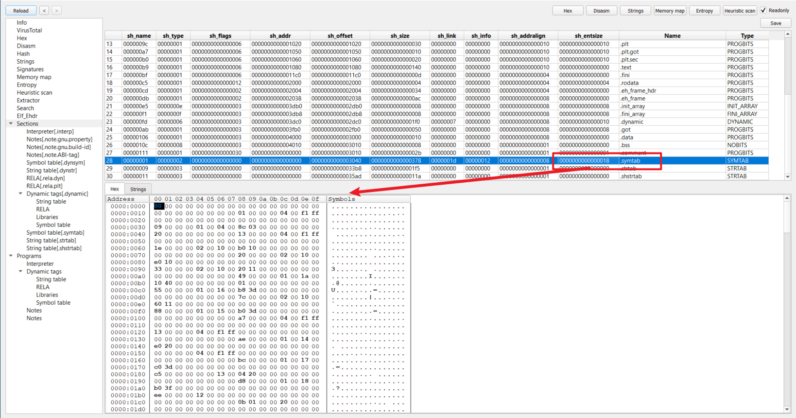

# Elf_Shdr


是专用于链接过程而言的，在每个“节”中包含有指令数据、符号数据、重定位数据等等

在连接视图中，“Section Header”是必须存在的，

文件里的每一个“节”都需要在“节头表”中有一个对应的注册项

这个注册项描述了节的名字、大小等等

所谓的注册表项只不过是一个数组罢了,装了很多节的属性信息


```c++
typedef struct elf32_shdr {
  DWORD	sh_name; 
  DWORD	sh_type; 
  DWORD	sh_flags;//节区标志
  DWORD	sh_addr; //节的虚拟地址,
  DWORD	sh_offset; //节的文件偏移。
  DWORD	sh_size; //节区的大小。
  DWORD	sh_link; //关联到其它节（不同节代表不同的意义，后面会有介绍）
  DWORD	sh_info;  //附加的节信息（不同节代表不同的意义，后面会有介绍）。
  DWORD	sh_addralign; //地址对齐
  DWORD	sh_entsize;   //给出每个表项的长度字节数。
} Elf32_Shdr;

typedef struct elf64_shdr {
  DWORD sh_name;		/* Section name, index in string tbl */
  DWORD sh_type;		/* Type of section */
  ULONGLONG sh_flags;		/* Miscellaneous section attributes */
  ULONGLONG sh_addr;		/* Section virtual addr at execution */
  ULONGLONG sh_offset;		/* Section file offset */
  ULONGLONG sh_size;		/* Size of section in bytes */
  DWORD sh_link;		/* Index of another section */
  DWORD sh_info;		/* Additional section information */
  ULONGLONG sh_addralign;	/* Section alignment */
  ULONGLONG sh_entsize;	/* Entry size if section holds table */
} Elf64_Shdr;
```

节区名存储在.[shstrtab] 字符串表中，sh_name是表中偏移。


通常，目标文件中含有众多的“节”，“节”区是文件中最大的部分，它们需要满足下列这些条件

• 目标文件中的每一个节一定对应有一个节头(section header)，节头中有对节的描述信息；但有的节头可以没有对应的节，

而只是一个空的头。

• 每一个节所占用的空间是连续的。

• 各个节之间不能互相重叠。

• 在目标文件中，节与节之间可能会存在一些多余的字节，这些字节不属于任何节。

关于第一点就像什么呢, PE的空节区

 


# sh_name

一个基于(.shstrtab)的偏移,会告诉我们Section的name,以字符串0结尾


# sh_type

节区类型

节类型，以下为 ET_REL 常见的节类型定义： 

节类型目前有下列可选范围，其中 SHT 是 **Section Header Table** 的简写。


| 名称                  | 说明                                                         |
| :-------------------- | :----------------------------------------------------------- |
| SHT_NULL              | 索引为 0 的节,此值表明本节头是一个无效的（非活动的）节头，它也没有对应的节 |
| SHT_PROGBITS          | 它的格式和含义都由程序来决定。比如 程序数据，如代码、数据等  |
| SHT_NOBITS            | 未初始化或初始化为零的数据，该节不占用ELF文件空间，但有大小  |
| SHT_SYMTAB/SHT_STRTAB | 一个是 strcut sym demo[xx]的数组                             |
| SHT_STRTAB            | 全是字符串,以0作为分割,开始,结束的标志                       |
| SHT_RELA              | 该类型节区包含显式指定位数的重定位项（ **RELocation entry with Addends** ），例如，32 位目标文件中的 Elf32_Rela 类型。此外，目标文件可能拥有多个重定位节区。 |
| SHT_HASH              | 该类型节区包含符号哈希表（ **HASH table** ）。               |
| SHT_DYNAMIC           | 该类型节区包含动态链接的信息（ **DYNAMIC linking** ）。      |
| SHT_NOTE              | 该类型节区包含以某种方式标记文件的信息（**NOTE**）。         |
|                       |                                                              |
| SHT_REL               | 该类型节区包含重定位表项（**RELocation entry without Addends**），不过并没有指定位数。例如，32 位目标文件中的 Elf32_rel 类型。目标文件中可以拥有多个重定位节区。 |
| SHT_SHLIB             | 该类型此节区被保留，不过其语义尚未被定义。                   |
| SHT_DYNSYM            | 作为一个完整的符号表，它可能包含很多对动态链接而言不必 要的符号。因此，目标文件也可以包含一个 SHT_DYNSYM 节区，其中保存动态链接符号的一个最小集合，以节省空间。 |
| SHT_LOPROC            | 此值指定保留给处理器专用语义的下界（ **LOw PROCessor-specific semantics** ）。 |
| SHT_HIPROC            | 此值指定保留给处理器专用语义的上界（ **HIgh PROCessor-specific semantics** ）。 |
| SHT_LOUSER            | 此值指定保留给应用程序的索引下界。                           |
| SHT_HIUSER            | 此值指定保留给应用程序的索引上界。                           |


 


SHT_STRTAB类型:


SYM_TAB类型:

(一个结构体数组)


# sh_flags

本节的一些属性，由一系列标志比特位组成

类似于PE.SectionHeader.Characteristics


节的标志位可以组合，描述了节的属性，定义如下： 

| 节标志        | 描述                                   |
| ------------- | -------------------------------------- |
| SHF_WRITE     | 可写                                   |
| SHF_ALLOC     | 执行时驻留内存（这种节一般包含在段内） |
| SHF_EXECINSTR | 可执行的属性                           |
| SHF_MERGE     | 可能被合并                             |
| SHF_STRINGS   | 包含以 0 结尾的字符串                  |
| SHF_INFO_LINK | sh_info 关联了另一个节的索引           |
| SHF_GROUP     | 此节是个组节的成员                     |
| SHF_TLS       | 节包含了线程局部存储（TLS）数据        |


下面是看不懂的一些介绍

```
SHF_ALLOC:
如果此标志被设置，表示本节内容在进程运行过程中要占用内存单元。并不是所有节都会占用实际的内存，
有一些起控制作用的节，在目标文件映射到进程空间时，并不需要占用内存

SHF_MASKPROC:
所有被此值所覆盖的位都是保留做特殊处理器扩展用的
```


# sh_offset


# sh_size


# sh_info 和 sh_link 

各个节类型的 sh_info 与 sh_link 的意义如下： 现了解了解,看不懂没关系

只有某些特定类型的节才会有 `sh_info 与 sh_link `字段


| 节类型                  | sh_link                         | sh_info            |
| ----------------------- | ------------------------------- | ------------------ |
| SHT_SYMTAB / SHT_DYNSYM | Section Header Table 中的偏移。 | 全局符号的起始索引 |
| SHT_REL / SHT_RELA      | （静态/动态）符号节索引         | 被重定位的节的索引 |
| SHT_DYNAMIC             | 动态字符串节索引                | 无                 |
| SHT_GNU_versym          | 动态符号节索引                  | 无                 |
| SHT_GNU_verneed         | 动态字符串节索引                | Verneed 项的数量   |
| SHT_GNU_verdef          | 动态字符串节索引                | Verdef 项的数量    |
| SHT_HASH / SHT_GNU_HASH | 动态符号节索引                  | 无                 |


# sh_entsize


比较特殊的一个字段

有一些节的内容是一张表，其中每一个表项的大小是固定的，比如符号表。

对于这种表来说，本成员指定该结构体的大小。 


其它的节类型值是保留未用的

也就是大多数的节的sh_entsize是保留未用的

如果节内容是特定元素的数组，该值代表了元素大小，如对于 SHT_SYMTAB，该址为的大小为sizeof(Elf_Sym).





# sh_addralign


地址的对齐

# sh_entsize


 某些节区中存在具有固定大小的表项的表，如符号表。对于这类节区，该成员给出每个表项的字节大小。反之，此成员取值为 0。


# 关于节的索引值

每个节都有它的索引值

就像是第0个节,第1个节,第2个节

他们都有编号或者 叫索引值


节头表中比较特殊的几个下标如下

| 名称          | 值     | 含义                                                         |
| :------------ | :----- | :----------------------------------------------------------- |
| SHN_UNDEF     | 0      | 标志未定义的，丢失的，不相关的或者其它没有意义的节引用。例如，与节号 SHN_UNDEF 相关的 “定义” 的符号就是一个未定义符号。**注：虽然 0 号索引被保留用于未定义值，节头表仍然包含索引 0 的项。也就是说，如果 ELF 头的 e_shnum 为 6，那么索引应该为 0~5。更加详细的内容在后面会说明。** |
| SHN_LORESERVE | 0xff00 | 保留索引值范围的下界。                                       |
| SHN_LOPROC    | 0xff00 | 处理器相关的下界                                             |
| SHN_HIPROC    | 0xff1f | 处理器相关的上界                                             |
| SHN_ABS       | 0xfff1 | 相关引用的绝对值。例如与节号 SHN_ABS 相关的符号拥有绝对值，它们不受重定位的影响 |
| SHN_COMMON    | 0xfff2 | 这一节区相定义的符号是通用符号，例如 FORTRAN COMMON，C 语言中未分配的外部变量。 |
| SHN_HIRESERVE | 0xffff | 保留索引值范围的上界。                                       |

 

 


