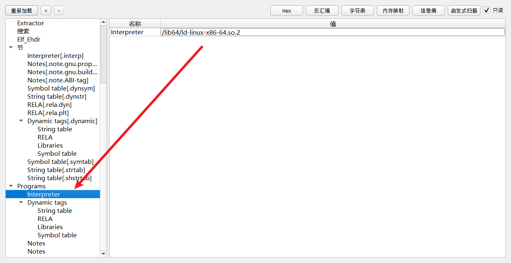
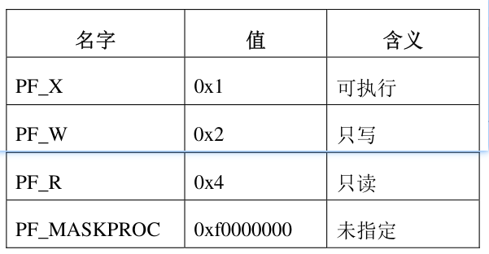
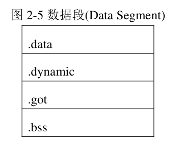

其实对比PE的话,,我们可以发现

只有一个section的概念

然后elf有Section和segment的概念

当我执行一个elf的话,,其实我还是可以看大Section这个东西

这说明了什么...? section仍然是最小的处理单元


# program header


一个可执行文件或共享目标文件的程序头表(program header table)是一个数组

数组中的每一个元素称为“程序头(program header)”

每一个程序头描述了一个“段(segment)” 或者一块用于准备执行程序的信息


程序头只对可执行文件或共享目标文件有意义，对于其它类型的目标文件，该信息可以忽略


在目标文件的文件头(elf header)中，e_phentsize 和 e_phnum 成员指定了程序头的大小。


````c++
//x86
typedef struct
{
  Elf32_Word	p_type;			/* Segment type */
  Elf32_Off	p_offset;		/* Segment file offset */
  Elf32_Addr	p_vaddr;		/* Segment virtual address */
  Elf32_Addr	p_paddr;		/* Segment physical address */
  Elf32_Word	p_filesz;		/* Segment size in file */
  Elf32_Word	p_memsz;		/* Segment size in memory */
  Elf32_Word	p_flags;		/* Segment flags */
  Elf32_Word	p_align;		/* Segment alignment */
} Elf32_Phdr;


//x64
typedef struct
{
  Elf64_Word	p_type;			/* Segment type */
  Elf64_Word	p_flags;		/* Segment flags */
  Elf64_Off	p_offset;		/* Segment file offset */
  Elf64_Addr	p_vaddr;		/* Segment virtual address */
  Elf64_Addr	p_paddr;		/* Segment physical address */
  Elf64_Xword	p_filesz;		/* Segment size in file */
  Elf64_Xword	p_memsz;		/* Segment size in memory */
  Elf64_Xword	p_align;		/* Segment alignment */
} Elf64_Phdr;
````


> p_type

此数据成员说明了本程序头所描述的段的类型，或者如何解析本程序头的信息


PT_NULL:

此类型表明本程序头是未使用的，本程序头内的其它成员值均无意义。具有此种类型的程序头应该被忽略。


PT_LOAD:

此类型表明本程序头指向一个可装载的段。段的内容会被从文件中拷贝到内存中。


PT_DYNAMIC:

此类型表明本段指明了动态连接的信息。


PT_INTERP:

本段指向了一个以”null”结尾的字符串，这个字符串是一个 ELF 解析器的路径。

这种段类型只对可执行程序有意义，当它出现在共享目标文件中时，是一个无意义的多余项。

在一个 ELF 文件中它最多只能出现一次，而且必须出现在其它可装载段的表项之前。




PT_NOTE:

本段指向了一个以”null”结尾的字符串，这个字符串包含一些附加的信息


PT_SHLIB:

该段类型是保留的，而且未定义语法。UNIX System V 系统上的应用程序不会包含这种表项。


PT_PHDR:

略...

PT_LOPROC ~ PT_HIPROC:

类型值在这个区间的程序头是为特定处理器保留的


> p_offset

此数据成员给出本段内容在文件中的位置，即段内容的开始位置相对于文件开头的偏移量

p_vaddr

内存中的虚拟地址。

p_paddr

和物理地址有关, 

目前这个成员多数情况下保留不用，或者被操作系统改作它用


> p_filesz

此数据成员给出本段内容在文件中的大小， 


> p_memsz

此数据成员给出本段内容在内容镜像中的大小，单位是字节，可以是 0。


> p_flags

此数据成员给出了本段内容的属性



可读与可执行是通用的，有其中一个就等于也有了另一个, 也就是说 PF_R等价于PF_X

可写权限是最高权限，可以覆盖另外两个，有了可写权限，所有权限就都有了


> p_align


# program


代码段(.text)或直译为“文本段”，包含的是只读的指令和数据，一般情况下会包含以下这些节


数据段(data segment)包含可写的数据和指令，典型的数据段包含以下节




注释段

类型为 PT_NOTE 的段往往会包含类型为 SHT_NOTE 的节，SHT_NOTE 节可以为目标文件提供一些特别的信息，

用于给其它的程序检查目标文件的一致性和兼容性。

这些信息我们称为“注释信息”，这样的节称为“注释节(note section)”，所在的段即为“注释段(note segment)”。


注释信息可以包含任意数量的“注释项”，每一个注释项是一个数组，

数组的每一个成员大小为 4 字节，格式依目标处理器而定。

也就是说,这个段他是自定义的对吧

具体的构成,,我认为可以不忙去了解


# 程序装载过程


当系统创建或者扩充一个进程镜像时，逻辑上，它要把文件中的段复制成为虚拟内存中的一个段。

但是系统不一定立刻真正地去读文件，什么时候读，还要依赖于程序的行为、系统负载等等。

进程在加载完成之后，很多文件的内容其实并没有真正地映射到内存中；

在运行过程中，进程只有在真正需要去访问一个内存页面的时候，才会去映射它。

what??? 这和我了解的PE不一样


文件内有 4 个页面包含不纯的代码和数据


第一个代码(text)页包含 ELF 头，程序头表和其它信息

最后一个代码页含有数据段开始处的拷贝

第一个数据(data)页含有代码段结尾处的拷贝

最后一个数据页可能含有与运行过程无关的信息


静态链接

```
gcc -demo.c -static -o demo.elf
```


