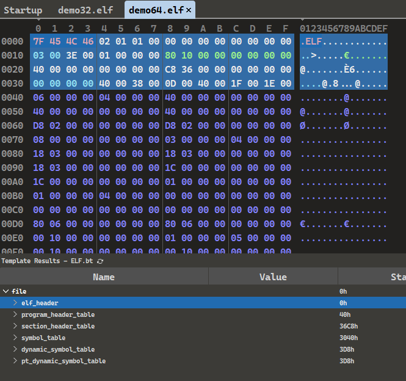
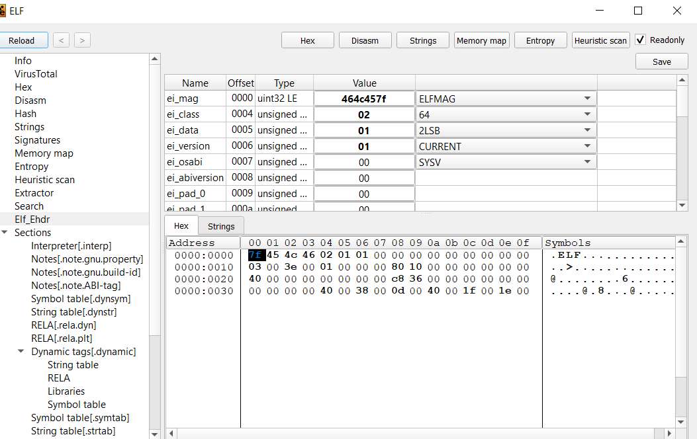
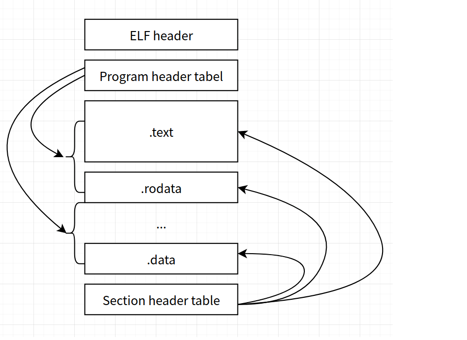
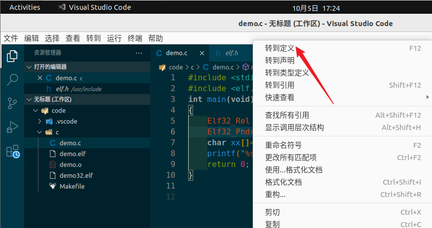

# ELF文件解析工具


## 010


010, 解析的插件ELF.bt需要去官网下载




## Die





# 如何生出一个elf


比如

```c++
#include <stdio.h>

int main()
{
  printf("hello world!\n");
  return 0;
}
```

编译的时候用的是

```
gcc -no-pie hello.c -o hello
```

为什么不是

```
gcc  hello.c -o hello
```

因为 Linux 里采用的一些新的执行格式:  ELF 64-bit LSB shared object

这个格式和以前的ELF可执行文件格式大同小异,,但是并不是我们研究的对象


# 简单介绍


在学的时候,我会更多的把他和我们的PE文件对比着来学习


首先对elf文件格式展开一个整体的认知



大概的布局长成上面的这个样子


ELF文件格式提供了两种视图，分别是链接视图和执行视图：

但是这并不重要,,哈哈,,了解 即可

什么是链接? 就是把很多的.o文件 通过xx手法拼成一个可以执行的elf文件

执行视图就是执行了呗


链接视图是以节（section）为单位，

执行视图是以段（segment）为单位。


链接过程: 当多个可重定向文件最终要整合成一个可执行的文件的时候

链接器把目标文件中相同的 section 整合成一个segment，在程序运行的时候，方便加载器的加载

比如代码段又可以分为.text，数据段又分为.data、.bss等。


**产生两种视图的原因**：看待同一个文件的不同角度。


**链接视图**：文件结构的粒度更细，将文件按功能模块的差异进行划分，最小的意义块单位是：节，

静态分析的时候一般关注的是链接视图，能够理解 ELF 文件中包含的各个部分的信息。


**运行视图**：根本目的是考虑 ELF 文件是如何为程序运行做准备，由于考虑内存装载过程的一些优化考虑，

将 ELF 文件从装载的角度重新划分 ELF 文件，最小的意义块单位是：段


所以就我们分析而言,,更多的是去关注section,而不是segment


# 相关结构体定义如何寻找


在  elf.h中可以找到相关定义 `/usr/include/elf.h`

有没有什么办法可以F12的?

vscoode可以对一个结构体F12的




# 参考链接


```
https://zhuanlan.zhihu.com/p/380908650
https://zhuanlan.zhihu.com/p/386573979
https://zhuanlan.zhihu.com/p/389408697
```

