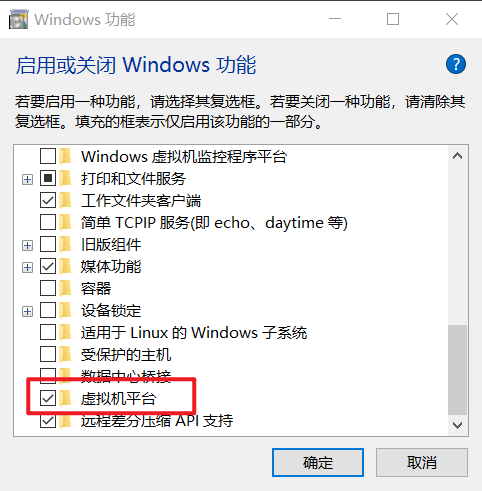

# 准备


## ADB.exe说明

这东西应该是SDK自带的

就想是WDK自导windbg.exe

adb.exe 负责安装apk,连接虚拟机吧


连接和断开

```
adb connect 127.0.0.1:5554
adb disconnect localhost:5554
```


打开shell环境

```c++
>adb shell
```


apk安装 

```c++
adb install apk_path...
Performing Streamed Install
Success
```


## WSA安装

官网下载链接 https://github.com/MustardChef/WSABuilds/releases

期间注意关闭杀软,,开启Windows的某个功能





## jdax 反汇编

官网下载链接 https://github.com/skylot/jadx/releases

