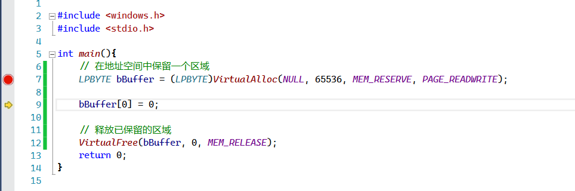
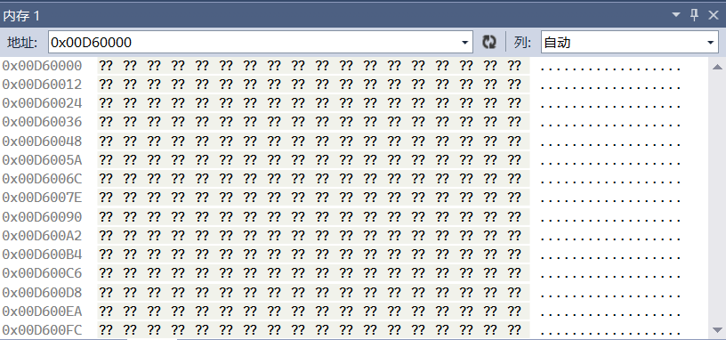
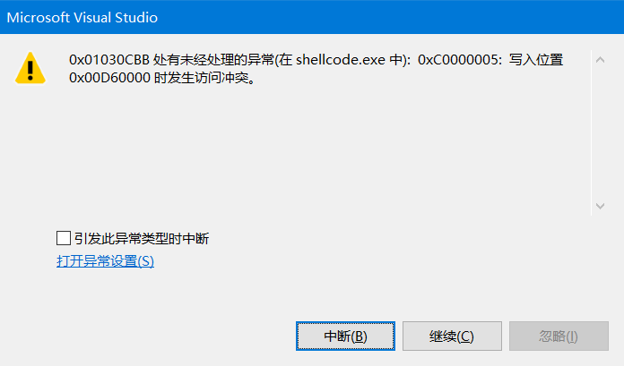
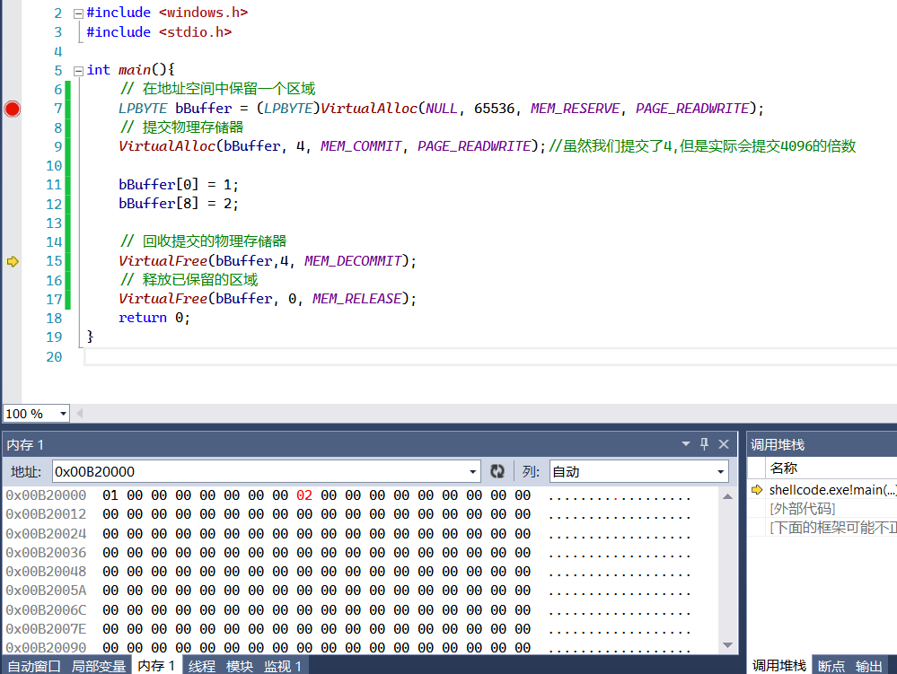

# 介绍

参考: https://www.cnblogs.com/thankgoodness/articles/1327771.html


```c++
LPVOID VirtualAlloc(
　LPVOID lpAddress, 
　DWORD dwSize, 
　DWORD flAllocationType,
　DWORD flProtect
);
```


lpAddress:

用于定义待分配区域的首地址。通常可将此参数设置为NULL，由系统通过搜索地址空间来决定满足条件的未保留地址空间。

如果保留区域的起始地址没有遵循从64KB分配粒度的边界开始之一原则，系统将自动调整该地址到最接近的64K的倍数

例如，如果指定的lpAddress为0x00781022，那么此保留区域实际是从0x00780000开始分配的


dwSize:

参数dwSize指定了保留区域的大小。

但是系统实际保留的区域大小必须是CPU页面大小的整数倍，如果指定的dwSize并非CPU页面的整数倍，

系统将自动对其进行调整，使其达到与之最接近的页面大小整数倍。与分配粒度一样


| 分配类型        | 类型说明                                                     |
| --------------- | ------------------------------------------------------------ |
| MEM_COMMIT      | 为特定的页面区域分配内存中或磁盘的页面文件中的物理存储       |
| MEM_PHYSICAL    | 分配物理内存（仅用于地址窗口扩展内存）                       |
| MEM_RESERVE     | 保留进程的虚拟地址空间，而不分配任何物理存储。保留页面可通过继续调用VirtualAlloc（）而被占用 |
| MEM_RESET       | 指明在内存中由参数lpAddress和dwSize指定的数据无效            |
| MEM_TOP_DOWN    | 在尽可能高的地址上分配内存（Windows 98忽略此标志）           |
| MEM_WRITE_WATCH | 必须与MEM_RESERVE一起指定，使系统跟踪那些被写入分配区域的页面（仅针对Windows 98） |


分配成功完成后，即在进程的虚拟地址空间中保留了一个区域，

可以对此区域中的内存进行保护权限许可范围内的访问。


当不再需要访问此地址空间区域时，应释放此区域。由VirtualFree（）负责完成。其函数原型为：

```c++
BOOL VirtualFree(
　LPVOID lpAddress,
　DWORD dwSize,
　DWORD dwFreeType
);
```

其中，参数lpAddress为指向待释放页面区域的指针。如

果参数dwFreeType指定了MEM_RELEASE，则lpAddress必须为页面区域被保留时由VirtualAlloc（）所返回的基地址。

参数dwSize指定了要释放的地址空间区域的大小，如果参数dwFreeType指定了MEM_RELEASE标志，则将dwSize设置为0，由系统计算在特定内存地址上的待释放区域的大小。

参数dwFreeType为所执行的释放操作的类型，其可能的取值为MEM_RELEASE和MEM_DECOMMIT，其中MEM_RELEASE标志指明要释放指定的保留页面区域，MEM_DECOMMIT标志则对指定的占用页面区域进行占用的解除。

如果VirtualFree（）成功执行完成，将回收全部范围的已分配页面，此后如再对这些已释放页面区域内存的访问将引发内存访问异常。

释放后的页面区域可供系统继续分配使用。


# 使用

下面这段代码演示了由系统在进程的用户模式分区内保留一个64KB大小的区域，并将其释放的过程

```c++
// 在地址空间中保留一个区域
LPBYTE bBuffer = (LPBYTE)VirtualAlloc(NULL, 65536, MEM_RESERVE, PAGE_READWRITE);
……
// 释放已保留的区域
VirtualFree(bBuffer, 0, MEM_RELEASE);
```


运行,并使用



然后就g了

我们尝试查看分配的内存,哦豁,,怎么全是`????`



然后尝试写入0

哦豁,,直接异常...



所以我想,,我应该知道了 `MEM_RESERVE`的意思: 是保留一块内存

就像是预定了一块内存,,,但是我们不能使用他,,他只是保留下来了


在地址空间中保留一个区域后，并不能直接对其进行使用，必须在把物理存储器提交给该区域后，才可以访问区域中的内存地址。

在提交过程中，物理存储器是按页面边界和页面大小的块来进行提交的。

若要为一个已保留的地址空间区域提交物理存储器，需要再次调用VirtualAlloc（）函数，

所不同的是在执行物理存储器的提交过程中需要指定flAllocationType参数为MEM_COMMIT标志，

使用的保护属性与保留区域时所用保护属性一致。在提交时，可以将物理存储器提交给整个保留区域，

也可以进行部分提交，由VirtualAlloc（）函数的lpAddress参数和dwSize参数指明要将物理存储器提交到何处以及要提交多少物理存储器。

```c++
// 在地址空间中保留一个区域
LPBYTE bBuffer = (LPBYTE)VirtualAlloc(NULL, 65536, MEM_RESERVE, PAGE_READWRITE);
// 提交物理存储器
VirtualAlloc(bBuffer, 65536, MEM_COMMIT, PAGE_READWRITE);
……
// 回收提交的物理存储器
VirtualFree(bBuffer, 65536, MEM_DECOMMIT);
// 释放已保留的区域
VirtualFree(bBuffer, 0, MEM_RELEASE);
```





提交内存后,,这么释放?

与保留区域的释放类似，当不再需要访问保留区域中被提交的物理存储器时，提交的物理存储器应得到及时的释放。

该回收过程与保留区域的释放一样也是通过VirtualFree（）函数来完成的。

在调用时为VirtualFree（）的dwFreeType参数指定MEM_DECOMMIT标志，

并在参数lpAddress和dwSize中传递用来标识要解除的第一个页面的内存地址和要释放的字节数

。此回收过程同样也是以页面为单位来进行的，将回收设定范围所涉及到的所有页面。


# 最后

由于未经提交的保留区域实际是无法使用的，因此在编程过程中允许通过一次VirtualAlloc（）调用

而完成对地址空间的区域保留及对保留区域的物理存储器的提交。

相应的，回收、释放过程也可由一次VirtualFree（）调用来实现。上述代码可按此方法改写为：


```c++
// 在地址空间中保留一个区域并提交物理存储器
LPBYTE bBuffer = (LPBYTE)VirtualAlloc(NULL, 65536, MEM_RESERVE | MEM_COMMIT, PAGE_READWRITE);
……
// 释放已保留的区域并回收提交的物理存储器
VirtualFree(bBuffer, 0, MEM_RELEASE | MEM_DECOMMIT);
```

