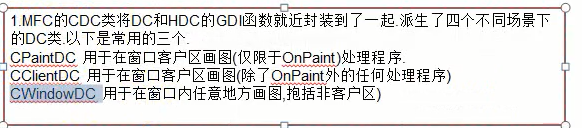

# HelloWorld


编译环境

IDE: vc6.0

项目设置: 静态编译

架构: x86

文件: test.cpp

```c++
#include <afxwin.h>

class CmyApp	:public CWinApp{
public:
	virtual BOOL InitInstance();
};

class CmainWindows	:public CFrameWnd{
public:
	CmainWindows();
};


CmyApp theApp;//有且只有一个

BOOL CmyApp::InitInstance(){
	//重写虚函数
	m_pMainWnd=new CmainWindows;
	m_pMainWnd->ShowWindow(m_nCmdShow);
	m_pMainWnd->UpdateWindow();
	return TRUE;
}
CmainWindows::CmainWindows(){
	
	//way1
	//Create(NULL,"Hell0 MFC");//创建一个窗口

	//way2
	RECT myRect={800,200,1000,400};
	Create(NULL,"Hell0 MFC",WS_OVERLAPPEDWINDOW,myRect);//创建一个窗口
	

}

```


```c
#include <afxwin.h>
class CmyApp:public CWinApp
{
public:
	virtual BOOL InitInstance();
};
class CmainWindows:public CFrameWnd
{
public:
	CmainWindows();


	afx_msg void OnLButtonDown(UINT nFlags,CPoint point);
	afx_msg void OnPaint();
	DECLARE_MESSAGE_MAP()
};

BEGIN_MESSAGE_MAP(CmainWindows,CFrameWnd)
	ON_WM_LBUTTONDOWN()//消息处理函数是默认的OnLButtonDown
	ON_WM_PAINT()
END_MESSAGE_MAP()

void CmainWindows::OnLButtonDown(UINT nFlags,CPoint point){
	AfxMessageBox("FInd YOu");
}
void CmainWindows::OnPaint(){
	CPaintDC dc(this);
	dc.DrawText("Hello MFC-redqx",CRect(0,0,200,200),DT_SINGLELINE);
}
BOOL CmyApp::InitInstance()
{
	//重写虚函数
	m_pMainWnd=new CmainWindows;
	m_pMainWnd->ShowWindow(m_nCmdShow);
	m_pMainWnd->UpdateWindow();
	return TRUE;
}
CmainWindows::CmainWindows(){
	
	//way1
	//Create(NULL,"Hell0 MFC");//创建一个窗口

	//way2
	RECT myRect={800,200,1000,400};
	Create(NULL,"Hell0 MFC",WS_OVERLAPPEDWINDOW,myRect);//创建一个窗口
}
CmyApp theApp;//有且只有一个
```


# 如何添加消息


涉及的宏定义

```c
DECLARE_MESSAGE_MAP
BEGIN_MESSAGE_MAP
END_MESSAGE_MAP
```


# 杂言

CWinApp 取代 WinMain

CFrameWnd 取代了 WndProc


# 画图/画刷




# 鼠标消息

