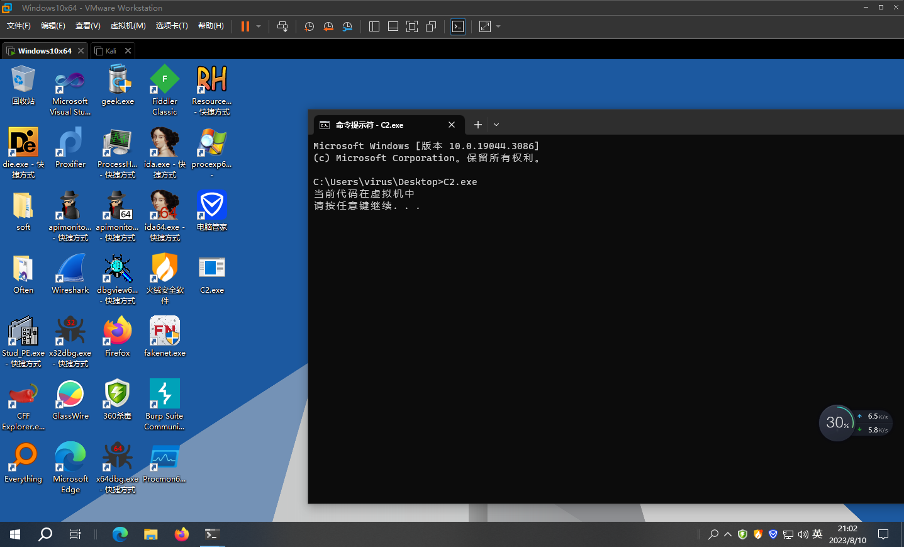

# IN端口检测


Vmware为真主机与虚拟机之间提供了相互沟通的通讯机制,

它使用IN指令来读取特定端口的数据以进行两机通讯,

但由于IN指令属于特权指令,在真机中运行将会触发`EXCEPTION_PRIV_INSTRUCTION`异常,

而在虚拟机中并不会发生异常,我们可以利用这个特性判断代码是否在虚拟机中.


```c
#include <windows.h>
#include <stdio.h>

bool IsInsideVM()
{
	bool VmWare = true;
	__try
	{
		__asm
		{
			mov    eax, 'VMXh'
			mov    ebx, 0
			mov    ecx, 10         // 指定功能号
			mov    edx, 'VX'
			in     eax, dx         // 从端口dx读取VMware版本到eax
			cmp    ebx, 'VMXh'     // 判断ebx中是否包含VMware版本VMXh
			setz[VmWare]           // 设置返回值 True/False
		}
	}
	__except (EXCEPTION_EXECUTE_HANDLER)
	{
		VmWare = false;            // 如果未处于虚拟机中,将会产生异常
	}
	return VmWare;
}

int main()
{
	int ret = IsInsideVM();

	if (ret == 1)
		printf("当前代码在虚拟机中 \n");
	else
		printf("宿主机 \n");

	system("pause");
	return 0;
}
```


运行效果

