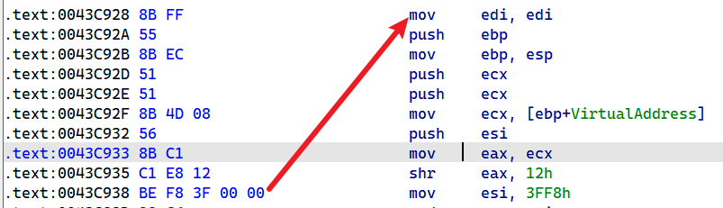

下面这个东西是反编译 win10目录 `C:\Windows\System32\ntoskrnl.exe`

可以看到这种exe仍然会留有补丁后门

```c++
mov edi,edi
```




mov edi,edi 虽然只有2个字节,跳转的范围也就[-128,+127]

但是我们不搞jmp 呢? 

比如我来一个

```c++
int 32
```

通过`int 32` 我们间接性的做很多事情


