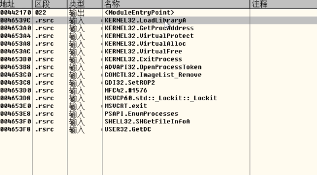

# PE查杀

 

## 检测的一些特征

> 使用时间戳作为特征

时间戳代表了一个exe出生的时间

当然这个东西修改后，不会去影响exe执行

杀软可以根据这个时间去检索该时间段出现过的恶意样本，然后做一个初步的猜测

> 使用入口点地址作为特征

入口点不在第一个节：一般第一个节是text，

入口点在末尾节

入口点在节与节之间

入口点在杀毒引|擎设置的范围之外

可执行的代码节具有可写属性

利用了TLS(线程本地存储区)入口点 (目前的C++的某些编译器都用到了TLS的回调

入口点为某个无效的地址(0XFFFFFF)

节名不属于正规范围内

资源节中检测到SYS文件

资源节中检测到DLL文件

资源节中出现自定义的资源类型(可能是EXE或者SYS加密过后的)

文件具有末尾数据,而末尾数据是SYS文件

文件具有末尾数据,而末尾数据是DLL文件

检测到壳特征

在引入表中引入敏感的API序列(静态API检测)

在木马文件中发现存在有敏感API名的字符串(静态API检测)

在木马文件中发现特定字符串的特征码可能和脚本执行有关吧 (1)_ FILE_ (2)_ FUNCTION_

在引出表中发现特定函数的名称(DLL)

拥有可执行属性的节的熵值超标

## 对抗

## 特殊的感染算法

不把免杀壳感染到目标程序上,而是将目标程序感染到免杀壳上; ？？？？

使用自定义的PE加载器加载修复加密后的引入表与TLS数据;

形成新的BIN文件，消除PE头特征

## 保护引入表

加密真正的引入表

伪造- -块看似正常的引入表

特征序列形成

然后发现这些API可以构成一个危险的恶意程序

