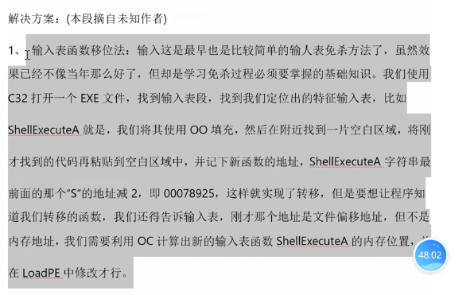
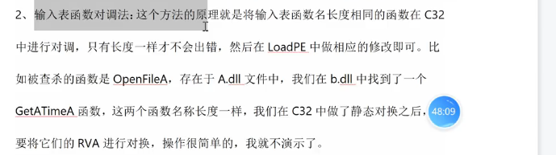
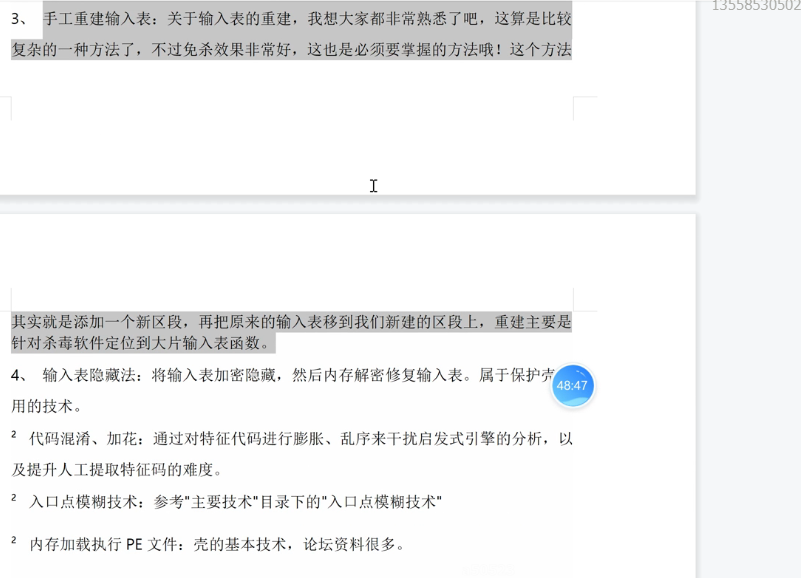
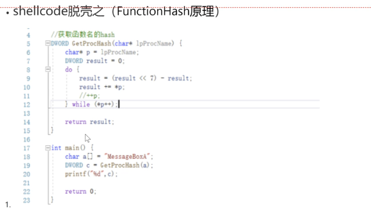

API的导入表确实查的严

但是API的动态调用，也查的很严

比如你多次loadlibrary，每load一次，杀软就监控你一次

然后就对你打一个印象分，最后印象不好就kill 你


所以我们有时不能频繁的去调用敏感的API，不然会被打上高危的标签

于是，如果我们重写API的话，就尽可能的规避了杀软


如果你的导入表太多的敏感API,跑起来就被杀

当然你可以导入一半不太敏感的API,动态导入一半不太敏感的API

这样会比不导入方便一些


如果说,杀软对敏感API挂钩,那么我们为什么不可以通过正常的API干坏事了

比如我们对MessageBox Hook,但是对MessageBox传递的参数是异常的敏感的一个指针

然后Hook后,干了坏事,再正常弹窗

以挂起的方式创建一个进程，然后在内存中，给他添加一个的DLL的导入表


 

这些已经过时的方法







第4个方法才是最厉害的


functionHash



```c
#include <windows.h>
#include <stdio.h>

//获取函数名的hash
DWORD GetProcHash(char* lpProcName) {
	char* p = lpProcName;
	DWORD result = 0;
	do {
		result = (result << 7) - result;
		result += *p;
		//++p;
	} while (*p++);

	return result;
}

int main() {
	char a[] = "MessageBoxA";
	DWORD c = GetProcHash(a);
	printf("%d",c);

	return 0;
}
```

