# 段寄存器 

段寄存器分为可见的部分和不可见的部分

段寄存器可见的是16位,也就是下面这个东西


<p style="color:#00FA9A;font-size:22px">
   也称之为段选择子,请记住这个名字,,后面会提及的
</p>


这个小小的WORD数据,就决定了很多的东西的

这个word寄存器大概的结构如下

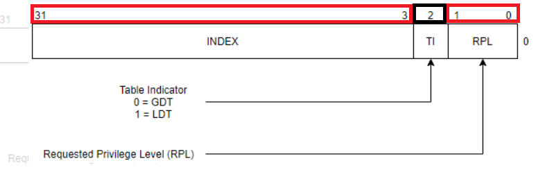

他的成员有映射了很多的东西

后面会后面会娓娓道来 


## 简单介绍

关于有哪些寄存器,就不多说了,这里只是简单的罗列一些段寄存器,

```c++
ES;
CS;
SS;
DS;
FS;
GS;
```

LDTR: Local Description Tabel Register  局部描述符号表寄存器,指明了IDT

GDTR: Global Description Tabel Register  全局描述符号表寄存器,指明了GDT

TR:  指明了TSS位置和大小

SDTR: 指明了SDT表在哪里 


## 关于他的读写

<p style="color:#FFB5C5;font-size:20px">
    先不说权限检查什么的<br>
    直接读写就对了<br>
    后面会说到相关的权限检查
</p>

读写大多数遇到的情况还是mov,其它是少数情况属于是了解一下


### 基于mov

mov可以实现一个寄存器的读写

后面大多数情况下都是使用mov实现段寄存器的一个读写

比如后期提权什么的,需要用到这些读写

ps:对LDTR和TR的读写,用的不是mov


读取段寄存器 :只能拿着16位寄存器去读取数据

```assembly
mov ax,ES 
```

修改段寄存器 :会根据你的段选择子和一些附带的其它信息写入12字节

```assembly
mov DS,ax 
```


### 基于L系列指令


L是Load的意思

```
LES,LSS,LDS,LFS,LGS
```

但是在使用的时候也有很多讲究

 

```c
#include<stdio.h>
int main()
{
	char buff[6];
	_asm {
		lea eax, buff;
		mov bx, ds;
		mov word ptr [eax+4], bx;
		les ecx, fword ptr [eax]
	}
	
	return 0;
}
```

fword的意思就是取出6个字节

les会把高2字节(段选择子)给es,也就是把数组最后2个字节给段选择子

低4字节给ecx

也就是说: 我们可以把一个tmp[6]的tmp[4,5]作为段选择子,然后赋值给寄存器


### sgdt/lgdt


```c++
#include<stdio.h>

int main(int argc, char** argv)
{

	char x[16];
	__asm {
		sgdt x;
	}
	printf("%x,%x\n", *(DWORD*)&x[2], *(WORD*)x);
	//-> 4b590000,7f
	return 0;
}
```


## 段选择子

接下来,其实是我们细说段选择子这个结构了


比如数据是	


所以它大概的结构

```c
strct
{
	2个bit位 RequestPrivilegeLevel; //请求特权级别
	1个bit位 TableIndicator; //查哪一个数组
	15个bit位 Index;//数组索引值
}
```

ps: 数组是QWORD Arr[xx]


先简单的介绍一下这些结构的名字

RPL: 请求权限,和未来的CPL有关系

根据RPL.我们又可以引出其它东西

CPL: 当前权限

DPL:  最低可访问我的权限


然后是其它成员,比如Ti,Ti这个东西又和另外一个成员Index有关

因为Ti决定了我们要去找哪一张表

然后找到表后,取出哪一个成员就和Index有关了


所以有哪些表?

有GDTR,LDTR

这些表都是基于QWORD 的Arr数组,所以每次遍历是+8哟

关于GDTR,LDTR有什么区别,,我们以后再说

```c++
TI=0,查GDT表
TI=1,查LDT表
```

但是可以了解一下

GDTR:   Global Description Tabel Register  全局描述符号表寄存器 有2个值,GDTR表的开始位置和表的大小

LDTR: Local Description Tabel Register  局部描述符号表寄存器 有2个值,LDTR表的开始位置和表的大小

然后Index当然就是在表里面寻找成员了,但是寻找好像不是那么简单的线性寻找

复杂的后面再说


# 段描述符号表成员


<p style="color:#FFB5C5;font-size:26px">
    遇到的很多概念,如果不理解没关系,后面会慢慢的get到,然后回来补充
</p>


段描述符, 不是指的是之前的段寄存器ES,DS,CS,也不是96位的那个完整的段寄存器

而是位于QWORD Arr[xxx]的数组成员

如下图


段描述符号和段寄存器之间有一个映射关系,,差不多就是说,段寄存器的一些成员决定了我们要去哪个表寻找哪个成员

一个段寄存器, 只会指向一个段描述符

段描述符有很多个,段寄存器可以选择性的指向任何一个段描述符(得通过检查)

段选择子和段描述符属于多对1的样

一个段选择子只对应一个段描述符

一个段描述符却可以有多个段选择子指向


如果把8字节合并在一起的话,从低地址往高地址看

为什么看上去这么别扭..其实是一个兼容性导致的

为了向下兼容,变成了这样子


比如数据

```c++
00cffb00`0000ffff
```


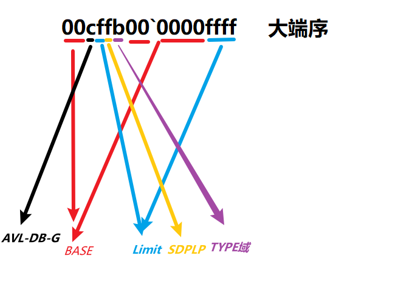


顺便回忆一下段寄存器结构,我没有在内存真正的找到过,他是否存在,我表示未知

```c
struct Segment
{
    WORD Selecter;  //段选择子 ,类似于一个index的索引值,索引了一张表
    WORD Attribute; //段属性, 表示了当前段寄存器的 R W X 属性读写执行
    DWORD Base;     //基址,表示段的起点 
    DWORD limit;    //基址的长度 
}//12字节,96位
```


## Base和Limit

(Base:DWORD `[0,15]+[16,23]+[24,31] `


Base由3部分构成(1+1+2=4)


Limit:DWORD但是,**数据是20个bit位** `[0,15]+[16,19]`


不是说我们只看Base和Limit就可以确定一个范围

这里面涉及很多东西,,,,后面再说

另外我还搞得不是很明白的


## Attribute


对于没介绍的成员,大多数是没用的,或者不知道的

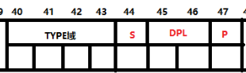

4个bit位,形成一个16进制位

8个bit位形成2个16进制位,也就形成了1个字节


### P位


```
P=1,该段描述符有效
P=0,反之无效
```

通过指令将段描述符加载至段寄存器的时候，CPU第一件事就是检查该段描述符的P位。

如果P位等于0，那么其他的检查就不做了。只有当P位为1的时候才会做后续的其他检查


### S位


段描述符分为了2大类

```
S=1 : code or data的描述符
S=0 : 系统段 描述符
```

系统段描述符可能是调用门、中断门、任务门、TSS段

如果S=0,那么这个段就会有一点不同了

其实S和TYPE域结合来看,,,会更加容易理解


其中注意S=1,不是布尔的0和1,而是权限的0和1

然后的话,S=1,就不要想着是系统段或者描述符了

而是S=0,才是系统段或者描述符


### Type域 [8,11]


#### 图表概览


日常一问: 通过什么去确定他是 非段描述符 或者 段描述符.

答案: 应该是通过S=0来确定 你是调用门/TSS/...


关于TYPE的作用

对于非段描述符来说(比如调用门,中断门,TSS任务段...)


对于段描述符来说

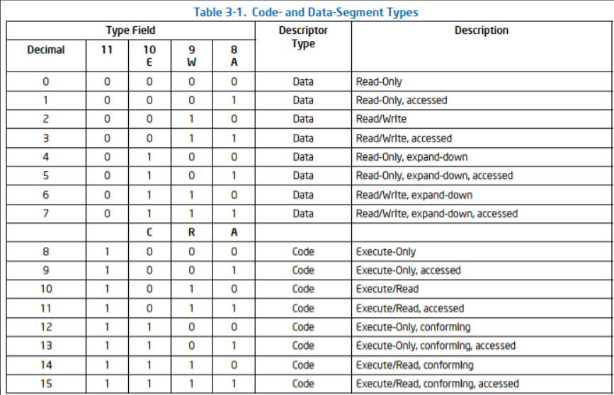


#### 介绍

 


然乎继续Attribute.Type域

下面主要介绍的是代码段和数据段的Type域, 系统段的Type域后面介绍, 


##### [11] 控制位


ps: 32位中的第11位,不是Attribute的11位

```
[11]=1, 指明代码段
[11]=0, 数据段
```

然后,换句话说,如果Type域>7,那么就是代码段

Type域的属性会根据你是不同的段,各个属性值会有不同的意义

所以1就算code,0就算data


##### [8, 9,10]


###### 数据段的AWE


A属性: 该段是否被访问过

W属性: 是否可写 write

E属性: 奇怪的拓展属性

---

A: 表示被访问过

W: 0是只能读, 1是可读可写

E: 0,向上拓展 ,1是向下拓展

如果E=0 向上拓展,,那么有效段范围就是红色的 左图

如果E=1,向下拓展,那么有效段范围就是红色的 右图


关于奇怪的拓展属性

了解一下,以后有需求的时候,再来学习补充


###### 代码段的AWC

1.   A属性: 该段是否被访问过
2.   W属性: 是否可读 read
3.   C属性: 
     1.   为1表示一致代码段 只能低级越权访问
     2.   为0表示非一致代码段   只能 低访问低, 高访问高, 互不干扰


一般情况下,我们的C位都是0, C=1的都是恶意构造的

`<8` 都是16位的

`>8` 的都是32位


### DB位


感觉的话,D位是用于16位CPU和3位CPU过度的一个属性位

数据段用B去描述

代码段用D去描述

所以合在一起叫DB位

位于高4字节的22位


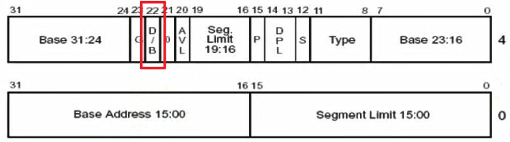

其实说白了,这个位就算确定了你在x86下很多东西是否要用16位那一套机制

比如说

> EIP寻址:

D = 1，采用32位寻址方式。这是x86默认的寻址方式

D = 0，采用16位寻址方式。

> 汇编指令:

```c++
//硬编码指令前缀67：改变寻址方式
MOV DWORD PTR SS:[EBP-0x18], ESP //32位寻址
MOV DWORD PTR DS:[DI-0x18], ESP //加了67的前缀的16位寻址方式
```


>对栈的影响


D = 1，使用x86那套机制,压栈入栈和寻址,比如push 4字节

D = 0，使用16位那套机制,压栈入栈和寻址,比如push 2字节


> 对向下扩展的数据段的影响：


D = 1，段上限为4GB。

D = 0，段上限为64KB。

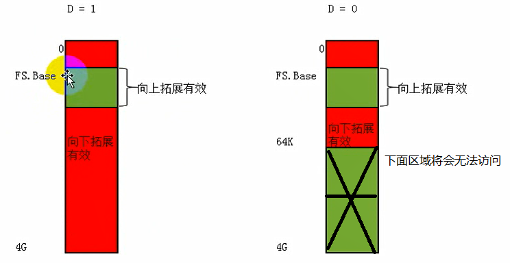

其实D干的事情,就是限制段的Limit吧.个人呢理解

以前寻址最大时0xFFFFFFFF,现在变为了64k的寻址范围


### G位 


Limit在取数据的时候,然后是20位,一般都是0xFFFFF,

但是我们知道段的最大长度,但是可以是0xFFFFFFFF

那是如何实现的?

依靠G位

```
G位=1,最大长度0xFFFFFFF
G位=0,最大长度是0xFFFFF
```


比如Base=10, Limit=20

当G=0,然后范围是10,20

当G=1.然后范围是10,20+1x0x1000


Base=0xffff0000,Limit=0x1000,G=0

如果Base>Limit,用Base+Limit作为基址

当然还需要很多例子来帮助理解


### DPL

你用什么权限来访问我,

你访问我的权限只能大于或者等于我

而不能拿着很低级很垃圾的权限来访问我


关于RPL,DPL,CLP的权限检查

之后可以看看这个文章

https://www.cnblogs.com/chenwb89/p/operating_system_004.html

https://blog.csdn.net/better0332/article/details/3416749s


> CPU分级


为什么要分级？

1.  因为对CPU来说，有些特权指令是只有在0环(Ring 0)才可以使用的。
2.  Windows系统只使用了CPU中的两个环，R0和R3。不是说另外几环不存在,是存在了但是没去使用,同时不代表你不能去使用

0环的地址好像是0x80000000~0xFFFFFFFF

 

#### CPL


大名:Current Privilege Level 当前特权级别，

CPL==CS的RPL

CS什么权限,SS就是什么权限,他们权限是一致的, 如果不相同,就g

就之前,我们对段选择子的定义是


#### DPL


大名 :Descriptor Privilege Level,描述符特权级别。

通俗的理解：

如果你想访问我，那么你应该要具备什么特权。如果权限存在越级访问,是不允许的

因为Windows中只使用了0环和3环。所以在Windows中，DPL只会是00或者11


eg:

引入:

AX是段选择子,含有成员RPL(希望请求的权限)

AX指向的段,含有成员DPL(GFTR[index]该段的权限)

该指令处于CS,CS和SS还有CPL(当前环境的权限)

```
MOV DS, AX//将AX指向的段描述符加载至DS段寄存器。
//如果AX指向的段DPL(描述符特权级别) = 0，
//但当前程序的CPL(当前进程特权级别) = 3，
//这行指令(MOV DS, AX)是不会成功的，因为段权限检查无法通过。
```


#### RPL


大名: Request Privilege Level,请求特权级别


-   RPL是段选择子的成员，每个段的段选择子都有自己的RPL。
-   RPL就是一个数值，意味着你可以随便写[0,3]，RPL可以随意指定。
-   但DPL不同，每个段描述符只有唯一的DPL。

 

关于为什么有3个权限(CPL,DPL,RPL), 2个不香吗?

<div style="color:#FFB5C5;font-size:16px">
    例如写代码时， <br>
    可以使用 "读写" 的权限去打开一个文件，
    但是为了避免出错， <br>
    有些时候我只想使用我能够得到的权限中的部分权限, <br> 
    比如我请求 "只读" 的权限去打开一个文件。可能我原本的可以获取所有权限 <br>
</div>


小结:

<div style="color:#00CED1;font-size:16px">
    CPL(Current Privilege Level)：当前进程特权级别。（CS和SS中储存的段选择子后2位。）<br>
	DPL(Descriptor Privilege Level)：描述符特权级别。（如果想访问，应该具备什么样的权限。） <br>
	RPL(Request Privilege Level)：请求特权级别。（使用什么样的权限去访问。<br>
</div>


# 段权限检查


这个东西主要是抓住本质...

次要的东西就是根据本质特征

然后慢慢的去推导


1), CPL

CPL是对CS的RPL的一种别称

所以CPL=CS.RPL


2), RPL

RPL是段选择子的成员

RPL的意思一个对段访问的请求权限啊,,这个权限的作用不是特别大

另外不是说你申请了某个访问权限,别人就一定给你对应的访问权限

然后当前的RPL很可能是以后的CPL, 因为CPL就是用RPL申请的

只不过有时候申请不通过罢了


3), DPL

这个权限,,以段的角度来说,,就是你要访问我,,最低应该具备的权限

也可能是说你访问我应该具备的权限吧..目前理解得不是很到位


在正常情况下,,CPL=目标DPL,然后不关注RPL

在权限角度 , min(CPL,RPL)=DPL


然后CS和SS在权限上要保持一直

<p style="color:#FFB5C5;font-size:16px">
    CS.DPL==CS.RPL==SS.DPL==SS.RPL
</p>


接下来又说说 一致代码段和非一致代码段,,在权限上有什么特点

> 非一致代码段: 

CPL==DPL,RPL>=DPL (权限上)

为什么?

首先RPL就是一个小丑,,所以权限卡得不是很严.RPL>=DPL就行

然后非一致代码段是 不同级别的权限各自访问各自的,,所以就是CPL=DPL,而不会存在CPL在权限上高于DPL或者什么之类的


> 一致代码段:

 CPL<=DPL  (权限上)

为什么?

因为一致代码段 只能低权限越级访问高权限

所以存在CPL权限低于目标段的DPL


# 小实验


## 理解 段描述符

这个代码运行会报错的

为什么???

````c++
#include<stdio.h>
#include<windows.h>
//int var = 0;
int main(int argc, char* argv[])
{
	int var = 0;
	__asm
	{
        mov ax,cs;
        mov ds,ax;
        mov dword ptr ds:[var],1;
	}
	printf("%d",var);
	return 0;
}
````


因为CS代码段本身就是不可写的,代码按道理是会异常的

其次,关于给定段寄存器,然后给定变量地址,它到底是对哪里写入,,我目前还不知道

比如给定DS或者CS,然后var地址是xxxx

然后真实写入的地址是不是xx,其实我还不知道的


然后就是关于段描述符的意义到底是什么?

感觉他就是对一块内存的一个描述,比如有没有可写,可读,,,什么什么之类的

它描述成什么样子, 那么那一个段他就是什么样子

当然同一块内存可以被不同的段描述符所描述..

那么同一块内存就会在不同的描述下有不同的意义


CS=0x1B, RPL=R3, GDT[3]= 00cffb00`0000ffff

```c++
|         (00cffb00`0000ffff)
|         (00000000)[0,000FFFFF)        |
|---------------------------------------|
| TYPE | S | DPL | P | AVL | - | DB | G |
| 1101 | 1 | 11  | 1 | 0   | 0 | 1  | 1 |
|---------------------------------------|
```

通过TYPE可以知道


所以CS就算可读,可执行,但是不可写


DS:0x23, RPL=R3, GDT[4]

```c++
|         (00cff300`0000ffff)
|         (00000000)[0,000FFFFF)        |
|---------------------------------------|
| TYPE | S | DPL | P | AVL | - | DB | G |
| 1100 | 1 | 11  | 1 | 0   | 0 | 1  | 1 |
|---------------------------------------|
```

通过TYPE可以知道

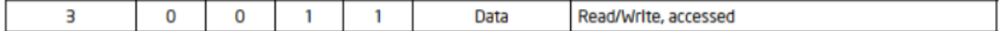

发现DS是可读可写的

其实DS和CS的很多东西都是一样的

只不过差距发生在了TYPE上

所以这就是段描述符的作用

如果实验看不懂,没关系,,把后面的学了再来看就没事了


## 基于 段描述符 的一些属性探测


### 段寄存器是否是否可写

 

简单的检测, 

比如探测ss是否可以写

```c
int var = 0;
int main(int argc, char* argv[])
{

    //int var = 0;
    __asm
    {
        mov ax,ss
        mov ds,ax
        mov dword ptr ds:[var],eax
    }
	return 0;
}
```

这里var分别位于全局的data区,和栈stack区域里面

data区对应的是ds

stack区对应的是ss

在没有任何修改的情况下,看看xdbg

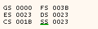

发现DS和SS是一样的

0x23: '0b100011'

RPL=R3,查GDTR,查GDTR[4]

GDTR[4]= 00cff300`0000ffff

Limit=0xffff

Base=00000000

然后就算一些属性位了

```c++
|         (00cff300`0000ffff)
|         (00000000)[0,000FFFFF)        |
|---------------------------------------|
| TYPE | S | DPL | P | AVL | - | DB | G |
| 1100 | 1 | 11  | 1 | 0   | 0 | 1  | 1 |
|---------------------------------------|
```

DPL=R3,

P=1 一个有效的代码段

S=1  code or data的描述符

TYPE:1100 表明

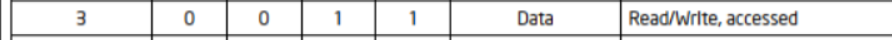


### 有没有Base属性


```c
int var = 0;
 
int main(int argc, char* argv[])
{
    __asm
    {
        xor eax,eax
        mov dwrod ptr ds:[0x00],eax
 		//如果BASE不存在的话,相当于mov dwrod ptr [0+0],eax,会触发一个异常
        //如果BASE存在的话,相当于mov dwrod ptr [BASE+0],eax,可能不会触发一个异常   
    }
	return 0;
}
```

其实我还是不知道如何去检车的


### 检测Limit属性 


```c
int var = 0;
int main()
{
    __asm
    {
        mov ax,fs     
        mov gs,ax      //此处如果换成ds则会出现编译不过的问题
        mov eax,gs:[0x1000]  //fs的limit是FFF 但是读0x1000则越界了
        //访问的地址相当于下面的 但是DS的Limit是0xFFFFFFFF
        //mov eax,dword ptr ds:[0x7FFDF000+0x1000]
        mov dword ptr ds:[var],eax
    }
    
}
```

首先查看FS

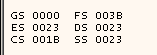

发现是0x3B

```c++
|         (0040f300`00000fff)
|         (00000000)[0,00000FFF)        |
|---------------------------------------|
| TYPE | S | DPL | P | AVL | - | DB | G |
| 1100 | 1 | 11  | 1 | 0   | 0 | 1  | 0 |
|---------------------------------------|
```

然后G位是0,说明最大就算0xFFF, (嗷?是吗?)


尝试运行

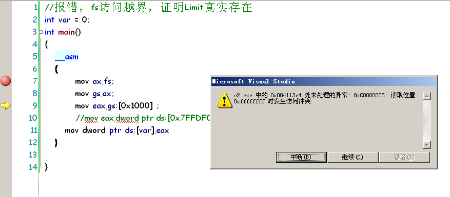


ps: 其实这个实验是有问题的

无论我怎么修改0x1000它都是会爆出异常的

哪怕就算GS:[00],也会报出异常


问题没有解决

然后重写构造了一下实验


首先FS是0xFFF的Limit,然后G位=0

当访问FS:[0xffD]的时候就会报出异常,不知道为什么

在0xFFD之前,是不会报出异常的

然后0xffD往后的访问都会报出0xC0000005的异常提醒


### 非一致代码段的探测


首先提权,让RPL=R0,

然后让CS=目标提权选择子

然后提权成功

然后读取高2G的内存

```c++
 int main(int argc, char* argv[])
{
	__asm{
		mov eax,0x8003f000;
		mov cs,0x48;
		mov ebx,ds:[eax];
	}
	return 0;
}
```


然后就g

因为提权手法不是这个的...

提权只能通过其它路径的....而不是简单的通过mov指令

比如TSS,调用门,中断门


# 复习


说一下如何拆分一个段选择子

说一下段描述符的组成,BASE,LIMIT如何抽离出来

说一下那些位(S,P,D...)分别在哪里

说一下这些意义和作用:

TYPE哪一位指明是代码段还是数据段

S位是干嘛的

D/B位是干嘛的

G位是干嘛的

其实重要的也就是段选择子和段描述符这个2个东西

