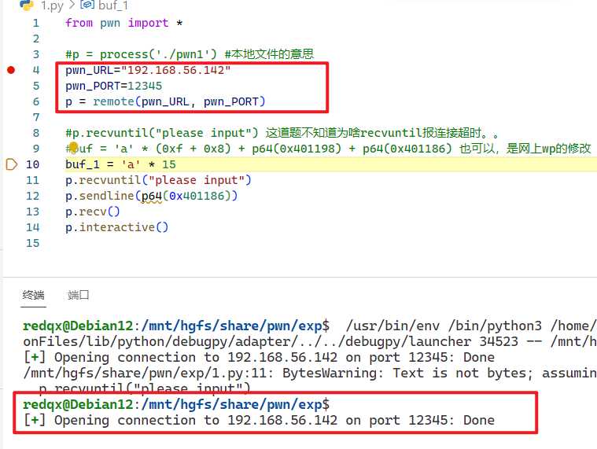
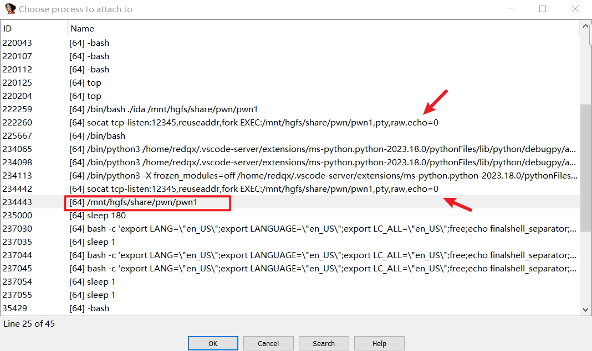
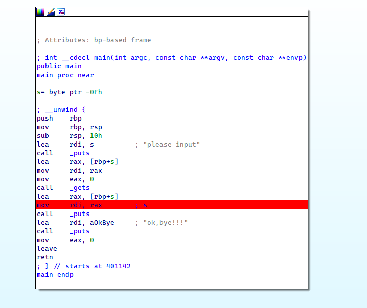
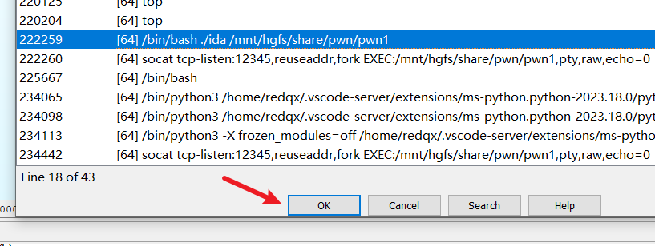
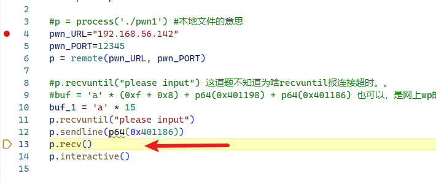
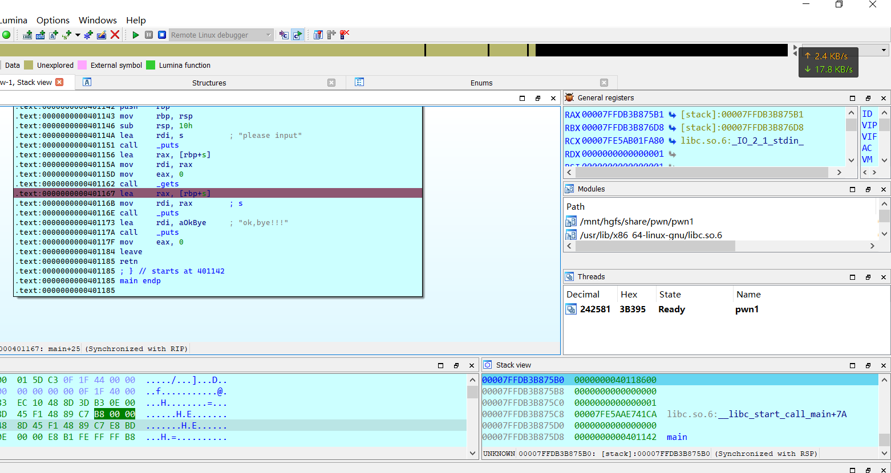

# IDA+SOCAT+pwntool


首先linux要安装socat


运行linux_erver64

```
redqx@Debian12:/mnt/hgfs/share/pwn/debug$ ./64
IDA Linux 64-bit remote debug server(ST) v7.6.27. Hex-Rays (c) 2004-2021
Listening on 0.0.0.0:23946...
2023-10-16 07:05:57 [1] Accepting connection from 192.168.56.1...
```


运行socat,,,为了方便,,,我把他写为sh脚本来运行

```
socat tcp-listen:8088,reuseaddr,fork EXEC: your_elf_path ,pty,raw,echo=0
```

脚本如下

```sh
#!/bin/bash

# 判断参数个数是否正确
if [ $# -ne 1 ]; then
    echo "Usage: $0 <you_elf>"
    exit 1
fi

# 保存 ELF 文件名
elf_file="$1"

# 检查 ELF 文件是否存在
if [ ! -f "$elf_file" ]; then
    echo "Error: File '$elf_file' not found."
    exit 1
fi

# 启动 socat 并监听端口
socat tcp-listen:12345,reuseaddr,fork EXEC:"$elf_file",pty,raw,echo=0
```


然后运行socat

```
redqx@Debian12:/mnt/hgfs/share/pwn/debug$ ./ida /mnt/hgfs/share/pwn/pwn1
```


然后用pwntools连接这个socat...

注意必须要先连接成功才会有之后的操作



然后来到IDA

使用remote_linux_server去调试

然后attach process



我们以这里的`/mnt/hgfs/share/pwn/pwn1`为例子

我们在一个可能停下来的地方下一个断电



然后attach 运行




然后继续运行我们的exp



然后就可以看到IDA停止下来了



然后就大工告成了

关于之后的调试....

比如调试调到一半,,我们停止了,,再次调试的话.....


首先linux_server不去动它

之前执行的socat指令也不要动他,,,如果它停止了,,,那就再次开启

然后我们仍然需要使用pwntools再去remote连接socat端口

然后再去attach的进程列表中去选择附加


